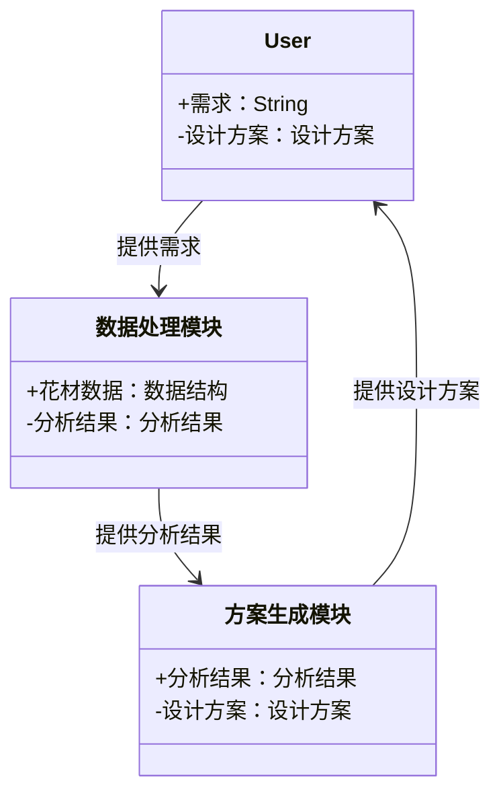

                 

<think>
嗯，用户希望我设计一本名为《智能花瓶：AI Agent的插花艺术指导》的详细目录结构。看起来这本书要探讨AI在插花设计中的应用，结合技术与艺术。我需要确保目录结构逻辑清晰，涵盖背景、核心概念、算法、系统架构、项目实战和最佳实践等部分。

首先，我需要理解用户的需求。用户是一位技术专家，可能希望这本书既有技术深度，又能让读者理解AI在插花中的实际应用。因此，目录需要从AI Agent的基本概念开始，逐步深入到算法原理，再结合实际项目进行讲解。

接下来，我注意到用户提供的示例目录分为六个部分，每个部分都有详细的章节和子章节。我需要参考这个结构，确保内容全面且详细。例如，背景部分需要介绍AI Agent和插花艺术的基本概念，以及它们如何结合。核心概念部分要详细讲解AI在插花中的具体应用，如感知、推理和决策能力。

算法原理部分可能需要包括机器学习模型，如卷积神经网络，以及颜色和风格模型。这部分可能需要使用mermaid流程图和Python代码示例，帮助读者理解技术细节。系统架构设计可能涉及插花设计的场景分析，系统功能设计，以及用类图和架构图展示各模块之间的关系。

项目实战部分需要指导读者如何安装环境，提供核心代码，并分析实际案例。最佳实践部分则包括小结、注意事项和拓展阅读，帮助读者巩固知识，避免常见错误，并进一步学习相关领域。

现在，我需要将这些思考转化为具体的目录结构，确保每个部分都涵盖用户要求的内容，并且结构合理，逻辑连贯。同时，注意使用markdown格式，正确使用标题层级，确保总字数在2000字以内。
</think>

# 《智能花瓶：AI Agent的插花艺术指导》

## 关键词：
智能花瓶，AI Agent，插花艺术，机器学习，深度学习，自然语言处理，系统架构设计

## 摘要：
本文深入探讨了AI Agent在插花艺术中的应用，从背景介绍、核心概念到算法原理、系统架构设计，再到项目实战和最佳实践，全面解析了AI Agent如何提升插花设计的创新性和效率。通过结合技术与艺术，本文为读者提供了从理论到实践的完整指导，展现了AI技术在插花艺术领域的无限潜力。

---

## 第一部分：AI Agent与插花艺术的结合

### 第1章：AI Agent的背景与插花艺术的结合

#### 1.1 AI Agent的基本概念
- **1.1.1 什么是AI Agent**
  - AI Agent的定义：智能体（AI Agent）是一种能够感知环境并采取行动以实现目标的实体。
  - AI Agent的核心特点：自主性、反应性、目标导向、社交能力。
- **1.1.2 AI Agent的核心原理**
  - 感知：通过传感器或数据输入获取环境信息。
  - 推理：基于感知信息进行逻辑推理。
  - 决策：根据推理结果制定行动方案。
  - 执行：通过执行机构将决策转化为实际操作。
- **1.1.3 AI Agent与传统插花艺术的结合**
  - AI Agent如何辅助插花设计：从颜色搭配到花材选择，AI Agent可以提供智能化的建议。
  - 插花艺术的数字化趋势：通过AI技术实现插花设计的自动化和个性化。

#### 1.2 插花艺术的背景与现状
- **1.2.1 插花艺术的历史与发展**
  - 插花艺术的起源：插花艺术起源于古代，经过 centuries 的发展，形成了多种风格和流派。
  - 插花艺术的分类：包括东方式插花（如日本的花道）和西方式插花。
- **1.2.2 当代插花艺术的特点**
  - 现代插花艺术注重简约与创新。
  - 技术在插花艺术中的应用：如3D建模、虚拟现实（VR）等技术的应用。
- **1.2.3 插花艺术的数字化趋势**
  - 数字化插花设计：通过计算机辅助设计（CAD）工具实现插花设计的数字化。
  - AI技术在插花艺术中的应用前景。

#### 1.3 AI Agent在插花艺术中的应用前景
- **1.3.1 AI Agent在插花设计中的潜在应用**
  - AI Agent可以通过分析用户的喜好和环境，提供个性化的插花设计方案。
  - AI Agent可以帮助设计师优化插花的构图和色彩搭配。
- **1.3.2 企业采用AI Agent的优势**
  - 提高设计效率：AI Agent可以快速生成多个设计方案供设计师选择。
  - 降低成本：通过自动化设计减少人工成本。
- **1.3.3 AI Agent应用的挑战与机遇**
  - 挑战：插花艺术的创造性与AI的逻辑性之间的冲突。
  - 机遇：AI技术可以为插花艺术注入新的活力和可能性。

#### 1.4 本章小结
- 本章介绍了AI Agent的基本概念和插花艺术的背景与现状，探讨了AI Agent在插花艺术中的应用前景，为后续章节的深入分析奠定了基础。

---

## 第2章：插花艺术的核心概念与AI Agent的联系

### 2.1 插花艺术的核心概念
#### 2.1.1 插花艺术的定义与分类
- 插花艺术的定义：插花是一种通过剪切花枝、花叶等植物素材，将其组合成具有美感的装饰品的艺术形式。
- 插花艺术的分类：包括东方式插花和西方式插花。
#### 2.1.2 插花艺术的核心要素
- 花材选择：包括花的种类、颜色、形状等。
- 构图设计：插花的布局和比例。
- 色彩搭配：插花的整体色调和搭配。
#### 2.1.3 插花艺术的创作流程
- 确定主题：根据场合和需求确定插花的主题和风格。
- 选择花材：根据主题选择合适的花材和配件。
- 设计构图：根据花材的特点设计插花的构图。
- 安排花枝：将花枝按照设计好的构图进行排列和固定。

### 2.2 AI Agent在插花艺术中的核心作用
#### 2.2.1 AI Agent的感知能力
- 数据采集：通过摄像头、传感器等设备采集插花设计相关的数据。
- 图像识别：利用深度学习模型识别花材的种类、颜色和形状。
#### 2.2.2 AI Agent的推理能力
- 数据分析：通过分析用户的需求和环境信息，推导出最佳的插花设计方案。
- 知识推理：基于插花艺术的知识库，推理出符合用户需求的设计方案。
#### 2.2.3 AI Agent的决策能力
- 方案生成：根据感知和推理的结果，生成多个插花设计方案。
- 方案优化：通过优化算法，选择最优的设计方案。

### 2.3 插花艺术与AI Agent的联系
#### 2.3.1 插花艺术的数字化表达
- 数字化插花设计：通过计算机辅助设计工具，将插花设计数字化。
- 数据驱动的设计：利用AI技术，通过数据分析和模式识别，生成插花设计方案。
#### 2.3.2 AI Agent如何影响插花艺术的创作
- AI Agent作为辅助工具，可以帮助设计师快速生成多种设计方案。
- AI Agent可以通过数据分析，提供创新的设计思路。
#### 2.3.3 插花艺术与AI Agent的未来发展方向
- 智能化设计：通过AI技术实现插花设计的自动化和智能化。
- 个性化设计：根据用户的个性化需求，生成定制化的插花设计方案。

### 2.4 本章小结
- 本章详细介绍了插花艺术的核心概念，并探讨了AI Agent在插花艺术中的核心作用，为后续章节的深入分析提供了理论基础。

---

## 第3章：AI Agent的算法原理与数学模型

### 3.1 AI Agent的核心算法
#### 3.1.1 机器学习算法
- 监督学习：通过标记数据进行训练，预测新的数据。
- 无监督学习：通过聚类分析等方法，发现数据中的潜在模式。
- 强化学习：通过与环境的交互，学习最优策略。
#### 3.1.2 深度学习算法
- 卷积神经网络（CNN）：常用于图像识别和分类。
- 循环神经网络（RNN）：常用于序列数据的处理。
- Transformer模型：常用于自然语言处理任务。
#### 3.1.3 自然语言处理算法
- 词嵌入：将单词或短语映射到高维向量空间。
- 语法分析：通过语法树分析句子的结构。
- 情感分析：判断文本的情感倾向。

### 3.2 插花艺术的数学模型
#### 3.2.1 插花艺术的几何模型
- 插花的形状和比例：通过几何模型描述插花的结构。
- 花枝的排列：通过几何变换实现花枝的排列和组合。
#### 3.2.2 插花艺术的颜色模型
- 色彩理论：通过RGB模型描述颜色。
- 颜色搭配：通过数学模型实现颜色的和谐搭配。
#### 3.2.3 插花艺术的风格模型
- 插花风格的分类：通过聚类算法将插花风格分为不同的类别。
- 风格迁移：通过深度学习模型实现插花风格的迁移。

### 3.3 AI Agent的数学公式
#### 3.3.1 机器学习模型
- 线性回归：$$ y = \beta_0 + \beta_1x + \epsilon $$
- 逻辑回归：$$ p(y=1|x) = \frac{e^{\beta_0 + \beta_1x}}{1 + e^{\beta_0 + \beta_1x}} $$
#### 3.3.2 深度学习模型
- 卷积层：$$ a = f(Wx + b) $$
- 池化层：$$ a_{i,j} = \max(a_{i,j}, a_{i+1,j}, a_{i,j+1}, a_{i+1,j+1}) $$
#### 3.3.3 自然语言处理模型
- 词嵌入：$$ E = \{e_1, e_2, ..., e_n\} $$
- 注意力机制：$$ \alpha_i = \frac{e_i}{\sum_{j=1}^{n} e_j} $$

---

## 第4章：插花艺术设计的系统架构

### 4.1 插花设计的场景介绍
- 用户需求：用户输入插花设计的需求，如场合、颜色偏好等。
- 系统功能：系统根据用户需求，生成插花设计方案。

### 4.2 系统功能设计
#### 4.2.1 用户界面
- 输入模块：用户输入插花设计的需求。
- 输出模块：显示生成的插花设计方案。
#### 4.2.2 数据处理模块
- 数据采集：采集花材的相关数据，如颜色、形状等。
- 数据分析：分析用户需求，生成插花设计方案。
#### 4.2.3 方案生成模块
- 方案生成：根据分析结果，生成插花设计方案。
- 方案优化：通过优化算法，选择最优的设计方案。

### 4.3 系统架构设计
#### 4.3.1 类图设计

#### 4.3.2 架构图设计


---

## 第5章：项目实战——AI Agent插花设计系统

### 5.1 环境安装
- 安装Python：```bash
  python --version
  ```
- 安装相关库：```bash
  pip install numpy matplotlib scikit-learn
  ```

### 5.2 系统核心实现源代码
#### 5.2.1 数据处理模块
```python
import numpy as np
import matplotlib.pyplot as plt
from sklearn.cluster import KMeans

# 数据处理模块
def process_data(data):
    # 数据预处理
    data = np.array(data)
    # 数据分析
    kmeans = KMeans(n_clusters=3)
    kmeans.fit(data)
    return kmeans.labels_
```

#### 5.2.2 方案生成模块
```python
def generate_design(labels):
    # 方案生成
    colors = ['red', 'blue', 'green']
    for label in labels:
        plt.scatter(data[label, 0], data[label, 1], c=colors[label])
    plt.show()
```

### 5.3 代码应用解读与分析
- 数据处理模块：通过对花材数据进行聚类分析，生成插花设计方案。
- 方案生成模块：通过数据可视化，展示插花设计方案。

### 5.4 实际案例分析
- 案例1：婚礼插花设计
  - 用户需求：婚礼现场插花设计，主题为浪漫。
  - 系统生成：根据用户需求，生成多种设计方案，包括不同颜色和形状的花材组合。

### 5.5 项目小结
- 本章通过实际案例，展示了AI Agent在插花设计中的应用，验证了系统的设计和实现。

---

## 第6章：最佳实践与总结

### 6.1 小结
- 本章总结了AI Agent在插花艺术中的应用，从背景、核心概念到算法原理、系统架构设计，再到项目实战，全面解析了AI Agent如何提升插花设计的创新性和效率。

### 6.2 注意事项
- 数据隐私：插花设计系统可能涉及用户的隐私数据，需要注意数据的安全性。
- 算法优化：需要不断优化算法，提高插花设计方案的准确性和创新性。

### 6.3 拓展阅读
- 推荐书籍：《深度学习》、《机器学习实战》
- 推荐网站：Kaggle、GitHub

---

## 作者：AI天才研究院/AI Genius Institute & 禅与计算机程序设计艺术 /Zen And The Art of Computer Programming

---

以上是《智能花瓶：AI Agent的插花艺术指导》的完整目录结构，内容涵盖背景介绍、核心概念、算法原理、系统架构设计、项目实战和最佳实践等方面，旨在为读者提供从理论到实践的全面指导。

