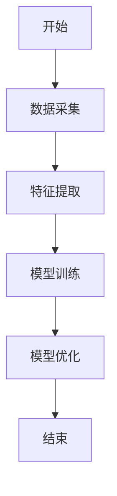

                 


# 智能花瓶：AI Agent的花卉保鲜技巧指导

---

## 关键词  
AI Agent, 花卉保鲜, 智能花瓶, 数据采集, 机器学习, 智能决策, 物联网

---

## 摘要  
本文详细探讨了AI Agent在花卉保鲜领域的应用，通过结合环境监测、数据采集和智能决策技术，提出了一种创新的花卉保鲜解决方案。文章从背景介绍、核心概念、算法原理、系统架构到实际案例，全面解析了AI Agent如何优化花卉保鲜过程，为花卉爱好者和相关行业提供了实用的技术指导和解决方案。

---

## 第一部分：背景介绍

### 第1章：花卉保鲜的背景与挑战

#### 1.1 花卉保鲜的重要性  
花卉作为自然美的一种象征，常用于装饰、礼仪和情感表达。然而，花卉的保鲜问题一直是人们关注的重点。鲜花的保鲜不仅关系到花的美观，还直接影响其经济价值和使用寿命。  

花卉保鲜的核心在于维持花的生理活性，延缓其衰老过程。传统保鲜方法主要包括物理方法（如低温储存）和化学方法（如防腐剂）。然而，这些方法存在效率低下、成本高、环境影响大等问题，难以满足现代花卉保鲜的需求。  

---

#### 1.2 花卉保鲜的传统方法与局限性  
传统的花卉保鲜方法主要包括以下几种：  
1. **物理保鲜**：通过低温、湿度控制等物理手段延缓花的衰老。  
2. **化学保鲜**：使用防腐剂、抗氧化剂等化学物质延长花的保鲜期。  
3. **包装技术**：通过特殊包装材料隔绝外界环境，减少花的水分蒸发。  

这些方法虽然在一定程度上延长了花的保鲜期，但也存在以下问题：  
- **成本高**：化学保鲜剂和特殊包装材料增加了保鲜成本。  
- **环境影响**：化学保鲜剂可能对环境造成污染。  
- **效率低**：传统方法难以实现精准控制，保鲜效果不稳定。  

---

#### 1.3 AI Agent在花卉保鲜中的应用前景  
随着人工智能技术的快速发展，AI Agent（智能代理）逐渐应用于各个领域。AI Agent是一种能够感知环境、自主决策并执行任务的智能系统。在花卉保鲜领域，AI Agent可以通过以下方式实现优化：  
1. **环境监测**：实时监测花卉的生长环境（如温度、湿度、光照等）。  
2. **数据采集**：采集花卉的生理数据（如叶绿素含量、细胞活性等）。  
3. **智能决策**：基于数据和模型，自动调整保鲜条件（如温度、光照强度等）。  

AI Agent的优势在于其能够实现精准控制和动态优化，从而显著提高保鲜效率，降低成本，并减少对环境的负面影响。  

---

## 第二部分：AI Agent与花卉保鲜的核心概念

### 第2章：AI Agent的基本原理

#### 2.1 AI Agent的定义与特点  
AI Agent是一种智能系统，能够通过感知环境、分析数据并执行任务来实现特定目标。其核心特点包括：  
1. **自主性**：能够在没有外部干预的情况下自主运行。  
2. **反应性**：能够实时感知环境变化并做出响应。  
3. **学习能力**：能够通过数据学习和优化自身算法。  

AI Agent在花卉保鲜中的应用主要体现在以下几个方面：  
1. **数据采集与分析**：通过传感器采集花卉的环境数据和生理数据。  
2. **智能决策**：基于数据和模型，制定最优的保鲜策略。  
3. **执行操作**：通过执行机构（如温控设备）调整环境条件。  

---

#### 2.2 花卉保鲜技术的基本原理  
花卉保鲜的核心在于维持花的生理活性。花的衰老过程主要受到以下因素的影响：  
1. **温度**：过高或过低的温度都会加速花的衰老。  
2. **湿度**：湿度不足会导致花的水分流失，而湿度过高则容易滋生霉菌。  
3. **光照**：光照不足会影响花的光合作用，而过强的光照则会灼伤花。  

通过控制这些环境因素，可以有效延缓花的衰老过程。  

---

#### 2.3 AI Agent与花卉保鲜的结合  
AI Agent与花卉保鲜的结合主要体现在以下几个方面：  
1. **环境监测**：AI Agent通过传感器实时监测花卉的生长环境，包括温度、湿度、光照等。  
2. **数据分析**：AI Agent利用机器学习算法分析花卉的生理数据，预测花的衰老趋势。  
3. **智能决策**：基于数据分析结果，AI Agent自动调整环境条件（如温度、湿度）以优化保鲜效果。  

---

## 第三部分：AI Agent的算法原理

### 第3章：AI Agent的算法基础

#### 3.1 数据采集与特征提取  
AI Agent的运行依赖于高质量的数据。在花卉保鲜中，数据采集主要包括以下内容：  
1. **环境数据**：温度、湿度、光照强度等。  
2. **生理数据**：叶绿素含量、细胞活性等。  

数据采集后，需要进行特征提取。例如，可以通过图像识别技术提取花的颜色、形状等特征，或通过传感器数据提取环境特征。  

---

#### 3.2 AI Agent的决策模型  
AI Agent的决策模型主要基于机器学习算法。以下是几种常用的算法：  

1. **支持向量机（SVM）**  
   SVM是一种常用的分类算法，适用于二分类问题。在花卉保鲜中，可以用于区分“保鲜状态良好”和“保鲜状态不佳”的样本。  

   $$ \text{SVM目标函数：} \quad \text{min} \frac{1}{2}\|w\|^2 + C\sum_{i=1}^n \xi_i $$
   $$ \text{约束条件：} \quad y_i(w \cdot x_i + b) \geq 1 - \xi_i $$  

2. **随机森林（Random Forest）**  
   随机森林是一种集成学习算法，适用于分类和回归问题。在花卉保鲜中，可以用于预测花的保鲜天数。  

3. **神经网络（Neural Network）**  
   神经网络是一种深度学习算法，适用于复杂的数据模式识别。在花卉保鲜中，可以用于图像识别（如花的健康状态检测）。  

---

#### 3.3 算法实现与优化  
以下是AI Agent算法实现的流程：  



模型优化主要包括以下步骤：  
1. **超参数调优**：通过网格搜索或随机搜索调整模型参数。  
2. **正则化**：防止过拟合（如L1/L2正则化）。  
3. **集成学习**：通过集成多个模型（如投票、加权平均）提高模型性能。  

---

## 第四部分：系统架构与设计

### 第4章：系统架构设计

#### 4.1 系统总体架构  
AI Agent的花卉保鲜系统总体架构如下：  


---

#### 4.2 系统功能模块  
1. **数据采集模块**  
   - 采集花卉的环境数据（温度、湿度、光照）和生理数据（叶绿素含量）。  

2. **AI处理模块**  
   - 数据预处理：清洗、归一化。  
   - 模型训练：基于机器学习算法训练保鲜模型。  
   - 模型推理：根据实时数据预测保鲜效果。  

3. **用户交互模块**  
   - 提供用户界面，显示保鲜状态和操作建议。  

---

## 第五部分：项目实战

### 第5章：AI Agent的花卉保鲜项目实战

#### 5.1 环境安装  
以下是项目所需的环境和工具：  
1. **硬件**：环境传感器（温度、湿度、光照传感器），摄像头（用于图像识别）。  
2. **软件**：Python（用于数据处理和模型训练），TensorFlow或Scikit-learn（机器学习库）。  

---

#### 5.2 核心代码实现  
以下是AI Agent的核心代码示例：  

```python
import numpy as np
from sklearn.svm import SVC

# 数据加载
X_train = np.load("features/X_train.npy")
y_train = np.load("features/y_train.npy")

# 模型训练
model = SVC(C=1.0, gamma=0.1)
model.fit(X_train, y_train)

# 模型推理
def predict_flower_health(X_test):
    return model.predict(X_test)
```

---

#### 5.3 代码解读与分析  
1. **数据加载**：从文件中加载训练数据。  
2. **模型训练**：使用支持向量机（SVM）训练分类模型。  
3. **模型推理**：根据输入的测试数据，预测花卉的健康状态。  

---

## 第六部分：最佳实践与总结

### 第6章：最佳实践与总结

#### 6.1 最佳实践  
1. **传感器选择**：选择高精度、低成本的传感器。  
2. **数据预处理**：确保数据的准确性和完整性。  
3. **模型优化**：通过调参和正则化提高模型性能。  

---

#### 6.2 小结  
通过AI Agent的应用，花卉保鲜技术得到了显著提升。AI Agent能够实时监测环境数据，智能分析花卉状态，并自动调整保鲜条件，从而实现高效、精准的保鲜效果。  

---

## 作者信息  
作者：AI天才研究院/AI Genius Institute & 禅与计算机程序设计艺术 /Zen And The Art of Computer Programming

