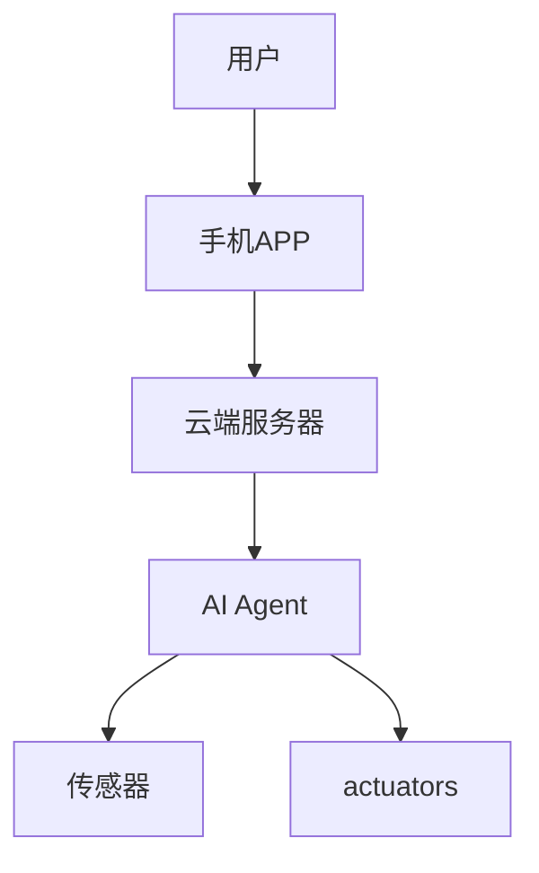
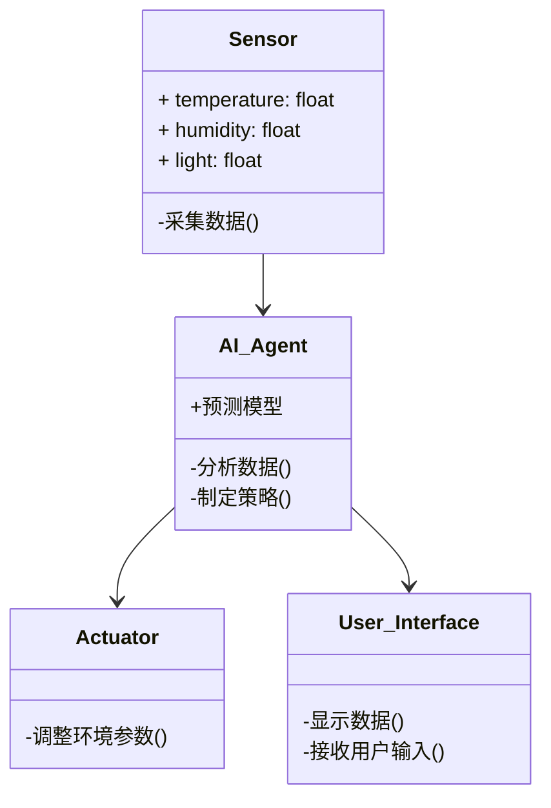
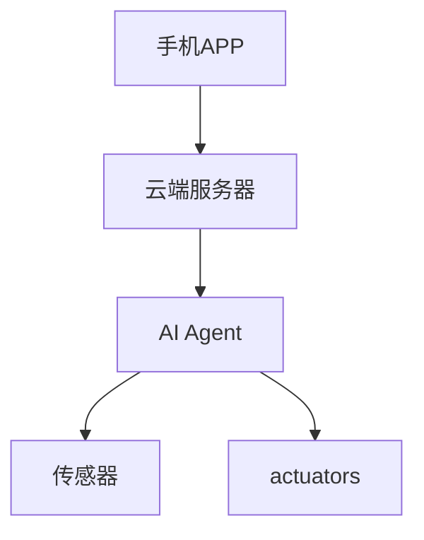

                 


# 智能花盆：AI Agent的植物生长优化管理器

---

## 关键词：智能花盆, AI Agent, 物联网, 机器学习, 植物生长优化, 物联网传感器

---

## 摘要：  
本文详细探讨了智能花盆的设计与实现，通过AI Agent技术优化植物生长管理。文章从背景、核心概念、传感器技术、AI算法、系统架构到项目实战，全面分析了智能花盆的工作原理和实际应用。通过物联网传感器数据采集、机器学习模型优化以及系统架构设计，展示了如何利用AI技术提升植物生长效率。

---

# 第1章: 智能花盆的背景与概念

## 1.1 智能花盆的发展背景

### 1.1.1 传统园艺的局限性  
传统园艺依赖人工经验，存在以下问题：  
1. **缺乏实时监测**：无法及时感知光照、温度、湿度等环境参数。  
2. **管理效率低**：人工浇水、施肥等操作耗时且容易出错。  
3. **资源浪费**：过度浇水或施肥可能导致水资源浪费和土壤污染。  

### 1.1.2 智能化技术在农业中的应用趋势  
随着物联网（IoT）、人工智能（AI）和大数据技术的发展，农业智能化成为趋势：  
1. **精准农业**：通过传感器和AI算法优化种植条件。  
2. **自动化管理**：利用智能设备实现自动浇水、施肥等功能。  
3. **数据驱动决策**：通过数据分析提升产量和质量。  

### 1.1.3 智能花盆的市场需求与应用场景  
智能花盆市场需求旺盛，应用场景广泛：  
1. **家庭用户**：适合园艺爱好者，提升种植效率。  
2. **农业大棚**：用于大规模植物种植管理。  
3. **科研机构**：支持植物生长研究。  

---

## 1.2 智能花盆的定义与特点

### 1.2.1 智能花盆的核心定义  
智能花盆是一种结合物联网和AI技术的智能设备，能够实时监测植物生长环境，并通过AI算法优化管理策略。  

### 1.2.2 智能花盆的主要特点  
1. **实时监测**：通过传感器持续采集环境数据。  
2. **智能决策**：利用AI算法自动调整光照、水分等条件。  
3. **远程控制**：可通过手机APP远程管理花盆。  

### 1.2.3 智能花盆与传统花盆的区别  
| 特性       | 传统花盆            | 智能花盆            |  
|------------|---------------------|--------------------|  
| 数据采集   | 无传感器           | 配备多种传感器      |  
| 管理方式   | 完全人工操作        | 自动化管理          |  
| 决策依据   | 经验                 | 数据驱动           |  

---

## 1.3 AI Agent在智能花盆中的作用

### 1.3.1 AI Agent的定义与功能  
AI Agent是一种智能体，能够感知环境、做出决策并执行动作。在智能花盆中，AI Agent负责：  
1. **数据处理**：分析传感器数据。  
2. **决策制定**：优化植物生长条件。  
3. **执行控制**：通过 actuators 调整环境参数。  

### 1.3.2 AI Agent在植物生长管理中的应用  
AI Agent通过以下方式优化植物生长：  
1. **预测模型**：基于历史数据预测最佳生长条件。  
2. **实时调整**：根据当前环境数据动态优化管理策略。  
3. **异常检测**：识别病虫害或环境异常。  

### 1.3.3 AI Agent的优势与局限性  
**优势**：  
- 提高管理效率。  
- 减少资源浪费。  
- 实现精准农业。  

**局限性**：  
- 依赖传感器数据的准确性。  
- 算法性能受数据质量和模型复杂度影响。  

---

## 1.4 本章小结  
本章介绍了智能花盆的背景、定义、特点以及AI Agent的作用，为后续章节奠定了基础。

---

# 第2章: 智能花盆的核心概念与技术

## 2.1 AI Agent的基本原理

### 2.1.1 AI Agent的组成与功能模块  
AI Agent的组成包括：  
1. **感知模块**：采集环境数据。  
2. **决策模块**：分析数据并制定策略。  
3. **执行模块**：通过 actuators 执行决策。  

### 2.1.2 AI Agent的核心算法  
常用算法包括：  
- **机器学习算法**：如随机森林、神经网络。  
- **优化算法**：如遗传算法、模拟退火。  

### 2.1.3 AI Agent与智能花盆的结合  
AI Agent通过以下步骤实现智能花盆的功能：  
1. **数据采集**：获取温度、湿度等参数。  
2. **数据分析**：利用机器学习模型预测最佳条件。  
3. **执行控制**：根据预测结果调整环境参数。  

---

## 2.2 物联网技术在智能花盆中的应用

### 2.2.1 物联网技术的基本概念  
物联网（IoT）通过传感器、通信技术和云计算实现万物互联。  

### 2.2.2 物联网在智能花盆中的具体应用  
- **传感器网络**：布置多种传感器监测环境。  
- **数据传输**：通过Wi-Fi或蓝牙将数据传输到云端。  
- **远程监控**：用户可通过手机APP实时查看数据。  

### 2.2.3 物联网技术对智能花盆功能的提升  
- **实时监控**：随时掌握植物生长状态。  
- **远程控制**：实现异地管理。  
- **数据存储与分析**：通过云端存储和分析数据，支持长期优化。  

---

## 2.3 智能花盆的系统架构

### 2.3.1 系统整体架构图  


### 2.3.2 系统功能模块划分  
1. **传感器模块**：采集环境数据。  
2. **AI Agent模块**：分析数据并制定策略。  
3. **执行模块**：调整环境参数。  
4. **用户交互模块**：提供可视化界面。  

### 2.3.3 系统组件之间的关系  
- **传感器**：向AI Agent发送数据。  
- **AI Agent**：接收数据并发送控制指令。  
- **执行模块**：根据指令调整环境参数。  

---

## 2.4 本章小结  
本章详细介绍了AI Agent和物联网技术在智能花盆中的应用，为后续章节的系统设计奠定了基础。

---

# 第3章: 智能花盆的传感器与数据采集

## 3.1 传感器的作用与分类

### 3.1.1 传感器的基本概念  
传感器是一种能够感知特定物理量（如温度、湿度）并将其转换为电信号的装置。  

### 3.1.2 常见传感器类型及其功能  
| 传感器类型 | 功能描述               |  
|------------|------------------------|  
| 温度传感器 | 测量环境温度           |  
| 湿度传感器 | 测量环境湿度           |  
| 光照传感器 | 测量光照强度           |  
| pH传感器   | 测量土壤酸碱度         |  

### 3.1.3 传感器在智能花盆中的具体应用  
- **温度传感器**：监测植物生长环境温度。  
- **湿度传感器**：监测土壤湿度。  
- **光照传感器**：监测光照强度。  

---

## 3.2 数据采集的原理与实现

### 3.2.1 数据采集的基本流程  
1. **传感器采集数据**：如温度传感器测量当前温度。  
2. **数据预处理**：滤除噪声，确保数据准确。  
3. **数据传输**：通过通信模块将数据传输到云端。  

### 3.2.2 数据采集的硬件实现  
- 使用Arduino或Raspberry Pi等开发板。  
- 通过I2C或SPI接口连接传感器。  

### 3.2.3 数据采集的软件实现  
- 编写数据采集程序，如Python脚本。  
- 使用MQTT协议传输数据到云端。  

---

## 3.3 数据预处理与分析

### 3.3.1 数据预处理的基本方法  
1. **去噪**：去除传感器噪声。  
2. **归一化**：将数据标准化处理。  
3. **插值**：处理缺失数据。  

### 3.3.2 数据分析的基本原理  
- 通过机器学习模型分析数据，提取有用信息。  
- 使用统计方法分析数据分布和趋势。  

---

## 3.4 本章小结  
本章详细介绍了智能花盆中传感器的作用、分类及数据采集的实现方法，为后续章节的数据分析奠定了基础。

---

# 第4章: AI算法与植物生长优化

## 4.1 机器学习在植物生长管理中的应用

### 4.1.1 机器学习的基本概念  
机器学习是一种通过数据训练模型，使其具备某种能力的技术。  

### 4.1.2 机器学习在植物生长管理中的具体应用  
- **预测模型**：预测植物生长周期和产量。  
- **分类模型**：识别病虫害。  
- **回归模型**：优化环境参数。  

### 4.1.3 机器学习算法的选择与优化  
常用算法包括：  
- **线性回归**：用于回归问题。  
- **决策树**：用于分类和回归问题。  
- **随机森林**：用于特征选择和模型优化。  

---

## 4.2 植物生长模型的建立与优化

### 4.2.1 植物生长模型的建立  
1. **数据准备**：收集光照、温度、湿度等数据。  
2. **特征选择**：选择影响植物生长的关键因素。  
3. **模型训练**：使用机器学习算法训练模型。  

### 4.2.2 模型优化与调参  
- **交叉验证**：评估模型性能。  
- **超参数调优**：通过网格搜索优化模型参数。  

### 4.2.3 模型部署与应用  
- **实时预测**：根据当前环境数据预测生长条件。  
- **动态调整**：根据预测结果优化管理策略。  

---

## 4.3 本章小结  
本章详细介绍了机器学习在植物生长管理中的应用，展示了如何通过AI算法优化植物生长条件。

---

# 第5章: 智能花盆的系统架构设计

## 5.1 系统整体架构图  


### 5.2 系统功能模块划分  
1. **传感器模块**：采集环境数据。  
2. **AI Agent模块**：分析数据并制定策略。  
3. **执行模块**：调整环境参数。  
4. **用户交互模块**：提供可视化界面。  

### 5.3 系统组件之间的关系  
- **传感器**：向AI Agent发送数据。  
- **AI Agent**：接收数据并发送控制指令。  
- **执行模块**：根据指令调整环境参数。  

---

## 5.2 系统功能模块划分  

### 5.2.1 领域模型（类图）  


---

## 5.3 系统架构设计  

### 5.3.1 系统架构图  


### 5.3.2 接口设计  
- **传感器接口**：提供数据采集API。  
- **AI Agent接口**：提供分析数据的API。  
- **执行模块接口**：提供调整环境参数的API。  

### 5.3.3 交互设计  
- **用户输入**：用户通过手机APP输入管理需求。  
- **系统反馈**：系统通过APP反馈当前状态和管理结果。  

---

## 5.4 本章小结  
本章详细介绍了智能花盆的系统架构设计，展示了如何通过模块化设计实现系统的高效运行。

---

# 第6章: 智能花盆的项目实战

## 6.1 项目环境安装

### 6.1.1 硬件安装  
- 安装Raspberry Pi和传感器模块。  
- 连接电源和通信模块。  

### 6.1.2 软件安装  
- 安装Python和必要的库（如paho-mqtt）。  
- 配置云端服务器（如AWS IoT）。  

---

## 6.2 系统核心实现

### 6.2.1 数据采集代码  
```python
import paho.mqtt.client as mqtt

def on_connect(client, userdata, flags, rc):
    print("Connected with result code " + str(rc))

client = mqtt.Client()
client.on_connect = on_connect
client.connect("localhost", 1883, 60)

client.publish("temperature", "25")
client.publish("humidity", "60")
client.publish("light", "500")
```

### 6.2.2 AI Agent实现  
```python
from sklearn.ensemble import RandomForestRegressor

# 数据准备
X = df[['temperature', 'humidity', 'light']]
y = df['optimal_water']

# 模型训练
model = RandomForestRegressor(n_estimators=100)
model.fit(X, y)

# 预测
predicted_water = model.predict(X)
```

### 6.2.3 执行模块代码  
```python
import RPi.GPIO as GPIO

def water_plant():
    GPIO.output(water_pump_pin, GPIO.HIGH)
    time.sleep(30)
    GPIO.output(water_pump_pin, GPIO.LOW)

water_plant()
```

---

## 6.3 项目实战案例分析

### 6.3.1 案例背景  
某用户使用智能花盆种植草莓，目标是优化生长条件。  

### 6.3.2 数据分析  
通过传感器数据，AI Agent预测出最佳浇水时间为每天早晨。  

### 6.3.3 系统优化  
根据预测结果，自动调整浇水时间和水量。  

---

## 6.4 本章小结  
本章通过实际案例展示了智能花盆的实现过程，从环境安装到系统核心代码，再到案例分析，详细讲解了项目的实战过程。

---

# 第7章: 总结与展望

## 7.1 全文总结  
智能花盆通过AI Agent和物联网技术，实现了植物生长的智能化管理。通过传感器数据采集、AI算法优化和系统架构设计，显著提升了植物生长效率和资源利用效率。

## 7.2 未来展望  
1. **技术优化**：进一步提升AI算法性能，引入深度学习技术。  
2. **功能扩展**：增加更多传感器类型，如CO2浓度传感器。  
3. **应用场景扩展**：从家庭种植扩展到大规模农业应用。  

## 7.3 注意事项与最佳实践  
- **数据质量管理**：确保传感器数据的准确性和完整性。  
- **算法优化**：定期更新模型，适应不同植物的生长需求。  
- **系统维护**：定期检查硬件设备，确保系统稳定运行。  

---

## 作者：AI天才研究院/AI Genius Institute & 禅与计算机程序设计艺术 /Zen And The Art of Computer Programming  

---

通过以上章节的详细阐述，本文全面介绍了智能花盆的设计与实现，展示了如何利用AI技术优化植物生长管理。希望本文能为相关领域的研究和实践提供有价值的参考。

