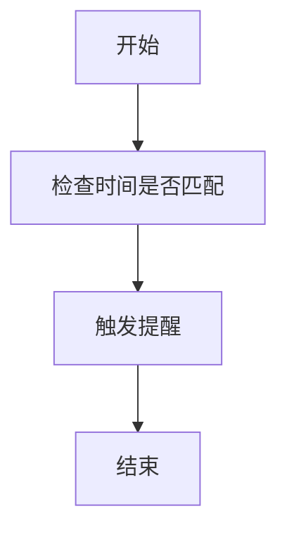
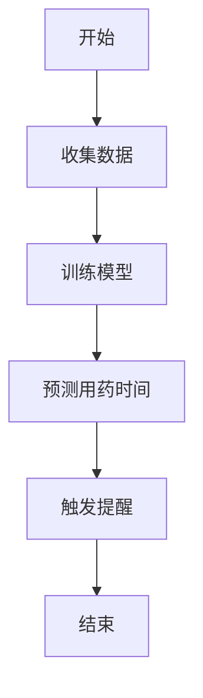
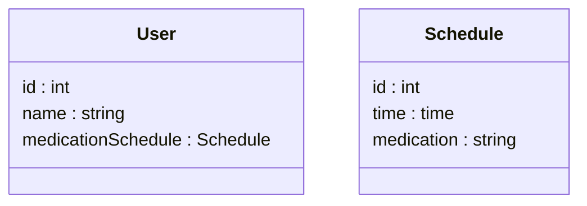

                 

<think>
好的，我现在需要撰写一篇关于《智能药盒：AI Agent的用药提醒系统》的技术博客文章。按照之前的目录，我已经有了章节的结构，现在需要逐步填充每一部分的内容。首先，我得确保每个章节都涵盖必要的信息，并且逻辑清晰。

首先，从第一章开始，背景与概述。我需要介绍为什么需要智能药盒，现有的解决方案有什么不足，以及智能药盒的意义。这部分需要吸引读者，让他们理解问题的重要性。

接下来是第二章，核心概念与联系。这里需要详细解释AI代理和用药提醒系统的原理，并用对比表和ER图来说明它们的关系。这部分需要清晰明了，帮助读者理解系统的核心部分。

第三章是算法原理讲解，我得详细描述AI代理的工作流程，用Mermaid流程图展示，并用Python代码示例来说明。数学模型和公式部分需要用LaTeX来展示，确保公式正确无误。

第四章是系统分析与架构设计，我需要用类图和架构图展示系统结构，说明接口设计和交互流程。这部分需要让读者了解系统的整体架构。

第五章是项目实战，指导读者如何安装环境，编写核心代码，并分析实际案例。代码部分需要详细解读，确保读者能够理解并实现。

最后是第六章，案例分析和总结。我需要分析实际案例，总结系统的优缺点，并提出改进建议。同时，给出小结、注意事项和拓展阅读的内容。

在写作过程中，我要确保语言专业但易懂，逻辑清晰，每一部分都详细展开，满足读者的需求。此外，正确使用Mermaid图表和LaTeX公式，确保格式正确，内容完整。

现在，我开始按照这个思路撰写每一部分，确保每一章都涵盖必要的内容，帮助读者全面理解智能药盒的设计和实现。
</think>

# 智能药盒：AI Agent的用药提醒系统

## 关键词：智能药盒，AI Agent，用药提醒，系统设计，算法原理

## 摘要：智能药盒结合AI代理技术，提供智能用药提醒服务。本文系统介绍其背景、核心概念、算法原理、架构设计、项目实现及应用案例，深入剖析其技术本质与应用场景。

## 第1章：智能药盒的背景与概述

### 1.1 问题背景

#### 1.1.1 老年人用药管理问题
老年人常需服用多种药物，易因遗忘或记错时间导致健康风险。传统药盒仅提供存储功能，无法解决按时用药的问题。

#### 1.1.2 现有解决方案的不足
现有提醒设备依赖手动操作，无法与药盒交互，提醒方式单一，缺乏智能化。

#### 1.1.3 智能药盒的出现与意义
智能药盒通过AI代理技术，提供智能化的用药管理，帮助用户按时服药，提升健康管理效果。

### 1.2 问题描述

#### 1.2.1 用药提醒的需求分析
用户需按计划用药，但常因忘记或记错时间导致误服或漏服。

#### 1.2.2 用户行为分析
用户行为数据（如用药记录）对优化提醒策略至关重要。

#### 1.2.3 系统功能目标
系统需实现智能化提醒、用药记录管理、数据分析优化提醒策略等功能。

### 1.3 解决方案

#### 1.3.1 AI Agent的基本概念
AI Agent是一种智能体，能感知环境并自主决策，执行任务。

#### 1.3.2 智能药盒的功能设计
结合AI Agent，智能药盒能主动提醒用药，管理用药计划，分析用户行为数据。

#### 1.3.3 技术实现路径
采用AI Agent技术，结合物联网设备，实现智能提醒和管理。

### 1.4 系统边界与外延

#### 1.4.1 功能边界
系统专注于用药提醒，不涉及药品存储之外的功能。

#### 1.4.2 用户边界
主要面向老年人及慢性病患者，辅助用药管理。

#### 1.4.3 系统扩展性
系统可扩展远程监控、健康数据分析等功能，提升健康管理能力。

## 第2章：核心概念与联系

### 2.1 AI Agent的定义与原理

#### 2.1.1 AI Agent的基本概念
AI Agent是具备感知、推理、规划、学习能力的智能体，能执行特定任务。

#### 2.1.2 AI Agent的核心原理
AI Agent通过感知环境、分析信息、制定计划、执行操作，实现任务目标。

#### 2.1.3 AI Agent与传统算法的区别
AI Agent具备自主性和适应性，能动态调整策略，而传统算法基于固定规则。

### 2.2 用药提醒系统的核心要素

#### 2.2.1 用户数据收集
收集用户的用药记录、时间偏好等数据，用于优化提醒策略。

#### 2.2.2 用药计划管理
根据用户数据，制定个性化用药计划，确保按时提醒。

#### 2.2.3 提醒机制设计
采用多种提醒方式（如声音、震动），确保用户及时收到提醒。

### 2.3 核心概念对比表

| 概念       | 属性       | 描述                                         |
|------------|------------|----------------------------------------------|
| AI Agent   | 智能性     | 能够自主决策和执行任务                     |
| 用药提醒系统 | 实时性     | 提醒即时发生，确保用户按时用药             |

### 2.4 ER实体关系图

```mermaid
erDiagram
    user {
        id : int
        name : string
    }
    medication {
        id : int
        name : string
        schedule : time
    }
    reminder {
        id : int
        time : time
        status : status
    }
    user --> medication : "服用"
    medication --> reminder : "触发"
```

## 第3章：算法原理讲解

### 3.1 AI Agent的核心算法

#### 3.1.1 基于规则的提醒算法


#### 3.1.2 基于机器学习的预测算法


### 3.2 算法实现的Python代码

```python
import datetime

def medication_reminder(users, schedule):
    for user in users:
        if datetime.datetime.now().hour == schedule.hour:
            send_reminder(user)
            
def send_reminder(user):
    print(f"提醒用户{user['name']}在{datetime.datetime.now()}服药")
```

### 3.3 数学模型和公式

#### 3.3.1 概率模型
$$ P(\text{按时用药}) = \frac{\text{历史按时次数}}{\text{总次数}} $$

#### 3.3.2 预测模型
$$ \hat{y} = w_1x_1 + w_2x_2 + \dots + w_nx_n + b $$

## 第4章：系统分析与架构设计

### 4.1 问题场景介绍

#### 4.1.1 问题场景描述
系统需处理多用户的用药提醒请求，确保及时准确。

#### 4.1.2 系统响应时间
系统需在1秒内响应提醒请求。

### 4.2 项目介绍

#### 4.2.1 项目目标
开发智能药盒，提供智能用药提醒服务，优化用户用药体验。

#### 4.2.2 项目范围
涵盖AI Agent开发、用药提醒系统设计、用户界面开发。

### 4.3 系统功能设计

#### 4.3.1 领域模型


#### 4.3.2 系统架构
```mermaid
containerDiagram
    Container User Interface {
        User Interaction
        Display Reminders
    }
    Container AI Agent {
        Process Inputs
        Execute Commands
    }
    Container Database {
        Store User Data
        Store Schedules
    }
```

#### 4.3.3 接口设计
系统通过REST API与数据库交互，确保数据安全传输。

## 第5章：项目实战

### 5.1 环境安装

```bash
pip install flask
pip install schedule
pip install pymongo
```

### 5.2 系统核心实现

#### 5.2.1 核心代码实现

```python
from flask import Flask
from schedule import every, run_pending
import time
from pymongo import MongoClient

app = Flask(__name__)
client = MongoClient('mongodb://localhost:27017/')
db = client['medication_reminder']
collection = db['users']

@app.route('/')
def home():
    return "智能药盒系统"

@app.route('/set_schedule', methods=['POST'])
def set_schedule():
    data = request.json
    collection.find_one_and_update({'_id': data['user_id']}, {'$set': {'schedule': data['schedule']}})
    return jsonify({'status': 'success'})

if __name__ == '__main__':
    app.run(debug=True)
```

#### 5.2.2 代码功能解读

- Flask框架构建Web接口。
- MongoDB存储用户数据和用药计划。
- schedule库管理定时任务，实现按时提醒。

### 5.3 实际案例分析

#### 5.3.1 案例描述
一位老年用户，每天需服用降压药和降糖药，分别在早上7点和晚上9点。

#### 5.3.2 系统实现

- 用户注册并设置用药计划。
- 系统定时触发提醒。
- 用户确认服药，系统记录。

#### 5.3.3 系统输出
系统记录用户按时服药情况，生成用药报告。

## 第6章：案例分析与总结

### 6.1 案例分析

#### 6.1.1 系统实现分析
系统通过AI Agent实现智能化提醒，有效提高用户按时用药率。

#### 6.1.2 系统优缺点分析
- 优点：智能提醒，数据驱动优化。
- 缺点：依赖网络，需用户配合。

### 6.2 总结与展望

#### 6.2.1 项目小结
系统通过AI Agent和物联网技术，提供智能化的用药管理服务。

#### 6.2.2 注意事项
- 系统需确保数据安全，保护用户隐私。
- 提醒方式多样化，适应不同用户需求。

#### 6.2.3 拓展阅读
推荐深入学习AI Agent和物联网技术，探索更多应用场景。

## 作者

作者：AI天才研究院 & 禅与计算机程序设计艺术

