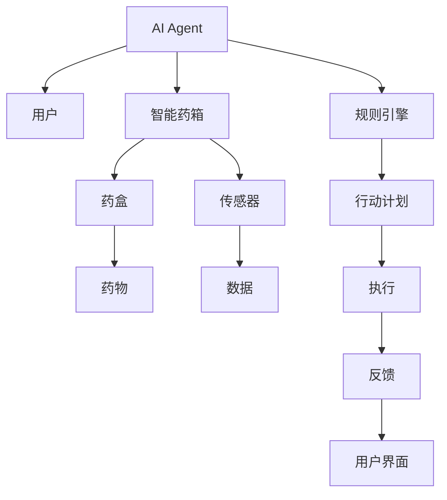
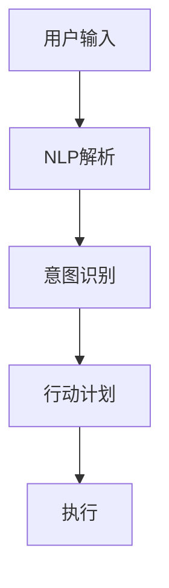
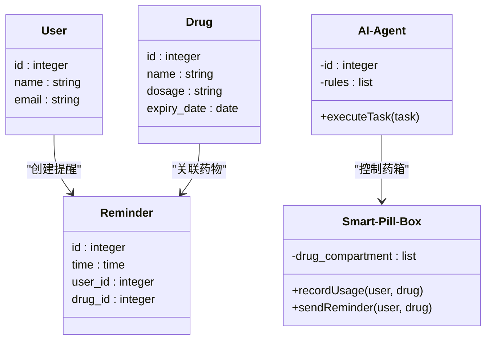
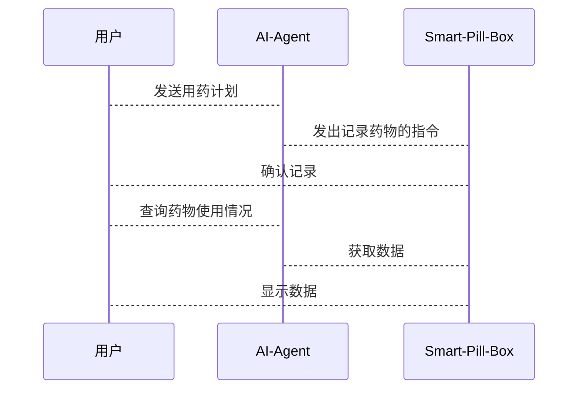

                 


# 智能药箱：AI Agent的用药管理与提醒系统

## 关键词：AI Agent，智能药箱，用药管理，用药提醒，医疗健康

## 摘要：  
智能药箱结合AI Agent技术，为用药管理提供智能化解决方案。通过AI Agent的自然语言处理、机器学习和规则引擎，智能药箱能够实现药物管理、用药提醒、数据采集与分析、异常检测等功能，帮助用户更高效地管理药物，提升用药依从性。本文将详细探讨智能药箱的设计与实现，涵盖背景介绍、核心概念、算法原理、系统架构、项目实战及最佳实践。

---

# 第1章：智能药箱的背景与问题背景

## 1.1 问题背景

### 1.1.1 药物管理问题的现状
现代医疗健康领域中，患者常常需要服用多种药物，且每种药物的服用时间、剂量、注意事项各不相同。传统的药物管理方式依赖于患者或家属手动记录和提醒，这种方式容易遗忘、错误率高，尤其是在老年人或病情复杂的患者中，问题更为突出。

### 1.1.2 智能药箱的必要性
智能药箱的出现，旨在解决传统药物管理方式的痛点。通过智能化的设计，智能药箱能够自动记录用药情况、提醒用药时间，并与AI Agent结合，提供个性化的用药建议和健康数据分析。

### 1.1.3 AI Agent在医疗健康中的应用前景
AI Agent（智能代理）是一种能够感知环境、执行任务、与用户交互的智能系统。在医疗健康领域，AI Agent可以用于健康监测、用药提醒、疾病管理等多种场景。结合智能药箱，AI Agent能够进一步提升用药管理的智能化水平。

## 1.2 问题描述

### 1.2.1 用药提醒的痛点
传统用药提醒方式依赖于手机闹钟或手动记录，这种方式缺乏智能化，容易被用户忽略或误操作，导致用药不及时或剂量错误。

### 1.2.2 药物管理的复杂性
患者可能需要服用多种药物，每种药物的服用时间、剂量、注意事项各不相同，传统管理方式难以实现高效、个性化的管理。

### 1.2.3 用户需求分析
用户需要一种能够自动记录用药情况、智能提醒用药时间、提供用药建议的系统，尤其是在复杂用药情况下，用户需要系统能够主动发现异常并提供帮助。

## 1.3 问题解决

### 1.3.1 智能药箱的核心功能
- 自动记录用药情况
- 智能提醒用药时间
- 提供用药建议
- 数据采集与分析
- 异常检测与提醒

### 1.3.2 AI Agent在用药管理中的作用
AI Agent通过自然语言处理、机器学习和规则引擎，能够理解用户的用药需求，主动提供个性化的用药建议，并与智能药箱交互，实现智能化的用药管理。

### 1.3.3 技术实现的可行性分析
AI Agent和智能药箱的结合在技术上是可行的，可以通过物联网技术实现药箱与用户的交互，通过AI技术实现智能化的用药管理。

## 1.4 边界与外延

### 1.4.1 智能药箱的功能边界
智能药箱的主要功能是管理用药，不涉及医疗诊断或其他健康服务。

### 1.4.2 与其他医疗系统的接口
智能药箱可以通过API与其他医疗系统（如电子健康记录系统）交互，但本文不涉及这部分内容。

### 1.4.3 未来可能的扩展方向
未来，智能药箱可以扩展到更复杂的健康服务，如疾病管理、健康监测等。

## 1.5 核心要素组成

### 1.5.1 AI Agent的构成
- 感知层：通过传感器或用户输入获取环境信息。
- 计划层：基于感知信息，制定行动计划。
- 执行层：通过智能药箱或其他设备执行任务。

### 1.5.2 药箱硬件的组成部分
- 药盒：用于存储和管理药物。
- 传感器：用于检测药物的存在和使用情况。
- 交互界面：用于用户与药箱的交互。

### 1.5.3 软件系统的功能模块
- 用户管理：管理用户信息。
- 用药提醒：根据用户用药计划发送提醒。
- 数据采集与分析：采集用药数据，进行分析和反馈。
- 异常检测：检测用药异常情况，并提醒用户。

---

# 第2章：AI Agent与智能药箱的关系

## 2.1 核心概念原理

### 2.1.1 AI Agent的基本原理
AI Agent通过感知环境、理解用户需求、制定计划并执行任务，实现智能化的用药管理。

### 2.1.2 智能药箱的工作机制
智能药箱通过传感器和交互界面，感知用户的用药行为，并通过AI Agent进行分析和反馈。

### 2.1.3 两者结合的实现方式
AI Agent通过与智能药箱的交互，实现智能化的用药管理，包括用药提醒、数据采集与分析等功能。

## 2.2 核心概念属性对比

| 属性         | AI Agent                     | 智能药箱                     |
|--------------|------------------------------|------------------------------|
| 功能         | 理解需求、制定计划、执行任务 | 存储药物、提醒用药、记录数据 |
| 输入方式     | 用户指令、传感器数据         | 药物使用记录、用户输入       |
| 输出方式     | 提醒信息、行动计划           | 药盒状态、提醒信息           |
| 交互方式     | 自然语言交互、规则引擎       | 图形界面、传感器交互         |
| 智能程度     | 高                          | 较高                        |

## 2.3 ER实体关系图

```mermaid
erDiagram
    user {
        id : integer
        name : string
        email : string
    }
    drug {
        id : integer
        name : string
        dosage : string
        expiry_date : date
    }
    reminder {
        id : integer
        time : time
        user_id : integer
        drug_id : integer
    }
    user ||-->> reminder : "创建提醒"
    drug ||-->> reminder : "关联药物"
```

---

## 2.4 核心概念的Mermaid流程图



---

# 第3章：算法原理与实现

## 3.1 算法原理

### 3.1.1 自然语言处理（NLP）算法
AI Agent通过NLP算法理解用户的用药需求，例如解析用户的用药计划和异常报告。



### 3.1.2 机器学习模型
AI Agent通过机器学习模型分析用药数据，预测用户可能的用药异常。

### 3.1.3 规则引擎
AI Agent通过规则引擎制定用药计划和异常处理规则。

## 3.2 算法实现

### 3.2.1 自然语言处理（NLP）代码示例
```python
from transformers import pipeline

# 加载预训练的NLP模型
nlp = pipeline("question-answering")

# 解析用户的用药计划
response = nlp(
    "用药计划：\n"
    "患者需要每天服用两次药物A，每次剂量为500mg；\n"
    "每周三和周五服用药物B，每次剂量为250mg。\n"
    "问题：患者下一次需要服用药物B的时间是什么时候？"
)
print(response)
```

### 3.2.2 机器学习模型代码示例
```python
from sklearn.tree import DecisionTreeClassifier
from sklearn.datasets import make_classification

# 生成示例数据
X, y = make_classification(n_samples=100, n_features=20, n_classes=2)

# 训练决策树模型
model = DecisionTreeClassifier()
model.fit(X, y)

# 预测用药异常
new_X = ...  # 新的用药数据
prediction = model.predict(new_X)
print(prediction)
```

### 3.2.3 数学模型与公式
AI Agent的异常检测算法可以基于统计模型，例如使用概率论中的贝叶斯定理：

$$ P(A|B) = \frac{P(B|A) \cdot P(A)}{P(B)} $$

其中，A表示“存在用药异常”，B表示“检测到的异常特征”。

---

# 第4章：系统分析与架构设计

## 4.1 问题场景介绍
智能药箱需要在多种场景中使用，例如家庭用药管理、医院病房管理等。

## 4.2 系统功能设计

### 4.2.1 领域模型Mermaid类图


### 4.2.2 系统架构Mermaid架构图
```mermaid
archiecture
    网络层 --> 服务层
    服务层 --> 数据层
    用户层 --> 网络层
    用户层 --> 服务层
    数据层 --> 服务层
```

## 4.3 系统接口设计
智能药箱与AI Agent之间的接口需要定义明确的API，例如：

- `/api/users`：管理用户信息
- `/api/drugs`：管理药物信息
- `/api/reminders`：管理用药提醒

## 4.4 系统交互Mermaid序列图


---

# 第5章：项目实战

## 5.1 环境安装
- 安装Python和必要的库（如Transformers、Scikit-learn）
- 安装Mermaid工具（用于绘制图表）

## 5.2 核心代码实现

### 5.2.1 AI Agent的实现
```python
class AI-Agent:
    def __init__(self):
        self.rules = []

    def executeTask(self, task):
        # 执行任务的逻辑
        pass
```

### 5.2.2 智能药箱的实现
```python
class Smart-Pill-Box:
    def __init__(self):
        self.drug_compartment = []

    def recordUsage(self, user, drug):
        # 记录药物使用情况
        pass

    def sendReminder(self, user, drug):
        # 发送用药提醒
        pass
```

## 5.3 案例分析
以一位需要每天服用两种药物的患者为例，展示AI Agent和智能药箱的协同工作过程。

---

# 第6章：最佳实践与小结

## 6.1 小结
智能药箱结合AI Agent，能够实现智能化的用药管理，提升患者的用药依从性。

## 6.2 注意事项
- 系统的安全性需要高度重视
- 用户隐私保护
- 系统的可扩展性

## 6.3 拓展阅读
建议读者进一步阅读相关领域的书籍和论文，深入了解AI Agent和智能药箱的技术细节。

---

# 作者

作者：AI天才研究院 / AI Genius Institute  
禅与计算机程序设计艺术 / Zen And The Art of Computer Programming

--- 

*注：本文部分代码示例可能需要根据实际需求进行调整和优化。*

