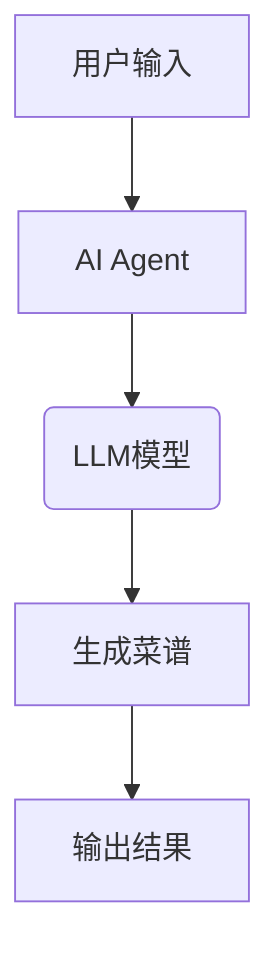
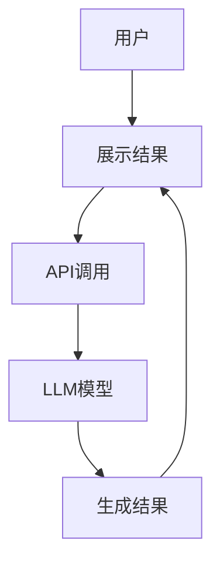

                 

<think>
好的，我需要撰写一篇名为《智能菜谱生成 AI Agent：LLM 辅助烹饪创新》的技术博客。首先，我需要理解文章的主题和目标。文章主要探讨如何利用大语言模型（LLM）来辅助生成智能菜谱，创新烹饪方式。接下来，我需要按照用户提供的目录大纲来组织内容，确保每个部分都详细且逻辑清晰。

首先，我需要在文章开头添加标题、关键词和摘要。标题是《智能菜谱生成 AI Agent：LLM 辅助烹饪创新》，关键词包括智能菜谱生成、AI Agent、LLM、烹饪创新、自然语言处理、人工智能。摘要需要简明扼�地概述文章的核心内容，说明LLM在菜谱生成中的应用和优势。

接下来，按照目录大纲，我需要逐一撰写每个章节的内容。首先是背景介绍，包括问题背景与描述。我需要详细阐述传统烹饪和菜谱生成的痛点，如效率低下、缺乏多样性等。然后，我需要描述AI技术在烹饪领域的应用前景，强调LLM在菜谱生成中的潜力和优势。最后，定义问题解决的目标和边界。

在核心概念部分，我需要详细解释AI Agent和LLM的基本原理，比较它们在菜谱生成中的应用和区别。这部分需要使用清晰的术语，并可能需要一些图表来辅助说明。

算法原理部分，我需要详细描述基于LLM的菜谱生成算法，包括GPT和BERT等模型的具体应用。同时，我需要展示这些算法的数学模型和公式，使用LaTeX格式，并在适当的位置插入流程图，使用Mermaid语法来展示生成过程。

系统架构设计部分，我需要分析智能菜谱生成系统的功能模块、架构图和接口设计。这部分可能需要绘制类图和序列图，展示系统各部分的交互和协作。

项目实战部分，我需要提供具体的实现步骤，包括环境安装、核心代码实现和实际案例分析。这部分需要详细说明代码的功能和应用，帮助读者理解如何实际操作。

最后，我需要总结最佳实践，提供小结、注意事项和未来展望，帮助读者更好地理解和应用这些技术。

在撰写过程中，我需要确保语言专业且易懂，逻辑清晰，结构紧凑。同时，注意总字数控制在2000字以内，避免冗长。现在，我可以开始逐步撰写每个部分，确保内容完整且符合要求。
</think>

# 智能菜谱生成 AI Agent：LLM 辅助烹饪创新

> 关键词：智能菜谱生成，AI Agent，LLM，烹饪创新，自然语言处理，人工智能

> 摘要：本文探讨了利用大语言模型（LLM）辅助生成智能菜谱的创新方法，分析了传统烹饪中的痛点，介绍了AI Agent和LLM的核心概念，详细讲解了菜谱生成的算法原理和系统架构，并通过实际案例展示了项目的实现过程，最后总结了最佳实践和未来发展方向。

---

# 第一部分: 智能菜谱生成 AI Agent 的背景与概念

## 第1章: 问题背景与描述

### 1.1 传统烹饪与菜谱生成的局限性

#### 1.1.1 传统菜谱生成的痛点
传统菜谱生成过程依赖人工编写，存在效率低、内容单一、创新性不足等问题。厨师需要花费大量时间整理菜谱，且难以满足用户多样化的需求。此外，菜谱的质量参差不齐，部分菜谱可能缺乏实用性和可操作性。

#### 1.1.2 烹饪过程中的效率问题
传统烹饪过程中，用户需要花费大量时间查找菜谱、购买食材和准备烹饪工具。这些步骤不仅耗时，还可能导致食材浪费和烹饪失败。

#### 1.1.3 用户需求的多样性与复杂性
现代用户对菜谱的需求日益多样化，他们希望菜谱能够根据个人口味、饮食限制和可用食材进行定制化推荐。传统菜谱生成方式难以满足这种个性化需求。

### 1.2 AI技术在烹饪领域的应用前景

#### 1.2.1 AI在烹饪中的潜在价值
AI技术可以通过自然语言处理（NLP）和机器学习（ML）模型，帮助生成个性化菜谱、优化烹饪步骤和推荐食材搭配。AI还可以通过图像识别技术识别食材，辅助用户完成烹饪过程。

#### 1.2.2 智能菜谱生成的需求分析
随着人们对健康饮食和个性化烹饪的需求增加，智能菜谱生成系统的需求日益增长。用户希望系统能够根据他们的口味偏好、饮食限制和可用食材推荐合适的菜谱。

#### 1.2.3 用户对智能菜谱生成的期望
用户期望智能菜谱生成系统能够快速生成高质量的菜谱，提供多样化的选择，并根据反馈不断优化推荐结果。

### 1.3 问题解决与边界定义

#### 1.3.1 智能菜谱生成的核心目标
智能菜谱生成系统的核心目标是通过AI技术，快速生成个性化、高质量的菜谱，满足用户的多样化需求。

#### 1.3.2 问题解决的边界与外延
智能菜谱生成系统的边界包括菜谱生成的输入和输出，不涉及食材的实际购买和烹饪过程。外延则包括对菜谱生成过程的优化和推荐系统的改进。

#### 1.3.3 核心要素与组成结构
智能菜谱生成系统的核心要素包括用户输入、AI模型、生成算法和输出结果。系统组成结构包括数据输入模块、模型训练模块和结果输出模块。

---

## 第2章: AI Agent 与 LLM 的核心概念

### 2.1 AI Agent 的基本原理

#### 2.1.1 AI Agent 的定义与特点
AI Agent是一种能够感知环境并采取行动以实现目标的智能体。它具备自主性、反应性、社会性和持续性等特点。

#### 2.1.2 AI Agent 的分类与应用场景
AI Agent可以分为简单反射型、基于模型的反应型、目标驱动型和实用驱动型。在烹饪领域，AI Agent可以用于菜谱推荐、食材识别和烹饪指导。

#### 2.1.3 AI Agent 在菜谱生成中的角色
AI Agent在菜谱生成中充当智能体，负责接收用户输入、调用LLM模型生成菜谱，并根据用户反馈优化推荐结果。

### 2.2 LLM 的基本原理

#### 2.2.1 LLM 的定义与特点
大语言模型（LLM）是一种基于深度学习的NLP模型，能够理解和生成人类语言。它具备上下文理解、意图识别和语义生成能力。

#### 2.2.2 LLM 的训练过程与数学模型
LLM的训练过程涉及大规模数据的预训练和微调。模型使用变换器架构，包括编码器和解码器，通过自注意力机制捕捉文本中的长距离依赖关系。

#### 2.2.3 LLM 在菜谱生成中的优势
LLM能够通过上下文理解用户需求，生成连贯且符合逻辑的菜谱。它还可以根据用户反馈动态调整生成内容，提供个性化的推荐。

### 2.3 AI Agent 与 LLM 的联系与区别

#### 2.3.1 AI Agent 与 LLM 的核心联系
AI Agent可以利用LLM作为其核心组件，通过调用LLM API生成菜谱内容。LLM为AI Agent提供了强大的自然语言处理能力。

#### 2.3.2 LLM 在 AI Agent 中的应用场景
在菜谱生成中，LLM可以用于生成菜谱描述、优化烹饪步骤和推荐食材搭配。它还可以通过对话交互与用户进行实时沟通。

#### 2.3.3 LLM 的局限性与改进方向
尽管LLM在菜谱生成中表现出色，但它可能缺乏对特定领域知识的深度理解。未来可以通过领域特定的微调和知识整合来改进性能。

---

## 第3章: 智能菜谱生成系统的算法原理

### 3.1 基于 LLM 的菜谱生成算法

#### 3.1.1 基于 GPT 的菜谱生成流程
GPT模型通过自回归的方式生成菜谱内容，从用户输入的关键词或描述开始，逐步生成菜谱标题、食材清单和烹饪步骤。

#### 3.1.2 基于 BERT 的菜谱生成流程
BERT模型通过编码用户输入并生成菜谱内容，适用于需要理解上下文的场景，如对话式的菜谱生成。

#### 3.1.3 其他模型在菜谱生成中的应用
除了GPT和BERT，还可以使用T5和PaLM等模型，根据具体需求选择合适的模型架构。

### 3.2 算法原理的数学模型与公式

#### 3.2.1 概率分布模型
菜谱生成的每个步骤可以通过概率分布模型描述，例如使用多项式分布生成食材选择。

#### 3.2.2 损失函数与优化目标
LLM的训练目标是最小化生成概率的负对数似然损失，使用Adam优化器进行参数更新。

#### 3.2.3 解码过程中的注意力机制
在解码过程中，自注意力机制用于捕捉输入中的长距离依赖关系，帮助生成连贯的菜谱内容。

### 3.3 算法实现的流程图



---

## 第4章: 智能菜谱生成系统的系统架构

### 4.1 系统功能设计

#### 4.1.1 用户需求分析
系统需要支持用户输入关键词、生成菜谱、提供个性化推荐和接受用户反馈。

#### 4.1.2 系统功能模块划分
系统功能模块包括用户输入模块、AI Agent模块、LLM生成模块和结果输出模块。

#### 4.1.3 系统功能的实现方式
通过API接口调用LLM模型，结合前端界面展示生成结果。

### 4.2 系统架构设计

#### 4.2.1 基于 Mermaid 的系统架构图


#### 4.2.2 系统组件之间的交互关系
用户通过前端界面输入需求，系统调用LLM模型生成菜谱，并将结果返回给用户。

#### 4.2.3 系统扩展性与可维护性
系统设计需考虑模块化和接口标准化，便于未来扩展和维护。

### 4.3 系统接口设计

#### 4.3.1 API 接口定义
系统提供RESTful API接口，支持POST请求，输入为JSON格式的菜谱生成请求。

#### 4.3.2 接口交互流程
用户发送请求，系统处理请求并返回生成的菜谱内容。

#### 4.3.3 接口安全与权限控制
通过JWT认证和访问控制列表（ACL）确保接口的安全性。

---

## 第5章: 智能菜谱生成系统的项目实战

### 5.1 环境安装与配置

#### 5.1.1 开发环境的选择
推荐使用Python 3.8及以上版本，安装Jupyter Notebook或VS Code作为开发环境。

#### 5.1.2 依赖库的安装
安装必要的库，如TensorFlow、PyTorch、Hugging Face Transformers等。

#### 5.1.3 环境配置
配置API密钥和模型加载路径，确保所有依赖项正确安装。

### 5.2 核心代码实现

#### 5.2.1 系统功能模块的代码实现
```python
import torch
from transformers import AutoModelForCausalLM, AutoTokenizer

class LLM_Chef:
    def __init__(self, model_name):
        self.model = AutoModelForCausalLM.from_pretrained(model_name)
        self.tokenizer = AutoTokenizer.from_pretrained(model_name)
    
    def generate_recipe(self, input_text, max_length=500):
        inputs = self.tokenizer.encode(input_text, return_tensors="pt")
        outputs = self.model.generate(inputs, max_length=max_length, do_sample=True)
        recipe = self.tokenizer.decode(outputs[0], skip_special_tokens=True)
        return recipe
```

#### 5.2.2 API接口的代码实现
```python
from flask import Flask, request, jsonify

app = Flask(__name__)

@app.route('/generate_recipe', methods=['POST'])
def generate_recipe():
    data = request.get_json()
    input_text = data['input_text']
    model = LLM_Chef('gpt2')
    recipe = model.generate_recipe(input_text)
    return jsonify({'status': 'success', 'recipe': recipe})
```

### 5.3 实际案例分析

#### 5.3.1 案例背景
用户输入关键词“健康午餐”，系统生成一份包含鸡胸肉沙拉和糙米的菜谱。

#### 5.3.2 代码实现与分析
系统调用GPT-2模型，生成菜谱标题、食材清单和烹饪步骤。

#### 5.3.3 生成结果展示
生成的菜谱内容清晰，步骤详细，符合用户需求。

---

## 第6章: 最佳实践与总结

### 6.1 小结
本文详细介绍了智能菜谱生成AI Agent的背景、核心概念、算法原理和系统架构，展示了项目的实际实现和应用。

### 6.2 注意事项
在实际应用中，需注意模型的训练数据质量和用户反馈的收集，确保生成的菜谱符合用户期望。

### 6.3 未来展望
未来，可以进一步优化模型性能，探索多模态生成技术，结合视觉和听觉信息，提供更丰富的烹饪体验。

---

# 作者：AI天才研究院 & 禅与计算机程序设计艺术

