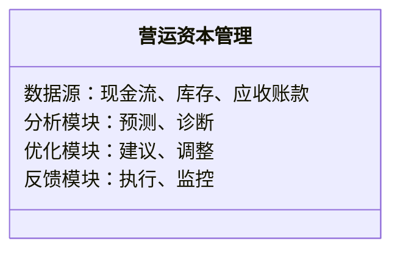
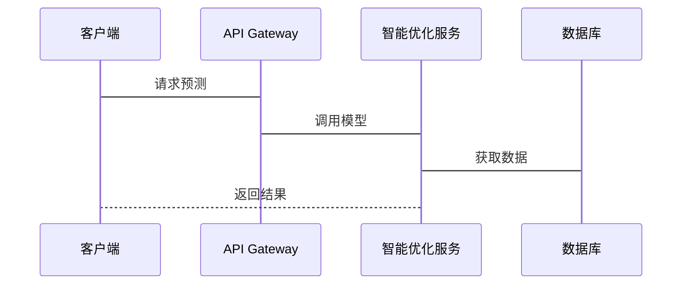

                 


# 智能营运资本管理优化系统

## 关键词：智能资本优化、人工智能算法、系统架构设计、现金流预测、资本效率提升

## 摘要：智能营运资本管理优化系统通过整合人工智能算法和大数据分析，优化企业的资本运作效率。本文将详细探讨系统的背景、核心概念、算法原理、系统架构设计，以及项目实战和最佳实践，帮助读者掌握智能资本优化的关键技术和方法。

---

## 第1章: 智能营运资本管理优化系统背景介绍

### 1.1 问题背景与描述
#### 1.1.1 营运资本管理的传统模式与挑战
传统营运资本管理依赖人工分析，效率低且容易出错。企业面临资金流动性差、库存积压、应收账款过高等问题，影响整体资金周转效率。

#### 1.1.2 智能化管理的需求与痛点
随着大数据和AI技术的发展，企业需要更高效、精准的资本管理工具。然而，现有系统难以实时分析和优化，且缺乏智能化决策支持。

#### 1.1.3 企业资本优化的核心目标
通过智能系统实现资本的动态优化，提高资金使用效率，降低运营成本，提升企业竞争力。

### 1.2 问题解决与边界
#### 1.2.1 智能优化的实现路径
利用机器学习和优化算法，构建智能分析模型，实时监控和优化资本流动。

#### 1.2.2 系统的边界与外延
系统专注于资本管理，不涉及企业战略和投资决策。主要优化现金流预测、库存管理和应收账款管理。

#### 1.2.3 核心要素与组成结构
包括数据采集、智能分析、优化建议和执行反馈四个模块。

## 第2章: 智能营运资本管理优化系统的核心概念与联系

### 2.1 核心概念原理
#### 2.1.1 营运资本管理的模型
采用现金流预测模型和库存周转模型，结合实时数据进行分析。

#### 2.1.2 智能优化的机制
利用机器学习算法，识别资本流动中的异常情况，自动调整优化策略。

#### 2.1.3 系统的核心要素
数据源、分析模型、优化算法和反馈机制。

### 2.2 概念属性对比表
| 概念       | 属性1   | 属性2   | 属性3   |
|------------|---------|---------|---------|
| 营运资本    | 定义：流动资金 | 范围：企业运营 | 目标：提高周转率 |
| 智能优化    | 技术：AI算法 | 方法：实时分析 | 效果：效率提升 |

### 2.3 ER实体关系图
```mermaid
erd
    entity 营运资本 {
        key 资金流
        field 资金池
        field 资金分配
    }
    entity 智能优化 {
        key 优化目标
        field 数据输入
        field 算法选择
    }
```

## 第3章: 智能营运资本管理优化系统的算法原理

### 3.1 机器学习算法
#### 3.1.1 线性回归模型
用于现金流预测，通过最小二乘法拟合最佳回归线。
$$ y = \beta_0 + \beta_1 x + \epsilon $$

#### 3.1.2 支持向量机（SVM）
用于分类问题，优化资本分配的决策边界。
$$ \text{最大化} \quad \frac{1}{2}\|w\|^2 $$
$$ \text{约束} \quad y_i(w \cdot x_i + b) \geq 1 $$

### 3.2 优化算法
#### 3.2.1 遗传算法
用于全局优化，模拟自然选择过程。
1. 初始化种群
2. 计算适应度
3. 选择、交叉和变异
4. 保留最优个体

#### 3.2.2 线性规划
用于资源分配问题，通过单纯形法求解。
$$ \text{最大化} \quad c^T x $$
$$ \text{约束} \quad Ax \leq b $$

### 3.3 算法流程图


### 3.4 代码实现
```python
import numpy as np
from sklearn.linear_model import LinearRegression

# 示例数据
X = np.array([[1], [2], [3], [4]])
y = np.array([2, 4, 5, 6])

# 训练模型
model = LinearRegression()
model.fit(X, y)

# 预测
print(model.predict([[5]]))
```

## 第4章: 智能营运资本管理优化系统的系统分析与架构设计

### 4.1 问题场景介绍
企业面临现金流预测不准、库存积压等问题，需要智能系统实时监控和优化。

### 4.2 项目介绍
开发一个基于AI的智能营运资本管理系统，帮助企业优化资本运作。

### 4.3 系统功能设计
#### 4.3.1 领域模型


### 4.4 系统架构设计
#### 4.4.1 微服务架构
采用微服务架构，各模块独立开发和部署。

#### 4.4.2 系统架构图


### 4.5 系统接口设计
#### 4.5.1 REST API
提供接口用于数据获取、模型调用和结果返回。

#### 4.5.2 数据交互流程


## 第5章: 智能营运资本管理优化系统的项目实战

### 5.1 环境安装
安装Python、TensorFlow和Flask框架，配置开发环境。

### 5.2 核心功能实现
开发现金流预测模块，实现库存优化建议。

### 5.3 代码实现与解读
```python
from flask import Flask, request, jsonify
import numpy as np
from sklearn.linear_model import LinearRegression

app = Flask(__name__)
model = LinearRegression()

@app.route('/predict', methods=['POST'])
def predict():
    data = request.json['data']
    X = np.array(data['X'])
    y_pred = model.predict(X)
    return jsonify({'result': y_pred.tolist()})

if __name__ == '__main__':
    app.run()
```

### 5.4 实际案例分析
分析某企业现金流预测案例，展示模型的应用效果和优化建议。

## 第6章: 智能营运资本管理优化系统的最佳实践

### 6.1 小结
智能系统能够显著提升资本管理效率，帮助企业实现精准优化。

### 6.2 注意事项
确保数据质量和模型泛化能力，定期更新模型。

### 6.3 未来趋势
结合区块链和物联网技术，构建更智能、更高效的资本管理平台。

## 附录: 术语表和参考文献
- 术语表：定义关键术语。
- 参考文献：列出相关文献和工具。

---

## 作者：AI天才研究院/AI Genius Institute & 禅与计算机程序设计艺术 /Zen And The Art of Computer Programming

