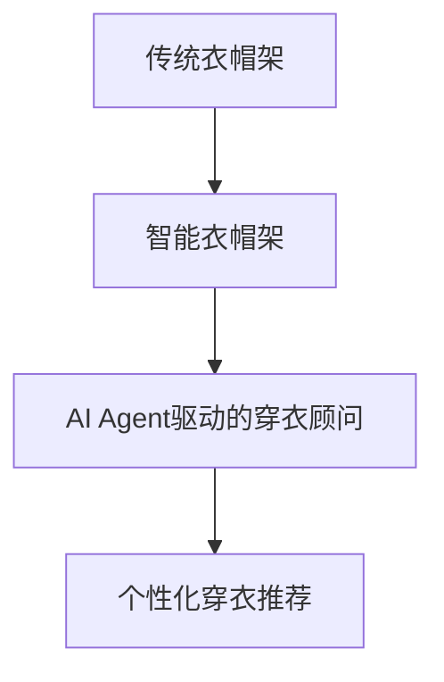
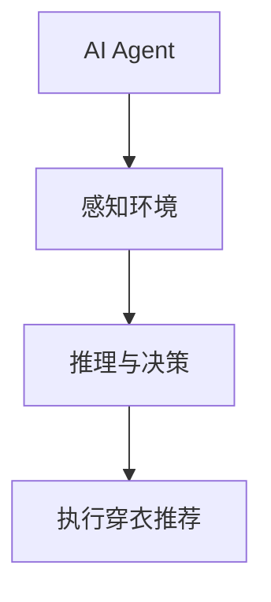
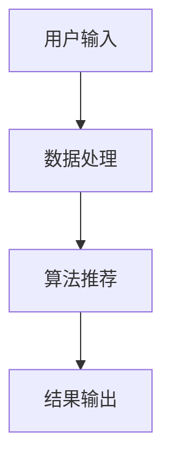

                 

# 智能衣帽架：AI Agent的穿衣风格顾问

## 关键词：智能衣帽架，AI Agent，穿衣风格，人工智能，物联网，智能家居

## 摘要：  
本文探讨了智能衣帽架如何通过AI Agent技术实现穿衣风格的智能化顾问。文章从背景介绍、核心概念、算法原理、系统架构到项目实战，全面分析了AI在智能衣帽架中的应用。通过协同过滤和深度学习算法，AI Agent能够根据用户需求推荐最优穿衣方案，实现智能衣帽架的高效管理和穿衣风格的个性化指导。本文还提供了实际项目代码和系统设计，为读者理解AI在智能家居中的应用提供了详尽的技术参考。

---

# 第1章: 智能衣帽架的背景与现状

## 1.1 智能衣帽架的背景介绍

### 1.1.1 衣帽架的演变历程
衣帽架作为日常生活中的常见物品，经历了从简单的物品悬挂装置到智能化管理工具的演变。早期的衣帽架主要用于存储衣物和帽子，而现代的智能衣帽架则通过AI技术实现了衣物的智能化管理与推荐。

### 1.1.2 AI技术在智能家居中的应用
AI技术的快速发展推动了智能家居设备的普及，智能衣帽架作为智能家居的一部分，利用AI技术实现了衣物管理的智能化。AI Agent能够通过分析用户的穿衣习惯和偏好，提供个性化的穿衣建议。

### 1.1.3 穿衣风格顾问的需求与痛点
随着人们生活水平的提高，穿衣风格的个性化需求日益增长。传统衣帽架无法满足用户对衣物推荐和管理的智能化需求，而智能衣帽架结合AI技术，能够解决这一痛点，为用户提供高效的穿衣风格顾问服务。

---

## 1.2 智能衣帽架的现状分析

### 1.2.1 当前市场上的智能衣帽架产品
目前市场上的智能衣帽架产品主要具备以下功能：
1. **衣物存储与管理**：通过传感器和物联网技术实现衣物的智能存储和分类。
2. **穿衣推荐**：基于AI算法推荐适合用户的穿衣方案。
3. **智能提醒**：提醒用户衣物的清洗和维护时间。

### 1.2.2 用户对智能衣帽架的实际需求
用户对智能衣帽架的需求主要集中在以下几个方面：
1. **高效管理衣物**：用户希望智能衣帽架能够帮助他们快速找到所需的衣物。
2. **个性化推荐**：用户希望系统能够根据他们的穿衣风格和场合推荐合适的衣物。
3. **智能化维护**：用户希望系统能够提醒他们衣物的清洗和维护时间。

### 1.2.3 智能衣帽架的市场潜力与挑战
智能衣帽架的市场潜力巨大，尤其是在智能家居市场快速发展的背景下。然而，其发展也面临一些挑战，例如：
1. **技术实现难度**：AI算法的复杂性和物联网技术的集成需要较高的技术门槛。
2. **用户体验优化**：如何让用户界面简洁易用，同时满足个性化需求是一个重要挑战。
3. **成本问题**：智能衣帽架的高成本可能限制其在大众市场上的普及。

---

## 1.3 本章小结
本章介绍了智能衣帽架的背景及其在市场中的现状，分析了AI技术在智能衣帽架中的应用前景。通过探讨用户需求和市场挑战，为后续章节的深入分析奠定了基础。

---

# 第2章: AI Agent与穿衣风格顾问的核心概念

## 2.1 AI Agent的基本原理

### 2.1.1 AI Agent的定义与分类
AI Agent是一种能够感知环境并采取行动以实现目标的智能体。根据功能和应用场景的不同，AI Agent可以分为以下几类：
1. **简单反射型AI Agent**：基于预设规则进行响应。
2. **基于模型的反射型AI Agent**：通过内部模型感知环境并做出决策。
3. **目标驱动型AI Agent**：根据目标选择最优行动方案。

### 2.1.2 AI Agent的核心技术
AI Agent的核心技术包括：
1. **感知技术**：通过传感器和摄像头等设备感知环境信息。
2. **决策技术**：基于感知信息进行推理和决策。
3. **行动技术**：根据决策结果执行相应动作。

### 2.1.3 AI Agent在穿衣风格中的应用
AI Agent可以通过分析用户的穿衣习惯和偏好，推荐适合的衣物搭配。例如，AI Agent可以根据用户的身材、肤色和场合推荐最佳的穿衣方案。

---

## 2.2 穿衣风格顾问的系统架构

### 2.2.1 穿衣风格顾问的输入与输出
穿衣风格顾问的系统架构包括以下输入和输出：
1. **输入**：
   - 用户的基本信息（身高、体重、肤色等）。
   - 用户的穿衣偏好（颜色偏好、风格偏好等）。
   - 当前天气情况。
2. **输出**：
   - 推荐的衣物搭配方案。
   - 穿衣建议和注意事项。

### 2.2.2 穿衣风格顾问的逻辑流程
穿衣风格顾问的逻辑流程如下：
1. **信息采集**：采集用户的穿衣需求和环境信息。
2. **数据分析**：分析用户的数据，生成穿衣方案。
3. **结果输出**：输出推荐的衣物搭配方案。

### 2.2.3 穿衣风格顾问的用户交互设计
穿衣风格顾问的用户交互设计需要简洁直观，用户可以通过触控屏或手机App输入需求，系统则通过语音或App反馈推荐结果。

---

## 2.3 智能衣帽架与AI Agent的结合

### 2.3.1 智能衣帽架的功能需求
智能衣帽架的功能需求包括：
1. **衣物存储与分类**：通过RFID技术和传感器实现衣物的智能存储和分类。
2. **穿衣推荐**：基于AI算法推荐适合用户的衣物搭配。
3. **智能提醒**：提醒用户衣物的清洗和维护时间。

### 2.3.2 AI Agent在智能衣帽架中的角色
AI Agent在智能衣帽架中扮演着“智能管家”的角色，负责数据采集、推理决策和结果输出。

### 2.3.3 智能衣帽架的用户价值
智能衣帽架通过AI Agent为用户提供了高效、个性化的衣物管理与推荐服务，帮助用户提升穿衣品味和生活效率。

---

## 2.4 本章小结
本章详细介绍了AI Agent的基本原理及其在穿衣风格顾问中的应用，分析了智能衣帽架的系统架构和功能需求。通过结合AI技术，智能衣帽架能够为用户提供更加智能化的穿衣风格顾问服务。

---

（接下来将按照用户提供的目录大纲继续撰写后续章节，涵盖算法原理、系统分析与架构设计、项目实战等内容。）

