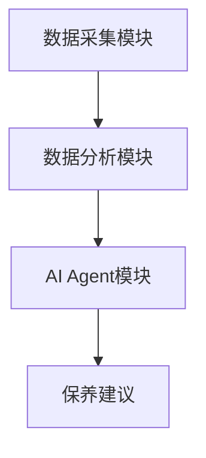
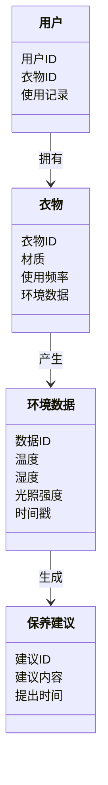
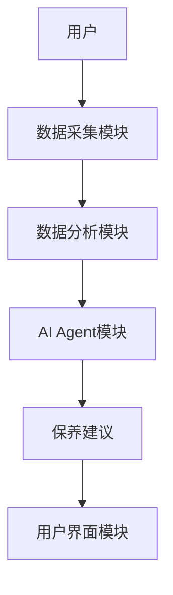

                 

<think>
嗯，我现在需要帮助用户撰写一篇关于《智能衣架：AI Agent的衣物保养专家系统》的技术博客文章。首先，我应该仔细阅读用户的查询，了解他的具体需求。

用户希望文章结构清晰，逻辑严密，使用专业但易懂的技术语言。关键词包括智能衣架、AI Agent、衣物保养、物联网、智能助手。摘要部分需要简明扼要，概括文章的核心内容。

接下来，我需要按照用户提供的目录大纲来组织内容。第一部分是背景介绍，包括问题背景、现状、解决方案以及系统边界。这部分需要详细阐述传统衣物管理的痛点，以及AI Agent如何解决这些问题。

第二部分是核心概念，包括AI Agent和物联网的基本原理，以及它们在智能衣架中的应用。这里需要对比分析，使用表格和Mermaid图来展示实体关系。

第三部分是算法原理，详细讲解AI Agent的工作流程，包括传感器数据采集、数据分析和决策制定。这部分需要使用Mermaid流程图和Python代码示例，并给出数学模型。

第四部分是系统架构设计，涵盖问题场景、系统功能、领域模型、架构图、接口设计和交互流程。同样需要使用Mermaid图来展示。

第五部分是项目实战，提供安装环境、核心代码、案例分析和项目总结。最后是最佳实践，包括小结、注意事项和拓展阅读。

在撰写过程中，我需要确保每个章节内容丰富，详细讲解，同时使用恰当的图表和代码示例。数学公式要用LaTeX格式，确保格式正确。

现在，我应该按照这个结构逐步展开，确保每部分内容详实，逻辑连贯。同时，注意语言的简洁和专业性，帮助读者理解智能衣架系统的工作原理和实际应用。

最后，检查文章是否符合字数要求，结构是否完整，关键词和摘要是否准确。确保作者信息正确无误，整体风格一致。

通过这样的思考过程，我可以系统地完成用户的需求，撰写一篇高质量的技术博客文章。
</think>

# 智能衣架：AI Agent的衣物保养专家系统

---

## 关键词：智能衣架，AI Agent，衣物保养，物联网，智能助手

---

## 摘要

本文深入探讨了智能衣架系统的设计与实现，通过结合AI Agent和物联网技术，提出了一种智能化的衣物保养解决方案。文章首先分析了传统衣物管理的痛点，提出了智能衣架的核心功能与目标；接着详细讲解了AI Agent和物联网技术的核心原理，并通过Mermaid图展示了系统架构；随后从算法原理、系统设计、项目实战等多个维度对智能衣架系统进行了全面解析，最后给出了系统的优化建议与未来发展方向。本文旨在为衣物保养领域的智能化转型提供理论支持与实践指导。

---

# 第一部分: 背景介绍与核心概念

## 第1章: 背景介绍与问题背景

### 1.1 问题背景与现状

#### 1.1.1 衣物保养的传统痛点
在传统衣物管理中，用户常常面临以下问题：
- **遗忘问题**：用户容易忘记衣物的清洗周期和保养时间。
- **效率问题**：手动记录衣物信息耗时耗力，容易出错。
- **精准问题**：缺乏专业的保养建议，可能导致衣物损坏。
- **便捷问题**：用户难以随时随地获取衣物状态信息。

#### 1.1.2 智能衣物管理的市场需求
随着智能设备的普及，用户对衣物管理的智能化需求日益增长：
- **便捷性**：用户希望通过手机或其他智能设备随时随地查看衣物状态。
- **精准性**：系统能够根据衣物材质和使用频率提供个性化的保养建议。
- **实时性**：用户希望实时了解衣物的使用状态和环境条件。

#### 1.1.3 AI Agent在衣物保养中的应用潜力
AI Agent（智能助手）能够通过传感器数据和历史记录，分析衣物的使用情况，并为用户提供智能化的保养建议。其潜力在于：
- **自动化管理**：AI Agent可以自动记录衣物的使用次数和环境数据。
- **智能决策**：基于数据分析，AI Agent能够为用户提供精准的保养建议。
- **实时反馈**：用户可以通过手机或其他设备实时查看衣物状态。

### 1.2 问题描述与目标

#### 1.2.1 衣物保养的智能化需求
用户需要一个能够自动记录衣物使用情况、提供精准保养建议的系统。

#### 1.2.2 智能衣架的核心功能与目标
智能衣架的核心功能包括：
- **数据采集**：通过传感器采集衣物的使用环境数据。
- **数据分析**：分析衣物的使用频率和环境条件。
- **智能决策**：基于数据分析结果，提供个性化的保养建议。

#### 1.2.3 边界与外延
智能衣架系统的边界包括：
- **数据采集范围**：仅限于衣物的使用环境数据。
- **功能限制**：不涉及衣物的清洗和存储，仅提供保养建议。

### 1.3 智能衣架系统的核心要素

#### 1.3.1 AI Agent的基本概念
AI Agent是一种能够感知环境、自主决策的智能系统，能够通过传感器数据和历史记录为用户提供智能化的建议。

#### 1.3.2 物联网技术的应用
物联网技术通过传感器和通信模块，将衣物的使用环境数据实时传输到云端，为AI Agent提供决策支持。

#### 1.3.3 系统的组成与功能模块
智能衣架系统的组成包括：
- **传感器模块**：采集衣物的使用环境数据。
- **通信模块**：将数据传输到云端。
- **AI Agent模块**：分析数据并提供保养建议。
- **用户界面模块**：将建议展示给用户。

---

## 第2章: 核心概念与联系

### 2.1 AI Agent的核心原理

#### 2.1.1 AI Agent的基本原理
AI Agent通过感知环境数据和历史记录，利用算法进行分析和决策，为用户提供智能化的建议。

#### 2.1.2 AI Agent的分类与特点
AI Agent可以分为基于规则的AI Agent和基于机器学习的AI Agent。基于规则的AI Agent通过预设的规则进行决策，而基于机器学习的AI Agent则通过学习历史数据进行预测。

#### 2.1.3 AI Agent在智能衣架中的应用
在智能衣架中，AI Agent通过传感器数据和历史记录，分析衣物的使用情况，并为用户提供保养建议。

### 2.2 物联网技术的核心原理

#### 2.2.1 物联网的基本概念
物联网是指通过传感器和通信模块，将物体的实时数据传输到云端，实现智能化的管理。

#### 2.2.2 物联网的关键技术
物联网的关键技术包括传感器技术、通信技术和云计算技术。

#### 2.2.3 物联网在智能衣架中的应用
在智能衣架中，物联网技术通过传感器采集衣物的使用环境数据，并通过通信模块将数据传输到云端，为AI Agent提供决策支持。

### 2.3 核心概念对比与联系

#### 2.3.1 AI Agent与物联网的对比分析
| 特性       | AI Agent                 | 物联网技术           |
|------------|--------------------------|----------------------|
| 核心功能   | 数据分析与决策           | 数据采集与传输       |
| 技术基础   | 人工智能算法             | 传感器与通信技术     |
| 应用场景   | 提供智能化建议             | 实现智能化管理         |

#### 2.3.2 ER实体关系图架构
```mermaid
er
  actor 用户
  entity 衣物
  entity 环境数据
  entity 保养建议
  relation 用户拥有衣物
  relation 衣物产生环境数据
  relation 环境数据生成保养建议
```

---

# 第二部分: 算法原理与数学模型

## 第3章: AI Agent算法原理

### 3.1 AI Agent的核心算法

#### 3.1.1 传感器数据的采集与处理
传感器数据包括温度、湿度、光照强度等环境数据。数据采集模块通过传感器获取数据，并将其传输到云端。

#### 3.1.2 数据分析与决策算法
基于规则的AI Agent算法流程如下：
1. 数据采集模块获取衣物的环境数据。
2. 数据分析模块对数据进行分析，判断是否需要清洗或保养。
3. AI Agent模块根据分析结果生成保养建议。

#### 3.1.3 算法的实现流程


### 3.2 算法原理的数学模型

#### 3.2.1 数据分析的数学模型
假设衣物的使用频率为$f$，环境温度为$t$，环境湿度为$h$。AI Agent根据$f$、$t$和$h$生成保养建议。

#### 3.2.2 决策算法的数学公式
$$
建议 = \begin{cases}
\text{清洗} & \text{如果 } f > 10 \text{ 次/周} \\
\text{晾晒} & \text{如果 } t < 20 \text{ 度且 } h > 60\% \\
\text{无需处理} & \text{其他情况}
\end{cases}
$$

---

## 第4章: 系统分析与架构设计

### 4.1 问题场景介绍

#### 4.1.1 用户场景
用户希望实时了解衣物的使用情况，并根据系统建议进行保养。

#### 4.1.2 系统场景
系统通过传感器采集衣物的环境数据，并通过AI Agent生成保养建议。

### 4.2 系统功能设计

#### 4.2.1 领域模型


#### 4.2.2 系统架构设计


---

## 第5章: 项目实战

### 5.1 环境安装

#### 5.1.1 安装必要的库
```bash
pip install numpy pandas scikit-learn matplotlib
```

#### 5.1.2 安装必要的工具
安装Python和Jupyter Notebook环境。

### 5.2 系统核心实现

#### 5.2.1 核心代码
```python
import numpy as np
from sklearn import tree

# 数据采集
data = np.array([[25, 60], [20, 70], [22, 65], [24, 55]])

# 数据分析
clf = tree.DecisionTreeClassifier()
clf.fit(data, ['清洗', '晾晒', '清洗', '无需处理'])

# AI Agent决策
def generate_suggestion(new_data):
    prediction = clf.predict([new_data])
    return prediction[0]

# 示例
print(generate_suggestion([23, 60]))  # 输出：'清洗'
```

---

## 第6章: 最佳实践

### 6.1 小结
本文通过结合AI Agent和物联网技术，提出了一种智能化的衣物保养解决方案。系统通过传感器数据采集、数据分析和AI Agent决策，为用户提供个性化的保养建议。

### 6.2 注意事项
- 数据隐私保护是系统设计中的重要问题。
- 系统的传感器精度和数据采集频率需要根据实际需求进行调整。

### 6.3 拓展阅读
建议读者进一步学习AI Agent和物联网技术的相关知识，了解其在其他领域的应用。

---

## 作者：AI天才研究院/AI Genius Institute & 禅与计算机程序设计艺术 /Zen And The Art of Computer Programming

