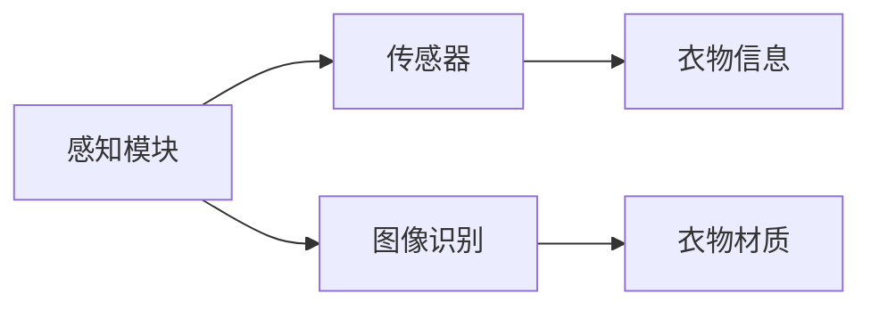
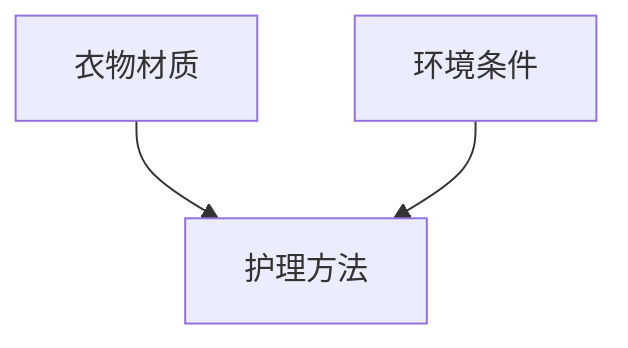
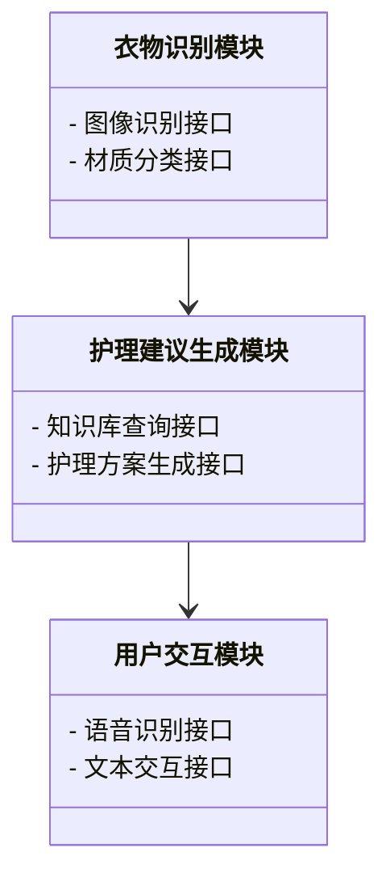
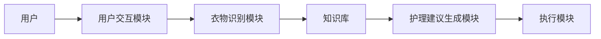
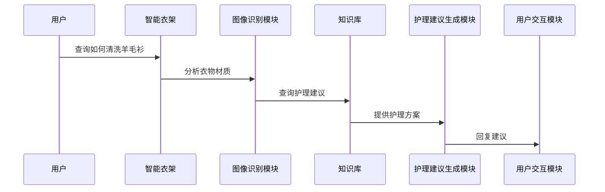

                 

<think>
嗯，用户希望我撰写一篇关于“智能衣架：AI Agent的衣物护理建议”的技术博客文章，并且提供一个详细的目录大纲。看起来用户需要的是一个结构清晰、内容详尽的专业技术博客，涵盖背景、原理、架构、项目实战等多个方面。

首先，我需要理解用户的需求。用户希望文章符合技术博客的风格，语言专业但又不失易懂，同时要具备深度，分析透彻。文章需要包含关键词、摘要，以及按照目录结构详细展开各个部分。

接下来，我需要考虑如何组织这些内容。文章应该从背景介绍开始，让读者了解AI Agent和智能衣架的基本概念，然后逐步深入到核心概念、算法原理、系统架构、项目实战和最佳实践。每个部分都需要详细分解，确保读者能够逐步理解和掌握相关知识。

在背景介绍部分，我需要解释AI Agent是什么，它在衣物护理中的应用，以及智能衣架的独特之处。这部分需要吸引读者，让他们对后续内容产生兴趣。同时，还要分析当前衣物护理的现状和挑战，说明为什么智能衣架是必要的。

核心概念部分需要详细讲解AI Agent的感知、决策和执行模块，以及如何构建衣物护理的知识库。这部分需要使用图表来辅助说明，比如ER实体关系图，帮助读者理解数据结构和关联。

算法原理部分是关键，我需要使用mermaid流程图展示AI Agent处理衣物护理请求的步骤，并附上Python代码示例。同时，数学公式需要用latex格式展示，确保清晰易懂。

系统分析与架构设计部分需要介绍问题场景，设计系统功能，如衣物识别和用户交互，并绘制领域模型类图和系统架构图，展示模块之间的关系和交互。

项目实战部分需要具体实施，包括环境安装、核心代码实现、案例分析和项目总结。这部分要让读者能够实际操作，理解如何将理论应用到实践中。

最后，最佳实践部分包括小结、注意事项和拓展阅读，帮助读者巩固所学内容，并引导他们进一步学习。

在整个思考过程中，我需要确保每个部分都详细展开，涵盖用户要求的所有内容，同时保持逻辑清晰，结构紧凑。这样，读者不仅能理解智能衣架的工作原理，还能实际应用相关技术解决问题。
</think>

# 智能衣架：AI Agent的衣物护理建议

> 关键词：AI Agent, 智能衣架, 衣物护理, 自然语言处理, 人工智能, 知识库构建

> 摘要：随着人工智能技术的飞速发展，AI Agent在智能家居领域的应用日益广泛。本文以智能衣架为例，探讨AI Agent在衣物护理中的应用场景与技术实现。通过详细分析AI Agent的核心概念、算法原理、系统架构及项目实战，本文旨在为读者提供一个全面的视角，帮助理解如何利用AI技术提升衣物护理的智能化水平。

---

# 第一部分: 智能衣架与AI Agent的背景介绍

# 第1章: AI Agent与智能衣架概述

## 1.1 AI Agent的基本概念
### 1.1.1 人工智能代理（AI Agent）的定义
人工智能代理（AI Agent）是指能够感知环境、自主决策并执行任务的智能实体。它可以理解用户需求、分析问题并提供解决方案，从而实现与用户的高效互动。

$$
\text{AI Agent} = \text{感知} \times \text{决策} \times \text{执行}
$$

### 1.1.2 AI Agent的核心特点
- **自主性**：能够在没有外部干预的情况下独立运作。
- **反应性**：能够实时感知环境变化并做出响应。
- **学习能力**：通过数据和经验不断优化自身的决策能力。
- **可解释性**：用户能够理解AI Agent的决策过程。

### 1.1.3 AI Agent在衣物护理中的应用前景
AI Agent可以通过分析衣物材质、用户需求和环境条件，提供个性化的衣物护理建议，从而提升用户体验。

---

## 1.2 智能衣架的定义与特点
### 1.2.1 智能衣架的定义
智能衣架是一种结合了AI技术的智能硬件，能够通过传感器和AI算法实现衣物识别、护理建议生成和用户交互。

### 1.2.2 智能衣架的核心功能
- **衣物识别**：通过图像识别技术识别衣物材质和品牌。
- **护理建议生成**：根据衣物特性推荐洗涤、烘干和熨烫的最佳方案。
- **用户交互**：通过语音或文本交互与用户沟通，提供实时建议。

### 1.2.3 智能衣架与传统衣架的主要区别
| 特性         | 智能衣架       | 传统衣架     |
|--------------|----------------|--------------|
| 功能         | 多功能         | 单一功能     |
| 是否智能     | 智能           | 非智能       |
| 连接方式     | 无线连接       | 无连接       |
| 是否具备AI   | 具备AI能力     | 无AI能力     |

---

## 1.3 衣物护理的现状与挑战
### 1.3.1 衣物护理的基本需求
- 清洗频率
- 洗涤温度
- 熨烫温度
- 避免损伤的材质

### 1.3.2 传统衣物护理的痛点
- 缺乏个性化建议
- 信息不对称
- 用户操作复杂

### 1.3.3 智能化衣物护理的必要性
- 提升用户体验
- 降低衣物损坏率
- 提高衣物使用寿命

---

## 1.4 智能衣架的应用背景
### 1.4.1 智能家居的发展趋势
智能家居的普及为AI Agent的应用提供了良好的环境。通过与智能家居设备的联动，智能衣架可以更好地融入用户的日常生活。

### 1.4.2 AI技术在智能家居中的应用
AI技术在智能家居中的应用包括智能音箱、智能灯泡、智能门锁等，而智能衣架是智能家居生态中的一个重要组成部分。

### 1.4.3 智能衣架在智能家居中的位置
智能衣架通过与洗衣机、烘干机等家电的联动，提供一体化的衣物护理解决方案。

---

## 1.5 本章小结
本章介绍了AI Agent的基本概念、智能衣架的特点以及智能化衣物护理的必要性。通过对比分析，读者可以清晰地理解智能衣架在智能家居中的重要地位。

---

# 第二部分: AI Agent的核心概念与原理

# 第2章: AI Agent的核心概念

## 2.1 AI Agent的感知与决策
### 2.1.1 感知模块的功能与实现
感知模块通过传感器和摄像头获取衣物信息，并通过图像识别技术提取衣物材质和品牌。



### 2.1.2 决策模块的核心算法
决策模块基于知识库中的数据，通过规则推理和机器学习算法生成护理建议。

$$
\text{护理建议} = f(\text{衣物材质}, \text{环境条件}, \text{用户需求})
$$

### 2.1.3 执行模块的作用与实现方式
执行模块通过与洗衣机、烘干机等设备联动，执行具体的护理操作。

---

## 2.2 衣物护理的知识库构建
### 2.2.1 衣物材质与护理需求的关系
不同材质的衣物需要不同的护理方式。例如，棉质衣物适合冷水洗涤，而羊毛衣物需要干洗。

### 2.2.2 知识库的数据结构与存储方式
知识库可以采用关系型数据库，存储衣物材质、护理方法和环境条件之间的映射关系。



### 2.2.3 知识库的更新与维护
知识库需要定期更新，以适应新的衣物材质和护理需求。

---

## 2.3 AI Agent与用户交互的实现
### 2.3.1 自然语言处理（NLP）在交互中的应用
通过NLP技术，AI Agent可以理解用户的自然语言输入，并生成相应的回复。

$$
\text{输入: } \text{“我的衬衫该怎么洗？”}
$$

$$
\text{输出: } \text{“建议使用温水手洗，避免机洗。”}
$$

### 2.3.2 用户意图的识别与解析
通过意图识别技术，AI Agent可以准确理解用户的深层需求。

### 2.3.3 交互过程中的反馈机制
AI Agent需要根据用户的反馈不断优化自身的交互策略。

---

## 2.4 本章小结
本章详细讲解了AI Agent的核心概念，包括感知、决策和执行模块，以及知识库的构建与管理。

---

# 第三部分: AI Agent的算法原理与实现

# 第3章: AI Agent的算法原理

## 3.1 算法概述
AI Agent的算法主要包括自然语言处理、知识推理和决策优化。

---

## 3.2 自然语言处理（NLP）的实现
### 3.2.1 分词与词性标注
通过分词技术将用户输入的文本分解为词语，并标注词性。

### 3.2.2 意图识别
通过预训练模型（如BERT）进行意图识别。

### 3.2.3 语义理解
通过语义分析技术理解用户需求。

---

## 3.3 知识推理的实现
### 3.3.1 知识库查询
根据用户输入的信息，查询知识库获取相关数据。

### 3.3.2 规则推理
基于预设的规则进行推理，生成护理建议。

### 3.3.3 机器学习推理
通过机器学习模型进行预测，优化护理建议。

---

## 3.4 决策优化的实现
### 3.4.1 决策树构建
通过决策树算法优化护理方案。

### 3.4.2 状态空间搜索
通过状态空间搜索算法找到最优决策路径。

### 3.4.3 强化学习
通过强化学习算法不断优化AI Agent的决策能力。

---

## 3.5 本章小结
本章详细讲解了AI Agent的核心算法，包括自然语言处理、知识推理和决策优化。

---

# 第四部分: 系统分析与架构设计方案

# 第4章: 智能衣架系统的架构设计

## 4.1 问题场景介绍
智能衣架需要与洗衣机、烘干机等设备联动，为用户提供一体化的衣物护理解决方案。

---

## 4.2 系统功能设计
### 4.2.1 衣物识别模块
- 图像识别
- 材质分类

### 4.2.2 护理建议生成模块
- 知识库查询
- 护理方案生成

### 4.2.3 用户交互模块
- 语音交互
- 文本交互

---

## 4.3 领域模型类图


---

## 4.4 系统架构设计


---

## 4.5 系统接口设计
- 用户与智能衣架的接口：HTTP REST API
- 智能衣架与洗衣机的接口：MQTT协议

---

## 4.6 系统交互序列图


---

## 4.7 本章小结
本章通过系统架构设计，详细说明了智能衣架的核心模块及其交互关系。

---

# 第五部分: 项目实战

# 第5章: 智能衣架项目的实现

## 5.1 环境安装
- 安装Python和相关库（如TensorFlow、NLP工具）
- 安装智能家居设备（如洗衣机、烘干机）

## 5.2 核心代码实现
### 5.2.1 图像识别模块
```python
import tensorflow as tf
def identify_fabric(image):
    # 图像识别代码
    return "棉质"
```

### 5.2.2 知识库查询模块
```python
def query_knowledge_base(fabric):
    if fabric == "棉质":
        return "温水手洗，避免机洗"
    else:
        return "普通洗涤"
```

### 5.2.3 用户交互模块
```python
def interact_with_user():
    user_input = input("请输入您的需求：")
    print("建议：", query_knowledge_base(identify_fabric(user_input)))
```

## 5.3 案例分析与代码解读
- 案例1：用户询问如何清洗棉质衬衫
- 案例2：用户询问如何清洗羊毛大衣

## 5.4 项目总结
通过本项目的实现，读者可以掌握AI Agent在智能衣架中的具体应用。

---

## 5.5 本章小结
本章通过实际项目，详细讲解了智能衣架的核心代码实现和案例分析。

---

# 第六部分: 最佳实践与总结

# 第6章: 最佳实践

## 6.1 小结
- AI Agent在智能衣架中的应用前景广阔
- 技术实现需要结合图像识别、自然语言处理和知识推理
- 系统设计需要考虑模块化和可扩展性

## 6.2 注意事项
- 确保数据安全
- 提供良好的用户反馈机制
- 定期更新知识库

## 6.3 拓展阅读
- 智能家居的其他应用
- AI Agent在其他领域的应用

---

## 6.4 本章小结
本章总结了智能衣架项目的最佳实践，并为读者提供了进一步学习的方向。

---

# 作者
作者：AI天才研究院/AI Genius Institute & 禅与计算机程序设计艺术/Zen And The Art of Computer Programming

---

**注**：本文内容仅用于技术分享和学习，转载请注明出处。

