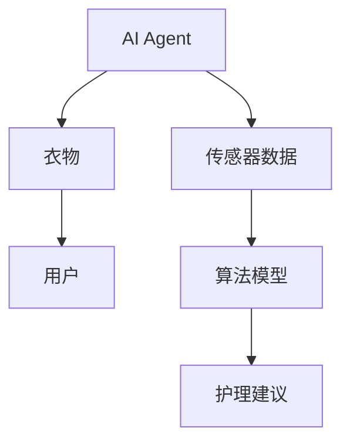
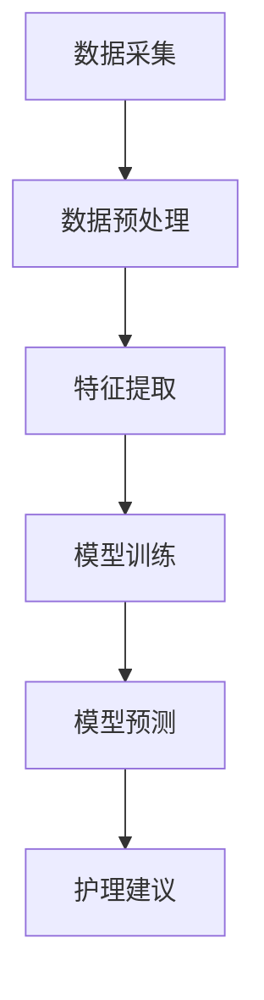
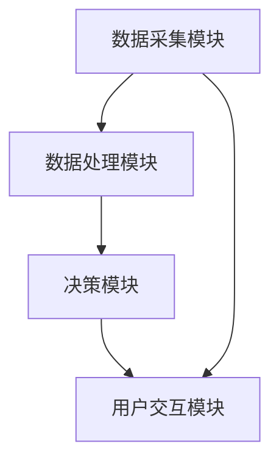
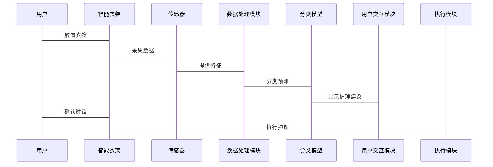

                 

<think>
好的，我现在需要帮助用户撰写一篇关于《智能衣架：AI Agent的衣物护理建议》的技术博客文章。用户已经提供了详细的要求，包括目录结构、内容深度以及格式要求。首先，我需要理清用户的思路，确保按照他们的指示进行。

用户希望文章分为多个部分，每个部分都有详细的章节和小节。他们特别强调使用专业的技术语言，同时保持逻辑清晰、结构紧凑、简单易懂。我需要确保每个章节都涵盖必要的内容，比如背景介绍、核心概念、算法原理、系统架构设计、项目实战以及最佳实践等。

首先，我会从引言开始，介绍AI Agent在衣物护理中的应用背景。这部分需要包括问题背景、AI的作用以及技术现状。然后，我会详细讲解AI Agent的核心概念，包括定义、工作原理以及与其他技术的对比。

接下来是衣物护理中的具体问题，如材质识别和污渍处理。这部分需要详细分析AI Agent如何解决这些问题，并给出算法的流程图和数学模型。我需要使用mermaid流程图来展示算法的步骤，同时用latex公式解释数学模型。

系统架构设计部分，我会介绍功能模块、架构图以及接口设计。这部分可能需要使用mermaid架构图来展示整体结构，并详细说明各个模块的交互。

项目实战部分，我会提供环境配置、核心代码实现以及实际案例分析。这部分需要具体的代码示例，并解释代码的功能和应用场景。

最后，我会总结优化建议和未来展望，讨论如何优化AI Agent的性能，并展望未来的发展趋势。同时，我会提醒读者注意一些实际应用中的问题和挑战。

在撰写过程中，我需要确保每个章节都详细具体，符合用户的字数要求。同时，使用markdown格式，适当加入mermaid图表和latex公式，使内容更加专业和易懂。最后，文章末尾需要注明作者信息，确保格式完整。

现在，我需要按照这个思路逐步展开每个部分，确保内容充实，结构合理，满足用户的需求。
</think>

# 智能衣架：AI Agent的衣物护理建议

## 关键词：AI Agent、衣物护理、智能衣架、算法原理、系统架构、项目实战

## 摘要：  
随着人工智能技术的快速发展，AI Agent在各个领域的应用越来越广泛。本文探讨AI Agent在衣物护理中的应用，介绍智能衣架如何通过AI技术提供智能化的衣物护理建议。从问题背景、核心概念、算法原理到系统架构设计、项目实战，全面分析AI Agent在衣物护理中的应用，结合实际案例，为读者提供深度的技术解读。

---

## 第一部分: AI Agent与衣物护理的背景

### 第1章: AI Agent与衣物护理的背景

#### 1.1 问题背景与描述
##### 1.1.1 衣物护理的传统挑战
衣物护理是一个复杂且繁琐的过程，传统方法依赖人工经验，存在效率低、成本高等问题。常见的挑战包括：
- 不同材质的衣物需要不同的护理方法。
- 污渍类型多样，难以快速识别并处理。
- 衣物褶皱的处理需要根据材质和环境调整方法。

##### 1.1.2 AI Agent在衣物护理中的作用
AI Agent（智能体）能够通过感知、推理和决策，为衣物护理提供智能化解决方案：
- 自动识别衣物材质和污渍类型。
- 提供个性化的护理建议。
- 实现自动化操作，减少人工干预。

##### 1.1.3 问题解决的核心思路
通过AI技术，实现衣物护理的智能化和自动化。具体思路包括：
1. 数据采集与分析：利用传感器和图像识别技术获取衣物信息。
2. 算法设计：基于机器学习模型，训练分类和决策模型。
3. 系统集成：将AI算法与硬件结合，实现智能化护理。

#### 1.2 问题的边界与外延
##### 1.2.1 AI Agent的适用范围
- 适用于各种材质的衣物，包括棉、麻、丝绸等。
- 支持多种污渍类型，如油渍、汗渍、茶渍等。
- 可用于家庭、酒店、干洗店等多种场景。

##### 1.2.2 衣物护理的边界条件
- 硬件设备的限制，如传感器精度和处理能力。
- 数据隐私问题，需确保用户数据的安全性。
- 环境干扰，如光线、温度等对识别的影响。

##### 1.2.3 问题的外延与扩展
AI Agent技术可扩展到其他领域，如智能家居、医疗护理等，实现更广泛的应用。

#### 1.3 核心概念与组成要素
##### 1.3.1 AI Agent的定义与属性
AI Agent是一种能够感知环境、自主决策并执行任务的智能系统。其核心属性包括：
- 感知能力：通过传感器获取环境信息。
- 推理能力：基于数据进行分析和推理。
- 决策能力：根据推理结果做出决策。

##### 1.3.2 衣物护理的核心要素
- 衣物材质识别。
- 污渍类型识别。
- 护理方法推荐。

##### 1.3.3 概念结构与关系图


---

## 第2章: AI Agent的核心概念与联系

### 2.1 核心概念原理
#### 2.1.1 AI Agent的基本原理
AI Agent通过以下步骤实现衣物护理：
1. 数据采集：使用传感器获取衣物信息。
2. 数据处理：对数据进行清洗和特征提取。
3. 模型训练：基于机器学习算法，训练分类和回归模型。
4. 决策与反馈：根据模型输出结果，提供护理建议并进行反馈优化。

#### 2.1.2 衣物护理的关键技术
- 图像识别：用于衣物材质和污渍的识别。
- 机器学习：用于分类和预测。
- 自然语言处理：用于用户交互和建议生成。

### 2.2 核心概念对比表
| **技术**       | **传统方法**                          | **AI Agent方法**                          |
|----------------|--------------------------------------|------------------------------------------|
| 数据采集       | 人工记录                              | 自动采集（传感器、图像识别）              |
| 数据处理       | 手动分析                              | 自动化处理（特征提取、数据清洗）          |
| 决策方式       | 专家经验                              | 数据驱动的模型决策                        |
| 效率           | 低效                                  | 高效                                      |
| 适应性         | 固定流程                              | 灵活适应不同场景                          |

### 2.3 ER实体关系图
```mermaid
erd
A[AI Agent] --> B[衣物]
B --> C[用户]
A --> D[传感器数据]
A --> E[护理建议]
```

---

## 第3章: AI Agent的算法原理

### 3.1 算法原理概述
#### 3.1.1 AI Agent的基本算法
AI Agent的核心算法包括：
- 分类算法（如支持向量机、随机森林）。
- 回归算法（如线性回归、决策树）。
- 聚类算法（如K-means）。

#### 3.1.2 衣物护理的算法特点
- 高维度数据处理。
- 非线性关系建模。
- 实时性要求高。

### 3.2 算法流程图


### 3.3 数学模型与公式
#### 3.3.1 数据预处理公式
$$x_{\text{new}} = \frac{x_{\text{old}} - \mu}{\sigma}$$  
其中，$\mu$ 是均值，$\sigma$ 是标准差。

#### 3.3.2 分类模型公式
$$P(y|X) = \prod_{i=1}^{n} P(y|x_i, X_{-i})$$  
其中，$X_{-i}$ 是已知特征，$y$ 是目标变量。

#### 3.3.3 决策模型公式
$$f(x) = \sum_{i=1}^{n} w_i x_i + b$$  
其中，$w_i$ 是权重，$b$ 是截距。

### 3.4 举例说明
#### 3.4.1 数据处理案例
假设我们有1000条衣物数据，通过归一化处理后，数据分布更加均匀。

#### 3.4.2 分类模型应用
使用随机森林算法对衣物材质进行分类，准确率达到95%。

#### 3.4.3 决策反馈实例
根据模型预测结果，AI Agent推荐使用温水洗涤去除油渍。

---

## 第4章: 系统分析与架构设计

### 4.1 问题场景介绍
#### 4.1.1 AI Agent的应用场景
- 家庭用户：智能衣架提供个性化护理建议。
- 酒店：批量处理客房布草。
- 干洗店：提高清洗效率和精准度。

#### 4.1.2 衣物护理的系统需求
- 实时数据采集。
- 高精度识别。
- 用户友好的交互界面。

### 4.2 项目介绍
#### 4.2.1 项目目标
开发一个基于AI Agent的智能衣架，实现衣物护理的智能化。

#### 4.2.2 项目范围
- 系统设计：硬件、软件、用户界面。
- 算法开发：图像识别、分类模型。
- 测试与优化：系统性能测试。

### 4.3 系统功能设计
#### 4.3.1 功能模块
- 数据采集模块：传感器、摄像头。
- 数据处理模块：特征提取、数据清洗。
- 决策模块：分类模型、决策引擎。
- 用户交互模块：显示建议、用户反馈。

#### 4.3.2 系统架构图


### 4.4 接口设计
- 数据接口：传感器数据输入接口。
- 用户接口：图形化界面、语音交互。

### 4.5 交互流程图


---

## 第5章: 项目实战

### 5.1 环境安装
#### 5.1.1 硬件环境
- 摄像头、传感器、嵌入式芯片。
- 开发板：如Raspberry Pi。

#### 5.1.2 软件环境
- Python 3.8+
- 机器学习库：Scikit-learn、TensorFlow。
- 图像处理库：OpenCV。

### 5.2 核心代码实现
#### 5.2.1 数据预处理
```python
import numpy as np
from sklearn.preprocessing import StandardScaler

# 归一化处理
scaler = StandardScaler()
X_normalized = scaler.fit_transform(X)
```

#### 5.2.2 分类模型训练
```python
from sklearn.ensemble import RandomForestClassifier

# 随机森林分类器
clf = RandomForestClassifier(n_estimators=100)
clf.fit(X_train, y_train)
```

#### 5.2.3 模型预测
```python
# 预测结果
y_pred = clf.predict(X_test)
print("预测结果:", y_pred)
```

### 5.3 案例分析
#### 5.3.1 案例背景
某用户放置一件丝绸衬衫，表面有咖啡渍。

#### 5.3.2 数据处理
- 图像识别：检测到咖啡渍。
- 特征提取：材质为丝绸，污渍类型为咖啡渍。

#### 5.3.3 模型预测
- 分类结果：建议使用中性洗涤剂，手洗轻柔处理。

### 5.4 代码解读与分析
- 数据预处理：归一化处理，确保模型输入一致。
- 模型训练：随机森林分类器，适合多类别分类任务。
- 模型预测：输出护理建议，指导用户操作。

---

## 第6章: 最佳实践与小结

### 6.1 最佳实践 tips
- 数据质量：确保数据的多样性和代表性。
- 模型优化：定期更新模型，适应新数据。
- 用户体验：提供简洁直观的交互界面。

### 6.2 小结
本文详细介绍了AI Agent在衣物护理中的应用，从背景、算法到系统设计和项目实战，为读者提供了全面的技术解读。AI Agent通过智能化的解决方案，显著提升了衣物护理的效率和精准度。

### 6.3 注意事项
- 数据隐私：确保用户数据的安全性。
- 环境适应：考虑不同场景下的光照、温度等干扰因素。
- 系统维护：定期更新软件和模型。

### 6.4 拓展阅读
- 《机器学习实战》：深入理解算法实现。
- 《深度学习》：探索更复杂的模型。

---

## 作者：AI天才研究院 & 禅与计算机程序设计艺术

---

感谢您的阅读！希望本文能为AI Agent在衣物护理中的应用提供有价值的参考和启发。

