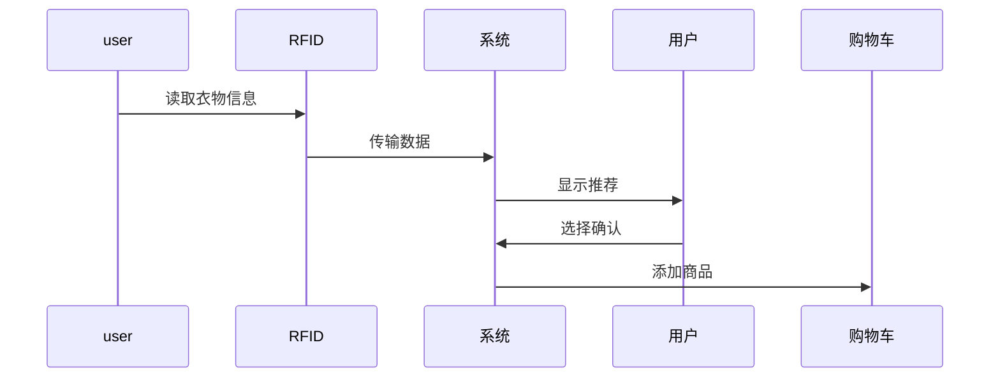

                 


# 智能衣柜：AI Agent的个人形象管理顾问

## 关键词
智能衣柜, AI Agent, 个人形象管理, 推荐系统, 系统架构设计

## 摘要
智能衣柜通过AI Agent技术，能够智能化地管理个人衣物，提供个性化的搭配建议，从而优化个人形象管理。本文详细探讨了智能衣柜的核心概念、算法原理、系统架构设计以及实际应用案例，旨在为读者提供全面的技术视角。

---

## 第一部分：背景介绍

### 第1章：智能衣柜的概念与背景

#### 1.1 智能衣柜的基本概念
- **智能衣柜的定义**：智能衣柜是一种结合人工智能技术的衣柜系统，能够自动识别衣物、推荐搭配并管理库存。
- **发展背景**：随着AI技术的进步，用户对个性化服务的需求增加，传统衣柜管理方式逐渐被智能化系统取代。
- **个人形象管理的重要性**：在社交和职业场合中，形象管理直接影响个人印象和机会。

#### 1.2 AI Agent在智能衣柜中的作用
- **AI Agent的基本概念**：AI Agent是能够感知环境、执行任务的智能体，用于辅助用户进行决策。
- **AI Agent的应用**：在智能衣柜中，AI Agent负责数据采集、分析和推荐，帮助用户优化搭配。
- **优势与挑战**：AI Agent能够提高效率和准确性，但需解决数据隐私和算法优化等问题。

---

## 第二部分：核心概念与联系

### 第2章：AI Agent的核心概念与原理

#### 2.1 AI Agent的基本原理
- **感知层**：通过传感器和摄像头采集衣物信息。
- **决策层**：利用算法分析数据，生成推荐。
- **执行层**：通过机械臂或APP通知用户操作。

#### 2.2 AI Agent与智能衣柜的关系
- AI Agent作为系统的核心，贯穿整个衣柜管理过程。

#### 2.3 核心要素对比
- **AI Agent与传统推荐系统对比**：
  | 对比维度 | AI Agent | 传统推荐系统 |
  |----------|-----------|--------------|
  | 数据来源 | 多模态数据 | 单一数据源   |
  | 个性化 | 高度定制 | 基于用户群体 |
  | 实时性 | 高 | 低         |

---

## 第三部分：算法原理

### 第3章：推荐算法原理

#### 3.1 协同过滤算法
- **基于用户的协同过滤**：通过相似用户的行为推荐。
- **基于物品的协同过滤**：分析物品特征进行推荐。

#### 3.2 基于内容的推荐算法
- 使用文本和图像特征进行推荐，克服数据稀疏性问题。

#### 3.3 深度学习推荐模型
- **神经网络模型**：如自动编码器和卷积神经网络。
- **注意力机制**：突出重要特征，提升推荐准确性。
- **生成对抗网络**：用于生成多样化的搭配建议。

---

## 第四部分：系统分析与架构设计

### 第4章：系统分析与架构设计

#### 4.1 系统需求分析
- 数据采集：通过RFID和摄像头获取衣物信息。
- 推荐功能：基于用户偏好生成搭配建议。
- 管理功能：支持衣物分类和库存管理。

#### 4.2 系统架构设计
- **分层架构**：数据采集层、处理层、应用层。
- **组件设计**：数据采集模块、推荐引擎、用户界面。

#### 4.3 接口设计
- 数据接口：与RFID设备通信。
- 用户接口：提供交互界面。

---

## 第五部分：项目实战

### 第5章：项目实战

#### 5.1 环境搭建
- 安装Python和相关库，如TensorFlow和Flask。

#### 5.2 核心代码实现
```python
# 数据预处理
import numpy as np
from sklearn.metrics.pairwise import cosine_similarity

# 模型训练
class AIAssistant:
    def __init__(self, items):
        self.items = items
        self.similarity_matrix = self.compute_similarity()

    def compute_similarity(self):
        # 特征提取
        features = np.random.rand(len(self.items), 10)
        return cosine_similarity(features)

# 推荐系统实现
def recommend_items(user_id, items, similarity_matrix):
    user_index = np.where(items[:, 0] == user_id)[0][0]
    similar_users = np.argsort(similarity_matrix[user_index])[::-1]
    recommended = items[similar_users, 1:]
    return recommended[:5]
```

#### 5.3 实际案例分析
- **用户登录**：通过RFID识别用户。
- **风格偏好选择**：用户选择喜欢的风格。
- **搭配推荐**：系统根据偏好推荐衣物。
- **购买确认**：用户确认后生成购买链接。

---

## 第六部分：案例分析

### 第6章：案例分析

#### 6.1 案例分析
- 某用户登录系统后，选择商务风格，系统推荐搭配西装和领带，并生成购买链接。

#### 6.2 交互流程图


---

## 第七部分：总结与展望

### 第7章：总结与展望

#### 7.1 总结
- AI Agent技术在智能衣柜中的应用显著提升了形象管理效率和准确性。

#### 7.2 未来展望
- 结合物联网技术，实现更智能的衣物管理。
- 开发更个性化的推荐算法，提升用户体验。

---

## 结语

智能衣柜作为AI技术的创新应用，正在改变我们的生活方式。通过本文的详细讲解，读者可以深入了解其背后的技术原理和实际应用，为未来的智能化生活提供参考。

---

## 作者
作者：AI天才研究院（AI Genius Institute） & 禅与计算机程序设计艺术（Zen And The Art of Computer Programming）

