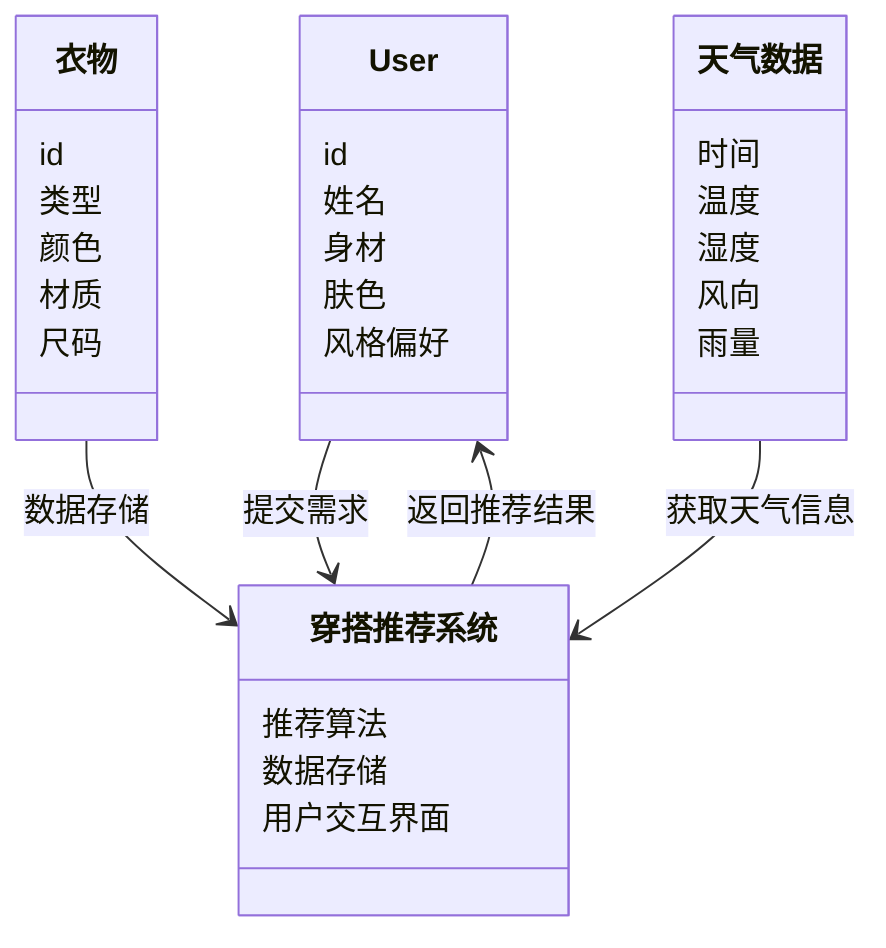
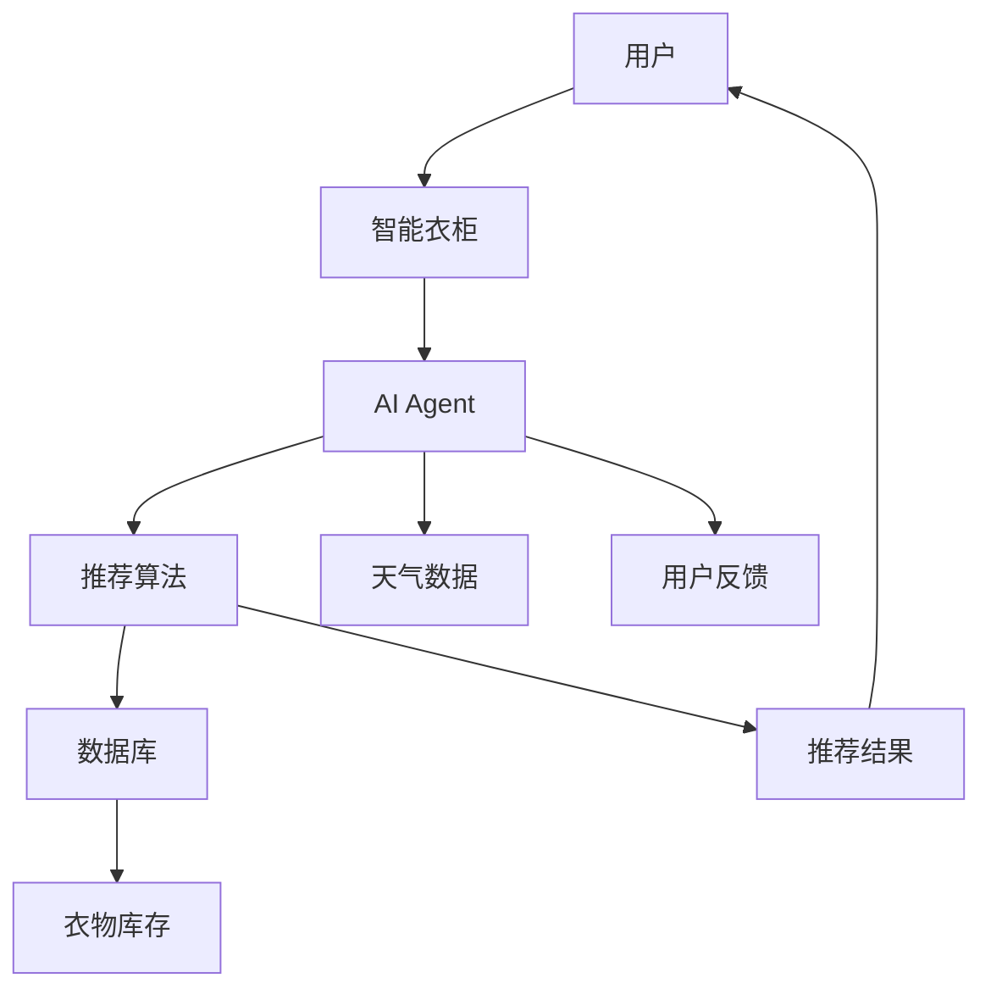
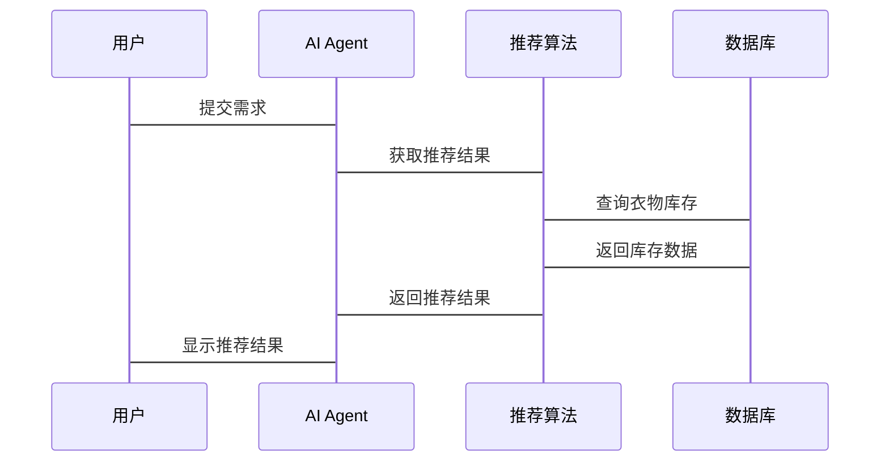

                 


# 智能衣柜：AI Agent的穿搭推荐系统

> 关键词：智能衣柜、AI Agent、穿搭推荐系统、机器学习、个性化推荐、用户体验优化

> 摘要：本文详细探讨了AI Agent在智能衣柜中的应用，特别是穿搭推荐系统的实现。通过分析AI Agent的核心原理、推荐算法、系统架构，以及实际项目案例，展示了如何利用人工智能技术提升用户的穿衣搭配体验。文章内容涵盖背景介绍、算法实现、系统设计、项目实战及最佳实践，为技术开发者和用户提供深度的技术洞察和实践指导。

---

# 第一部分: 智能衣柜与AI Agent的背景与概念

## 第1章: 智能衣柜的发展背景

### 1.1 智能衣柜的定义与特点

#### 1.1.1 智能衣柜的定义
智能衣柜是一种结合了物联网（IoT）和人工智能（AI）技术的智能家具，能够通过传感器、摄像头和AI算法，实现衣物的自动分类、管理以及个性化推荐。与传统衣柜相比，智能衣柜不仅能够存储衣物，还能帮助用户更好地管理和搭配衣物。

#### 1.1.2 智能衣柜的核心特点
- **智能感知**：通过传感器和摄像头，实时监测衣物的状态（如颜色、款式、材质）。
- **数据分析**：利用AI算法分析用户的穿衣习惯、场合需求和天气变化，提供智能化的穿搭建议。
- **个性化推荐**：根据用户的身材、肤色、风格偏好，推荐适合的穿搭方案。
- **智能提醒**：提醒用户衣物的清洁时间、需要淘汰的衣物，以及推荐适合的搭配。

#### 1.1.3 智能衣柜与传统衣柜的区别
| 特性             | 传统衣柜           | 智能衣柜           |
|------------------|--------------------|--------------------|
| 管理方式         | 手动分类、存储     | 自动分类、管理     |
| 推荐方式         | 无推荐             | AI驱动个性化推荐   |
| 智能功能         | 无                | 智能感知、提醒、数据分析 |

---

### 1.2 AI Agent的基本概念

#### 1.2.1 AI Agent的定义
AI Agent（人工智能代理）是指能够感知环境、自主决策并执行任务的智能实体。它可以是一个软件程序，也可以是一个物理设备，通过与用户或环境的交互，完成特定的目标。

#### 1.2.2 AI Agent的核心属性
- **感知能力**：通过传感器、摄像头等设备获取环境信息。
- **推理能力**：基于获取的信息，进行逻辑推理和模式识别。
- **决策能力**：根据推理结果，制定最优的行动计划。
- **执行能力**：通过执行机构（如机械臂、显示屏）完成任务。

#### 1.2.3 AI Agent在智能衣柜中的应用
AI Agent在智能衣柜中的主要作用是通过分析用户的穿衣习惯和场景需求，提供个性化的穿搭建议。例如：
- 根据用户的身材和肤色推荐适合的服装颜色。
- 根据天气情况推荐适合的衣物搭配。
- 根据用户的日程安排推荐适合的场合着装。

---

### 1.3 穿搭推荐系统的定义与应用场景

#### 1.3.1 穿搭推荐系统的定义
穿搭推荐系统是一种基于用户特征、衣物属性和场景需求，利用AI算法推荐适合的穿搭方案的系统。它能够帮助用户在短时间内找到合适的衣物搭配，提升穿衣效率和时尚感。

#### 1.3.2 穿搭推荐系统的应用场景
- **个人用户**：帮助用户根据身材、肤色、风格偏好推荐穿搭方案。
- **品牌商家**：通过分析用户的穿衣习惯，优化产品设计和营销策略。
- **电商平台**：为用户提供个性化的购物推荐，提升用户购买体验。

#### 1.3.3 智能衣柜中的穿搭推荐系统
在智能衣柜中，穿搭推荐系统通过分析用户的穿衣数据和场景需求，实时推荐适合的衣物搭配。例如：
- 根据用户的身材和场合推荐适合的服装搭配。
- 根据天气变化推荐适合的衣物组合。
- 根据用户的偏好推荐适合的时尚潮流。

---

## 第1章小结
智能衣柜作为智能家居的重要组成部分，通过结合AI Agent技术，能够为用户提供智能化的穿搭推荐服务。AI Agent在智能衣柜中的应用，不仅提升了用户的穿衣效率，还优化了用户的穿衣体验。接下来，我们将深入探讨AI Agent在穿搭推荐系统中的核心原理和实现方法。

---

## 第2章: AI Agent的穿搭推荐系统原理

### 2.1 AI Agent的核心原理

#### 2.1.1 AI Agent的感知与推理
AI Agent通过传感器和摄像头感知环境信息，利用机器学习算法进行推理和模式识别。例如，通过图像识别技术，AI Agent可以识别衣物的颜色、款式和材质。

#### 2.1.2 AI Agent的决策与执行
基于感知到的信息和推理结果，AI Agent会制定最优的行动计划，并通过执行机构完成任务。例如，根据用户的日程安排，AI Agent可以自动推荐适合的衣物搭配。

#### 2.1.3 AI Agent的自适应与学习
AI Agent能够通过与用户的交互和环境反馈不断优化自身的算法模型，提升推荐的准确性和用户体验。

---

### 2.2 穿搭推荐系统的原理

#### 2.2.1 穿搭推荐系统的输入与输出
- **输入**：用户的身材、肤色、风格偏好、衣物库存、天气信息。
- **输出**：适合的衣物搭配方案，包括上衣、下装、鞋子、配饰等。

#### 2.2.2 穿搭推荐系统的算法与模型
常见的穿搭推荐算法包括协同过滤、基于内容的推荐、混合推荐等。其中，协同过滤是一种基于用户相似性推荐的算法，适合处理大规模用户数据。

#### 2.2.3 穿搭推荐系统的评价指标
- **准确率**：推荐的衣物搭配与用户实际需求的匹配程度。
- **召回率**：推荐的衣物搭配覆盖用户需求的范围。
- **用户满意度**：用户对推荐结果的满意度。

---

### 2.3 AI Agent与穿搭推荐系统的结合

#### 2.3.1 AI Agent在穿搭推荐中的角色
AI Agent在穿搭推荐系统中主要负责感知、推理和决策。例如，AI Agent可以通过图像识别技术识别用户的身材和肤色，然后根据这些信息推荐适合的衣物颜色和款式。

#### 2.3.2 穿搭推荐系统的数据流
1. 用户输入需求：身材、肤色、风格偏好、场合需求。
2. AI Agent感知环境：通过传感器和摄像头获取衣物库存、天气信息。
3. 算法推理：基于用户需求和环境信息，推荐适合的衣物搭配。
4. 用户反馈：用户对推荐结果的满意度反馈，优化算法模型。

#### 2.3.3 AI Agent与用户交互的流程
1. 用户登录智能衣柜，输入日程安排和场合需求。
2. AI Agent通过图像识别技术获取用户的身材和肤色信息。
3. 根据用户需求和环境信息，推荐适合的衣物搭配方案。
4. 用户确认推荐方案，AI Agent生成穿搭计划并执行。

---

## 第2章小结
AI Agent在穿搭推荐系统中的应用，不仅提升了推荐的准确性和个性化，还优化了用户体验。通过感知、推理和决策，AI Agent能够为用户提供智能化的穿搭建议，帮助用户更好地管理和搭配衣物。

---

## 第3章: 穿搭推荐系统的算法原理

### 3.1 穿搭推荐系统的算法选择与实现

#### 3.1.1 算法选择
在穿搭推荐系统中，协同过滤算法是一种常用的选择。它通过分析用户的行为数据，找到与当前用户相似的用户群体，然后推荐相似用户的喜欢的衣物。

#### 3.1.2 协同过滤算法的实现步骤
1. 数据预处理：收集用户的行为数据，包括用户的点击、收藏、购买记录。
2. 用户相似度计算：通过计算用户之间的相似度，找到与当前用户最相似的用户群体。
3. 推荐结果生成：根据相似用户的喜好，推荐适合的衣物搭配。

#### 3.1.3 协同过滤算法的优缺点
- **优点**：推荐结果准确率高，适合处理大规模用户数据。
- **缺点**：计算复杂度高，实时性较差。

---

### 3.2 算法实现的数学模型

#### 3.2.1 协同过滤算法的数学公式
协同过滤算法的核心是计算用户之间的相似度，常用的相似度计算公式包括余弦相似度和皮尔逊相关系数。

- **余弦相似度**：
  $$ \text{cos}(u, v) = \frac{u \cdot v}{\|u\| \|v\|} $$

- **皮尔逊相关系数**：
  $$ \text{pearson}(u, v) = \frac{\sum (u_i - \bar{u})(v_i - \bar{v})}{\sqrt{\sum (u_i - \bar{u})^2} \sqrt{\sum (v_i - \bar{v})^2}} $$

---

### 3.3 项目实战: 协同过滤算法的实现

#### 3.3.1 环境安装
```bash
pip install numpy
pip install pandas
pip install scikit-learn
```

#### 3.3.2 核心代码实现
```python
from sklearn.metrics.pairwise import cosine_similarity
import numpy as np

# 用户行为数据矩阵
user_data = np.array([[4, 3, 2, 1],
                      [3, 4, 1, 2],
                      [2, 1, 4, 3],
                      [1, 2, 3, 4]])

# 计算用户相似度矩阵
similarity_matrix = cosine_similarity(user_data)

# 推荐结果
def recommend(user_id, similarity_matrix, user_data):
    # 找到与当前用户最相似的其他用户
    similar_users = np.argsort(similarity_matrix[user_id])[::-1]
    # 推荐当前用户未评分的物品
    recommended_items = []
    for user in similar_users:
        for item in range(len(user_data[user])):
            if user_data[user][item] == 0 and item not in recommended_items:
                recommended_items.append(item)
    return recommended_items

# 示例推荐
user_id = 0
recommendations = recommend(user_id, similarity_matrix, user_data)
print(f"推荐的物品为：{recommendations}")
```

---

## 第3章小结
通过协同过滤算法，我们可以实现一个基本的穿搭推荐系统。然而，协同过滤算法在实时性和计算复杂度方面存在一定的局限性。接下来，我们将探讨更高效的推荐算法和系统架构设计。

---

## 第4章: 系统分析与架构设计方案

### 4.1 问题场景介绍

#### 4.1.1 用户需求
- 用户希望根据身材、肤色和场合需求推荐适合的衣物搭配。
- 用户希望实时获取衣物的清洗和保养建议。

#### 4.1.2 系统功能
- 衣物分类与管理：通过图像识别技术自动分类衣物。
- 穿搭推荐：根据用户需求推荐适合的衣物搭配。
- 智能提醒：提醒用户衣物的清洗时间和保养建议。

---

### 4.2 系统架构设计

#### 4.2.1 领域模型


#### 4.2.2 系统架构图


---

### 4.3 系统交互流程

#### 4.3.1 序列图


---

## 第4章小结
通过系统架构设计，我们可以清晰地看到智能衣柜的穿搭推荐系统是如何协同工作的。从用户需求到推荐结果，整个过程涉及多个模块的协作，确保推荐结果的准确性和实时性。

---

## 第5章: 项目实战

### 5.1 环境安装

#### 5.1.1 Python环境安装
```bash
pip install numpy
pip install pandas
pip install scikit-learn
pip install matplotlib
pip install seaborn
```

#### 5.1.2 数据库安装
- 使用MySQL或MongoDB存储用户数据和衣物信息。

---

### 5.2 核心代码实现

#### 5.2.1 图像识别代码
```python
import cv2

# 读取图片
image = cv2.imread("clothes.jpg")

# 调用API进行图像识别
response = requests.post("http://api.imagerecognition.com", data=image)

# 获取衣物信息
clothes_info = response.json()
```

#### 5.2.2 推荐算法代码
```python
from sklearn.neighbors import NearestNeighbors

# 训练模型
model = NearestNeighbors(n_neighbors=5, algorithm='ball_tree').fit(clothes_features)

# 查询推荐结果
distances, indices = model.kneighbors(query_features)
```

---

### 5.3 实际案例分析

#### 5.3.1 案例背景
假设用户是一位身材高挑、肤色白皙的女性，偏好简约风格。当前天气为晴天，温度25摄氏度，湿度60%。

#### 5.3.2 系统推荐
基于用户的需求和环境信息，系统推荐以下搭配：
- 上衣：白色衬衫
- 下装：米色长裤
- 鞋子：浅棕色凉鞋
- 配饰：金色项链

---

## 第5章小结
通过实际案例分析，我们可以看到智能衣柜的穿搭推荐系统是如何根据用户的个性化需求和环境信息，推荐适合的衣物搭配的。接下来，我们将总结一些最佳实践和注意事项。

---

## 第6章: 最佳实践与小结

### 6.1 最佳实践

#### 6.1.1 数据质量的重要性
- 数据的准确性和完整性直接影响推荐结果的准确性。

#### 6.1.2 模型的可解释性
- 在实际应用中，模型的可解释性非常重要，尤其是在医疗和金融领域。

#### 6.1.3 用户隐私与数据安全
- 在处理用户数据时，必须遵守相关的隐私保护法规，确保用户数据的安全性。

---

### 6.2 小结

通过本文的详细讲解，我们了解了AI Agent在智能衣柜中的应用，特别是穿搭推荐系统的实现。从背景介绍到算法实现，再到系统架构设计和项目实战，我们一步步深入探讨了如何利用人工智能技术提升用户的穿衣体验。希望本文的内容能够为技术开发者和用户提供有价值的参考和启发。

---

## 作者
作者：AI天才研究院/AI Genius Institute  
联系邮箱：contact@aitalentinstitute.com  
个人博客：https://blog.aitalentinstitute.com

