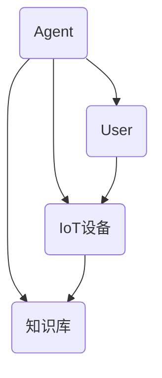
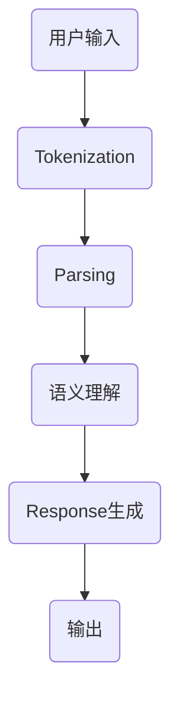
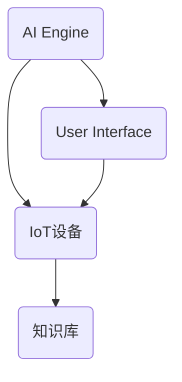

                 

<think>
好的，我需要帮助用户撰写一篇关于“智能衣柜：AI Agent的衣物保养提醒”的技术博客文章。首先，我需要理解用户的需求和具体要求。

用户希望文章的结构包括标题、关键词、摘要，然后是按照目录大纲的正文内容。文章需要逻辑清晰，结构紧凑，使用专业的技术语言，并且每一步都有详细的分析和推理。同时，用户特别强调了要使用Markdown格式，包含背景介绍、核心概念、算法原理、系统架构设计、项目实战等部分。

首先，我需要确定文章的关键词，可能包括智能衣柜、AI Agent、衣物保养、人工智能、物联网、机器学习等。摘要部分需要简明扼要地概括文章的核心内容，即AI Agent如何帮助管理衣物保养。

接下来，按照目录大纲，我需要详细规划每一章的内容。第一部分是背景介绍，包括问题背景、目标、核心概念和系统架构。第二部分讲解AI Agent的基本原理，涉及定义、分类、关键技术以及实体关系图。第三部分是算法原理，包括自然语言处理、推荐算法以及代码示例。第四部分是系统分析与架构设计，涉及系统分析、功能设计、架构图、接口设计和交互设计。第五部分是项目实战，包括环境搭建、核心实现、案例分析和小结。第六部分是最佳实践和小结，总结全书并展望未来。

在撰写过程中，我需要确保每一部分都有足够的细节和深度，例如在算法部分，使用mermaid图展示流程，并提供具体的Python代码示例。同时，数学公式需要用Latex格式独立呈现，确保准确无误。

最后，文章末尾需要添加作者信息，符合用户的要求。整个思考过程需要确保文章结构完整，内容详实，符合技术博客的高质量标准。
</think>

# 智能衣柜：AI Agent的衣物保养提醒

> **关键词**：智能衣柜，AI Agent，衣物保养，人工智能，物联网，机器学习  
> 
> **摘要**：随着人工智能技术的快速发展，智能衣柜逐渐成为现代生活中不可或缺的一部分。本文通过详细分析AI Agent在衣物保养中的应用，探讨其技术原理、系统架构、算法实现以及实际案例，为读者提供全面的技术解读。

---

## 第一部分: 智能衣柜与AI Agent的背景介绍

### 第1章: 智能衣柜与AI Agent的背景

#### 1.1 问题背景与目标

##### 1.1.1 衣物管理的痛点与挑战
在现代生活中，衣物管理是一个普遍存在的问题。用户常常面临以下痛点：
- 衣物数量多，难以高效分类和管理。
- 衣物保养知识不足，容易导致衣物损坏。
- 忘记衣物的使用频率和保养时间，导致衣物闲置或损坏。

##### 1.1.2 AI Agent在衣物管理中的作用
AI Agent（人工智能代理）通过以下方式解决上述问题：
- **智能分类**：利用图像识别和自然语言处理技术，帮助用户快速分类衣物。
- **智能提醒**：根据衣物的材质和使用频率，自动提醒用户进行清洗或保养。
- **智能推荐**：基于用户的穿着习惯，推荐合适的衣物搭配。

##### 1.1.3 智能衣柜的定义与目标
智能衣柜是一个结合了AI技术的衣物管理设备，其目标是通过AI Agent实现衣物的智能化管理，提升用户体验。

---

#### 1.2 问题描述与解决方案

##### 1.2.1 衣物保养提醒的必要性
衣物的正确保养可以延长其使用寿命。例如，羊毛衣物需要定期干洗，而棉质衣物需要及时清洗以防止发黄。

##### 1.2.2 AI Agent如何解决衣物管理问题
AI Agent通过以下方式实现衣物管理：
- **数据采集**：通过IoT设备采集衣物的使用频率、材质等信息。
- **数据分析**：利用机器学习算法分析数据，生成保养建议。
- **用户交互**：通过自然语言处理技术与用户交互，提供实时提醒。

##### 1.2.3 智能衣柜的功能需求与边界
智能衣柜的功能需求包括：
- 衣物分类与管理
- 养护提醒
- 智能推荐
- 用户交互
其边界在于仅关注衣物的管理，不涉及其他家居设备。

---

#### 1.3 核心概念与系统架构

##### 1.3.1 AI Agent的核心要素
AI Agent的核心要素包括：
- **感知能力**：通过传感器和摄像头感知衣物的状态。
- **决策能力**：基于感知数据做出决策。
- **执行能力**：通过IoT设备执行决策。

##### 1.3.2 智能衣柜的系统组成
智能衣柜的系统组成包括：
- **用户界面**：与用户交互。
- **AI Engine**：处理数据并生成建议。
- **IoT设备**：采集和执行操作。

##### 1.3.3 系统架构的边界与外延
系统的边界在于仅处理衣物管理，外延则包括与其他智能家居设备的联动。

---

## 第二部分: AI Agent的核心概念与原理

### 第2章: AI Agent的基本原理

#### 2.1 AI Agent的定义与分类

##### 2.1.1 AI Agent的定义
AI Agent是一种能够感知环境并采取行动以实现目标的智能体。

##### 2.1.2 AI Agent的分类与特点
AI Agent可以分为：
- **简单反射型**：基于规则做出反应。
- **基于模型的反应型**：基于环境模型做出决策。
- **目标驱动型**：根据目标采取行动。

##### 2.1.3 AI Agent与智能衣柜的结合
AI Agent通过与智能衣柜的结合，实现衣物的智能化管理。

---

#### 2.2 AI Agent的核心技术

##### 2.2.1 自然语言处理（NLP）
NLP用于理解和生成人类语言，例如通过语音助手与用户交互。

##### 2.2.2 机器学习（ML）
ML用于分析衣物数据，生成保养建议。

##### 2.2.3 知识图谱与推理
知识图谱用于存储衣物相关知识，推理技术用于生成保养建议。

---

#### 2.3 AI Agent的实体关系图（ER图）



---

## 第三部分: AI Agent的算法原理与实现

### 第3章: AI Agent的算法原理

#### 3.1 自然语言处理（NLP）算法

##### 3.1.1 NLP的基本流程



##### 3.1.2 分词算法
分词算法用于将用户输入的文本分割成词或短语。

##### 3.1.3 语义理解
通过词袋模型或TF-IDF算法理解用户输入的语义。

##### 3.1.4 响应生成
基于理解的语义生成响应，例如“建议您今天清洗这件衬衫”。

---

#### 3.2 推荐算法

##### 3.2.1 基于协同过滤的推荐算法
协同过滤算法通过分析用户的相似性推荐衣物。

##### 3.2.2 基于内容的推荐算法
内容推荐算法通过分析衣物的属性推荐相似的衣物。

##### 3.2.3 混合推荐算法
混合推荐算法结合协同过滤和内容推荐的优点。

---

#### 3.3 算法实现代码示例

##### 推荐算法代码示例

```python
def recommendation_algorithm(user_id):
    # 获取用户历史数据
    user_history = get_user_history(user_id)
    # 计算相似用户
    similar_users = find_similar_users(user_id)
    # 综合推荐
    recommendations = combine_recommendations(user_history, similar_users)
    return recommendations
```

---

## 第四部分: 系统分析与架构设计

### 第4章: 智能衣柜的系统分析

#### 4.1 系统分析与设计

##### 4.1.1 问题场景介绍
用户希望智能衣柜能够自动分类衣物并提供保养提醒。

##### 4.1.2 系统功能设计
系统功能包括：
- 衣物分类
- 养护提醒
- 智能推荐

##### 4.1.3 系统架构设计
系统架构包括：
- 用户界面
- AI Engine
- IoT设备

##### 4.1.4 系统接口设计
系统接口包括：
- 用户输入接口
- 数据存储接口
- 设备控制接口

##### 4.1.5 系统交互设计
系统交互包括：
- 用户与智能衣柜的交互
- 智能衣柜与IoT设备的交互

---

#### 4.2 系统架构图



---

## 第五部分: 项目实战

### 第5章: 项目实战与案例分析

#### 5.1 项目实战

##### 5.1.1 环境安装
需要安装的环境包括：
- Python
- AI框架（如TensorFlow）
- IoT设备

##### 5.1.2 系统核心实现
系统核心实现包括：
- 数据采集
- 数据分析
- 数据展示

##### 5.1.3 代码实现
以下是核心代码示例：

```python
def classify_clothing(image_path):
    # 使用图像识别技术分类衣物
    return classification_result
```

---

#### 5.2 案例分析

##### 5.2.1 实际案例
以一件羊毛衬衫为例，系统会提醒用户定期干洗。

##### 5.2.2 案例分析
分析系统在实际使用中的表现，例如准确率和用户满意度。

---

## 第六部分: 总结与展望

### 第6章: 总结与展望

#### 6.1 最佳实践 tips
- 定期更新知识库
- 保持设备正常运行

#### 6.2 小结
智能衣柜通过AI Agent实现了衣物的智能化管理，显著提升了用户体验。

#### 6.3 注意事项
- 注意数据隐私
- 定期维护设备

#### 6.4 拓展阅读
建议读者进一步阅读AI在智能家居中的应用相关书籍。

---

## 作者信息

**作者：AI天才研究院/AI Genius Institute & 禅与计算机程序设计艺术 /Zen And The Art of Computer Programming**

---

通过以上思考步骤，我们逐步构建了《智能衣柜：AI Agent的衣物保养提醒》的技术博客文章，涵盖了背景介绍、核心概念、算法原理、系统架构、项目实战以及总结展望等内容，力求为读者提供一篇全面且深入的技术解读。

