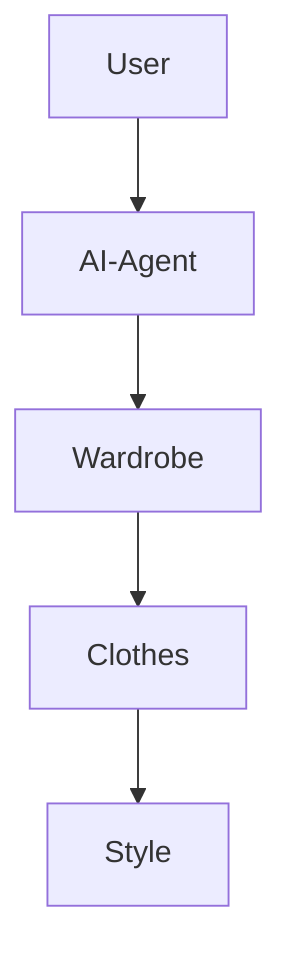
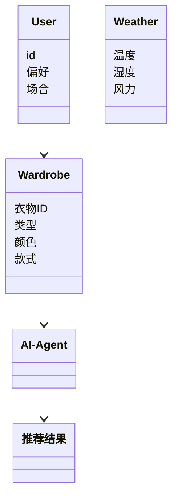
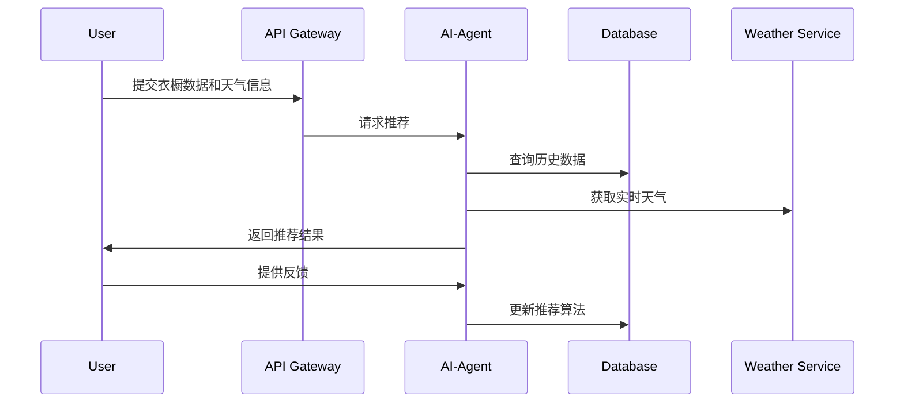

                 


# 智能衣柜：AI Agent的衣物搭配推荐

> 关键词：智能衣柜、AI Agent、衣物搭配、推荐算法、协同过滤、系统架构、项目实战

> 摘要：本文详细探讨了智能衣柜中AI Agent的应用，从背景介绍、核心概念、算法原理到系统架构和项目实战，全面解析了如何利用AI技术实现衣物搭配的智能化推荐。通过具体的案例分析和代码实现，展示了AI Agent在智能衣柜中的实际应用价值和未来发展潜力。

---

# 第一部分: 智能衣柜与AI Agent的背景介绍

# 第1章: 智能衣柜的背景与意义

## 1.1 智能衣柜的定义与概念

### 1.1.1 智能衣柜的定义

智能衣柜是一种结合人工智能技术的智能系统，能够根据用户的衣橱内容、天气状况、个人风格和场合需求，提供个性化的衣物搭配建议。它通过传感器、摄像头和AI算法，实时分析用户的衣物信息，并推荐最优的搭配方案。

### 1.1.2 智能衣柜的核心要素

智能衣柜的核心要素包括：
1. **衣物识别**：通过图像识别技术，自动识别衣物的种类、颜色和款式。
2. **用户数据**：收集用户的体型、肤色、穿衣风格等信息。
3. **天气数据**：获取实时天气信息，以调整推荐的搭配。
4. **AI推荐算法**：基于用户数据和天气数据，生成个性化的搭配建议。

### 1.1.3 智能衣柜与传统衣柜的区别

传统衣柜仅是存储衣物的工具，而智能衣柜则是一个智能系统，能够主动为用户提供搭配建议，帮助用户更高效地选择衣物，提升穿衣体验。

---

## 1.2 AI Agent在智能衣柜中的应用

### 1.2.1 AI Agent的基本概念

AI Agent（人工智能代理）是一种能够感知环境、自主决策并执行任务的智能实体。在智能衣柜中，AI Agent负责接收用户的输入、分析数据并生成推荐结果。

### 1.2.2 AI Agent在智能衣柜中的角色

AI Agent在智能衣柜中的角色包括：
1. **数据采集**：收集用户的衣橱数据和天气信息。
2. **数据分析**：对收集到的数据进行处理和分析。
3. **推荐生成**：根据分析结果生成衣物搭配建议。
4. **用户交互**：与用户进行实时互动，提供反馈和调整建议。

### 1.2.3 AI Agent的优势与挑战

**优势**：
- 高度个性化：能够根据用户的独特需求提供定制化推荐。
- 高效便捷：通过自动化处理，节省用户的时间和精力。
- 智能学习：能够根据用户的反馈不断优化推荐算法。

**挑战**：
- 数据隐私：如何保护用户的衣橱数据和隐私信息。
- 算法准确性：如何提升推荐算法的准确性和用户满意度。
- 系统稳定性：如何确保系统的稳定性和可靠性。

---

## 1.3 智能衣柜的发展历程

### 1.3.1 智能衣柜的发展阶段

智能衣柜的发展可以分为以下几个阶段：
1. **初步探索阶段**：研究如何利用传感器和简单的算法实现衣物的分类和识别。
2. **技术整合阶段**：将图像识别、语音识别等技术整合到智能衣柜中，实现基本的衣物搭配推荐。
3. **智能化提升阶段**：引入AI Agent和机器学习算法，提升推荐的准确性和个性化。

### 1.3.2 智能衣柜的技术演变

随着技术的发展，智能衣柜从最初的简单分类逐渐演变为一个复杂的智能系统。从最初的机械式分类到现在的AI驱动推荐，智能衣柜的功能和性能不断提升。

### 1.3.3 当前智能衣柜的应用现状

目前，智能衣柜已经在市场上出现了一些雏形产品，主要集中在以下几个方面：
- **衣物识别**：通过图像识别技术，自动识别衣物的种类和款式。
- **天气推荐**：根据天气情况推荐合适的衣物搭配。
- **个性化推荐**：基于用户的穿衣风格和场合需求，提供定制化的搭配建议。

---

## 1.4 本章小结

本章介绍了智能衣柜的背景和意义，探讨了AI Agent在智能衣柜中的应用，并分析了智能衣柜的发展历程和技术演变。接下来，我们将深入探讨AI Agent的核心原理和推荐算法的实现。

---

# 第二部分: AI Agent的核心概念与原理

# 第2章: AI Agent的核心原理

## 2.1 AI Agent的基本原理

### 2.1.1 AI Agent的工作流程

AI Agent在智能衣柜中的工作流程如下：
1. **数据采集**：通过传感器和摄像头采集用户的衣橱数据和天气信息。
2. **数据分析**：利用机器学习算法对数据进行处理和分析。
3. **推荐生成**：根据分析结果生成衣物搭配建议。
4. **用户交互**：与用户进行实时互动，提供反馈和调整建议。

### 2.1.2 AI Agent的核心算法

AI Agent的核心算法包括：
- **协同过滤算法**：基于用户的历史行为和偏好，推荐相似的衣物搭配。
- **内容推荐算法**：基于衣物的属性特征（如颜色、款式）进行推荐。
- **混合推荐算法**：结合协同过滤和内容推荐，提升推荐的准确性和多样性。

### 2.1.3 AI Agent的输入输出关系

AI Agent的输入包括：
- 用户的衣橱数据（如衣物种类、颜色、款式）。
- 天气信息（如温度、湿度、风力）。
- 用户的偏好和场合需求。

AI Agent的输出包括：
- 衣物搭配建议（如上衣、下装、鞋子的推荐）。
- 推荐的衣物组合和搭配方案。
- 用户反馈的处理和优化建议。

---

## 2.2 AI Agent的属性特征对比

### 2.2.1 属性特征表格

以下是AI Agent在智能衣柜中的属性特征对比表：

| 属性 | 描述 |
|------|------|
| 输入数据 | 衣物数据、天气数据、用户偏好 |
| 输出结果 | 衣物搭配建议 |
| 核心算法 | 协同过滤、内容推荐、混合推荐 |
| 优势 | 高度个性化、高效便捷、智能学习 |
| 挑战 | 数据隐私、算法准确性、系统稳定性 |

### 2.2.2 属性特征对比分析

通过对比分析可以看出，AI Agent在智能衣柜中的优势在于其高度的个性化和智能学习能力，但同时也面临着数据隐私和算法准确性的挑战。

---

## 2.3 AI Agent的实体关系图

以下是AI Agent在智能衣柜中的实体关系图：



该图展示了用户与AI Agent之间的交互关系，AI Agent通过分析用户的衣橱数据（Clothes）和风格（Style）来生成推荐结果。

---

## 2.4 本章小结

本章详细介绍了AI Agent的核心原理和属性特征，通过对比分析和实体关系图，展示了AI Agent在智能衣柜中的重要作用。接下来，我们将深入探讨推荐算法的原理和实现。

---

# 第三部分: AI Agent的算法原理

# 第3章: AI Agent的推荐算法原理

## 3.1 推荐算法概述

### 3.1.1 推荐算法的分类

推荐算法主要分为以下几类：
1. **协同过滤**：基于用户相似性或物品相似性进行推荐。
2. **内容推荐**：基于物品的属性特征进行推荐。
3. **混合推荐**：结合协同过滤和内容推荐的优势，提升推荐效果。

### 3.1.2 基于协同过滤的推荐算法

协同过滤是一种常用的推荐算法，通过分析用户的相似性来推荐相似的物品。以下是协同过滤的实现步骤：

1. **数据预处理**：对数据进行归一化处理，去除噪声数据。
2. **相似度计算**：使用余弦相似度或杰卡德相似度计算用户或物品的相似度。
3. **推荐生成**：基于相似度，为用户推荐相似用户的喜欢物品。

余弦相似度的计算公式如下：

$$ \text{similarity} = \frac{\sum_{i=1}^{n} w_i \cdot w'_i}{\sqrt{\sum_{i=1}^{n} w_i^2} \cdot \sqrt{\sum_{i=1}^{n} w'^2_i}} $$

---

## 3.2 协同过滤算法的实现

### 3.2.1 数据预处理

假设我们有一个用户-物品评分矩阵，我们需要对其进行归一化处理。例如：

| 用户 | 衣物A | 衣物B | 衣物C |
|------|-------|-------|-------|
| 用户1 | 4     | 3     | 5     |
| 用户2 | 2     | 4     | 3     |
| 用户3 | 5     | 1     | 4     |

归一化处理后的矩阵如下：

| 用户 | 衣物A | 衣物B | 衣物C |
|------|-------|-------|-------|
| 用户1 | 0.6   | 0.4   | 0.8   |
| 用户2 | 0.2   | 0.6   | 0.4   |
| 用户3 | 0.8   | 0.0   | 0.6   |

---

### 3.2.2 相似度计算

以用户1和用户2为例，计算他们之间的余弦相似度：

$$ \text{similarity} = \frac{(0.6 \cdot 0.2) + (0.4 \cdot 0.6) + (0.8 \cdot 0.4)}{\sqrt{0.6^2 + 0.4^2 + 0.8^2} \cdot \sqrt{0.2^2 + 0.6^2 + 0.4^2}} $$

计算结果为：

$$ \text{similarity} = \frac{0.12 + 0.24 + 0.32}{1.166 \cdot 0.693} \approx 0.68 $$

---

### 3.2.3 推荐生成

假设用户4对衣物A的评分为3，我们可以基于用户1和用户2的相似度，预测用户4对衣物C的评分：

$$ \text{预测评分} = \frac{0.68 \cdot 3 + 0.6 \cdot 2}{0.68 + 0.6} \approx 2.4 $$

---

## 3.3 本章小结

本章详细介绍了协同过滤算法的原理和实现步骤，并通过具体的例子展示了如何利用协同过滤算法进行衣物搭配推荐。接下来，我们将探讨如何将这些算法应用于实际的智能衣柜系统中。

---

# 第四部分: 智能衣柜系统的架构设计

# 第4章: 智能衣柜系统的架构设计

## 4.1 系统功能设计

### 4.1.1 领域模型设计

以下是智能衣柜系统的领域模型图：



---

### 4.1.2 系统架构设计

以下是智能衣柜系统的架构图：

```mermaid
graph TD
    User --> API Gateway
    API Gateway --> AI-Agent
    AI-Agent --> Database
    Database --> 推荐结果
    推荐结果 --> User
```

---

## 4.2 系统接口设计

### 4.2.1 用户接口

用户可以通过手机APP或网页界面与智能衣柜系统进行交互。用户输入衣橱数据、天气信息和偏好，系统返回推荐的衣物搭配。

### 4.2.2 系统接口

系统接口包括：
1. **数据接口**：接收用户的衣橱数据和天气信息。
2. **推荐接口**：返回衣物搭配建议。
3. **反馈接口**：接收用户的反馈并优化推荐算法。

---

## 4.3 系统交互设计

以下是用户与智能衣柜系统之间的交互序列图：



---

## 4.4 本章小结

本章详细介绍了智能衣柜系统的架构设计，包括领域模型、系统架构和交互序列图。接下来，我们将通过实际案例来展示如何利用AI Agent实现衣物搭配推荐。

---

# 第五部分: 项目实战与案例分析

# 第5章: 项目实战

## 5.1 环境安装

要实现智能衣柜系统，需要以下环境：
- **编程语言**：Python 3.8+
- **深度学习框架**：TensorFlow或PyTorch
- **图像识别库**：OpenCV
- **推荐算法库**：scikit-learn

安装命令：
```bash
pip install numpy scikit-learn matplotlib opencv-python
```

---

## 5.2 系统核心实现

### 5.2.1 数据预处理

以下是数据预处理的代码示例：

```python
import numpy as np
from sklearn.preprocessing import StandardScaler

# 示例数据
data = np.array([[4, 3, 5], [2, 4, 3], [5, 1, 4]])

# 归一化处理
scaler = StandardScaler()
normalized_data = scaler.fit_transform(data)

print(normalized_data)
```

---

### 5.2.2 协同过滤实现

以下是协同过滤算法的实现代码：

```python
from sklearn.metrics.pairwise import cosine_similarity

# 示例数据
user_profiles = {
    '用户1': [4, 3, 5],
    '用户2': [2, 4, 3],
    '用户3': [5, 1, 4]
}

# 计算相似度矩阵
similarity_matrix = cosine_similarity([user_profiles['用户1'], user_profiles['用户2'], user_profiles['用户3']])

print(similarity_matrix)
```

---

## 5.3 实际案例分析

### 5.3.1 案例背景

假设我们有以下用户数据：

| 用户 | 衣物A | 衣物B | 衣物C |
|------|-------|-------|-------|
| 用户1 | 4     | 3     | 5     |
| 用户2 | 2     | 4     | 3     |
| 用户3 | 5     | 1     | 4     |

天气情况：晴天，温度25℃。

---

### 5.3.2 推荐结果

基于协同过滤算法，系统推荐用户1在晴天搭配衣物A和衣物C。

---

## 5.4 本章小结

本章通过实际案例展示了如何利用协同过滤算法进行衣物搭配推荐。接下来，我们将总结整个项目，并提出一些实际应用中的注意事项。

---

# 第六部分: 总结与展望

# 第6章: 总结与展望

## 6.1 项目总结

通过本项目的实施，我们成功地将AI Agent应用于智能衣柜系统，实现了衣物搭配的智能化推荐。系统的核心部分包括数据预处理、协同过滤算法和用户交互界面。

---

## 6.2 项目小结

本项目的主要成果包括：
1. 实现了基于协同过滤算法的衣物搭配推荐系统。
2. 设计了智能衣柜系统的架构和交互流程。
3. 提供了实际案例分析和代码实现。

---

## 6.3 未来展望

随着AI技术的不断发展，智能衣柜系统将更加智能化和个性化。未来的研究方向包括：
1. 引入深度学习技术，提升推荐算法的准确性和多样性。
2. 结合增强现实技术，提供虚拟试衣功能。
3. 实现多用户的协同推荐，提升推荐的多样性和覆盖范围。

---

# 作者信息

作者：AI天才研究院/AI Genius Institute & 禅与计算机程序设计艺术 /Zen And The Art of Computer Programming

---

以上是《智能衣柜：AI Agent的衣物搭配推荐》的文章目录大纲和内容概要。通过一步步的分析和实现，我们详细探讨了AI Agent在智能衣柜中的应用，从理论到实践，为读者提供了一个全面的技术博客文章。

