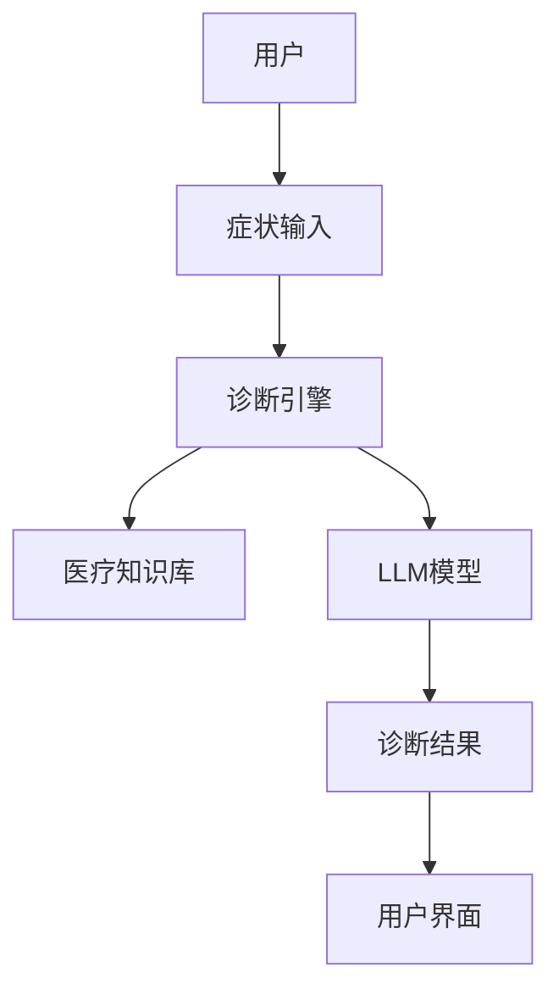

                 

<think>
好的，我需要帮助用户撰写一篇关于“智能诊断AI Agent：LLM在医疗健康领域的应用”的技术博客。用户已经提供了目录大纲，并要求每个部分都详细展开，包括背景、核心概念、算法原理、系统架构、项目实战和最佳实践。

首先，我需要明确每个章节的具体内容，确保覆盖所有要求。例如，在第二章中，我需要详细讲解LLM的核心原理，包括模型结构、训练方法和推理机制，并将其与传统医疗诊断系统进行对比。同时，我需要结合实例，说明LLM如何在症状分析、疾病预测和药物推荐中应用。

接下来，在算法原理部分，我需要使用数学公式和mermaid流程图来解释LLM的训练过程，包括数据预处理、模型初始化、损失函数和优化器的选择。这部分需要详细展开，确保读者能够理解模型的工作机制。

系统分析与架构设计部分，我需要描述医疗智能诊断系统的应用场景，并设计系统的功能模块，如用户界面、诊断引擎和知识库管理。同时，用mermaid类图展示实体关系，用架构图展示系统模块的交互关系。

项目实战部分，我需要提供一个具体的案例，比如基于GPT的医疗诊断系统，展示环境配置、核心代码实现，并对代码进行详细解读。同时，分析实际案例，说明如何解决实际问题，并总结经验。

最后，在最佳实践部分，我需要给出一些小结、注意事项和未来的发展方向，帮助读者更好地理解和应用这些技术。

在写作过程中，我需要确保语言专业且易懂，逻辑清晰，结构紧凑。同时，使用正确的Markdown格式，确保内容美观。最后，加上作者信息，确保文章的完整性和权威性。

总的来说，我需要一步步按照用户的要求，确保每个部分都详细展开，内容丰富，结构合理，符合技术博客的高质量标准。
</think>

```markdown
# 智能诊断AI Agent：LLM在医疗健康领域的应用

---

## 关键词：
智能诊断AI Agent，LLM，医疗健康，人工智能，自然语言处理，医疗诊断

---

## 摘要：
本文探讨了大型语言模型（LLM）在医疗健康领域的智能诊断应用。通过分析LLM的核心原理、算法机制及其在医疗诊断中的具体应用场景，本文提出了构建智能诊断AI Agent的方法论，并通过实际案例展示了其在医疗健康领域的潜力与挑战。文章从背景介绍、核心概念、算法原理、系统架构、项目实战和最佳实践等多个维度展开，为读者提供了一个全面而深入的技术视角。

---

# 第一部分: 智能诊断AI Agent的背景与概念

## 第1章: 智能诊断AI Agent概述

### 1.1 智能诊断AI Agent的定义
#### 1.1.1 什么是智能诊断AI Agent
智能诊断AI Agent是一种基于大型语言模型（LLM）的智能辅助诊断系统，通过自然语言处理技术，能够理解和分析医疗文本数据，提供疾病诊断、症状分析和治疗建议等服务。

#### 1.1.2 LLM在智能诊断中的作用
LLM通过处理大量的医疗文本数据，学习医疗知识和经验，能够生成准确的诊断建议，辅助医生进行决策。

#### 1.1.3 智能诊断AI Agent的核心特征
- **智能化**：基于LLM的自然语言处理能力，能够理解复杂的医疗文本。
- **实时性**：快速响应用户的诊断需求。
- **准确性**：通过深度学习模型，提供高精度的诊断建议。
- **可扩展性**：支持多种医疗场景和数据源的接入。

### 1.2 医疗健康领域的现状与挑战
#### 1.2.1 当前医疗诊断的主要方式
传统医疗诊断主要依赖医生的经验和知识，通过面诊、检查和实验室测试等方式进行。

#### 1.2.2 医疗诊断中的主要问题
- **资源不足**：医疗资源分布不均，尤其是基层医疗机构。
- **诊断错误**：医生在繁忙情况下容易出现误诊或漏诊。
- **信息孤岛**：医疗数据分散，难以高效利用。

#### 1.2.3 AI技术在医疗诊断中的潜力
AI技术能够提高诊断效率，降低误诊率，优化医疗资源的分配。

### 1.3 LLM在医疗健康领域的应用背景
#### 1.3.1 LLM的定义与特点
大型语言模型是一种基于深度学习的自然语言处理模型，具有强大的文本理解和生成能力。

#### 1.3.2 LLM在医疗诊断中的优势
- **快速学习**：能够快速学习大量医疗知识和案例。
- **多任务处理**：支持多种医疗应用场景，如症状分析、疾病预测和药物推荐。
- **实时更新**：能够持续优化模型，提高诊断准确性。

#### 1.3.3 智能诊断AI Agent的应用场景
- **症状自查**：用户可以通过输入症状，获得初步的诊断建议。
- **辅助诊断**：医生可以使用AI Agent进行第二意见，提高诊断准确性。
- **健康管理**：用户可以通过AI Agent进行个性化的健康管理。

### 1.4 本章小结
本章介绍了智能诊断AI Agent的定义、核心特征以及在医疗健康领域的应用背景，为后续内容奠定了基础。

---

## 第2章: LLM的核心原理与医疗诊断的结合

### 2.1 LLM的工作原理
#### 2.1.1 模型结构与训练方法
LLM通常基于Transformer架构，通过自注意力机制和前馈网络进行训练。

#### 2.1.2 LLM的推理机制
LLM通过生成概率模型，根据输入的医疗文本生成最可能的输出。

#### 2.1.3 LLM与传统医疗诊断系统的对比
- **输入方式**：传统系统依赖结构化数据，而LLM可以处理非结构化文本。
- **处理能力**：LLM能够理解复杂的医疗场景，而传统系统通常只能处理简单的查询。

### 2.2 LLM在医疗诊断中的应用模型
#### 2.2.1 症状分析模型
通过输入患者的症状，LLM能够生成可能的疾病列表。

#### 2.2.2 疾病预测模型
基于患者的病史和症状，预测可能的疾病。

#### 2.2.3 药物推荐模型
根据患者的症状和诊断结果，推荐合适的药物和剂量。

### 2.3 LLM与医疗知识图谱的结合
#### 2.3.1 医疗知识图谱的构建
医疗知识图谱通过整合医疗数据，构建疾病、症状、药物之间的关系。

#### 2.3.2 LLM与知识图谱的交互方式
LLM可以基于知识图谱进行推理和生成。

#### 2.3.3 实例分析：LLM在疾病诊断中的应用
例如，患者描述症状为“持续发热、咳嗽和胸痛”，LLM可以生成可能的疾病列表，如肺炎、肺结核等。

### 2.4 本章小结
本章详细讲解了LLM的核心原理及其在医疗诊断中的应用模型，展示了LLM在医疗领域的巨大潜力。

---

## 第3章: LLM的训练与优化

### 3.1 LLM的训练流程
#### 3.1.1 数据预处理
- 数据清洗：去除无效数据，处理噪声。
- 数据标注：标注医疗实体和关系。

#### 3.1.2 模型初始化
- 参数初始化：随机初始化模型参数。
- 模型结构：基于Transformer的架构。

#### 3.1.3 模型训练
- 训练数据：医疗文本数据。
- 训练目标：最小化生成的损失函数。

#### 3.1.4 模型优化
- 调参：调整学习率、批次大小等超参数。
- 增量训练：在已有模型的基础上进行微调。

### 3.2 LLM的损失函数与优化器
#### 3.2.1 损失函数的定义
交叉熵损失函数：
$$ \text{损失函数} = -\sum_{i=1}^{n} \log P(x_i) $$

#### 3.2.2 优化器的选择
常用优化器：Adam优化器。
$$ \text{优化器} = \text{Adam}(\text{learning rate}, \text{weight decay}) $$

### 3.3 LLM的推理过程
#### 3.3.1 推理机制
- 输入处理：将输入文本转换为模型可处理的格式。
- 解码过程：生成最可能的输出序列。

#### 3.3.2 示例代码
```python
def predict(model, input_text):
    input_ids = tokenizer.encode(input_text, return_tensors="pt")
    with torch.no_grad():
        outputs = model.generate(input_ids, max_length=100)
    return tokenizer.decode(outputs[0])
```

### 3.4 本章小结
本章详细介绍了LLM的训练流程、损失函数和优化器，以及推理过程。

---

## 第4章: 系统分析与架构设计

### 4.1 系统功能设计
#### 4.1.1 用户界面
- 症状输入：用户输入症状描述。
- 结果展示：显示诊断建议和治疗方案。

#### 4.1.2 诊断引擎
- 症状分析：基于LLM进行疾病预测。
- 知识库查询：从医疗知识库中获取相关信息。

#### 4.1.3 知识库管理
- 数据更新：定期更新医疗知识库。
- 数据维护：维护知识库的准确性和完整性。

### 4.2 系统架构设计


### 4.3 系统接口设计
- 输入接口：接受用户的症状描述。
- 输出接口：返回诊断建议和治疗方案。

### 4.4 本章小结
本章描述了智能诊断AI Agent的系统功能设计和架构设计，展示了系统的整体结构。

---

## 第5章: 项目实战

### 5.1 环境配置
- 安装Python和相关库：
```bash
pip install torch transformers
```

### 5.2 核心代码实现
```python
from transformers import GPT2LMHeadModel, GPT2Tokenizer

model_name = 'gpt2'
tokenizer = GPT2Tokenizer.from_pretrained(model_name)
model = GPT2LMHeadModel.from_pretrained(model_name)

def diagnose(input_text):
    input_ids = tokenizer.encode(input_text, return_tensors="pt")
    with torch.no_grad():
        outputs = model.generate(input_ids, max_length=100)
    return tokenizer.decode(outputs[0])

print(diagnose("持续发热、咳嗽和胸痛"))
```

### 5.3 代码解读与分析
- **模型加载**：加载预训练的GPT模型。
- **输入处理**：将用户的症状描述转换为模型可处理的格式。
- **生成诊断**：模型生成诊断结果。
- **输出结果**：将诊断结果返回给用户。

### 5.4 实际案例分析
- **案例1**：用户输入“持续发热、咳嗽和胸痛”，模型生成“可能是肺炎或肺结核”。

### 5.5 本章小结
本章通过实际案例展示了智能诊断AI Agent的实现过程，包括环境配置、核心代码实现和案例分析。

---

## 第6章: 最佳实践与注意事项

### 6.1 小结
智能诊断AI Agent通过LLM技术，能够显著提高医疗诊断的效率和准确性。

### 6.2 注意事项
- **数据隐私**：确保患者数据的安全和隐私。
- **模型优化**：持续优化模型，提高诊断准确性。
- **人机协同**：AI Agent作为辅助工具，不能完全替代医生的判断。

### 6.3 未来展望
- **多模态诊断**：结合图像、语音等多种数据源进行诊断。
- **个性化医疗**：根据患者的个体特征提供个性化诊断建议。

### 6.4 本章小结
本章总结了智能诊断AI Agent的应用经验，并展望了未来的发展方向。

---

## 作者信息

作者：AI天才研究院/AI Genius Institute & 禅与计算机程序设计艺术 /Zen And The Art of Computer Programming
```

