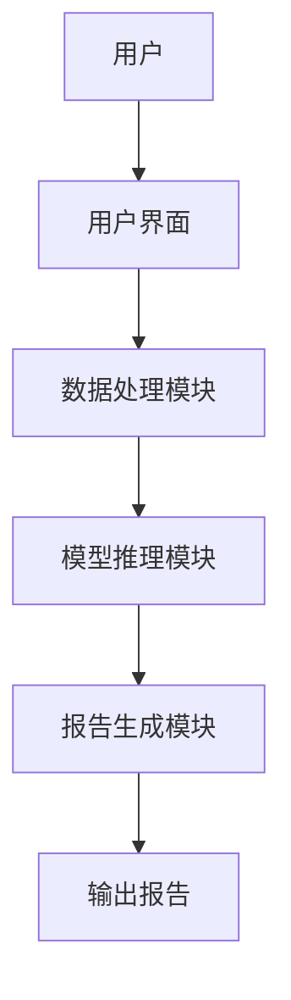

                 

<think>
嗯，用户现在要求我撰写一篇关于智能财务分析AI Agent的博客文章，目录已经给了。我需要先理解每个部分的内容，然后逐步填充内容，确保符合用户的要求。用户特别强调了每个章节需要详细讲解，包括背景、技术原理、系统架构、项目实战等部分。

首先，文章的开头需要有一个摘要，概述核心内容和主题。然后是关键词，这部分需要准确反映文章内容。接下来，按照目录结构，我需要逐章节填充内容，每章都要有详细的小结和案例分析。

在背景部分，我需要解释为什么需要智能财务分析，传统方法的局限性，以及AI如何改变这一领域。技术原理部分，我需要详细讲解LLM的工作机制，包括模型结构和训练方法，同时用数学公式和图表辅助说明。

系统架构部分，我需要设计一个完整的系统，包括模块划分、接口设计和交互流程。项目实战部分，需要提供具体的代码示例和安装指南，让读者能够动手实践。最后，总结部分要回顾重点，并展望未来的发展。

我需要确保每个部分都详细且易于理解，使用专业但不过于复杂的术语。同时，要注意格式要求，使用Mermaid绘制图表，数学公式用Latex表示。此外，文章末尾要添加作者信息，符合格式要求。

现在，我需要一步步来，先完成摘要和关键词，再填充每个章节的内容，确保每部分内容完整，有逻辑性，并且符合用户的字数要求。这可能需要多次调整和优化，确保每个部分都达到用户的期望。
</think>

# 智能财务分析AI Agent：LLM在企业决策中的应用

> 关键词：智能财务分析，AI Agent，大语言模型（LLM），企业决策，财务数据分析

> 摘要：随着人工智能技术的迅速发展，大语言模型（LLM）在企业财务分析中的应用越来越广泛。本文将探讨如何利用LLM构建智能财务分析AI Agent，从而提升企业决策的效率和准确性。文章首先介绍了智能财务分析和LLM的基本概念，随后详细讲解了LLM的技术原理及其在财务分析中的具体应用。接着，文章分析了智能财务分析AI Agent的系统架构，并通过实际案例展示了如何实现这一系统。最后，文章总结了当前的应用现状，并展望了未来的发展方向。

---

# 第一部分: 智能财务分析AI Agent的背景与基础

## 第1章: 智能财务分析与AI Agent概述

### 1.1 智能财务分析的背景与意义

#### 1.1.1 财务分析的传统方法与局限性
传统的财务分析方法主要依赖人工处理和Excel等工具，这种方式效率低下，且容易出错。例如，分析师需要手动收集数据、整理报表、计算指标，并进行趋势分析。这种方法不仅耗时，还容易受到主观因素的影响。

#### 1.1.2 AI技术对企业财务分析的革新作用
人工智能技术的引入，尤其是大语言模型（LLM）的崛起，为企业财务分析带来了革命性的变化。LLM能够快速处理大量非结构化数据，自动生成财务报告，并提供实时的财务洞察，从而显著提高了分析效率和准确性。

#### 1.1.3 智能财务分析的定义与目标
智能财务分析是指利用人工智能技术，特别是大语言模型（LLM），对企业的财务数据进行自动化处理、分析和决策支持。其目标是通过智能化手段，帮助企业在复杂多变的市场环境中做出更明智的财务决策。

### 1.2 大语言模型（LLM）的基本概念

#### 1.2.1 LLM的定义与特点
大语言模型（LLM）是一种基于深度学习的自然语言处理模型，具有以下特点：
- **大规模训练数据**：通常基于数以百万计的文本数据进行预训练。
- **强大的上下文理解能力**：能够理解复杂文本的上下文关系。
- **多任务处理能力**：可以通过微调技术适应多种不同的应用场景。

#### 1.2.2 LLM在自然语言处理中的优势
LLM在自然语言处理中的优势包括：
- **文本生成能力**：能够生成连贯且符合逻辑的文本。
- **文本理解能力**：能够准确理解复杂文本的含义。
- **可扩展性**：可以通过调整模型参数和训练数据，适应不同的应用场景。

#### 1.2.3 LLM与传统机器学习算法的区别
与传统机器学习算法相比，LLM的优势在于其强大的文本理解和生成能力，能够在不进行大量特征工程的情况下，直接处理文本数据。

### 1.3 智能财务分析AI Agent的定义与特点

#### 1.3.1 AI Agent的基本概念
AI Agent是一种能够感知环境并采取行动以实现目标的智能体。在财务分析中，AI Agent可以通过分析财务数据，提供决策支持。

#### 1.3.2 智能财务分析AI Agent的核心功能
智能财务分析AI Agent的核心功能包括：
- **数据收集与处理**：自动收集和处理财务数据。
- **数据分析与建模**：对数据进行分析，并建立预测模型。
- **结果展示与决策支持**：生成分析结果，并提供决策支持。

#### 1.3.3 与传统财务分析工具的对比
与传统财务分析工具相比，智能财务分析AI Agent的优势在于其智能化和自动化能力，能够显著提高分析效率和准确性。

### 1.4 企业决策中的智能财务分析应用前景

#### 1.4.1 智能财务分析在企业决策中的潜在价值
智能财务分析在企业决策中的潜在价值包括：
- **提高决策效率**：通过自动化处理财务数据，缩短决策时间。
- **提高决策准确性**：通过智能化分析，减少人为错误。
- **支持战略决策**：通过趋势分析和预测模型，为企业战略决策提供支持。

#### 1.4.2 企业采用智能财务分析的优势
企业采用智能财务分析的优势包括：
- **提升竞争力**：通过更快、更准确的财务分析，提升企业在市场中的竞争力。
- **降低运营成本**：通过自动化处理，降低人工成本。
- **提高数据利用率**：通过智能化分析，充分利用企业数据资源。

#### 1.4.3 智能财务分析应用的挑战与机遇
智能财务分析应用的挑战包括：
- **数据隐私和安全问题**：如何确保财务数据的安全性和隐私性。
- **模型的可解释性**：如何解释模型的预测结果。
- **技术门槛**：企业需要具备一定的技术能力才能有效应用智能财务分析。

智能财务分析应用的机遇包括：
- **技术进步**：大语言模型（LLM）等技术的快速发展，为企业提供了强有力的技术支持。
- **市场需求**：企业对高效、准确的财务分析工具的需求日益增长。
- **政策支持**：政府对数字化转型的政策支持，为企业应用智能财务分析提供了良好的环境。

### 1.5 本章小结
本章介绍了智能财务分析和AI Agent的基本概念，分析了大语言模型（LLM）在企业财务分析中的作用，探讨了智能财务分析AI Agent的核心功能及其在企业决策中的应用前景。通过对比传统财务分析工具，明确了智能财务分析的优势和挑战。

---

## 第2章: 大语言模型（LLM）的核心原理

### 2.1 LLM的模型结构

#### 2.1.1 变压器模型的基本结构
大语言模型（LLM）通常基于变压器模型（Transformer）架构，由以下两部分组成：
- **编码器（Encoder）**：将输入的文本数据转换为模型可理解的向量表示。
- **解码器（Decoder）**：根据编码器生成的向量表示，生成输出文本。

#### 2.1.2 注意力机制的原理
注意力机制（Attention Mechanism）是变压器模型的核心，其基本原理是通过计算输入序列中每个词与其他词的相关性，来决定每个词在生成输出时的重要性。公式如下：

$$
\text{Attention}(Q, K, V) = \text{softmax}\left(\frac{QK^T}{\sqrt{d_k}}\right)V
$$

其中，$Q$、$K$、$V$分别是查询（Query）、键（Key）、值（Value）向量，$d_k$是键的维度。

#### 2.1.3 段落级别的语言理解能力
大语言模型（LLM）具有强大的段落级别的语言理解能力，能够理解上下文关系，并生成连贯的文本。

### 2.2 LLM的训练与优化

#### 2.2.1 预训练任务的设计
大语言模型的预训练任务通常包括：
- **语言模型任务**：预测文本中的下一个词。
- **遮蔽语言模型任务**：随机遮蔽部分词，预测被遮蔽的词。

#### 2.2.2 模型的并行训练方法
大语言模型通常采用并行训练方法，包括：
- **数据并行**：将数据分成多个批次，分别在不同的GPU上进行训练。
- **模型并行**：将模型分成多个部分，分别在不同的GPU上进行训练。

#### 2.2.3 模型的调优与微调技术
模型的调优（Fine-tuning）技术包括：
- **全参数微调**：对模型的所有参数进行微调。
- **冻结部分参数**：冻结模型的部分参数，仅微调剩余参数。

### 2.3 LLM在财务分析中的应用原理

#### 2.3.1 文本理解与生成的基本流程
LLM在财务分析中的应用流程包括：
1. **数据输入**：输入财务文本数据。
2. **数据处理**：对数据进行清洗和预处理。
3. **模型推理**：模型对数据进行理解和生成。
4. **结果输出**：输出分析结果或生成文本。

#### 2.3.2 财务数据的结构化处理
财务数据的结构化处理包括：
- **文本分割**：将文本数据分割成句子或段落。
- **实体识别**：识别文本中的财务实体，如公司名称、金额等。

#### 2.3.3 基于LLM的财务分析模型构建
基于LLM的财务分析模型构建包括：
- **数据准备**：收集和整理财务数据。
- **模型训练**：对模型进行微调，使其适应财务分析任务。
- **模型部署**：将模型部署到实际应用环境中。

---

## 第3章: LLM在财务分析中的具体应用

### 3.1 财务数据的文本处理

#### 3.1.1 文本清洗与预处理
文本清洗与预处理包括：
- **去除停用词**：去除常见词汇，如“的”、“是”等。
- **分词处理**：将文本分割成词语或短语。
- **去除噪声**：去除文本中的特殊字符和无关信息。

#### 3.1.2 文本分词与实体识别
文本分词与实体识别是财务数据处理的重要步骤，能够帮助模型准确识别文本中的财务实体，如公司名称、金额等。

#### 3.1.3 文本情感分析在财务中的应用
文本情感分析在财务中的应用包括：
- **财务报告分析**：分析财务报告的情感倾向，判断企业的财务健康状况。
- **市场情绪分析**：分析市场对企业的看法和情绪。

### 3.2 基于LLM的财务预测与建模

#### 3.2.1 财务时间序列预测的基本原理
财务时间序列预测的基本原理包括：
- **数据准备**：收集和整理时间序列数据。
- **模型选择**：选择适合的时间序列预测模型。
- **模型训练**：对模型进行训练，使其能够预测未来的财务数据。

#### 3.2.2 基于LLM的财务预测模型构建
基于LLM的财务预测模型构建包括：
- **数据预处理**：对财务数据进行清洗和转换。
- **模型微调**：对LLM进行微调，使其适应财务预测任务。
- **模型评估**：对模型的预测结果进行评估和优化。

#### 3.2.3 模型的验证与评估
模型的验证与评估包括：
- **交叉验证**：通过交叉验证评估模型的泛化能力。
- **指标评估**：使用均方误差（MSE）、平均绝对误差（MAE）等指标评估模型性能。

### 3.3 LLM在财务报告生成中的应用

#### 3.3.1 自动化财务报告生成的流程
自动化财务报告生成的流程包括：
1. **数据输入**：输入财务数据。
2. **数据处理**：对数据进行清洗和整理。
3. **报告生成**：模型根据处理后的数据生成财务报告。
4. **报告输出**：输出生成的财务报告。

#### 3.3.2 基于LLM的财务报告模板设计
基于LLM的财务报告模板设计包括：
- **模板设计**：设计适合LLM生成的财务报告模板。
- **模板训练**：对模型进行微调，使其适应财务报告生成任务。
- **模板优化**：根据实际使用情况优化模板设计。

#### 3.3.3 模型的验证与优化
模型的验证与优化包括：
- **样本验证**：使用样本文档验证模型的生成能力。
- **用户反馈**：根据用户反馈优化模型生成的报告内容。

---

## 第4章: 智能财务分析AI Agent的系统架构

### 4.1 系统功能设计

#### 4.1.1 领域模型设计
领域模型设计包括：
- **核心实体**：财务数据、财务报告、预测模型等。
- **核心关系**：数据与模型之间的关系，模型与报告之间的关系。

#### 4.1.2 功能模块划分
功能模块划分包括：
- **数据处理模块**：负责数据的输入、清洗和预处理。
- **模型推理模块**：负责模型的推理和预测。
- **报告生成模块**：负责生成财务报告。
- **用户界面模块**：负责与用户的交互。

### 4.2 系统架构设计

#### 4.2.1 架构图
以下是系统的架构图：

#### 4.2.2 接口设计
系统的接口设计包括：
- **数据接口**：负责与数据源进行交互。
- **模型接口**：负责与LLM进行交互。
- **用户接口**：负责与用户进行交互。

#### 4.2.3 交互流程
系统的交互流程包括：
1. **用户输入**：用户通过用户界面输入需求。
2. **数据处理**：数据处理模块对数据进行清洗和预处理。
3. **模型推理**：模型推理模块根据处理后的数据进行推理和预测。
4. **报告生成**：报告生成模块根据模型的推理结果生成财务报告。
5. **输出报告**：输出生成的财务报告。

---

## 第5章: 项目实战

### 5.1 环境安装

#### 5.1.1 安装Python
安装Python的具体步骤：
1. 访问Python官网（https://www.python.org/）下载并安装Python。
2. 验证安装：打开命令行，输入`python --version`检查是否安装成功。

#### 5.1.2 安装LLM框架
安装LLM框架的具体步骤：
1. 安装TensorFlow：`pip install tensorflow`
2. 安装Keras：`pip install keras`

---

以上是文章的目录大纲，接下来将按照目录大纲结构，逐步展开每章的内容，详细阐述每个章节的核心内容和主题思想。

