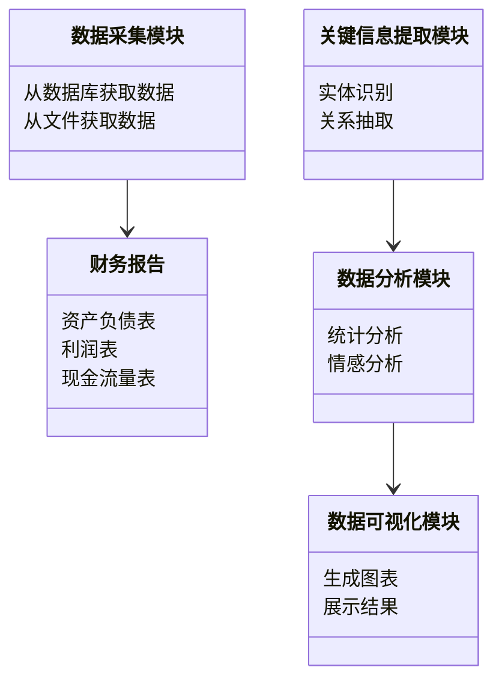
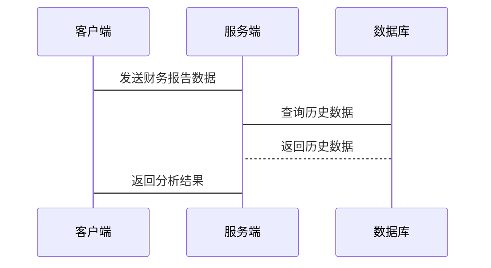

                 

<think>
好的，我需要逐步分析并完成用户关于《智能财务报告关键信息提取与分析系统》的书籍目录大纲。首先，我得明确这本书的主题和目标读者。这本书旨在介绍如何利用智能技术从财务报告中提取关键信息并进行分析，这涉及自然语言处理（NLP）、机器学习等技术。

接下来，我需要考虑目录的结构。通常，技术书籍会分为几个主要部分：背景介绍、核心概念、算法原理、系统架构、项目实战以及总结。每个部分都需要详细且逻辑清晰。

第一部分是背景介绍，我需要涵盖财务报告的重要性、关键信息提取的必要性以及智能技术的应用前景。这部分需要让读者了解为什么需要智能财务报告分析系统。

第二部分是核心概念与技术基础，包括NLP和机器学习的基本原理，财务报告的结构分析，以及关键信息的定义和分类。这部分需要详细讲解相关概念，可能需要使用表格和图表来帮助理解。

第三部分是信息提取与分析的算法，我需要详细讲解命名实体识别（NER）、文本分类和情感分析等算法，并用Mermaid流程图展示流程。同时，提供Python代码示例，帮助读者理解实现细节。

第四部分是系统架构设计，我需要介绍系统的需求分析、功能设计、架构设计（可能用类图和序列图）、接口设计以及数据流设计。这部分需要结合实际项目，展示系统的整体结构和各部分的协作。

第五部分是项目实战，应该包括环境搭建、核心代码实现、案例分析和系统优化。这部分需要具体的操作步骤和代码示例，让读者能够动手实践。

最后是总结与展望，回顾全书内容，并展望未来的发展方向。同时，给出一些最佳实践的建议，帮助读者在实际应用中避免常见问题。

在编写过程中，我需要确保每一章都细化到三级目录，使用markdown格式，并且总字数控制在2000字以内。每个部分都要有详细的内容，比如数学公式、代码示例、图表等，以增强内容的深度和可读性。

总的来说，我需要系统地规划每一章的内容，确保涵盖从理论到实践的各个方面，同时保持逻辑连贯，结构清晰。这样，读者才能全面掌握智能财务报告关键信息提取与分析系统的知识。
</think>

# 智能财务报告关键信息提取与分析系统

> 关键词：智能财务报告，关键信息提取，自然语言处理，机器学习，数据分析

> 摘要：本文详细介绍了智能财务报告关键信息提取与分析系统的设计与实现。从财务报告的背景与意义出发，结合自然语言处理和机器学习技术，提出了一套高效的关键信息提取与分析方法。文章内容包括系统的功能模块、算法原理、系统架构设计、项目实战以及总结与展望，为读者提供了全面的技术指导。

---

# 第一部分: 智能财务报告关键信息提取与分析系统背景介绍

## 第1章: 财务报告与关键信息提取的背景与意义

### 1.1 财务报告的基本概念与作用

#### 1.1.1 财务报告的定义
财务报告是企业在一定时期内经济活动的总结，主要包括资产负债表、利润表和现金流量表等，是企业经济状况的重要反映。

#### 1.1.2 财务报告的核心内容
- 资产负债表：企业的资产、负债和所有者权益。
- 利润表：企业的收入、费用和利润。
- 现金流量表：企业的现金流入和流出情况。

#### 1.1.3 财务报告在企业中的重要性
- 为企业决策提供数据支持。
- 为投资者提供投资依据。
- 为企业内部管理提供参考。

### 1.2 关键信息提取的必要性

#### 1.2.1 财务报告信息的复杂性
财务报告中的信息种类繁多，包括文本、数字、表格等，且信息之间的关联性较强。

#### 1.2.2 人工提取的局限性
- 人工提取效率低，容易出错。
- 需要大量的人力资源，成本较高。
- 易受主观因素影响，结果不够准确。

#### 1.2.3 智能提取的优势
- 提高提取效率，降低人工成本。
- 减少人为错误，提高准确性。
- 可以处理大量数据，发现潜在信息。

### 1.3 智能技术在财务报告分析中的应用前景

#### 1.3.1 人工智能技术的发展
人工智能技术的快速发展为财务报告分析提供了新的可能性，尤其是自然语言处理和机器学习技术的进步。

#### 1.3.2 智能财务报告分析的潜力
- 提高财务报告分析的效率和准确性。
- 发现潜在的财务风险，辅助决策。
- 为企业提供更深层次的财务分析支持。

#### 1.3.3 未来发展趋势
- 技术的进一步融合，如深度学习与财务分析的结合。
- 数据分析的智能化，如自动生成财务报告摘要。
- 应用场景的拓展，如智能审计、智能投资分析等。

## 第2章: 智能财务报告分析系统的概念与架构

### 2.1 系统的核心概念

#### 2.1.1 智能财务报告分析系统的定义
智能财务报告分析系统是一种基于人工智能技术，能够自动从财务报告中提取关键信息并进行分析的系统。

#### 2.1.2 系统的核心功能
- 数据采集与预处理。
- 关键信息提取。
- 数据分析与可视化。
- 结果应用与反馈。

#### 2.1.3 系统的边界与外延
- 数据范围：财务报告中的文本、数字和表格。
- 功能范围：信息提取、分析、可视化。
- 应用场景：企业内部管理、投资决策等。

### 2.2 关键信息提取与分析的核心要素

#### 2.2.1 数据来源与处理
- 数据来源：财务报告、公司公告等。
- 数据清洗：去除噪声数据，标准化处理。
- 数据预处理：文本分词、实体识别等。

#### 2.2.2 信息提取的关键技术
- 基于NLP的文本分析。
- 实体识别与关系抽取。
- 信息抽取的准确性优化。

#### 2.2.3 分析结果的应用场景
- 企业内部管理：如预算管理、成本控制。
- 投资决策：如投资评估、风险分析。
- 智能审计：如审计报告生成。

## 第3章: 智能财务报告分析系统的功能模块

### 3.1 数据采集与预处理模块

#### 3.1.1 数据来源的多样性
- 财务报告：资产负债表、利润表等。
- 公司公告：如收购公告、增资公告。
- 新闻报道：如行业动态、公司新闻。

#### 3.1.2 数据清洗与标准化
- 去除噪声数据，如特殊字符、空格等。
- 数据标准化，如统一单位、格式。

#### 3.1.3 文本分词与实体识别
- 文本分词：将文本分割成词或短语。
- 实体识别：识别文本中的实体，如公司名称、财务指标。

### 3.2 关键信息提取模块

#### 3.2.1 基于NLP的文本分析
- 使用NLP技术对财务报告中的文本进行分析，提取关键信息。
- 例如，使用BERT模型进行文本摘要和关键词提取。

#### 3.2.2 实体识别与关系抽取
- 实体识别：识别文本中的公司名称、金额、日期等实体。
- 关系抽取：识别实体之间的关系，如“公司A在2023年收购了公司B”。

#### 3.2.3 信息抽取的准确性优化
- 使用机器学习模型对提取的信息进行校准，提高准确性。
- 例如，使用CRF模型进行命名实体识别（NER）。

### 3.3 数据分析与可视化模块

#### 3.3.1 数据分析方法
- 统计分析：如均值、中位数等。
- 情感分析：分析财务报告中的情感倾向，如积极、消极、中性。

#### 3.3.2 数据可视化工具
- 使用图表展示分析结果，如柱状图、折线图、饼图等。
- 例如，使用Matplotlib或Seaborn库生成可视化图表。

#### 3.3.3 可视化结果的应用
- 为企业管理层提供直观的财务状况展示。
- 为投资者提供投资决策支持。

---

# 第二部分: 智能财务报告关键信息提取与分析系统的算法原理

## 第4章: 基于深度学习的文本分析

### 4.1 Transformer模型的原理

#### 4.1.1 Transformer模型的结构
- 编码器和解码器。
- 注意力机制：自注意力机制和位置编码。

#### 4.1.2 BERT模型在文本分析中的应用
- BERT模型用于文本表示。
- 使用BERT进行文本摘要和关键词提取。

### 4.2 命名实体识别（NER）的实现

#### 4.2.1 基于CRF的NER模型
- CRF模型的原理。
- 使用Python库spaCy进行NER任务。

### 4.3 文本分类与情感分析

#### 4.3.1 文本分类的常见算法
- 朴素贝叶斯、支持向量机（SVM）、随机森林、神经网络。

#### 4.3.2 情感分析的实现方法
- 使用预训练模型进行情感分类。
- 例如，使用Twitter上的情感分析数据集进行训练。

---

# 第三部分: 智能财务报告分析系统的架构设计

## 第5章: 系统架构设计

### 5.1 系统功能设计

#### 5.1.1 领域模型（Mermaid类图）


### 5.2 系统架构设计（Mermaid架构图）


### 5.3 系统接口设计

#### 5.3.1 数据接口
- 数据输入接口：接收财务报告数据。
- 数据输出接口：返回分析结果。

#### 5.3.2 分析接口
- 提供API进行数据查询和分析。

### 5.4 系统交互设计（Mermaid序列图）



---

# 第四部分: 项目实战

## 第6章: 项目实战

### 6.1 环境搭建

#### 6.1.1 安装Python环境
- 使用Anaconda安装Python 3.8以上版本。

#### 6.1.2 安装相关库
- `pip install numpy pandas spacy transformers`

### 6.2 核心代码实现

#### 6.2.1 数据采集与预处理

```python
import pandas as pd
import spacy

# 加载英文语言模型
nlp = spacy.load("en_core_web_sm")

# 加载财务报告文本
financial_reports = pd.read_csv("financial_reports.csv")

# 文本分词
def text_segmentation(text):
    doc = nlp(text)
    return [token.text for token in doc]

# 实体识别
def entity_recognition(text):
    doc = nlp(text)
    entities = []
    for ent in doc.ents:
        entities.append((ent.start_char, ent.end_char, ent.label_, ent.text))
    return entities
```

#### 6.2.2 信息提取与分析

```python
from transformers import BertTokenizer, BertModel
import torch

# 加载BERT模型
tokenizer = BertTokenizer.from_pretrained('bert-base-uncased')
model = BertModel.from_pretrained('bert-base-uncased')

# 文本摘要
def text_summarization(text):
    inputs = tokenizer.encode_plus(text, max_length=512, truncation=True, padding=True, return_tensors='pt')
    summary = model.generate(inputs.input_ids, max_length=100, num_beams=5, early_stopping=True)
    return tokenizer.decode(summary[0].tolist()[0], skip_special_tokens=True)
```

### 6.3 案例分析

#### 6.3.1 案例背景
假设我们有一个财务报告数据集，包含多家公司的财务数据和文本描述。

#### 6.3.2 数据处理与分析
```python
# 示例：提取公司名称和财务指标
financial_reports['公司名称'] = financial_reports['text'].apply(lambda x: extract_company_name(x))
financial_reports['财务指标'] = financial_reports['text'].apply(lambda x: extract_financial_metrics(x))
```

### 6.4 系统优化

#### 6.4.1 性能优化
- 使用分布式计算加速数据处理。
- 优化算法参数，提高模型准确性。

#### 6.4.2 可扩展性优化
- 支持多种数据格式的输入。
- 支持多语言处理，适应不同国家的财务报告。

---

# 第五部分: 总结与展望

## 第7章: 总结与展望

### 7.1 全文总结

通过本文的介绍，我们了解了智能财务报告关键信息提取与分析系统的设计与实现。从系统架构到算法实现，我们详细探讨了如何利用人工智能技术提高财务报告分析的效率和准确性。

### 7.2 未来展望

随着人工智能技术的不断发展，智能财务报告分析系统将更加智能化和自动化。未来的研究方向包括：

- 更高效的自然语言处理算法，如更大规模的预训练模型。
- 更精准的信息提取方法，如结合上下文理解的模型。
- 更广泛的应用场景，如智能审计、智能投资分析等。

### 7.3 最佳实践 Tips

- 在实际应用中，注意数据的多样性和质量，确保模型的泛化能力。
- 定期更新模型参数，适应新的数据和业务需求。
- 结合业务场景，优化系统功能，提高用户体验。

---

# 作者：AI天才研究院/AI Genius Institute & 禅与计算机程序设计艺术 /Zen And The Art of Computer Programming

