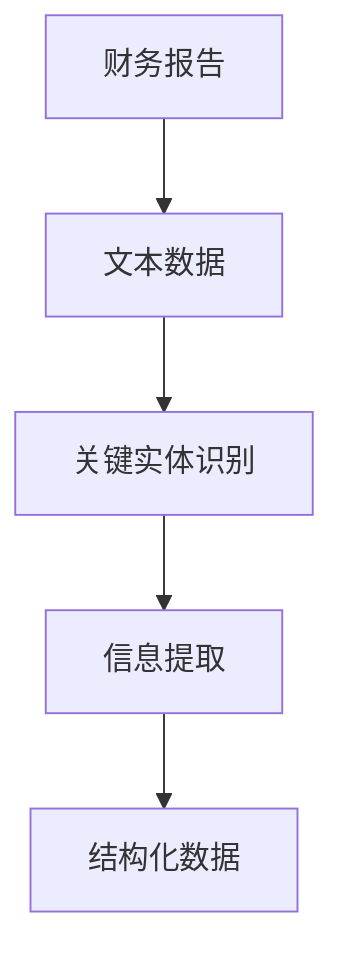
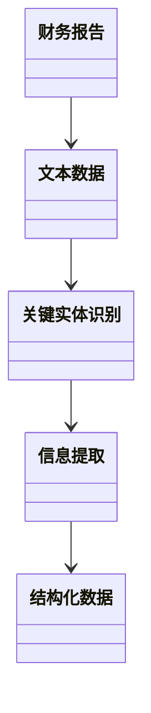

                 


# 智能财务报告关键信息提取工具

> 关键词：智能财务报告，关键信息提取，自然语言处理，机器学习，文本挖掘

> 摘要：本文深入探讨智能财务报告关键信息提取工具的设计与实现，从问题背景到系统架构，结合实际案例，详细分析了基于规则、统计学习和深度学习的多种算法原理，并提供了完整的系统设计与优化方案。文章结构清晰，内容详实，适合技术爱好者和财务专业人士阅读。

---

## 第一部分：智能财务报告关键信息提取工具的背景与概念

### 第1章：问题背景与需求分析

#### 1.1 财务报告的关键信息提取问题

财务报告是企业重要的财务信息载体，通常包含大量的文字、表格和数据。传统的财务报告分析依赖人工阅读和理解，效率低下且容易出错。随着企业规模的扩大和数据量的增加，如何快速、准确地从财务报告中提取关键信息成为一项重要挑战。

- **财务报告的特点**：结构复杂、信息量大、格式多样。
- **关键信息提取的重要性**：提升数据分析效率、降低人工成本、提高决策精准度。
- **传统方法的局限性**：依赖人工阅读，效率低、易出错，难以应对海量数据。

#### 1.2 问题描述与目标设定

- **问题描述**：如何从非结构化和半结构化的财务文本中自动提取关键信息（如收入、成本、利润等）。
- **目标设定**：设计一个高效的智能工具，实现财务报告信息的自动化提取、分类和分析。
- **边界与外延**：限定于财务报告中的关键信息提取，不包括财务预测和决策分析。

### 第2章：核心概念与联系

#### 2.1 关键信息提取的核心概念

- **自然语言处理（NLP）**：用于理解文本结构和语义，是信息提取的基础。
- **机器学习（ML）**：通过训练模型实现模式识别和分类。
- **财务报告结构化**：将非结构化文本转化为结构化数据，便于后续分析。

#### 2.2 核心概念的联系与对比

| 技术 | 原理 | 优缺点 | 应用场景 |
|------|------|---------|----------|
| 正则表达式 | 基于模式匹配 | 简单高效，但灵活性差 | 适合已知结构的数据 |
| CRF | 统计模型 | 准确率高，依赖标注数据 | 适合长文本序列标注 |
| LSTM | 深度学习模型 | 模型复杂，但效果好 | 适合复杂语义理解 |

#### 2.3 实体关系图（Mermaid流程图）



---

## 第二部分：关键信息提取的算法原理

### 第3章：基于规则的提取算法

#### 3.1 规则提取的基本原理

- **正则表达式**：通过预定义的模式匹配特定的文本结构。
  - 示例：`^\d+\.\d+%` 匹配百分比数值。
- **模板匹配**：基于财务报告的固定格式进行匹配。
- **规则优化**：通过反馈机制不断优化匹配规则。

### 第4章：统计学习模型

#### 4.1 基于CRF的条件随机场模型

- **CRF基本原理（Mermaid流程图）**


- **数学模型（Latex公式）**
  - 转移概率：$$P(t_j | t_{j-1})$$
  - 发射概率：$$P(w_j | t_j)$$
  - 最佳路径概率：$$P(t_1, t_2, ..., t_n | w_1, w_2, ..., w_n) = \prod_{j=1}^n P(t_j | t_{j-1}) P(w_j | t_j)$$

### 第5章：深度学习模型

#### 5.1 基于RNN的序列标注

- **RNN基本原理（Mermaid流程图）**


- **LSTM在财务信息提取中的应用**
  - LSTM通过记忆单元捕捉长距离依赖关系，适合处理财务报告中的复杂语义。

---

## 第三部分：系统分析与架构设计

### 第6章：系统功能设计

#### 6.1 领域模型设计（Mermaid类图）



#### 6.2 系统架构设计（Mermaid架构图）


### 第7章：系统实现与优化

#### 7.1 环境搭建与工具安装

- **Python环境**：推荐使用Anaconda，安装 `spacy`, `tensorflow` 等依赖库。
- **数据预处理工具**：如 `pandas`, `numpy`。

#### 7.2 核心算法实现（Python源代码）

```python
import spacy

nlp = spacy.load("en_core_web_sm")
doc = nlp("Revenue increased by 10% last year.")

for token in doc:
    print(token.text, token.pos_)
```

---

## 第四部分：项目实战与案例分析

### 第8章：项目实战

#### 8.1 环境配置与数据准备

- **安装依赖**：`pip install spacy transformers`
- **数据准备**：收集并清洗财务报告文本数据。

#### 8.2 关键信息提取工具的实现

```python
from transformers import pipeline

extractor = pipeline("ner", model="dbmdz/bert-large-cased-finetuned-conll03-2014")
result = extractor("The company's revenue was $100,000.")

print(result)
```

### 第9章：案例分析与经验总结

#### 9.1 实际案例分析

- **案例背景**：某企业需要从年度报告中提取收入、成本和利润数据。
- **工具应用**：通过NLP模型识别关键实体并结构化处理。

#### 9.2 项目经验总结

- **系统优化**：采用分布式架构提升处理效率。
- **模型调优**：通过交叉验证优化模型参数。

---

## 结语

智能财务报告关键信息提取工具结合了自然语言处理和机器学习技术，能够显著提升财务分析的效率和准确性。本文通过系统化的分析和实践，为读者提供了从理论到实践的完整指导。

---

作者：AI天才研究院/AI Genius Institute & 禅与计算机程序设计艺术 /Zen And The Art of Computer Programming

