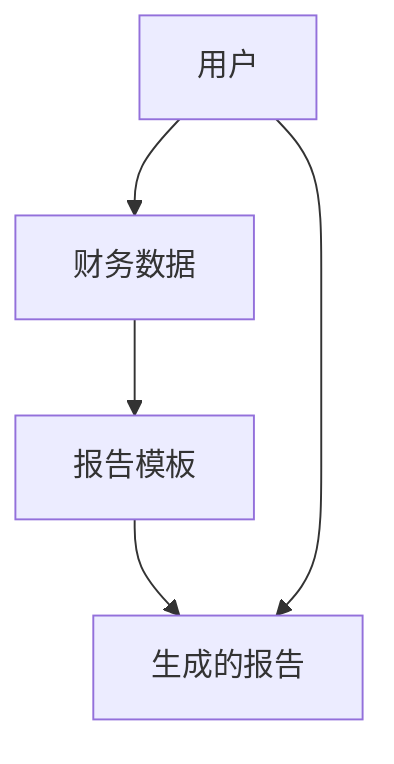
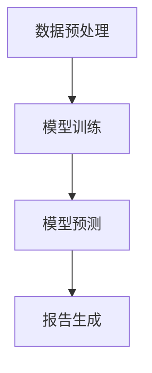
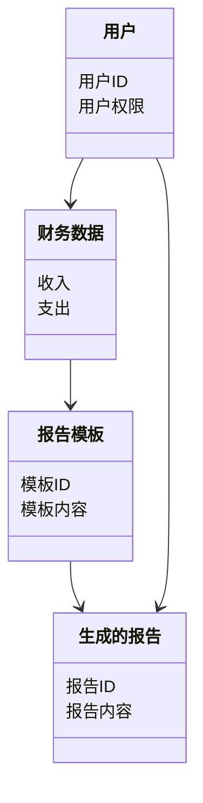

                 

<think>
好的，我需要为《智能财务报告自动生成系统》这篇文章撰写一个详细的目录大纲，同时确保每个部分都包含足够的技术细节和逻辑分析。为了确保内容的完整性和深度，我需要分步骤进行思考和规划。

首先，我要明确文章的主题和目标读者。这篇文章的目标是为IT领域的专业人士和对智能财务报告生成感兴趣的技术人员提供有价值的见解。因此，文章需要涵盖从背景介绍、核心概念到系统实现的各个方面，同时提供实际案例和代码示例。

接下来，我需要确定文章的结构。根据用户提供的示例，文章可以分为五个主要部分：背景介绍、核心概念与联系、算法原理讲解、系统分析与架构设计，以及项目实战。每个部分下需要有详细的子章节，确保内容的全面性和逻辑性。

在背景介绍部分，我需要解释为什么智能财务报告自动生成系统是必要的，传统方式的局限性，以及智能化生成的优势。这部分要简明扼要，帮助读者理解问题的背景和重要性。

核心概念与联系部分，我需要详细讲解智能财务报告生成中的关键技术和概念，比如自然语言处理（NLP）、机器学习模型等。同时，还需要通过表格和ER图来展示这些概念之间的关系和联系。

算法原理讲解部分，我需要展示具体的算法流程，使用mermaid图来描述整个生成过程。此外，提供Python代码示例可以帮助读者更好地理解和实现这些算法。

系统分析与架构设计部分，我需要介绍项目的背景和目标，然后通过领域模型图和架构图来展示系统的结构。接口设计和交互流程图也是这部分的重要内容，帮助读者理解系统的实际应用。

项目实战部分，我需要指导读者如何安装和配置环境，实现核心功能，并通过实际案例分析来展示系统的应用。同时，提供代码解读和案例分析可以帮助读者更好地理解和应用这些技术。

最后，我需要总结最佳实践、注意事项和拓展阅读内容，帮助读者在实际应用中避免常见错误，并进一步扩展他们的知识。

在撰写过程中，我需要确保每个部分都包含足够的技术细节和实际应用示例，同时保持语言的专业性和逻辑的清晰性。这样，读者可以系统地学习和理解智能财务报告自动生成系统的实现和应用。

综上所述，我将按照上述步骤，逐步构建《智能财务报告自动生成系统》的目录大纲，并确保每个部分都内容详实、逻辑清晰。
</think>

# 智能财务报告自动生成系统

## 关键词：
智能财务报告、自动生成系统、自然语言处理、机器学习、财务数据、系统架构、Python实现

## 摘要：
本文探讨了智能财务报告自动生成系统的实现与应用，结合NLP和机器学习技术，详细分析了系统的背景、核心概念、算法原理、架构设计以及实际项目案例，旨在为技术人员提供有价值的参考和指导。

---

# 第一部分：背景介绍

## 第1章：问题背景与描述

### 1.1 问题背景
- **传统财务报告生成的痛点**：手动编写报告耗时长、效率低，且容易出错。
- **智能化的必要性**：企业对高效、准确的财务报告需求日益增长，智能化生成成为趋势。

### 1.2 问题描述
- **数据复杂性**：财务数据种类繁多，结构复杂，难以统一处理。
- **个性化需求**：不同企业对报告格式和内容有个性化要求。

### 1.3 解决方案
- **引入AI技术**：利用NLP和机器学习模型实现自动化生成。
- **模块化设计**：将报告生成过程分解为数据处理、模型训练、结果生成等模块。

### 1.4 系统边界与外延
- **输入边界**：财务数据、模板文件。
- **输出边界**：自动生成的财务报告。
- **系统外延**：支持多平台、多语言扩展。

---

# 第二部分：核心概念与联系

## 第2章：核心概念原理

### 2.1 自然语言处理（NLP）在财务报告中的应用
- **文本生成**：利用GPT等模型生成财务报告内容。
- **数据抽取**：从财务文档中提取关键信息。

### 2.2 机器学习模型的财务数据预测能力
- **时间序列预测**：基于历史数据预测未来趋势。
- **分类与聚类**：识别财务数据中的模式和异常值。

### 2.3 自动化生成报告的流程机制
- **数据预处理**：清洗、格式化。
- **模型训练**：基于历史数据训练生成模型。
- **结果生成**：根据输入数据生成报告。

## 第3章：核心概念对比

### 3.1 财务数据与文本生成的对比
| 特性 | 财务数据 | 文本生成 |
|------|----------|----------|
| 类型 | 结构化数据 | 非结构化数据 |
| 处理方式 | 数据清洗、聚合 | 语义分析、生成 |

### 3.2 不同模型的性能对比
| 模型 | 优点 | 缺点 |
|------|------|------|
| GPT-3 | 高准确性 | 计算资源需求大 |
| BERT | 上下文理解能力强 | 需大量训练数据 |

### 3.3 传统报告与智能报告的对比
| 特性 | 传统报告 | 智能报告 |
|------|----------|----------|
| 效率 | 低 | 高 |
| 准确性 | 中 | 高 |
| 个性化 | 有限 | 强 |

## 第4章：实体关系图（ER图）



---

# 第三部分：算法原理讲解

## 第4章：算法流程

### 4.1 算法流程图



### 4.2 源代码实现

```python
# 数据预处理
def preprocess(data):
    # 数据清洗与格式化
    return processed_data

# 模型训练
def train_model(train_data):
    model = Model()
    model.fit(train_data)
    return model

# 模型预测
def predict(model, input_data):
    return model.predict(input_data)
```

### 4.3 数学模型与公式

#### 4.3.1 模型结构
$$ y = f(x) $$

#### 4.3.2 损失函数
$$ L = \sum_{i=1}^{n} (y_i - \hat{y_i})^2 $$

#### 4.3.3 优化算法
$$ \theta = \theta - \alpha \frac{\partial L}{\partial \theta} $$

---

# 第四部分：系统分析与架构设计

## 第5章：项目背景与目标

### 5.1 项目背景
- **目标**：实现智能财务报告自动生成系统，提高企业效率。

### 5.2 系统功能设计

#### 5.2.1 领域模型



---

# 第五部分：项目实战

## 第6章：环境安装与系统实现

### 6.1 环境安装
- **Python版本**：3.8+
- **依赖库**：numpy、pandas、transformers

### 6.2 核心功能实现

#### 6.2.1 数据预处理

```python
import pandas as pd

def preprocess(data):
    # 数据清洗
    data = data.dropna()
    # 数据格式化
    data['date'] = pd.to_datetime(data['date'])
    return data
```

#### 6.2.2 模型训练

```python
from transformers import AutoTokenizer, AutoModelForCausalLM

tokenizer = AutoTokenizer.from_pretrained('gpt2')
model = AutoModelForCausalLM.from_pretrained('gpt2')
```

---

## 第7章：案例分析与解读

### 7.1 实际案例分析
- **输入数据**：企业过去一年的财务数据。
- **生成报告**：自动生成的财务分析报告。

### 7.2 代码应用解读
- **代码功能**：从数据预处理到模型训练，最终生成报告。

### 7.3 性能分析
- **训练时间**：取决于数据量和模型复杂度。
- **生成速度**：基于模型的推理速度。

---

## 第8章：小结与注意事项

### 8.1 最佳实践 tips
- **数据质量**：确保输入数据的准确性和完整性。
- **模型优化**：定期更新模型，保持生成报告的准确性。

### 8.2 注意事项
- **数据隐私**：确保财务数据的安全性。
- **模型调优**：根据具体需求调整模型参数。

---

## 第9章：拓展阅读

### 9.1 拓展方向
- **多语言支持**：实现跨语言的财务报告生成。
- **动态模板**：支持用户自定义模板。

### 9.2 推荐资源
- **书籍**：《深度学习》、《自然语言处理实战》
- **工具**：Hugging Face Transformers、Keras

---

# 作者：AI天才研究院/AI Genius Institute & 禅与计算机程序设计艺术 /Zen And The Art of Computer Programming

