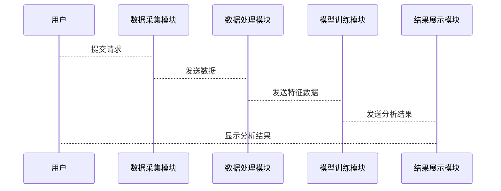

                 


# 智能财务报表分析与解读

> 关键词：智能财务报表分析，人工智能，财务数据，机器学习，深度学习，自然语言处理

> 摘要：本文详细探讨智能财务报表分析的核心概念、算法原理及其在实际应用中的表现。通过对比传统财务分析与智能分析的差异，结合具体案例和系统架构设计，阐述如何利用人工智能技术提升财务报表分析的效率和准确性。

---

# 第一部分: 智能财务报表分析的背景与基础

## 第1章: 财务报表分析的智能化转型

### 1.1 财务报表分析的传统方法与局限性

#### 1.1.1 传统财务报表分析的定义与特点
传统财务报表分析是一种基于财务数据的定性和定量分析方法，主要依赖人工对资产负债表、利润表和现金流量表进行解读。其特点是：
- **数据驱动**：依赖财务数据，缺乏对非结构化数据的处理能力。
- **人工主导**：分析过程主要由财务人员完成，效率较低。
- **规则导向**：依赖预先设定的财务规则和指标，难以发现隐藏的模式。

#### 1.1.2 传统方法在现代企业中的局限性
随着企业规模的扩大和数据量的增加，传统财务分析方法面临以下挑战：
- **数据复杂性**：企业数据来源多样，结构化与非结构化数据并存，传统方法难以全面处理。
- **分析效率**：人工分析耗时长，难以满足实时分析的需求。
- **洞察深度**：传统方法难以发现数据中的深层次关联和潜在风险。

#### 1.1.3 智能化转型的必要性与目标
智能化转型的目的是通过引入人工智能技术，提升财务报表分析的效率和准确性。其主要目标包括：
- **自动化处理**：利用AI技术实现数据的自动采集、清洗和分析。
- **深度洞察**：通过机器学习和深度学习发现数据中的隐藏模式和潜在风险。
- **实时反馈**：提供实时的财务分析结果，支持企业决策。

### 1.2 智能财务报表分析的核心概念

#### 1.2.1 智能财务报表分析的定义
智能财务报表分析是一种结合人工智能技术的财务分析方法，通过自然语言处理（NLP）、机器学习和深度学习等技术，对财务数据进行自动化处理和深度分析，以提供更精准的财务洞察。

#### 1.2.2 智能分析与传统分析的主要区别
以下是智能分析与传统分析的主要区别：

| 对比维度 | 传统分析 | 智能分析 |
|----------|----------|----------|
| 数据处理 | 依赖结构化数据 | 支持结构化和非结构化数据 |
| 分析方法 | 主要依赖人工经验 | 自动化分析，基于算法模型 |
| 分析效率 | 低效，耗时长 | 高效，实时分析 |
| 洞察深度 | 有限，依赖预设规则 | 深度挖掘，发现隐藏模式 |

#### 1.2.3 智能分析的核心技术与工具
智能分析的核心技术包括：
- **自然语言处理（NLP）**：用于处理财务报告中的文本数据，提取关键词和情感分析。
- **机器学习**：用于预测财务指标和识别异常值。
- **深度学习**：用于处理复杂的财务数据模式，如时间序列分析。

### 1.3 财务报表分析的数据基础

#### 1.3.1 数据预处理的重要性
数据预处理是智能分析的关键步骤，主要包括数据清洗、数据标准化和数据特征提取。以下是数据预处理的重要性：
- **数据清洗**：去除噪声数据，确保数据质量。
- **数据标准化**：将不同来源的数据统一格式，便于后续分析。
- **数据特征提取**：提取有助于模型训练的关键特征。

#### 1.3.2 数据清洗与标准化方法
以下是常见的数据清洗与标准化方法：
- **数据清洗**：
  - 去除重复数据。
  - 处理缺失值（如填充、删除或插值）。
  - 标识并处理异常值。
- **数据标准化**：
  - 标准化：将数据按比例缩放到相同范围（如0-1）。
  - 标准差标准化：通过减去均值并除以标准差进行标准化。

#### 1.3.3 数据特征提取与维度分析
特征提取是将数据转换为更高级的表示形式，常用的方法包括：
- **TF-IDF**：用于提取文本数据中的关键词。
- **主成分分析（PCA）**：用于降维，提取主要特征。

### 1.4 本章小结
本章介绍了智能财务报表分析的背景、核心概念及其与传统分析的区别。通过数据预处理的重要性，为后续的智能分析奠定了基础。

---

# 第二部分: 智能财务报表分析的核心概念与联系

## 第2章: 财务报表分析的核心要素

### 2.1 财务报表的主要组成部分

#### 2.1.1 资产负债表的核心要素
资产负债表反映企业在某一特定日期的财务状况，主要包括以下要素：
- **资产**：企业拥有的资源，分为流动资产和非流动资产。
- **负债**：企业欠款的金额，分为流动负债和非流动负债。
- **所有者权益**：企业净资产的价值。

#### 2.1.2 利润表的关键指标
利润表反映企业在一定会计期间的经营成果，主要包括以下指标：
- **收入**：企业在一定时期内通过销售产品或服务获得的总收入。
- **成本**：生产产品或提供服务所发生的直接成本。
- **利润**：收入减去成本和费用后的净利润。

#### 2.1.3 现金流量表的重要性
现金流量表反映企业在一定会计期间内现金的流入和流出情况，主要包括以下内容：
- **经营活动现金流**：企业日常经营活动中产生的现金流。
- **投资活动现金流**：企业投资活动产生的现金流。
- **筹资活动现金流**：企业筹资活动产生的现金流。

### 2.2 AI技术在财务报表分析中的应用

#### 2.2.1 自然语言处理在文本分析中的应用
自然语言处理（NLP）技术在财务报表分析中的应用包括：
- **文本抽取**：从财务报告中提取关键信息（如收入、成本）。
- **情感分析**：分析财务报告中的情感倾向，识别潜在风险。

#### 2.2.2 机器学习在财务预测中的作用
机器学习在财务预测中的作用包括：
- **预测模型**：利用历史数据训练预测模型，预测未来财务指标。
- **异常检测**：识别财务数据中的异常值，预警潜在风险。

#### 2.2.3 深度学习在复杂模式识别中的优势
深度学习在复杂模式识别中的优势包括：
- **模式识别**：识别复杂数据模式，如时间序列中的周期性变化。
- **特征学习**：自动提取特征，减少特征工程的工作量。

### 2.3 智能分析的核心概念对比分析

#### 2.3.1 传统分析与智能分析的对比表格
以下是传统分析与智能分析的对比表格：

| 对比维度 | 传统分析 | 智能分析 |
|----------|----------|----------|
| 数据处理 | 依赖结构化数据 | 支持结构化和非结构化数据 |
| 分析方法 | 主要依赖人工经验 | 自动化分析，基于算法模型 |
| 分析效率 | 低效，耗时长 | 高效，实时分析 |
| 洞察深度 | 有限，依赖预设规则 | 深度挖掘，发现隐藏模式 |

#### 2.3.2 智能分析的ER实体关系图
以下是智能分析的ER实体关系图：

```mermaid
erd
    财务数据
    知识图谱
    特征提取
    模型训练
    结果输出
    财务数据 --> 特征提取
    特征提取 --> 模型训练
    模型训练 --> 结果输出
```

### 2.4 本章小结
本章详细介绍了财务报表的核心要素及其在智能分析中的应用，通过对比分析和ER图，进一步明确了智能分析的优势和实现路径。

---

# 第三部分: 智能财务报表分析的算法原理

## 第3章: 常见算法与原理

### 3.1 文本挖掘与财务数据处理

#### 3.1.1 文本挖掘的基本原理
文本挖掘是一种从文本数据中提取有用信息的技术，其基本原理包括：
- **文本清洗**：去除噪声数据，如停用词和标点符号。
- **文本表示**：将文本转换为向量形式，如TF-IDF和词嵌入（Word2Vec）。

#### 3.1.2 财务文本数据的特征提取方法
财务文本数据的特征提取方法包括：
- **TF-IDF**：用于提取关键词。
- **Word2Vec**：用于生成词嵌入向量。

#### 3.1.3 基于TF-IDF的关键词提取
以下是基于TF-IDF的关键词提取示例：

```python
from sklearn.feature_extraction.text import TfidfVectorizer

text = "公司在2022年的收入为1000万元，同比增长20%。"
vectorizer = TfidfVectorizer()
tfidf = vectorizer.fit_transform([text])
feature_names = vectorizer.get_feature_names_out()
print(feature_names)
```

### 3.2 机器学习分类算法

#### 3.2.1 支持向量机（SVM）原理
支持向量机（SVM）是一种监督学习算法，其原理包括：
- **数据映射**：将数据映射到高维空间，使得数据可以被线性分割。
- **支持向量**：选择能够区分两类数据的点作为支持向量。
- **超平面**：在高维空间中找到一个超平面，将数据分为两类。

#### 3.2.2 随机森林的分类原理
随机森林是一种基于决策树的集成学习算法，其原理包括：
- **决策树构建**：通过特征选择构建多棵决策树。
- **投票机制**：通过投票机制确定最终的分类结果。

#### 3.2.3 K-近邻算法（KNN）的应用
K-近邻算法是一种基于距离的分类算法，其应用包括：
- **距离计算**：计算样本点之间的距离。
- **最近邻居**：选择距离最近的K个样本，根据多数类别确定样本类别。

### 3.3 深度学习模型

#### 3.3.1 LSTM网络在时间序列分析中的应用
长短期记忆网络（LSTM）是一种处理时间序列数据的深度学习模型，其应用包括：
- **时间序列预测**：预测未来的财务指标。
- **序列建模**：建模财务数据的时间依赖性。

#### 3.3.2 Transformer模型在长文本处理中的优势
Transformer模型是一种基于注意力机制的深度学习模型，其优势包括：
- **自注意力机制**：能够捕捉文本中的全局依赖关系。
- **并行计算**：支持并行计算，提升计算效率。

#### 3.3.3 BERT模型的应用
BERT模型是一种基于Transformer的预训练语言模型，其应用包括：
- **文本表示**：生成高质量的文本表示。
- **问答系统**：用于财务报告中的问答任务。

---

# 第四部分: 系统分析与架构设计方案

## 第4章: 智能财务报表分析系统设计

### 4.1 问题场景介绍
智能财务报表分析系统旨在通过AI技术提升财务报表分析的效率和准确性。系统需要处理以下问题：
- **数据多样性**：处理结构化和非结构化数据。
- **实时性**：提供实时的财务分析结果。
- **可扩展性**：支持大规模数据处理。

### 4.2 项目介绍
本项目旨在开发一个智能财务报表分析系统，主要功能包括：
- **数据采集**：从多种数据源采集财务数据。
- **特征提取**：对数据进行特征提取和数据清洗。
- **模型训练**：训练机器学习和深度学习模型。
- **结果展示**：将分析结果以可视化形式展示。

### 4.3 系统功能设计

#### 4.3.1 领域模型设计
以下是领域模型设计：


#### 4.3.2 系统架构设计
以下是系统架构设计：


#### 4.3.3 系统接口设计
系统接口设计包括：
- **数据接口**：与财务系统对接，获取财务数据。
- **模型接口**：与第三方机器学习平台对接，调用模型服务。
- **展示接口**：与前端展示界面对接，输出分析结果。

#### 4.3.4 系统交互设计
以下是系统交互设计：



### 4.4 本章小结
本章详细描述了智能财务报表分析系统的架构设计和功能模块，为后续的系统实现奠定了基础。

---

# 第五部分: 项目实战与应用

## 第5章: 项目实战

### 5.1 环境安装与配置

#### 5.1.1 安装Python环境
```bash
python --version
pip install --upgrade pip
```

#### 5.1.2 安装必要的库
```bash
pip install numpy
pip install pandas
pip install scikit-learn
pip install transformers
pip install sentence-transformers
```

### 5.2 系统核心实现

#### 5.2.1 数据采集模块
```python
import pandas as pd
import requests

def fetch_financial_data(company):
    url = f"https://api.example.com/financial_data/{company}"
    response = requests.get(url)
    data = response.json()
    return pd.DataFrame(data)
```

#### 5.2.2 特征提取模块
```python
from sklearn.feature_extraction.text import TfidfVectorizer

def extract_features(text):
    vectorizer = TfidfVectorizer()
    features = vectorizer.fit_transform([text])
    return features
```

#### 5.2.3 模型训练模块
```python
from sklearn.svm import SVC

def train_model(X, y):
    model = SVC()
    model.fit(X, y)
    return model
```

#### 5.2.4 结果展示模块
```python
import matplotlib.pyplot as plt

def plot_results(results):
    plt.plot(results)
    plt.xlabel('Time')
    plt.ylabel('Value')
    plt.show()
```

### 5.3 项目小结
本章通过具体的代码实现，展示了智能财务报表分析系统的实现过程，包括数据采集、特征提取、模型训练和结果展示。

---

# 第六部分: 最佳实践与总结

## 第6章: 最佳实践与总结

### 6.1 最佳实践

#### 6.1.1 数据处理
- 确保数据的准确性和完整性。
- 处理缺失值和异常值。

#### 6.1.2 模型选择
- 根据具体任务选择合适的算法。
- 进行模型调优和交叉验证。

#### 6.1.3 系统优化
- 优化系统架构，提高处理效率。
- 采用分布式计算，处理大规模数据。

### 6.2 小结
智能财务报表分析是一项复杂但极具价值的任务，通过结合人工智能技术，可以显著提升财务分析的效率和准确性。

### 6.3 注意事项
- 数据隐私和安全问题需要高度重视。
- 系统的可扩展性和可维护性需要在设计阶段充分考虑。
- 模型的可解释性需要在实现过程中重点关注。

### 6.4 拓展阅读
- 《机器学习实战》
- 《深度学习入门：基于Python的CNN、RNN、GAN等人工神经网络的原理和实现》
- 《自然语言处理入门：基于Python的文本挖掘、情感分析、机器翻译等任务的实现》

---

# 结语

智能财务报表分析是人工智能技术在财务领域的典型应用，通过本文的系统介绍和实践案例，读者可以深入了解如何利用AI技术提升财务分析的效率和准确性。未来，随着技术的不断进步，智能财务报表分析将更加智能化和自动化。

---

# 作者

**作者：AI天才研究院/AI Genius Institute & 禅与计算机程序设计艺术 /Zen And The Art of Computer Programming**

