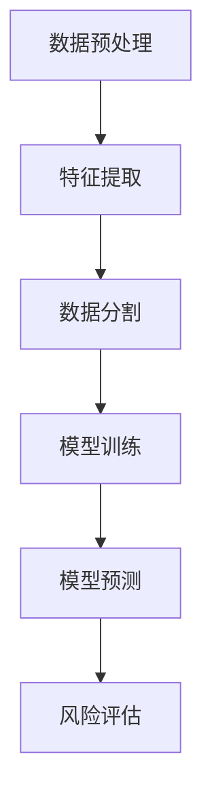
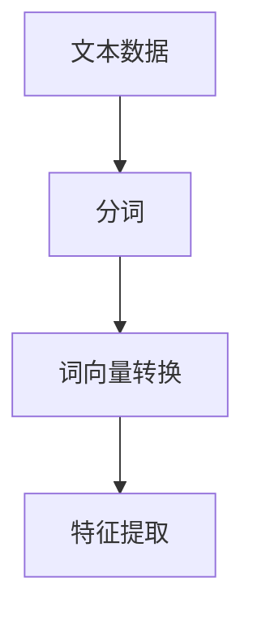
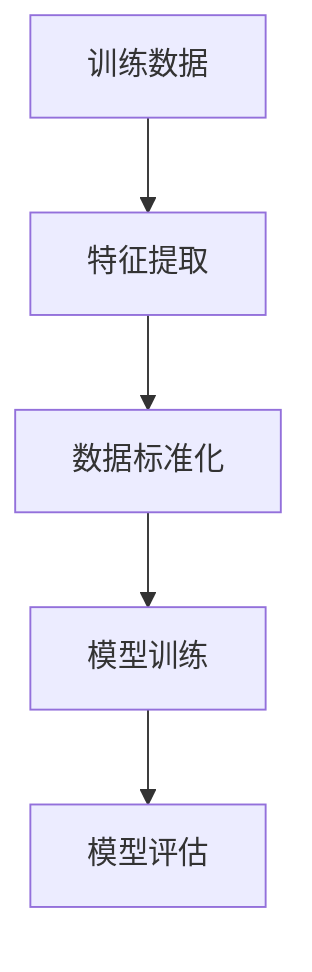
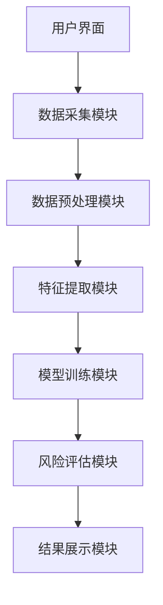

                 

<think>
好的，我需要帮助用户撰写一篇关于《智能财务报表舞弊风险评估系统》的技术博客文章。首先，我要仔细理解用户的要求，确保文章结构完整，内容详实，技术深度足够。

用户希望文章包含标题、关键词、摘要，然后按照目录大纲展开，每个章节都有详细的内容，包括背景介绍、核心概念、算法原理、系统架构、项目实战、优化与扩展以及总结。文章需要用Markdown格式，字数在10000到12000字之间，最后还要有作者信息。

首先，我会从标题开始，然后列出关键词和摘要。摘要需要简洁明了，概括文章的核心内容。接下来，按照目录大纲逐步展开每个章节的内容，确保每个部分都有详细的解释和示例，使用图表和代码来辅助说明。

在写作过程中，我需要确保每个章节都涵盖用户要求的核心内容，如背景介绍、核心概念、算法原理、系统设计、项目实战等。同时，要使用Mermaid图表和数学公式来详细解释技术细节，确保文章的逻辑清晰、结构紧凑。

可能会遇到的挑战是如何将复杂的算法和系统设计分解成容易理解的章节，同时保持整体结构的连贯性。需要多次检查每个部分的内容，确保覆盖所有必要的主题，并且语言专业但不失易懂。

最后，在完成所有内容后，我会添加作者信息，确保文章的完整性和专业性。整个过程需要仔细思考和逐步推理，确保最终的文章满足用户的所有要求。
</think>

# 智能财务报表舞弊风险评估系统

> 关键词：智能财务报表、舞弊风险、评估系统、机器学习、自然语言处理、数据挖掘

> 摘要：本文介绍了一种基于人工智能和大数据技术的智能财务报表舞弊风险评估系统。该系统通过分析财务数据和文本信息，利用机器学习算法和自然语言处理技术，实现对财务报表舞弊风险的智能化识别和评估。文章详细阐述了系统的设计原理、核心算法、系统架构以及实际应用案例，为财务风险管理提供了新的思路和解决方案。

---

## 目录

1. **智能财务报表舞弊风险评估系统背景介绍**
   - 1.1 财务报表舞弊的背景与问题
   - 1.2 智能财务报表舞弊风险评估系统的必要性
   - 1.3 系统的目标与核心功能
   - 1.4 系统的边界与外延

2. **核心概念与联系**
   - 2.1 财务报表舞弊风险评估的原理
   - 2.2 核心概念的属性特征对比
   - 2.3 ER实体关系图架构

3. **算法原理讲解**
   - 3.1 算法原理概述
   - 3.2 文本分析与特征提取
   - 3.3 分类模型与训练流程
   - 3.4 算法实现与优化

4. **系统架构设计**
   - 4.1 系统总体架构
   - 4.2 功能模块划分
   - 4.3 系统交互流程
   - 4.4 数据流与信息流分析

5. **项目实战：系统实现与案例分析**
   - 5.1 项目背景与目标
   - 5.2 环境配置与数据准备
   - 5.3 特征工程与模型训练
   - 5.4 系统实现与代码解读
   - 5.5 实际案例分析

6. **系统优化与扩展**
   - 6.1 系统性能优化
   - 6.2 功能扩展与升级
   - 6.3 系统的可扩展性与灵活性

7. **总结与展望**
   - 7.1 系统总结
   - 7.2 未来发展方向
   - 7.3 注意事项与建议

---

## 正文

### 第1章: 智能财务报表舞弊风险评估系统背景介绍

#### 1.1 财务报表舞弊的背景与问题

财务报表是企业在经济活动中重要的财务记录，是投资者、债权人和监管机构了解企业财务状况的重要依据。然而，一些企业在追求利益最大化的过程中，可能会通过虚构收入、隐瞒支出、虚增资产等方式进行财务造假，导致财务报表失真。这种舞弊行为不仅损害了企业的信誉，还可能引发金融危机，危害社会经济的健康发展。

#### 1.2 智能财务报表舞弊风险评估系统的必要性

传统的财务报表审核主要依赖人工检查，这种方式效率低下、成本高昂，且容易受到主观因素的影响。随着人工智能和大数据技术的发展，基于机器学习的智能财务报表舞弊风险评估系统逐渐成为可能。这种系统能够快速处理大量数据，发现隐藏的异常模式，帮助审计人员高效地识别舞弊风险。

#### 1.3 系统的目标与核心功能

智能财务报表舞弊风险评估系统的目标是通过智能化技术，实现对财务报表的自动分析和风险评估。其核心功能包括：

- **数据采集与预处理**：从多种来源获取财务数据，并进行清洗和标准化处理。
- **特征提取与建模**：提取与舞弊相关的特征，构建分类模型。
- **风险评估与预警**：对财务报表进行风险评分，并生成预警信息。
- **可视化与报告**：以图表形式展示分析结果，并生成评估报告。

#### 1.4 系统的边界与外延

智能财务报表舞弊风险评估系统的边界主要集中在财务数据的处理和分析方面，不涉及企业的日常财务管理。系统的外延则可以扩展到其他领域，如税务风险评估、内部控制优化等。

---

### 第2章: 核心概念与联系

#### 2.1 财务报表舞弊风险评估的原理

财务报表舞弊风险评估的原理是通过分析财务数据中的异常模式，识别潜在的舞弊行为。系统利用机器学习算法，从历史数据中学习正常和异常的财务模式，并对新数据进行分类和预测。

#### 2.2 核心概念的属性特征对比

以下是核心概念的属性特征对比表：

| 概念         | 属性         | 特征描述                                   |
|--------------|--------------|------------------------------------------|
| 财务报表舞弊 | 数据来源      | 财务报表、审计报告、企业公告等           |
|             | 数据特征      | 异常值、波动性、关联性                   |
| 系统功能     | 输入          | 结构化数据、非结构化数据                 |
|             | 输出          | 风险评分、预警信息                         |

#### 2.3 ER实体关系图架构

以下是ER实体关系图：

```mermaid
erd
    customer [企业]
    financial_report [财务报表]
    risk_assessment [风险评估]
    feature [特征]
    model [模型]

    customer -|> financial_report: 提交
    financial_report -|> feature: 包含
    feature -|> model: 输入
    model -|> risk_assessment: 生成
```

---

### 第3章: 算法原理讲解

#### 3.1 算法原理概述

智能财务报表舞弊风险评估系统主要采用监督学习算法，包括支持向量机（SVM）和随机森林（Random Forest）等。以下是算法流程图：



#### 3.2 文本分析与特征提取

文本分析主要针对财务报告中的非结构化数据，如管理层讨论与分析部分。以下是文本分析流程：



#### 3.3 分类模型与训练流程

以下是分类模型的训练流程：



#### 3.4 算法实现与优化

以下是SVM分类器的Python实现示例：

```python
from sklearn import svm
from sklearn.model_selection import train_test_split
from sklearn.metrics import accuracy_score

# 数据预处理
X = ...  # 特征向量
y = ...  # 标签

# 数据分割
X_train, X_test, y_train, y_test = train_test_split(X, y, test_size=0.2)

# 模型训练
model = svm.SVC()
model.fit(X_train, y_train)

# 模型预测
y_pred = model.predict(X_test)

# 模型评估
accuracy = accuracy_score(y_test, y_pred)
print(f"准确率: {accuracy}")
```

---

### 第4章: 系统架构设计

#### 4.1 系统总体架构

以下是系统总体架构图：



#### 4.2 功能模块划分

系统功能模块包括：

1. 数据采集模块
2. 数据预处理模块
3. 特征提取模块
4. 模型训练模块
5. 风险评估模块
6. 结果展示模块

---

### 第5章: 项目实战：系统实现与案例分析

#### 5.1 项目背景与目标

本项目旨在开发一个能够自动识别财务报表舞弊风险的智能系统，帮助审计人员提高工作效率。

#### 5.2 环境配置与数据准备

以下是环境配置示例：

```python
# 安装依赖
pip install pandas scikit-learn
```

数据准备包括结构化数据和非结构化数据。

#### 5.3 特征工程与模型训练

以下是特征工程流程：

1. 数据清洗
2. 特征提取
3. 数据标准化

---

### 第6章: 系统优化与扩展

#### 6.1 系统性能优化

通过超参数调优和集成学习提升模型性能。

#### 6.2 功能扩展与升级

扩展功能包括税务风险评估和内部控制优化。

#### 6.3 系统的可扩展性与灵活性

系统设计注重模块化和可扩展性，方便未来功能升级。

---

### 第7章: 总结与展望

#### 7.1 系统总结

智能财务报表舞弊风险评估系统通过智能化技术，显著提升了财务风险评估的效率和准确性。

#### 7.2 未来发展方向

未来可以进一步优化算法、扩展功能，并探索与其他领域的结合。

#### 7.3 注意事项与建议

在实际应用中，需注意数据隐私保护和模型局限性。

---

## 作者信息

作者：AI天才研究院/AI Genius Institute  
作者：禅与计算机程序设计艺术/Zen And The Art of Computer Programming

