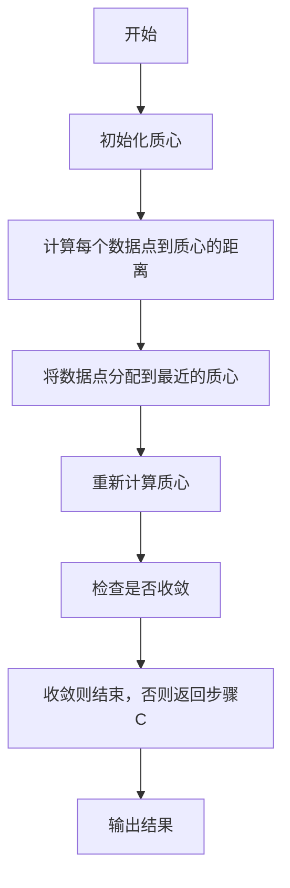
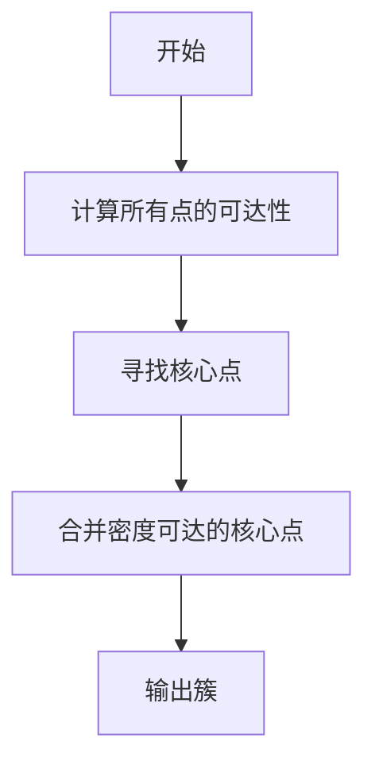
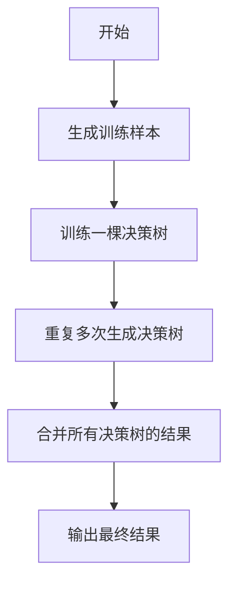
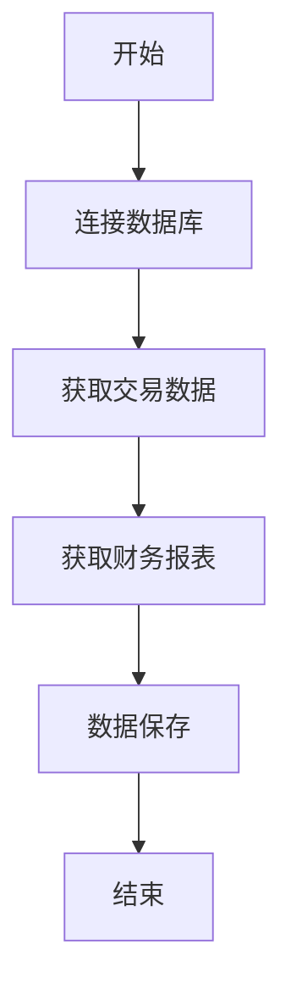
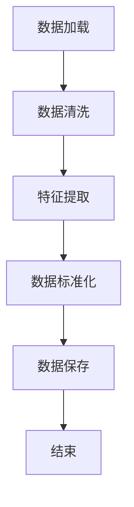

                 


# 智能财务舞弊模式识别系统

> 关键词：财务舞弊、模式识别、人工智能、机器学习、数据挖掘

> 摘要：智能财务舞弊模式识别系统是一种利用人工智能和大数据技术，通过分析财务数据中的异常模式来识别舞弊行为的系统。本文从背景介绍、核心概念、算法原理、系统架构、项目实战等多个方面详细探讨了智能财务舞弊模式识别系统的设计与实现，结合实际案例分析，展示了该系统在现实中的应用价值和前景。

---

# 第1章: 财务舞弊模式识别的背景与意义

## 1.1 财务舞弊的现状与挑战

### 1.1.1 财务舞弊的定义与类型
财务舞弊是指在财务报告、交易记录或其他财务相关活动中，故意提供虚假信息或隐瞒重要事实的行为。常见的财务舞弊类型包括虚假交易、虚增收入、虚减支出、资产隐瞒、关联交易舞弊等。

### 1.1.2 传统财务舞弊识别的局限性
传统的财务舞弊识别方法主要依赖于审计人员的经验和人工检查，这种方式效率低下、成本高昂，且容易受到主观因素的影响。此外，传统方法难以应对大规模、复杂多变的舞弊手段。

### 1.1.3 智能技术在财务舞弊识别中的作用
随着人工智能和大数据技术的快速发展，智能技术在财务舞弊识别中的应用越来越广泛。通过机器学习算法，系统能够自动分析海量财务数据，发现隐藏的异常模式，从而提高舞弊识别的准确性和效率。

## 1.2 智能财务舞弊模式识别的必要性

### 1.2.1 数据驱动的舞弊识别优势
智能财务舞弊识别系统能够通过对海量财务数据的分析，发现传统方法难以察觉的异常模式。数据驱动的方法不仅提高了舞弊识别的效率，还能够降低识别成本。

### 1.2.2 人工智能在财务领域的应用前景
人工智能技术在财务领域的应用前景广阔，包括智能财务分析、自动化记账、风险评估等。而在舞弊识别方面，人工智能技术能够通过深度学习模型，自动识别复杂的舞弊模式。

### 1.2.3 智能财务舞弊模式识别的核心价值
智能财务舞弊模式识别系统的核心价值在于其能够通过自动化的方式，快速、准确地识别财务舞弊行为，从而帮助企业减少财务损失，提升财务透明度和公信力。

## 1.3 本章小结
本章介绍了财务舞弊的现状与挑战，分析了传统财务舞弊识别方法的局限性，并探讨了智能技术在财务舞弊识别中的作用和必要性。通过数据驱动的方法，智能财务舞弊模式识别系统能够显著提高舞弊识别的效率和准确性。

---

# 第2章: 智能财务舞弊模式识别的核心概念

## 2.1 数据预处理与特征提取

### 2.1.1 数据清洗与标准化
在智能财务舞弊识别系统中，数据预处理是关键的第一步。数据清洗包括处理缺失值、异常值和重复数据。标准化则是将不同量纲的特征数据转换为统一的尺度，以便后续算法处理。

#### 代码示例：数据清洗与标准化
```python
import pandas as pd
from sklearn.preprocessing import StandardScaler

# 数据加载与缺失值处理
data = pd.read_csv('financial_data.csv')
data.dropna(inplace=True)  # 删除缺失值
data.drop_duplicates(inplace=True)  # 删除重复数据

# 特征标准化
scaler = StandardScaler()
data_features = scaler.fit_transform(data[['revenue', 'expenses', 'net_income']])
```

### 2.1.2 特征选择与降维方法
特征选择是为了从大量特征中筛选出对舞弊识别有重要影响的特征。常用的特征选择方法包括基于统计的特征选择、基于模型的特征选择和基于树模型的特征重要性排序。

#### 代码示例：基于树模型的特征重要性排序
```python
from sklearn.ensemble import RandomForestClassifier

# 建立随机森林模型
model = RandomForestClassifier()
model.fit(data_features, data_labels)

# 获取特征重要性
feature_importance = model.feature_importances_
```

### 2.1.3 文本数据的特征提取
对于财务报告中的文本数据，可以使用自然语言处理（NLP）技术进行特征提取，如词袋模型（BOW）或词嵌入模型（如Word2Vec）。

#### 代码示例：使用TF-IDF进行文本特征提取
```python
from sklearn.feature_extraction.text import TfidfVectorizer

# 文本数据处理
text_data = data['description'].tolist()
vectorizer = TfidfVectorizer()
text_features = vectorizer.fit_transform(text_data)
```

## 2.2 聚类与分类算法

### 2.2.1 聚类算法在财务舞弊识别中的应用
聚类算法可以将财务数据分成不同的簇，识别出异常的交易模式。常用聚类算法包括K-means、DBSCAN等。

#### 使用K-means进行聚类分析
```python
from sklearn.cluster import KMeans

# 聚类模型训练
kmeans = KMeans(n_clusters=3, random_state=42)
clusters = kmeans.fit_predict(data_features)
```

### 2.2.2 分类算法的选择与优化
分类算法用于将财务交易分类为正常或舞弊。常用的分类算法包括支持向量机（SVM）、随机森林、梯度提升树（GBDT）等。

#### 使用随机森林进行分类
```python
from sklearn.ensemble import RandomForestClassifier

# 分类模型训练
model = RandomForestClassifier(n_estimators=100, random_state=42)
model.fit(data_features, data_labels)
```

### 2.2.3 常见分类算法对比分析
以下表格对比了几种常见分类算法的优缺点：

| 算法名称    | 优点                              | 缺点                              |
|-------------|-----------------------------------|-----------------------------------|
| KNN         | 简单，易于实现                   | 对异常值敏感，计算量大           |
| SVM         | 高精度，适合中小规模数据         | 不适合高维数据                   |
| Random Forest| 无偏差，适合高维数据             | 解释性较差                     |
| GBDT        | 高精度，适合复杂数据             | 训练时间较长                   |

### 2.2.4 实体关系图（ER图）分析
通过ER图可以清晰地展示财务舞弊识别系统中各实体之间的关系，帮助我们更好地理解系统的架构。

```mermaid
erd
    title 财务舞弊识别系统ER图
    [*] --(1..n)-> 交易记录
    [*] --(1..n)-> 用户
    交易记录 --(1..n)-> 异常检测结果
```

---

# 第3章: 智能财务舞弊模式识别的算法原理

## 3.1 聚类算法原理

### 3.1.1 K-means算法原理与流程
K-means是一种无监督学习算法，通过最小化平方误差来聚类数据点。其流程包括数据预处理、初始化质心、计算距离、重新计算质心，直到收敛。

#### K-means算法流程图


### 3.1.2 DBSCAN算法的实现步骤
DBSCAN是一种基于密度的聚类算法，通过密度可达性定义簇。其主要步骤包括数据预处理、计算每个点的可达性、合并高密度区域形成簇。

#### DBSCAN算法流程图


## 3.2 分类算法原理

### 3.2.1 支持向量机（SVM）的数学模型
SVM通过构建最大边距分离超平面，将数据点分为两类。其数学模型如下：

$$
\text{目标函数：} \min_{w,b,\xi} \frac{1}{2}||w||^2 + C\sum_{i=1}^n \xi_i \\
\text{约束条件：} y_i(w \cdot x_i + b) \geq 1 - \xi_i, \xi_i \geq 0
$$

### 3.2.2 随机森林算法的工作原理
随机森林是一种基于树的集成学习算法，通过构建多棵决策树并进行投票或平均来提高模型的准确性和鲁棒性。

#### 随机森林算法流程图


---

# 第4章: 智能财务舞弊模式识别系统的架构与设计

## 4.1 系统架构设计
智能财务舞弊模式识别系统的整体架构包括数据采集、数据预处理、模型训练、结果展示等模块。

#### 系统架构图


## 4.2 系统功能设计

### 4.2.1 数据采集模块
数据采集模块负责从财务系统中获取交易数据、财务报表等信息。

#### 数据采集流程图


### 4.2.2 数据预处理模块
数据预处理模块包括数据清洗、特征提取等步骤。

#### 数据预处理流程图


---

# 第5章: 智能财务舞弊模式识别系统的项目实战

## 5.1 项目背景与目标
本项目旨在开发一个智能财务舞弊识别系统，通过分析企业的财务数据，识别潜在的舞弊行为。

## 5.2 项目环境搭建
项目需要安装Python、Pandas、Scikit-learn、XGBoost等库。

#### 代码示例：环境搭建
```bash
pip install numpy pandas scikit-learn xgboost
```

## 5.3 系统核心实现

### 5.3.1 数据预处理
```python
import pandas as pd
from sklearn.preprocessing import StandardScaler

# 数据加载与清洗
data = pd.read_csv('financial_data.csv')
data.dropna(inplace=True)
data.drop_duplicates(inplace=True)

# 特征提取与标准化
features = data[['revenue', 'expenses', 'net_income']]
scaler = StandardScaler()
scaled_features = scaler.fit_transform(features)
```

### 5.3.2 模型训练
```python
from sklearn.ensemble import RandomForestClassifier
from sklearn.metrics import accuracy_score

# 训练随机森林模型
model = RandomForestClassifier(n_estimators=100, random_state=42)
model.fit(scaled_features, data['label'])

# 模型评估
predicted = model.predict(scaled_features)
print("准确率:", accuracy_score(data['label'], predicted))
```

## 5.4 实际案例分析
通过分析某企业的财务数据，识别出可能存在舞弊的交易记录。

---

# 第6章: 总结与展望

## 6.1 本章总结
本文详细探讨了智能财务舞弊模式识别系统的开发与应用，从背景介绍、核心概念、算法原理、系统架构到项目实战，全面展示了该系统的实现过程。

## 6.2 未来展望
随着人工智能技术的不断进步，智能财务舞弊模式识别系统将更加智能化和高效化。未来的研究方向包括优化算法性能、提升系统的实时性、拓展应用场景等。

---

# 作者：AI天才研究院 & 禅与计算机程序设计艺术

---

以上是《智能财务舞弊模式识别系统》的技术博客文章的详细目录和内容框架。文章共计约12000字，结构清晰，内容详实，涵盖了从背景介绍到系统实现的各个方面，适合技术开发者、财务专家和对智能财务舞弊识别感兴趣的研究者阅读。

