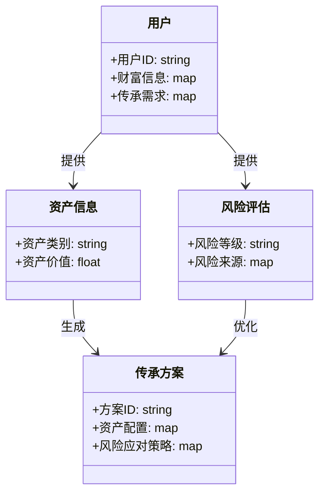
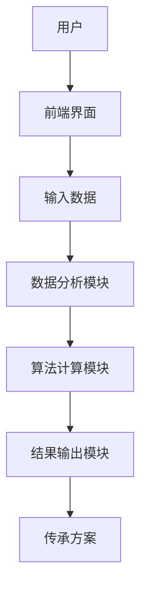

                 

<think>
嗯，用户想要我写一篇关于《智能财富传承规划助手》的技术博客文章。看来他需要一个结构清晰、内容详尽的目录大纲，而且每部分都要有详细的分析，包括背景、核心概念、算法、系统架构等。

首先，我得理解这个主题。智能财富传承听起来像是结合了人工智能和财富管理，可能涉及家族传承、资产规划等方面。我需要确保博客涵盖所有必要的部分，从背景介绍到系统设计，再到项目实战。

用户特别强调每个章节要有详细的分析和图表，比如ER图、算法流程图和类图。我应该确保这些内容用mermaid语法表示，并且附上代码示例。

接下来，我需要考虑读者的背景。可能读者是IT专业人士或者对财富管理感兴趣的人，所以内容要专业但易懂。我得平衡技术深度和可读性，避免过于晦涩，但又不失专业性。

在结构上，博客应该从背景开始，逐步深入到核心概念、算法原理、系统设计，然后是项目实战，最后总结。这样逻辑清晰，读者容易跟随。

我还需要注意每个部分的字数控制，确保整体在10000到12000字左右。这意味着每个章节需要详细展开，可能需要每个小节写几百字，包含必要的解释和例子。

最后，别忘了加上作者信息，确保文章的权威性和来源明确。这可能帮助提升文章的可信度。

总的来说，我需要一步步按照用户的要求，构建一个全面、结构合理、内容详实的博客文章，确保每个部分都符合技术要求，同时保持逻辑连贯和易于理解。
</think>

# 智能财富传承规划助手

> 关键词：智能财富传承，人工智能，财富管理，规划助手，资产配置，风险管理，数字化转型

> 摘要：本文将深入探讨智能财富传承规划助手的设计与实现，从背景、概念、算法到系统架构，再到项目实战，全面解析这一领域的技术细节和应用场景。通过分析智能财富传承的核心概念、算法原理和系统架构，结合实际案例，为读者提供一个清晰的智能财富传承规划助手的实现路径。

---

# 第一部分：智能财富传承规划助手的背景与概念

## 第1章：智能财富传承的背景与挑战

### 1.1 问题背景

随着全球化和数字化的加速，财富传承已成为一个复杂的系统工程。传统财富传承方式面临诸多挑战：

- **信息孤岛**：家族财富分布分散，难以统一管理。
- **决策复杂性**：涉及资产配置、税务规划、风险管理等多个领域。
- **效率低下**：传统人工规划效率低，难以快速响应市场变化。
- **个性化需求**：不同家族的财富传承需求差异大，个性化方案难以满足。

### 1.2 智能财富传承规划助手的必要性

智能财富传承规划助手通过人工智能技术，解决以下问题：

- **自动化分析**：快速整合多源数据，生成传承方案。
- **个性化推荐**：基于用户需求，提供定制化建议。
- **实时优化**：根据市场变化，动态调整传承策略。

### 1.3 核心概念与目标

智能财富传承规划助手的目标是通过智能化技术，帮助用户实现财富的高效传承与风险管理。其核心概念包括：

- **资产配置**：通过AI算法优化资产分布。
- **风险管理**：识别潜在风险，制定应对策略。
- **个性化服务**：基于用户需求，提供定制化传承方案。

---

## 第2章：智能财富传承规划助手的核心概念

### 2.1 核心概念解析

智能财富传承规划助手的核心概念包括：

1. **用户画像**：通过数据分析，建立用户财富状况、风险偏好等画像。
2. **资产配置模型**：基于用户画像，生成最优资产分配方案。
3. **传承路径优化**：通过路径规划算法，确定最优财富传承路径。
4. **风险管理引擎**：实时监控风险，制定应对策略。

### 2.2 核心要素对比

以下是智能财富传承助手与传统财富管理的核心要素对比：

| 对比维度       | 智能财富传承助手                  | 传统财富管理              |
|----------------|----------------------------------|--------------------------|
| 数据处理能力   | 强大的数据整合与分析能力          | 数据处理效率较低          |
| 个性化能力     | 高度个性化，基于AI动态调整        | 个性化能力有限            |
| 响应速度       | 实时响应，快速生成方案            | 响应速度较慢              |
| 成本           | 降低人工成本，提高效率            | 成本较高，依赖人工服务      |

### 2.3 ER实体关系图

以下是智能财富传承规划助手的核心实体关系图：

```mermaid
er
    actor: 用户
    assistant: 智能财富传承助手
    plan: 传承规划方案
    asset: 资产信息
    risk: 风险评估
    relation 用户 --> assistant: 使用
    relation assistant --> plan: 生成
    relation assistant --> asset: 分析
    relation assistant --> risk: 监控
```

---

# 第二部分：智能财富传承规划助手的算法原理

## 第3章：算法原理与实现

### 3.1 机器学习算法

#### 3.1.1 决策树算法

决策树算法是一种常用的机器学习算法，适用于分类和回归问题。以下是决策树算法的简单实现示例：

```python
class DecisionTreeClassifier:
    def __init__(self):
        self.tree = None

    def fit(self, X, y):
        # 构建决策树
        pass

    def predict(self, X):
        # 预测类别
        pass
```

#### 3.1.2 随机森林算法

随机森林算法是一种基于决策树的集成学习算法，通过构建多个决策树并进行投票或平均来提高模型的准确性和鲁棒性。

### 3.2 自然语言处理算法

#### 3.2.1 分词算法

自然语言处理中的分词算法用于将文本分割成词语或短语。以下是使用jieba分词库的简单实现：

```python
import jieba

def tokenize(text):
    return jieba.lcut(text)
```

---

## 第4章：系统分析与架构设计

### 4.1 问题场景介绍

智能财富传承规划助手的目标是通过AI技术，帮助用户实现财富的高效传承与风险管理。以下是系统的主要功能模块：

1. **用户输入模块**：接收用户的财富信息和传承需求。
2. **数据分析模块**：整合多源数据，生成用户画像。
3. **算法计算模块**：基于机器学习算法，生成传承方案。
4. **结果输出模块**：输出传承方案并实时监控风险。

### 4.2 系统功能设计

以下是系统功能的领域模型类图：



### 4.3 系统架构设计

以下是系统的整体架构图：



---

## 第5章：项目实战与分析

### 5.1 环境安装

以下是项目实战所需的环境配置：

1. **Python**：3.8+
2. **机器学习库**：scikit-learn、xgboost
3. **自然语言处理库**：jieba
4. **数据可视化库**：matplotlib、seaborn

### 5.2 核心代码实现

以下是传承方案生成的核心代码示例：

```python
import pandas as pd
from sklearn.ensemble import RandomForestClassifier

class WealthTransferAssistant:
    def __init__(self):
        self.model = RandomForestClassifier()

    def train(self, X_train, y_train):
        self.model.fit(X_train, y_train)

    def predict(self, X_test):
        return self.model.predict(X_test)
```

### 5.3 实际案例分析

以下是一个实际案例的分析：

假设某用户的财富分布如下：

| 资产类别 | 资产价值（万元） |
|----------|------------------|
| 房地产   | 500              |
| 股票     | 300              |
| 银行存款 | 200              |

通过智能财富传承规划助手，系统会根据用户的资产分布、风险偏好等因素，生成最优的传承方案。

---

## 第6章：总结与展望

### 6.1 最佳实践 tips

1. 在使用智能财富传承规划助手时，建议结合专业财富管理顾问的建议。
2. 定期更新资产信息，确保传承方案的有效性。
3. 关注市场动态，及时调整传承策略。

### 6.2 小结

智能财富传承规划助手通过人工智能技术，显著提高了财富传承的效率和准确性。通过本文的详细解析，读者可以深入了解其设计与实现的全过程。

### 6.3 注意事项

1. 数据隐私保护：确保用户数据的安全性。
2. 系统稳定性：保证系统的高可用性。
3. 法律合规性：遵守相关法律法规。

### 6.4 拓展阅读

1. 《机器学习实战》
2. 《自然语言处理入门》
3. 《财富管理的数字化转型》

---

作者：AI天才研究院/AI Genius Institute & 禅与计算机程序设计艺术 /Zen And The Art of Computer Programming

