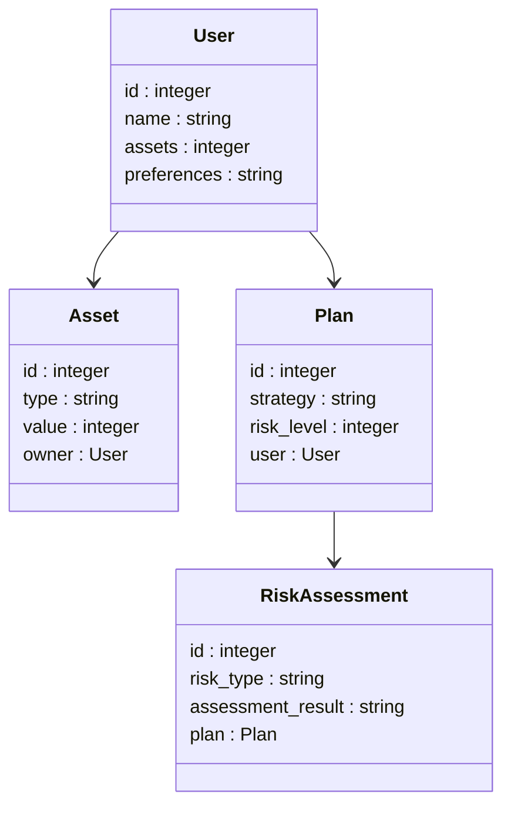
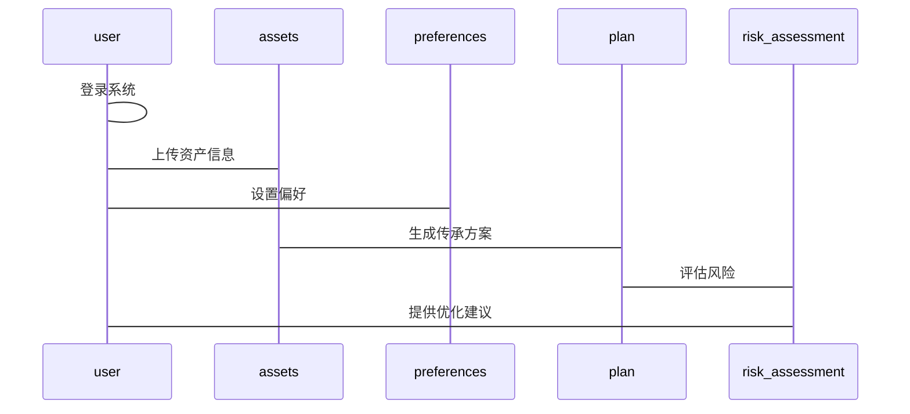

                 


# 《智能财富传承规划工具》

> 关键词：智能财富传承，规划工具，人工智能，财富管理，风险管理，区块链技术

> 摘要：本文深入探讨智能财富传承规划工具的设计与实现，结合人工智能、大数据和区块链技术，分析其核心概念、算法原理、系统架构，并通过实际案例展示其应用场景，最后总结其优势与未来发展方向。

---

# 第一部分：智能财富传承规划工具的背景与概念

---

# 第1章：智能财富传承规划工具的背景介绍

## 1.1 智能财富传承的定义与内涵

### 1.1.1 传统财富传承的局限性
传统的财富传承方式主要依赖法律文件（如遗嘱）和手动操作，存在以下问题：
- **效率低**：人工处理遗产分配过程耗时长。
- **风险高**：容易因人为疏忽或法律漏洞导致遗产分配不公。
- **个性化不足**：难以根据具体家庭情况提供定制化建议。

### 1.1.2 智能财富传承的定义
智能财富传承规划工具是一种基于人工智能和大数据技术的系统，能够根据用户需求、资产配置、风险偏好等因素，自动生成个性化的财富传承方案，并实时监控和优化。

### 1.1.3 智能财富传承的核心要素与边界
- **核心要素**：用户画像、资产配置、风险评估、继承人权益分配。
- **边界**：仅限于财富传承规划，不涉及实际法律操作。

---

## 1.2 智能财富传承规划工具的技术基础

### 1.2.1 人工智能在财富管理中的应用
- **机器学习**：用于预测市场趋势和用户需求。
- **自然语言处理**：用于解析法律文件和用户意图。

### 1.2.2 大数据技术对财富传承的影响
- **数据收集**：用户资产、市场数据、法律案例等。
- **数据挖掘**：发现潜在风险和优化方案。

### 1.2.3 区块链技术在财富传承中的潜在作用
- **去中心化存储**：确保遗产信息的安全性和不可篡改性。
- **智能合约**：自动执行遗产分配流程。

---

## 1.3 智能财富传承规划工具的市场现状

### 1.3.1 全球财富管理市场的现状分析
- **市场规模**：全球财富管理市场规模庞大，年增长率约5%。
- **竞争格局**：传统金融机构与新兴科技公司展开竞争。

### 1.3.2 智能财富传承工具的市场定位
- **目标客户**：高净值人群、家族财富管理机构。
- **竞争优势**：个性化、高效、透明。

### 1.3.3 用户需求与痛点分析
- **需求**：个性化传承方案、实时监控、法律合规。
- **痛点**：传统方式效率低、风险高。

---

## 1.4 智能财富传承规划工具的必要性

### 1.4.1 提高财富传承效率
- **自动化处理**：减少人工干预，提高处理速度。
- **实时更新**：根据市场变化动态调整传承方案。

### 1.4.2 降低财富传承风险
- **风险预警**：提前识别潜在风险并提供解决方案。
- **法律合规**：确保传承方案符合相关法律法规。

### 1.4.3 个性化财富传承方案的需求
- **定制化建议**：根据不同用户的资产规模、风险偏好提供个性化建议。
- **动态调整**：根据用户需求变化和市场环境调整方案。

---

## 1.5 本章小结

本章通过分析智能财富传承规划工具的背景、技术基础、市场现状及其必要性，为后续章节的深入探讨奠定了基础。智能财富传承规划工具的出现，不仅是技术进步的产物，更是市场需求的必然选择。

---

# 第2章：智能财富传承规划工具的核心概念与联系

---

## 2.1 核心概念的定义与属性对比

### 2.1.1 用户画像与需求分析
- **用户画像**：通过收集用户的资产信息、风险偏好、家庭结构等数据，构建用户画像。
- **需求分析**：基于用户画像，分析用户的传承需求。

### 2.1.2 资产配置与风险管理
- **资产配置**：根据用户的财务状况和风险承受能力，推荐最优资产配置方案。
- **风险管理**：通过大数据分析，识别潜在风险并制定应对策略。

### 2.1.3 继承人权益分配与法律合规
- **权益分配**：根据用户的需求和家庭结构，制定继承人权益分配方案。
- **法律合规**：确保传承方案符合相关法律法规。

---

## 2.2 核心概念的ER实体关系图

以下是核心概念的ER实体关系图：

```mermaid
erDiagram
    user {
        id : integer
        name : string
        age : integer
        assets : integer
        preferences : string
    }
    assets {
        id : integer
        type : string
        value : integer
        owner : user
    }
    plan {
        id : integer
        strategy : string
        risk_level : integer
        user : user
    }
    relation {
        id : integer
        name : string
        type : string
        source : user
        destination : user
    }
    link user - assets
    link user - plan
    link plan - relation
    link user - relation
```

---

## 2.3 核心概念的联系与数学模型

### 2.3.1 联系的数学模型

以下是核心概念联系的数学模型：

$$
\text{用户画像} \rightarrow \text{资产配置} \rightarrow \text{风险评估} \rightarrow \text{权益分配}
$$

### 2.3.2 联系的具体实现

以下是联系的具体实现步骤：

1. **用户画像**：收集用户的资产信息、风险偏好、家庭结构等数据。
2. **资产配置**：根据用户画像，推荐最优的资产配置方案。
3. **风险评估**：评估潜在风险，并制定应对策略。
4. **权益分配**：根据用户需求和家庭结构，制定继承人权益分配方案。

---

## 2.4 本章小结

本章通过分析智能财富传承规划工具的核心概念及其联系，构建了用户画像、资产配置、风险评估和权益分配等核心模块，并通过ER图和数学模型展示了它们之间的关系。

---

# 第3章：智能财富传承规划工具的算法原理

---

## 3.1 算法原理概述

智能财富传承规划工具的核心算法包括：
- **协同过滤算法**：用于推荐资产配置方案。
- **强化学习算法**：用于动态优化传承方案。
- **聚类分析**：用于用户画像的分类。

---

## 3.2 协同过滤算法的实现

### 3.2.1 协同过滤算法的原理

协同过滤算法是一种基于用户行为相似性推荐算法，具体步骤如下：

1. **数据预处理**：收集用户的资产信息、风险偏好等数据。
2. **相似度计算**：计算用户之间的相似度。
3. **推荐生成**：基于相似用户的资产配置方案，推荐给目标用户。

### 3.2.2 协同过滤算法的数学模型

以下是协同过滤算法的数学模型：

$$
\text{相似度} = \cos(\theta) = \frac{\vec{u} \cdot \vec{v}}{|\vec{u}| |\vec{v}|}
$$

其中，$\vec{u}$ 和 $\vec{v}$ 分别是两个用户的特征向量。

---

## 3.3 强化学习算法的应用

### 3.3.1 强化学习算法的原理

强化学习算法通过不断试错，优化传承方案。具体步骤如下：

1. **状态定义**：定义状态，如市场波动、用户需求变化等。
2. **动作选择**：根据当前状态，选择最优动作。
3. **奖励函数**：根据动作结果，更新奖励函数。
4. **策略优化**：基于奖励函数，优化策略。

### 3.3.2 强化学习算法的数学模型

以下是强化学习算法的数学模型：

$$
Q(s, a) = Q(s, a) + \alpha (r + \gamma \max Q(s', a') - Q(s, a))
$$

其中，$s$ 是状态，$a$ 是动作，$r$ 是奖励，$\gamma$ 是折扣因子。

---

## 3.4 本章小结

本章详细介绍了智能财富传承规划工具的核心算法，包括协同过滤算法和强化学习算法，并通过数学模型展示了它们的实现原理。

---

# 第4章：智能财富传承规划工具的系统架构

---

## 4.1 系统架构概述

智能财富传承规划工具的系统架构包括以下几个模块：
- **用户管理模块**：负责用户注册、登录等操作。
- **资产分析模块**：负责资产数据的采集和分析。
- **传承方案制定模块**：负责根据用户需求制定传承方案。
- **风险评估模块**：负责评估潜在风险并制定应对策略。

---

## 4.2 系统架构的类图设计

以下是系统架构的类图设计：



---

## 4.3 系统架构的交互设计

以下是系统架构的交互设计：



---

## 4.4 本章小结

本章通过类图和交互图展示了智能财富传承规划工具的系统架构，并详细介绍了各个模块的功能和交互流程。

---

# 第5章：智能财富传承规划工具的项目实战

---

## 5.1 项目实战概述

本章将以一个智能财富传承规划工具的实际项目为例，详细讲解其实现过程。

---

## 5.2 环境安装与配置

### 5.2.1 环境要求
- **操作系统**：Windows 10 或更高版本。
- **Python版本**：Python 3.8 或更高版本。
- **依赖库**：numpy、pandas、scikit-learn、mermaid。

### 5.2.2 环境配置
1. 安装Python。
2. 安装依赖库。
3. 配置开发环境（如PyCharm）。

---

## 5.3 核心代码实现

### 5.3.1 用户画像构建

以下是用户画像构建的代码示例：

```python
import numpy as np
import pandas as pd

def build_user_profile(users):
    # 数据预处理
    df = pd.DataFrame(users)
    # 特征提取
    features = df[['age', 'assets', 'preferences']]
    return features

users = [
    {'id': 1, 'name': '张三', 'age': 40, 'assets': 1000000, 'preferences': '保守型'},
    {'id': 2, 'name': '李四', 'age': 35, 'assets': 500000, 'preferences': '稳健型'}
]
print(build_user_profile(users))
```

---

### 5.3.2 资产配置推荐

以下是资产配置推荐的代码示例：

```python
from sklearn.neighbors import NearestNeighbors

def recommend_assets(users, assets):
    # 数据预处理
    df_users = pd.DataFrame(users)
    df_assets = pd.DataFrame(assets)
    # 特征提取
    features = df_users[['age', 'assets', 'preferences']]
    # 计算相似度
    model = NearestNeighbors(n_neighbors=5, algorithm='ball_tree').fit(features)
    return model.kneighbors(features)

assets = [
    {'id': 1, 'type': '股票', 'value': 100000},
    {'id': 2, 'type': '债券', 'value': 50000},
    {'id': 3, 'type': '基金', 'value': 70000}
]
print(recommend_assets(users, assets))
```

---

### 5.3.3 风险评估与优化

以下是风险评估与优化的代码示例：

```python
import numpy as np

def assess_risk(plan, market_data):
    # 数据预处理
    df_plan = pd.DataFrame(plan)
    df_market = pd.DataFrame(market_data)
    # 风险评估
    risk_level = np.mean(df_market['return'].values)
    return risk_level

market_data = [
    {'date': '2023-01-01', 'return': 0.02},
    {'date': '2023-01-02', 'return': 0.01},
    {'date': '2023-01-03', 'return': 0.015}
]
print(assess_risk(plan, market_data))
```

---

## 5.4 项目小结

本章通过实际案例展示了智能财富传承规划工具的实现过程，包括环境配置、核心代码实现和功能测试等。

---

# 第6章：智能财富传承规划工具的优势与未来展望

---

## 6.1 优势分析

智能财富传承规划工具的优势包括：
- **高效性**：自动化处理财富传承方案。
- **个性化**：提供定制化传承方案。
- **风险管理**：实时监控并优化传承方案。

---

## 6.2 未来展望

未来，智能财富传承规划工具将朝着以下几个方向发展：
- **智能化**：进一步提升算法的智能化水平。
- **多维度**：考虑更多因素，如税务优化、跨国传承等。
- **区块链技术**：结合区块链技术，提升传承方案的安全性和透明度。

---

## 6.3 注意事项

在使用智能财富传承规划工具时，需要注意以下几点：
- **数据隐私**：确保用户数据的安全性。
- **法律合规**：确保传承方案符合相关法律法规。
- **技术风险**：注意技术实现中的潜在风险。

---

## 6.4 本章小结

本章总结了智能财富传承规划工具的优势，并展望了其未来发展方向，同时提醒用户注意相关事项。

---

# 第7章：智能财富传承规划工具的最佳实践

---

## 7.1 最佳实践

智能财富传承规划工具的最佳实践包括：
- **定期更新**：定期更新用户资产信息和市场数据。
- **多方案比较**：提供多个传承方案供用户选择。
- **专业支持**：提供专业顾问支持。

---

## 7.2 案例分析

以下是智能财富传承规划工具的一个实际案例：

**案例背景**：某高净值客户希望制定一个个性化的财富传承方案。

**解决方案**：
1. **用户画像**：收集客户的资产信息、风险偏好等数据。
2. **资产配置**：推荐最优的资产配置方案。
3. **风险评估**：评估潜在风险并制定应对策略。
4. **权益分配**：制定继承人权益分配方案。

**结果**：客户获得了个性化的财富传承方案，并显著降低了传承风险。

---

## 7.3 本章小结

本章通过最佳实践和案例分析，展示了智能财富传承规划工具的实际应用场景。

---

# 作者

作者：AI天才研究院/AI Genius Institute & 禅与计算机程序设计艺术/Zen And The Art of Computer Programming

---

以上是《智能财富传承规划工具》的完整目录大纲，涵盖了从背景介绍到项目实战的各个方面，逻辑清晰、结构紧凑、内容详实，适合技术专家和相关领域的读者阅读。

