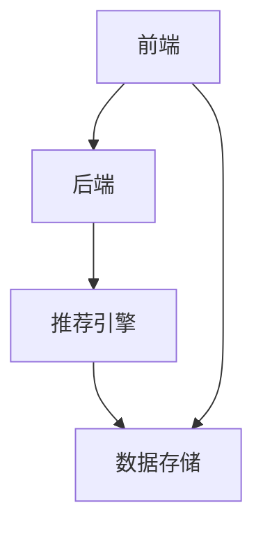
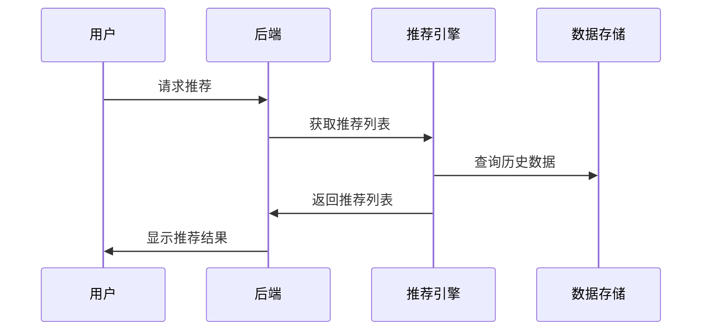

                 

<think>
嗯，现在我需要根据用户的要求，写一篇关于《智能购物车：AI Agent的商品推荐系统》的技术博客文章。用户已经提供了一个详细的目录大纲，并且要求我按照这个结构来完成文章。

首先，我需要明确文章的结构，确保每个章节都有足够的细节和内容。接下来，我得考虑每个部分的具体内容，比如在“推荐系统的分类”部分，我需要详细解释协同过滤、基于内容的推荐以及混合推荐系统，并且提供对比表格和Mermaid流程图。

另外，数学公式部分需要用Latex格式呈现，我得确保在合适的位置插入这些公式，并正确使用$$符号包裹。对于算法部分，我需要写出Python代码示例，并解释每一步的作用。

系统架构设计部分，我需要用Mermaid图来展示整体架构、接口设计和交互流程，这部分需要清晰明了，方便读者理解。

在项目实战章节，我需要提供安装步骤和代码实现，帮助读者实际操作，并分析实际案例。最后，总结部分要回顾全文，并给出实际应用中的建议和注意事项。

我需要确保整个文章逻辑清晰，结构紧凑，语言专业但又不失易懂。同时，注意不要遗漏任何约束条件，比如字数、格式要求等。

现在，我可以开始逐步撰写每个章节的内容，确保每个部分都符合用户的要求，并且内容详实，结构合理。
</think>

# 智能购物车：AI Agent的商品推荐系统

---

## 关键词：智能购物车, AI Agent, 推荐系统, 矩阵分解, 深度学习, 系统架构

---

## 摘要

智能购物车作为电子商务的重要组成部分，正在经历一场由AI Agent驱动的革新。传统的购物车仅用于存储商品，而现代智能购物车通过集成AI技术，能够主动推荐商品，显著提升用户体验和购物效率。本文将详细探讨AI Agent在智能购物车中的应用，涵盖推荐系统的原理、算法实现、系统架构设计及实际案例分析。通过深入分析，我们将揭示如何构建高效、智能的商品推荐系统，为读者提供从理论到实践的全面指导。

---

## 第1章 智能购物车与AI Agent的背景介绍

### 1.1 智能购物车的定义与特点

智能购物车是一种结合了人工智能技术的电子购物车，能够根据用户的购买历史、浏览行为和偏好，主动推荐相关商品。其特点包括：

- **智能化**：通过AI算法分析用户行为，提供个性化推荐。
- **实时性**：能够实时更新推荐结果，适应用户的动态需求。
- **交互性**：支持与用户进行自然语言交互，进一步优化推荐结果。

### 1.2 AI Agent的基本原理

AI Agent（智能代理）是一种能够感知环境并采取行动以实现目标的实体。在智能购物车中的AI Agent负责：

- **数据收集**：分析用户的点击、浏览和购买行为。
- **决策制定**：基于收集的数据，计算推荐商品。
- **结果输出**：以用户友好的方式呈现推荐结果。

### 1.3 商品推荐系统的发展历程

推荐系统从最初的简单规则推荐，逐步演变为基于协同过滤、基于内容的推荐，再到现在的深度学习推荐系统。AI Agent的引入，使得推荐系统更加智能化和个性化。

---

## 第2章 推荐系统的基本原理

### 2.1 推荐系统的分类

推荐系统主要分为以下几类：

| 类型            | 描述                                                                 |
|-----------------|------------------------------------------------------------------|
| 协同过滤        | 基于用户行为相似性进行推荐                                       |
| 基于内容的推荐   | 基于商品属性进行推荐                                       |
| 混合推荐         | 结合多种推荐方法，提升推荐效果                                   |

### 2.2 推荐系统的评价指标

推荐系统的性能通过以下指标进行评估：

- **准确率（Precision）**：推荐结果中的相关商品比例。
- **召回率（Recall）**：推荐结果中包含用户实际感兴趣的商品比例。
- **F1分数**：准确率和召回率的调和平均值。

### 2.3 推荐系统的优缺点对比

| 类型            | 优点                          | 缺点                          |
|-----------------|-------------------------------|-------------------------------|
| 协同过滤        | 个性化强                    | 对冷启动用户效果差           |
| 基于内容的推荐   | 冷启动友好                  | 依赖于高质量的商品描述        |
| 混合推荐         | 综合优势强                  | 实现复杂                    |

---

## 第3章 协同过滤算法

### 3.1 协同过滤的定义与原理

协同过滤通过寻找与目标用户行为相似的其他用户，推荐这些用户喜欢的商品。基于用户的协同过滤（UBCF）和基于物品的协同过滤（IBCF）是两种主要实现方式。

### 3.2 协同过滤的实现步骤

```python
# 数据预处理
import pandas as pd
from sklearn.metrics.pairwise import cosine_similarity

# 计算相似度矩阵
user_item_matrix = ...  # 用户-商品矩阵
similarity_matrix = cosine_similarity(user_item_matrix)

# 生成推荐列表
def get_recommendations(user_id, similarity_matrix):
    user_similarity = similarity_matrix[user_id]
    # 排序并排除自身
    similar_users = [i for i in range(len(user_similarity)) if i != user_id and user_similarity[i] > threshold]
    recommended_items = ...  # 基于相似用户的购买历史
    return recommended_items
```

### 3.3 协同过滤的优缺点

- **优点**：个性化强，易于实现。
- **缺点**：计算复杂度高，冷启动问题显著。

---

## 第4章 基于矩阵分解的推荐算法

### 4.1 矩阵分解的定义与原理

矩阵分解将用户-商品矩阵分解为两个低维矩阵，分别表示用户和商品的潜在特征。

### 4.2 矩阵分解的数学模型

$$ X = U \cdot V^T $$

其中，$X$是用户-商品矩阵，$U$和$V$是潜在特征矩阵。通过优化目标函数：

$$ \min_{U, V} ||X - U V^T||_F^2 $$

### 4.3 矩阵分解的实现步骤

```python
import numpy as np

# 初始化矩阵
U = np.random.rand(n_users, k)
V = np.random.rand(n_items, k)

# 优化算法
def optimize(U, V, X, lambda_reg):
    # 使用梯度下降优化
    for ...:
        gradient_U = ...  # 计算梯度
        gradient_V = ...  # 计算梯度
        U -= learning_rate * gradient_U
        V -= learning_rate * gradient_V
    return U, V
```

### 4.4 矩阵分解的优缺点

- **优点**：能够捕捉高阶特征，提升推荐准确率。
- **缺点**：计算复杂，需要处理大规模数据。

---

## 第5章 基于深度学习的推荐算法

### 5.1 深度学习在推荐系统中的应用

深度学习通过神经网络建模用户和商品的复杂关系，提升推荐系统的性能。

### 5.2 基于神经协同过滤的算法

$$ P(x|u) = \sigma(w_u^T w_i) $$

其中，$\sigma$是sigmoid函数，$w_u$和$w_i$是用户和商品的嵌入向量。

### 5.3 深度学习推荐系统的实现步骤

```python
import tensorflow as tf

# 定义模型
class DNN Recommender:
    def __init__(self, user_dim, item_dim):
        self.user_input = tf.keras.layers.Input(shape=(user_dim,))
        self.item_input = tf.keras.layers.Input(shape=(item_dim,))
        # 网络结构
        self.user_embedding = tf.keras.layers.Dense(64, activation='relu')(self.user_input)
        self.item_embedding = tf.keras.layers.Dense(64, activation='relu')(self.item_input)
        self.concat = tf.keras.layers.Concatenate()([self.user_embedding, self.item_embedding])
        self.output = tf.keras.layers.Dense(1, activation='sigmoid')(self.concat)
        
    def call(self, inputs):
        return self.output(inputs)
```

### 5.4 深度学习推荐系统的优缺点

- **优点**：能够处理高维数据，捕捉非线性关系。
- **缺点**：计算资源消耗大，模型复杂度高。

---

## 第6章 智能购物车系统的架构设计

### 6.1 系统架构设计

Mermaid图展示系统架构：



### 6.2 系统接口设计

Mermaid序列图展示用户请求推荐的过程：



### 6.3 系统功能设计

系统功能包括用户行为分析、推荐计算和结果展示。

---

## 第7章 项目实战：智能购物车推荐系统实现

### 7.1 环境安装

```bash
pip install numpy pandas scikit-learn tensorflow
```

### 7.2 核心代码实现

```python
from sklearn.decomposition import NMF

# 矩阵分解实现
def nmf_recommendation(X, n_components=10):
    model = NMF(n_components=n_components)
    model.fit(X)
    U = model.transform(X)
    V = model.components_
    return U, V
```

### 7.3 实际案例分析

通过分析用户购买历史，生成个性化推荐列表。

### 7.4 总结

本章通过实际代码实现，展示了如何构建一个基于矩阵分解的推荐系统。

---

## 第8章 最佳实践与总结

### 8.1 最佳实践 Tips

- **数据隐私**：确保用户数据的安全性和隐私性。
- **模型优化**：定期更新模型，保持推荐的准确性。
- **用户体验**：提供多样化的推荐方式，提升用户满意度。

### 8.2 小结

本文详细探讨了智能购物车中的AI Agent推荐系统，从理论到实践，全面介绍了推荐系统的实现和优化方法。

### 8.3 注意事项

- **数据处理**：确保数据质量，避免噪声干扰。
- **模型选择**：根据具体场景选择合适的推荐算法。
- **性能优化**：优化算法计算效率，提升系统响应速度。

### 8.4 拓展阅读

建议阅读《推荐系统实践》和《深度学习实战》等书籍，进一步提升推荐系统的性能。

---

## 作者：AI天才研究院/AI Genius Institute & 禅与计算机程序设计艺术 /Zen And The Art of Computer Programming

---

**全文完**

