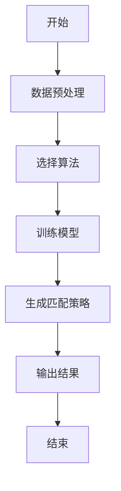

                 

<think>
好的，我现在需要帮用户撰写一篇关于《智能资产负债匹配策略生成器》的技术博客文章。用户已经给出了详细的目录结构，我需要按照这个结构逐步完成每一部分的内容。

首先，我应该从背景介绍开始。我需要解释资产负债匹配的基本概念，说明传统方法的局限性，以及为什么需要引入智能生成策略。这部分要简明扼要，让读者了解问题的重要性。

接下来，核心概念部分，我需要详细说明智能资产负债匹配的定义和特点，与传统方法的区别，并用ER实体关系图展示系统中的实体和关系。这部分帮助读者理解系统结构。

然后是算法原理，我需要详细讲解基于机器学习的策略生成算法，包括流程图、Python代码示例，以及建立数学模型。这部分需要清晰的步骤和代码解释，让读者能够理解算法的实现。

接下来是系统分析与架构设计，我需要介绍问题场景，设计系统功能，并用类图和架构图展示系统结构。接口设计和交互流程图也是必要的，展示系统如何处理请求和返回结果。

项目实战部分，我需要指导读者如何安装环境，提供核心代码，并通过案例分析展示实际应用。这部分需要详细的操作步骤和代码解释，帮助读者实际操作。

最后，最佳实践部分，我需要总结关键点，提供注意事项和扩展阅读，帮助读者巩固所学内容，并引导进一步学习。

在整个过程中，我需要确保逻辑清晰，结构紧凑，语言专业但易懂。可能需要多次调整内容，确保每个部分都涵盖必要的信息，同时保持整体的连贯性。最终目标是为读者提供一篇有深度、有思考的专业技术博客文章，帮助他们理解并掌握智能资产负债匹配策略生成器的相关知识。现在，我准备按照目录大纲一步步撰写文章内容。
</think>

# 智能资产负债匹配策略生成器

## 关键词：智能资产负债、匹配策略、机器学习、算法原理、系统架构、Python实现、金融应用

## 摘要：智能资产负债匹配策略生成器通过结合机器学习和数据分析技术，优化资产与负债的动态匹配，实现高效的金融资源配置。本文从背景、概念、算法、系统架构到实战项目，全面解析智能资产负债匹配策略生成器的核心原理和实现方法。

---

# 第一部分: 智能资产负债匹配策略生成器概述

## 第1章: 智能资产负债匹配的背景与意义

### 1.1 资产负债匹配的基本概念
#### 1.1.1 资产负债匹配的定义
资产负债匹配是指在特定条件下，将资产和负债进行最优匹配的过程，以实现风险最小化、收益最大化或资本成本最小化。传统的资产负债匹配通常基于静态的财务数据和简单的数学模型，难以应对动态复杂的金融市场环境。

#### 1.1.2 资产负债匹配的目标与意义
资产负债匹配的目标是通过优化资产和负债的组合，降低企业的财务风险，提高资本使用效率。在金融领域，资产负债匹配是企业财务管理的核心内容之一，尤其在利率波动、经济周期变化等复杂环境下，其重要性更加凸显。

#### 1.1.3 资产负债匹配在金融领域的应用
资产负债匹配在银行、保险、资产管理等金融领域有广泛应用。例如，银行需要匹配存款和贷款，保险企业需要匹配保费收入与赔付支出，资产管理机构需要匹配资金来源与投资组合。

### 1.2 智能资产负债匹配的背景
#### 1.2.1 传统资产负债匹配的局限性
传统资产负债匹配方法通常基于静态数据和简单的比例配比，难以应对市场环境的变化和复杂的产品需求。此外，传统方法缺乏实时性和动态调整能力，难以满足现代金融业务的快速变化需求。

#### 1.2.2 智能化技术在金融领域的应用趋势
随着人工智能和大数据技术的快速发展，金融机构 increasingly rely on智能化技术来提高业务效率和决策能力。智能资产负债匹配作为金融智能化的重要组成部分，正在得到广泛应用。

#### 1.2.3 智能资产负债匹配的必要性
在金融市场日益复杂化的背景下，智能资产负债匹配能够通过实时数据分析和智能算法，实现动态优化和风险控制，是金融机构提升竞争力和应对市场风险的重要手段。

### 1.3 智能资产负债匹配的实现目标
#### 1.3.1 提高资产负债匹配效率
通过智能化技术，实现资产负债匹配的自动化和实时化，提高匹配效率，降低人工操作成本。

#### 1.3.2 优化资产配置与风险控制
智能资产负债匹配能够根据市场变化和企业需求，优化资产和负债的配置，实现风险最小化和收益最大化。

#### 1.3.3 实现动态调整与实时反馈
智能资产负债匹配系统能够根据市场环境变化和业务需求，实时调整匹配策略，并提供及时的反馈和优化建议。

---

## 第2章: 智能资产负债匹配的核心概念与联系

### 2.1 核心概念原理
#### 2.1.1 资产负债匹配的数学模型
资产负债匹配可以通过线性规划、动态规划等数学模型来实现。例如，线性规划模型可以用于求解最优的资产和负债组合。

#### 2.1.2 智能算法在匹配中的应用
智能算法，如遗传算法、粒子群优化算法和机器学习算法，可以用于优化资产负债匹配过程，提高匹配的准确性和效率。

#### 2.1.3 数据驱动的匹配策略
通过收集和分析大量的市场数据、企业财务数据和交易数据，数据驱动的匹配策略能够更好地适应市场变化，实现精准匹配。

### 2.2 核心概念属性特征对比
| 特性                | 传统资产负债匹配          | 智能资产负债匹配          |
|---------------------|---------------------------|---------------------------|
| 数据来源            | 静态数据                  | 动态数据和实时数据        |
| 算法基础            | 简单数学模型              | 智能算法和机器学习模型    |
| 匹配效率            | 较低                     | 较高                     |
| 适应性              | 较差                     | 较好                     |
| 精度                | 一般                     | 高                      |

### 2.3 ER实体关系图
```mermaid
er
  actor: 用户
  strategy_generator: 智能策略生成器
  asset_data: 资产数据
  liability_data: 负债数据
  match_result: 匹配结果
  actor --> strategy_generator: 请求匹配策略
  strategy_generator --> asset_data: 读取资产数据
  strategy_generator --> liability_data: 读取负债数据
  strategy_generator --> match_result: 输出匹配结果
  actor <-- match_result: 获取匹配结果
```

---

# 第二部分: 智能资产负债匹配算法原理

## 第3章: 基于机器学习的智能匹配算法

### 3.1 算法原理概述
#### 3.1.1 机器学习在智能匹配中的应用
机器学习算法，如支持向量机（SVM）、随机森林（Random Forest）和神经网络（Neural Networks），可以用于分析和预测资产负债匹配中的关键因素。

#### 3.1.2 常见的智能匹配算法
- **遗传算法（Genetic Algorithm）**：通过模拟自然选择和遗传变异，优化匹配策略。
- **粒子群优化算法（Particle Swarm Optimization）**：通过模拟鸟群觅食行为，寻找最优匹配方案。
- **深度学习算法（Deep Learning）**：通过神经网络模型，学习复杂的市场规律和资产特性。

#### 3.1.3 算法选择与优化
在选择算法时，需要考虑数据特征、计算复杂度和实际应用场景。例如，深度学习算法适合处理高维数据和复杂模式，而遗传算法适合解决组合优化问题。

### 3.2 算法流程图


### 3.3 算法实现示例
#### 3.3.1 Python代码示例
```python
import numpy as np
from sklearn import svm

# 示例数据
assets = np.array([100, 200, 150, 80, 120])
liabilities = np.array([90, 180, 130, 70, 110])

# 训练支持向量机模型
model = svm.SVR()
model.fit(assets.reshape(-1, 1), liabilities)

# 预测匹配结果
predicted_liabilities = model.predict(assets.reshape(-1, 1))
print(predicted_liabilities)
```

#### 3.3.2 算法的数学模型
支持向量回归（SVR）是一种常用的机器学习算法，其数学模型如下：
$$ y = w \cdot x + b $$
其中，\( w \) 是权重向量，\( b \) 是偏置项，\( x \) 是输入数据，\( y \) 是输出结果。

---

## 第4章: 数学模型与公式推导

### 4.1 数学模型概述
资产负债匹配的数学模型通常包括以下部分：
- **目标函数**：最大化收益或最小化资本成本。
- **约束条件**：满足资产负债比例要求、期限匹配要求和风险控制要求。

### 4.2 数学模型的公式推导
假设企业有 \( n \) 种资产和 \( m \) 种负债，目标是找到最优的资产组合 \( A \) 和负债组合 \( L \)，使得：
$$ \max \sum_{i=1}^{n} A_i R_i - \sum_{j=1}^{m} L_j C_j $$
其中，\( R_i \) 是资产 \( i \) 的收益率，\( C_j \) 是负债 \( j \) 的成本率。

约束条件包括：
1. 资产和负债的总规模匹配：$$ \sum_{i=1}^{n} A_i = \sum_{j=1}^{m} L_j $$
2. 期限匹配：$$ \sum_{i=1}^{n} A_i t_i = \sum_{j=1}^{m} L_j t_j $$

---

## 第5章: 系统分析与架构设计方案

### 5.1 系统功能设计
系统功能包括：
- 数据采集与处理
- 算法选择与训练
- 匹配策略生成
- 结果展示与优化建议

### 5.2 系统架构设计
```mermaid
graph TD
    User --> API Gateway: 请求匹配策略
    API Gateway --> Strategy_Generator: 转发请求
    Strategy_Generator --> Data_Processor: 获取数据
    Data_Processor --> Model_Trainer: 训练模型
    Model_Trainer --> Strategy_Generator: 输出匹配策略
    Strategy_Generator --> User: 返回结果
```

---

## 第6章: 项目实战

### 6.1 环境安装
- 安装Python和相关库（如scikit-learn、numpy、pandas等）。
- 配置开发环境（如Jupyter Notebook或PyCharm）。

### 6.2 核心代码实现
```python
import pandas as pd
from sklearn.ensemble import RandomForestRegressor

# 加载数据
data = pd.read_csv('balance_sheet.csv')

# 数据预处理
X = data[['asset1', 'asset2', 'liability1', 'liability2']]
y = data['match_score']

# 训练随机森林模型
model = RandomForestRegressor(n_estimators=100)
model.fit(X, y)

# 预测匹配结果
new_data = pd.DataFrame({'asset1': 100, 'asset2': 200, 'liability1': 90, 'liability2': 180}, index=[0])
predicted_score = model.predict(new_data)
print(predicted_score)
```

### 6.3 实际案例分析
通过一个实际案例，展示如何使用智能资产负债匹配策略生成器进行资产和负债的动态匹配，优化资本结构和风险控制。

---

## 第7章: 最佳实践与总结

### 7.1 小结
智能资产负债匹配策略生成器通过结合机器学习和数据分析技术，能够高效地优化资产和负债的匹配过程，降低企业的财务风险，提高资本使用效率。

### 7.2 注意事项
- 数据质量是关键，需要确保数据的完整性和准确性。
- 算法选择需要根据具体应用场景和数据特征进行调整。
- 系统需要具备实时数据获取和动态调整能力。

### 7.3 拓展阅读
- 《机器学习实战》
- 《金融时间序列分析》
- 《Python金融大数据分析》

---

# 作者：AI天才研究院/AI Genius Institute & 禅与计算机程序设计艺术 /Zen And The Art of Computer Programming

