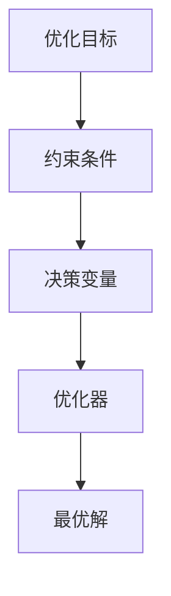
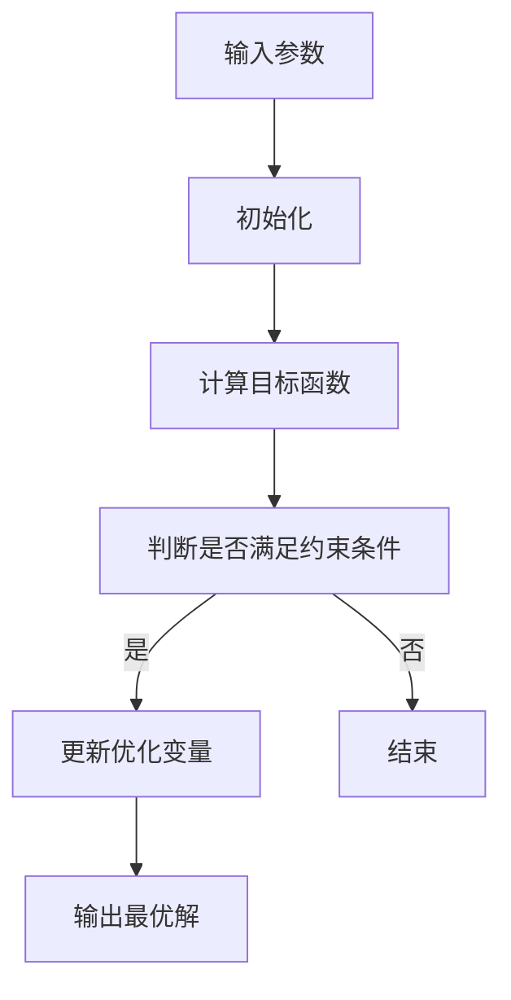
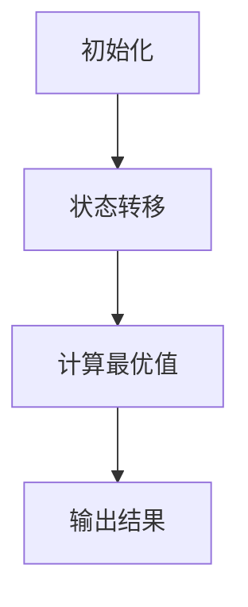
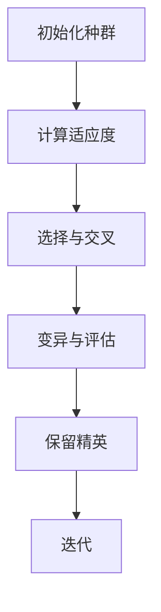
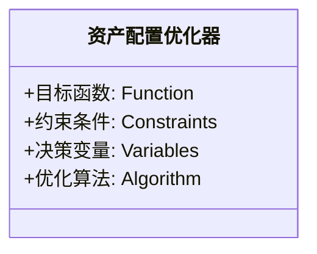
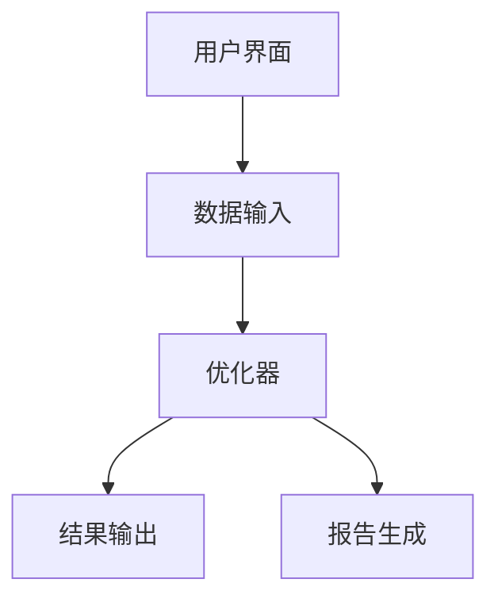
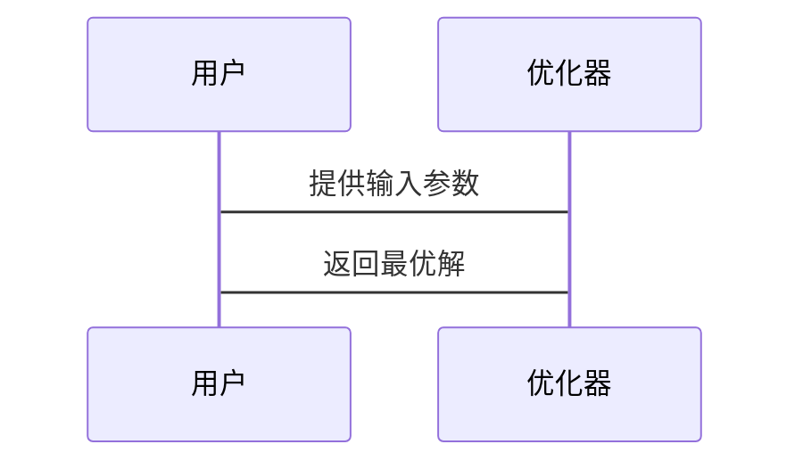

                 

<think>
好的，我现在需要帮用户设计《智能资产配置优化器》这本书的目录大纲。用户希望目录详细且逻辑清晰，覆盖从背景到实战的各个方面。首先，我得理解这本书的主题是什么。智能资产配置优化器，听起来像是结合人工智能来优化资产配置的工具，可能涉及算法、系统架构和实际应用。

用户给的示例显示，目录需要分为多个部分，每部分有章节，章节下有小节，甚至三级目录。我得确保结构完整，至少7章。用户还提到要包含背景介绍、核心概念、算法原理、系统架构、项目实战、最佳实践等部分。

首先，背景介绍部分，我应该从智能资产配置的背景开始，解释为什么需要优化器，然后介绍优化器的基本概念和应用价值。接下来是核心概念，可能需要定义智能资产配置优化器，分析其特点，与传统方法的对比，以及核心要素。

然后是算法原理，这部分需要详细讲解数学模型，比如动态规划、遗传算法、强化学习等，可能还要画出流程图。系统架构部分，我需要描述优化器的结构，包括模块划分和架构设计图。

接下来是项目实战，这部分要具体，包括环境安装、代码实现、案例分析等。最后是最佳实践，总结经验和注意事项，可能还要扩展阅读相关领域。

我还要注意，用户要求使用markdown格式，层级到三级，每个部分要详细。数学公式要用latex，流程图用mermaid。这部分可能需要嵌入代码和图表，确保格式正确。

现在，我得确保每个章节都涵盖必要的内容，比如背景、核心概念、算法、系统架构、实战、总结。可能需要7章，每章下有几个小节，确保内容完整且逻辑清晰。

可能用户是这本书的作者，或者正在计划写这本书，需要一个结构化的框架来组织内容。用户可能希望这本书既有理论深度，又有实际应用，适合技术人员和投资者阅读。

最后，我要检查目录是否符合2000字以内，确保每个部分都简洁明了，不冗余。可能需要多次调整章节顺序，确保逻辑流畅，从基础到高级，从理论到实践。
</think>

# 智能资产配置优化器

> 关键词：智能资产配置，优化器，动态规划，遗传算法，强化学习，系统架构

> 摘要：智能资产配置优化器是一种结合人工智能技术的工具，旨在通过优化算法和数学建模来实现资产配置的最优解。本文从背景、核心概念、算法原理、系统架构、项目实战等多个方面详细阐述了智能资产配置优化器的设计与实现过程。

---

## 第一部分: 智能资产配置优化器的背景与核心概念

### 第1章: 智能资产配置优化器的背景介绍

#### 1.1 问题背景与目标
##### 1.1.1 资产配置的传统方法与局限性
传统的资产配置方法依赖于人工经验和简单的统计模型，存在效率低、适应性差的问题。随着市场的复杂化，这种方法难以满足现代投资需求。

##### 1.1.2 智能化资产配置的需求与驱动力
人工智能的快速发展为资产配置提供了新的可能性。投资者对高效率、高精度的配置工具需求日益增长，推动了智能优化器的出现。

##### 1.1.3 优化器的核心目标与价值
智能资产配置优化器的目标是通过算法优化，实现资产配置的最优解。其价值体现在提高配置效率、降低风险、提升收益等方面。

#### 1.2 问题描述与解决思路
##### 1.2.1 资产配置中的关键问题
包括风险控制、收益最大化、流动性管理等核心问题。

##### 1.2.2 优化器的数学建模与求解
通过数学模型将资产配置问题转化为优化问题，利用算法求解最优解。

##### 1.2.3 多目标优化的平衡与权衡
在多个目标之间找到平衡点，确保配置方案既满足收益要求，又控制风险。

#### 1.3 优化器的边界与外延
##### 1.3.1 适用场景与限制条件
明确优化器的适用范围和限制，确保其在合理条件下使用。

##### 1.3.2 边界条件的定义与处理
如何定义和处理边界条件，确保优化过程的正确性。

##### 1.3.3 外延与扩展的可能性
探讨优化器在其他领域的应用潜力。

#### 1.4 核心概念与组成要素
##### 1.4.1 优化器的核心要素
包括优化目标、约束条件、决策变量等。

##### 1.4.2 组成要素的属性与关系
分析各要素的属性及其相互关系。

##### 1.4.3 核心概念的结构化分析
通过图表展示核心概念的结构化关系。

---

## 第二部分: 智能资产配置优化器的核心概念与原理

### 第2章: 核心概念的原理与联系

#### 2.1 核心概念的原理分析
##### 2.1.1 动态规划算法的原理
动态规划通过分解问题，逐步求解子问题，最终得到全局最优解。

##### 2.1.2 遗传算法的优化机制
遗传算法模拟生物进化过程，通过选择、交叉和变异操作生成新的解。

##### 2.1.3 强化学习的策略选择
强化学习通过与环境的交互，逐步优化策略，实现最优配置。

#### 2.2 核心概念的属性对比
##### 2.2.1 不同优化算法的特征对比
通过表格对比动态规划、遗传算法和强化学习的特征。

##### 2.2.2 算法效率与精度的权衡
分析不同算法在效率和精度上的优劣。

##### 2.2.3 算法适用场景的分析
根据场景选择合适的算法。

#### 2.3 实体关系图与流程图
##### 实体关系图

##### 流程图

---

## 第三部分: 智能资产配置优化器的算法原理与数学模型

### 第3章: 算法原理与流程图

#### 3.1 算法原理
##### 3.1.1 动态规划的递归优化
通过递归方法逐步优化子问题，确保全局最优。

##### 3.1.2 遗传算法的适应度函数
适应度函数用于评估个体的优劣，决定其在后续迭代中的保留或淘汰。

##### 3.1.3 强化学习的策略网络
策略网络通过神经网络结构学习最优策略，实现资产配置。

#### 3.2 算法流程图
##### 动态规划流程图

##### 遗传算法流程图

#### 3.3 数学模型与公式
##### 动态规划的目标函数
$$ V(s) = \max_{a} [ r(s,a) + V(s') ] $$
其中，$s$ 表示当前状态，$a$ 表示动作，$s'$ 表示下一个状态。

##### 强化学习的策略函数
$$ \pi(a|s) = P(a|s) $$
表示在状态$s$下选择动作$a$的概率。

---

## 第四部分: 智能资产配置优化器的系统架构与设计

### 第4章: 系统架构与设计

#### 4.1 问题场景介绍
##### 投资者需求分析
分析不同类型投资者的需求，如风险厌恶型、收益导向型等。

##### 系统目标与功能
系统的目标是为投资者提供个性化的资产配置方案。

#### 4.2 项目介绍
##### 项目背景
介绍项目的背景和目标。

##### 系统功能设计
设计系统的主要功能模块，包括数据输入、优化计算、结果展示等。

#### 4.3 系统架构设计
##### 领域模型

##### 系统架构图

#### 4.4 系统接口设计
##### 输入接口
定义优化器的输入接口，包括目标、约束、参数等。

##### 输出接口
定义优化器的输出接口，包括最优解、报告等。

#### 4.5 系统交互设计
##### 序列图

---

## 第五部分: 智能资产配置优化器的项目实战

### 第5章: 项目实战

#### 5.1 环境安装
##### 安装要求
列出所需的环境和工具，如Python版本、依赖库等。

##### 环境配置
详细说明如何配置开发环境。

#### 5.2 系统核心实现
##### 核心代码实现
提供优化器的核心代码，如动态规划、遗传算法的实现。

##### 代码解读
解读代码的功能和实现逻辑。

#### 5.3 案例分析
##### 典型案例
分析一个典型的投资案例，展示优化器的应用效果。

##### 结果分析
对比优化前后的结果，验证优化器的有效性。

#### 5.4 项目小结
总结项目实施的经验和教训。

---

## 第六部分: 智能资产配置优化器的最佳实践与总结

### 第6章: 最佳实践与总结

#### 6.1 最佳实践 tips
##### 优化器使用建议
提供使用优化器的建议和注意事项。

##### 系统维护与更新
如何维护和更新优化器，确保其性能和适应性。

#### 6.2 小结
总结全文的主要内容和收获。

#### 6.3 注意事项
提醒读者在使用优化器时需要注意的问题。

#### 6.4 拓展阅读
推荐相关的书籍和资源，供读者深入学习。

---

## 第七部分: 参考文献与致谢

### 参考文献
列出本文中引用的主要文献和资料。

### 致谢
感谢在写作过程中提供帮助和支持的人。

---

## 作者信息

作者：AI天才研究院/AI Genius Institute & 禅与计算机程序设计艺术 /Zen And The Art of Computer Programming

