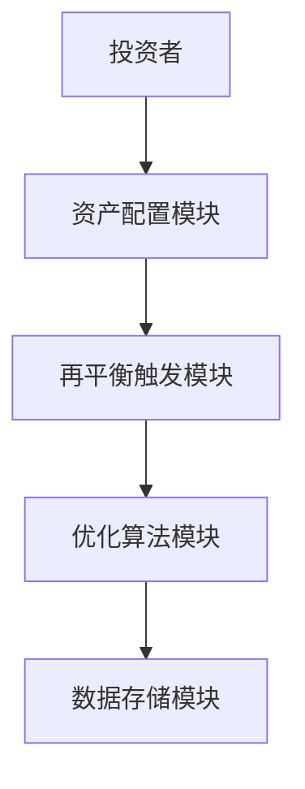
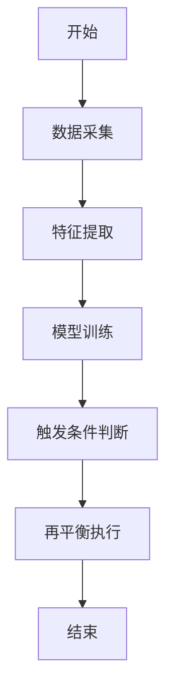
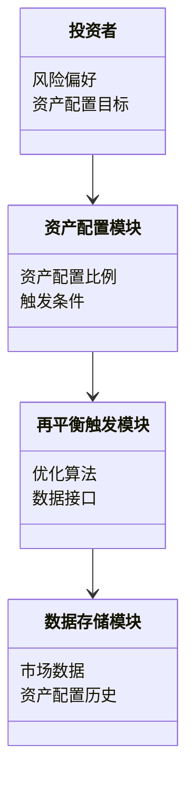
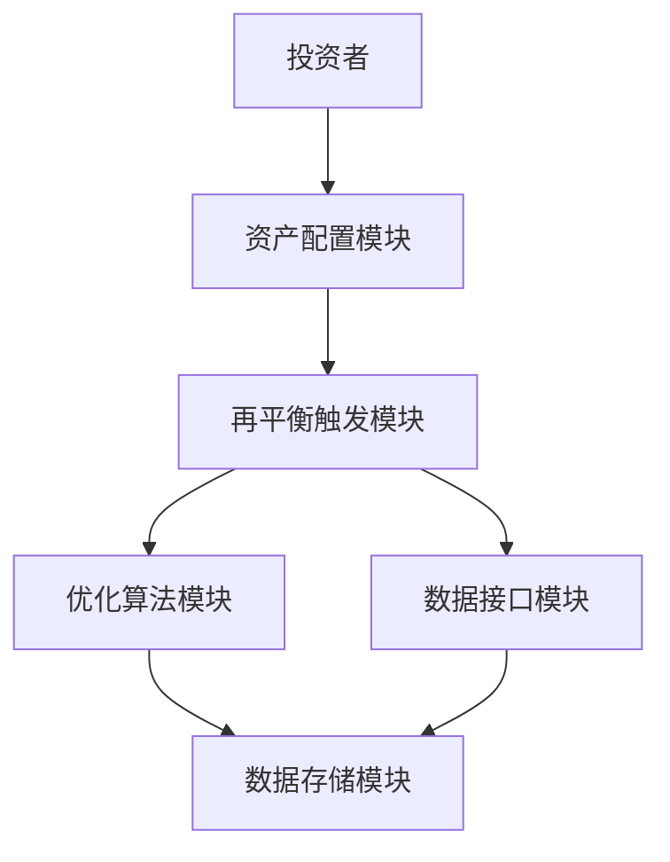
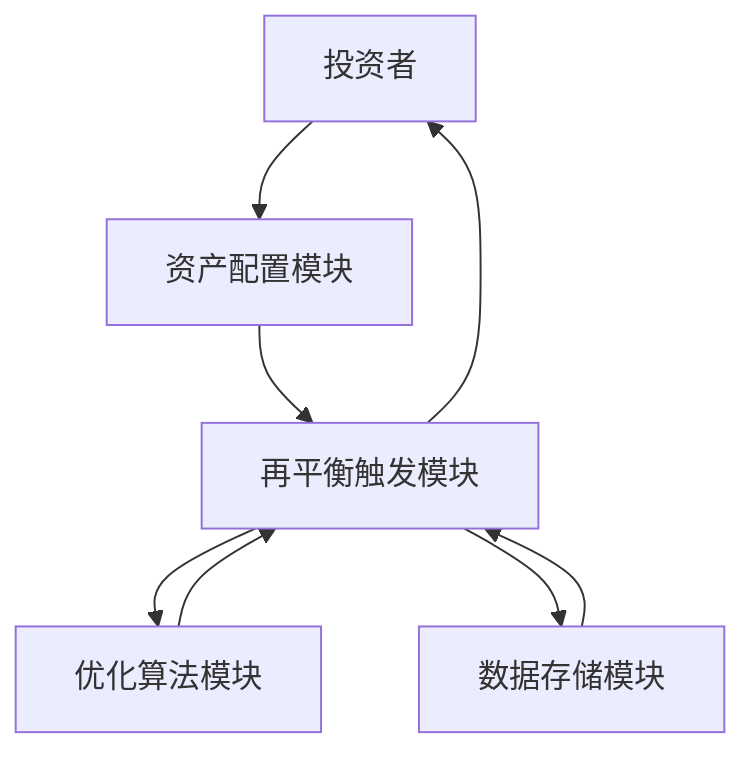

                 


# 智能资产配置再平衡触发系统

## 关键词：智能资产配置、再平衡触发、优化算法、系统架构、金融投资

## 摘要：本文系统地介绍了智能资产配置再平衡触发系统的背景、核心原理、算法实现、系统架构及实际应用。通过详细分析触发条件、再平衡策略和优化算法，结合实际案例，展示了该系统的实现过程和应用场景。最后，本文总结了系统的最佳实践和注意事项，为读者提供了全面的技术指导。

---

# 第一部分: 智能资产配置再平衡触发系统概述

## 第1章: 智能资产配置再平衡触发系统背景介绍

### 1.1 问题背景与描述
随着金融市场的发展，投资者越来越依赖智能系统来优化资产配置。然而，市场波动和投资者需求的变化使得资产配置需要定期调整，即再平衡。传统的手动再平衡方式效率低、成本高，难以应对复杂多变的市场环境。因此，智能资产配置再平衡触发系统应运而生，旨在通过自动化技术实现高效、精准的再平衡操作。

### 1.2 系统目标与应用场景
智能资产配置再平衡触发系统的目标是实时监控市场变化和投资者需求，自动触发再平衡操作，以维持最优资产配置。其主要应用场景包括：
- 机构投资者的资产管理系统
- 个人投资者的智能投顾服务
- 量化交易系统的动态调整

### 1.3 本章小结
本章通过分析市场背景和实际需求，明确了智能资产配置再平衡触发系统的重要性及其应用场景。

---

# 第二部分: 核心概念与联系

## 第2章: 核心概念与原理

### 2.1 智能资产配置再平衡触发系统的核心原理
智能资产配置再平衡触发系统的核心在于通过实时数据采集、分析和优化算法，判断是否需要触发再平衡操作。触发条件通常包括市场波动、资产配置偏离目标、投资者风险偏好变化等因素。

#### 2.1.1 触发条件的定义
触发条件是系统判断是否需要执行再平衡操作的依据，常见的触发条件包括：
- 市场波动率超过阈值
- 资产配置偏离目标比例超过一定幅度
- 投资者的风险偏好发生变化

#### 2.1.2 再平衡策略的分类
根据触发条件和优化目标的不同，再平衡策略可以分为以下几类：
- 定期再平衡：按固定时间间隔进行再平衡操作
- 事件驱动再平衡：根据特定事件触发再平衡操作
- 动态再平衡：根据市场变化实时调整再平衡频率

#### 2.1.3 优化算法的原理
优化算法是系统的核心，常用的算法包括：
- 均值-方差优化：在给定风险水平下最大化收益
- 黑格-拉昂格优化：在给定收益下最小化风险
- 非线性优化：考虑复杂约束条件下的最优解

### 2.2 核心概念对比与表格分析
下表对比了触发条件和再平衡策略的核心属性：

| **属性**       | **触发条件**                     | **再平衡策略**                     |
|-----------------|----------------------------------|----------------------------------|
| **类型**       | 市场波动、配置偏离、风险偏好变化 | 定期、事件驱动、动态               |
| **触发方式**   | 系统自动判断                     | 系统自动或手动触发                 |
| **优化目标**   | 最小化偏离                      | 最大化收益或最小化风险             |

### 2.3 系统架构与实体关系图
以下为系统的核心实体关系图：



---

# 第三部分: 算法原理与数学模型

## 第3章: 算法原理与流程

### 3.1 算法流程概述
智能资产配置再平衡触发系统的算法流程包括以下步骤：
1. 数据采集：实时采集市场数据和投资者需求数据
2. 特征提取：提取市场波动率、资产配置偏离度等特征
3. 模型训练：使用优化算法训练模型
4. 触发条件判断：判断是否需要触发再平衡操作
5. 再平衡执行：执行再平衡操作并更新数据

### 3.2 算法实现流程图
以下为算法实现流程图：



### 3.3 数学模型与公式
#### 3.3.1 优化目标函数
在均值-方差优化中，目标函数为：
$$ \text{目标函数} = \min \sum_{i=1}^{n} w_i \cdot \sigma_i^2 $$
其中，\( w_i \) 是资产 \( i \) 的权重，\( \sigma_i \) 是资产 \( i \) 的波动率。

#### 3.3.2 约束条件
$$ \sum_{i=1}^{n} w_i = 1 $$
$$ w_i \geq 0 \quad \forall i $$

---

# 第四部分: 系统分析与架构设计

## 第4章: 系统分析与架构设计方案

### 4.1 问题场景介绍
智能资产配置再平衡触发系统需要处理以下问题：
- 如何实时采集和处理市场数据
- 如何设计高效的优化算法
- 如何实现系统的可扩展性和高可用性

### 4.2 系统功能设计
#### 4.2.1 领域模型
以下为系统的核心领域模型：



#### 4.2.2 系统架构设计
以下为系统的分层架构设计：



#### 4.2.3 系统交互设计
以下为系统的交互流程图：



---

# 第五部分: 项目实战

## 第5章: 项目实战

### 5.1 环境安装与配置
要运行智能资产配置再平衡触发系统，需要以下环境：
- Python 3.8+
- 数据库：MySQL/MongoDB
- 开发工具：PyCharm/VS Code
- 依赖库：Pandas、NumPy、Scikit-learn

### 5.2 系统核心实现
以下为系统核心模块的实现代码：

```python
import numpy as np
import pandas as pd
from sklearn.metrics import mean_squared_error

def optimize_portfolio(weights, returns):
    # 均值-方差优化
    n = len(weights)
    cov_matrix = np.cov(returns)
    inv_cov = np.linalg.inv(cov_matrix)
    target = np.array([1]*n)
    w_opt = np.dot(inv_cov, target)
    w_opt = w_opt / np.sum(w_opt)
    return w_opt

def trigger_rebalance(weights, target_weights, threshold=0.05):
    # 判断是否需要触发再平衡
    diff = np.abs(weights - target_weights)
    return np.any(diff > threshold)

# 示例数据
data = pd.read_csv('market_data.csv')
weights = data['weights'].values
target_weights = data['target_weights'].values

# 优化权重
optimized_weights = optimize_portfolio(weights, data['returns'].values)

# 判断是否需要触发再平衡
if trigger_rebalance(optimized_weights, target_weights):
    # 执行再平衡操作
    print("触发再平衡操作")
else:
    print("无需触发再平衡操作")
```

### 5.3 实际案例分析
假设我们有一个包含3种资产的投资组合，目标配置比例为[0.4, 0.3, 0.3]。当前市场波动率较高，导致实际配置比例偏离目标。系统会自动触发再平衡操作，调整权重以恢复目标配置。

---

# 第六部分: 最佳实践与总结

## 第6章: 最佳实践与总结

### 6.1 最佳实践 tips
- 定期监控系统运行状态
- 及时更新市场数据和模型
- 根据市场变化调整触发条件

### 6.2 小结
智能资产配置再平衡触发系统通过自动化技术，显著提高了资产配置的效率和准确性。本文详细介绍了系统的背景、核心原理、算法实现和实际应用，为读者提供了全面的技术指导。

### 6.3 注意事项
- 确保数据源的准确性和及时性
- 定期评估和优化触发条件
- 处理好系统的可扩展性和高可用性

### 6.4 拓展阅读
- 《Python机器学习实战》
- 《量化投资：算法与策略》
- 《系统设计与架构》

---

# 作者：AI天才研究院/AI Genius Institute & 禅与计算机程序设计艺术 /Zen And The Art of Computer Programming

