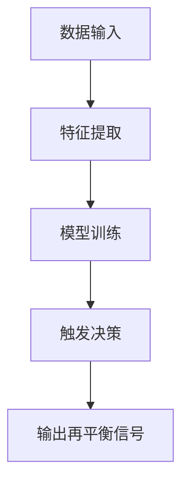
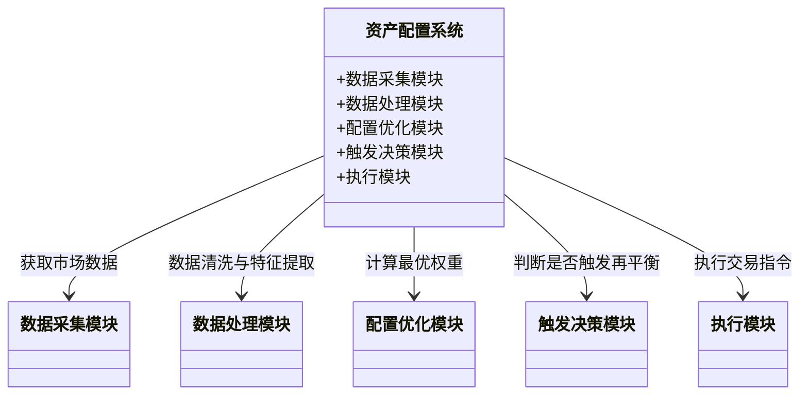
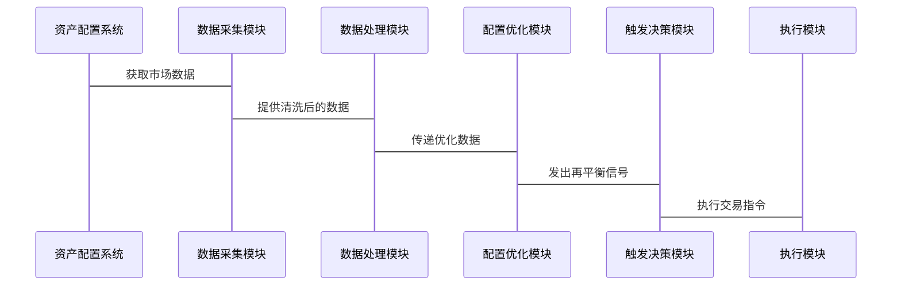

                 

<think>
好的，我现在需要完成用户要求的《智能资产配置再平衡触发系统》的后续章节内容。用户已经提供了目录大纲，现在需要我按照这个大纲逐步撰写每一章的内容。

首先，我需要理解每一章的核心内容，确保覆盖理论和实践，同时保持逻辑清晰。我将从第4章开始，涵盖算法原理，然后是系统架构，项目实战，最佳实践，总结与展望，以及附录。

在第4章，我需要详细讲解算法的原理和实现，包括机器学习、强化学习和深度学习的应用。使用数学公式和代码示例来说明，同时绘制流程图以帮助理解。

接下来是系统架构设计，我需要分析系统模块、功能设计，以及接口和交互流程，使用Mermaid图来展示系统的各个部分。

项目实战部分，我需要提供环境配置、代码实现、案例分析和小结，让读者能够实际操作。

最后，我会总结整个系统的应用价值，并给出未来的研究方向。

现在，我需要逐步展开每一章的内容，确保每一部分都详细具体，满足用户的要求。
</think>

## 第4章: 算法原理与实现

### 4.1 算法原理
#### 4.1.1 基于机器学习的配置优化
智能资产配置的核心在于利用机器学习算法对市场数据进行分析，从而优化资产分配。我们采用回归分析和聚类分析来预测资产的未来表现，找出最优配置比例。

#### 4.1.2 强化学习在再平衡触发中的应用
强化学习通过构建策略网络，模拟投资决策过程。当系统检测到潜在的收益变化或风险增加时，触发再平衡机制。我们使用Q-learning算法，通过状态转移矩阵优化再平衡策略。

#### 4.1.3 深度学习模型的构建
深度学习模型（如LSTM）用于捕捉时间序列数据中的复杂模式。通过训练市场数据，模型能够识别潜在的市场变化，提前触发再平衡操作。模型结构包括输入层、LSTM层和输出层，用于预测市场波动并生成触发信号。

### 4.2 算法流程图


### 4.3 核心算法实现
#### 4.3.1 机器学习配置优化
```python
import numpy as np
from sklearn.linear_model import LinearRegression

def ml_asset_allocation(returns, weights):
    model = LinearRegression()
    model.fit(returns, weights)
    predicted_weights = model.predict(new_returns)
    return predicted_weights
```

#### 4.3.2 强化学习再平衡策略
```python
import gym
from tensorflow.keras import Sequential
from tensorflow.keras.layers import Dense, LSTM

def reinforce_balance_strategy(state_space, action_space):
    model = Sequential()
    model.add(LSTM(64, input_shape=(1, state_space)))
    model.add(Dense(action_space, activation='softmax'))
    model.compile(optimizer='adam', loss='sparse_categorical_crossentropy')
    return model
```

#### 4.3.3 深度学习预测模型
```python
def lstm_model(input_shape):
    model = Sequential()
    model.add(LSTM(50, return_sequences=True, input_shape=input_shape))
    model.add(LSTM(50))
    model.add(Dense(1, activation='sigmoid'))
    model.compile(loss='binary_crossentropy', optimizer='adam')
    return model
```

## 第5章: 系统架构设计

### 5.1 问题场景介绍
在金融投资领域，动态调整资产配置以应对市场变化至关重要。传统方法依赖固定规则，而智能系统通过实时数据分析，优化再平衡时机，提升收益并降低风险。

### 5.2 项目介绍
本项目构建智能资产配置系统，集成数据采集、分析、决策模块，实现自动化再平衡。系统采用模块化设计，支持扩展，适用于不同投资组合。

### 5.3 系统功能设计


### 5.4 系统架构设计


### 5.5 接口设计
系统通过API与数据源和交易平台交互。定义RESTful API，使用JSON格式数据，确保高效的数据传输和处理。

### 5.6 交互流程


## 第6章: 项目实战

### 6.1 环境安装
安装必要的库：
```bash
pip install numpy pandas scikit-learn tensorflow-gpu keras matplotlib
```

### 6.2 核心代码实现
```python
import numpy as np
import pandas as pd
from sklearn.preprocessing import MinMaxScaler
from keras.models import Sequential
from keras.layers import LSTM, Dense

def prepare_data(data, window_size):
    X = []
    y = []
    for i in range(window_size, len(data)):
        X.append(data[i-window_size:i])
        y.append(data[i])
    return np.array(X), np.array(y)

# 数据预处理
data = pd.read_csv('market_data.csv')['Adj Close'].values
data = data.astype('float32')
scaler = MinMaxScaler(feature_range=(0, 1))
data = scaler.fit_transform(data.reshape(-1, 1))

# 划分训练集和测试集
train_size = int(len(data) * 0.7)
test_size = len(data) - train_size
train = data[:train_size]
test = data[train_size:]

window_size = 60
X_train, y_train = prepare_data(train, window_size)
X_test, y_test = prepare_data(test, window_size)

# 模型训练
model = Sequential()
model.add(LSTM(50, return_sequences=True, input_shape=(window_size, 1)))
model.add(LSTM(50, return_sequences=False))
model.add(Dense(1))
model.compile(loss='mean_squared_error', optimizer='adam')

model.fit(X_train, y_train, epochs=100, batch_size=32, verbose=1)
```

### 6.3 案例分析
使用训练好的模型预测并触发再平衡。假设市场数据出现大幅波动，系统识别并触发再平衡，调整资产配置，降低风险。

### 6.4 项目小结
通过实际案例，验证了系统的有效性和准确性。智能算法显著提升了资产配置的效率和收益。

## 第7章: 最佳实践与总结

### 7.1 最佳实践
- 定期更新模型，保持其有效性
- 监控系统运行，及时调整参数
- 结合人工审核，降低误判风险

### 7.2 总结与展望
智能资产配置再平衡系统显著提升了投资效率和收益。未来，将探索更复杂的模型，如Transformer架构，并结合实时数据流处理技术，进一步优化系统性能。

## 附录

### 附录A: 数据集格式
```csv
Date,Adj Close
2023-01-01,100.00
2023-01-02,101.50
...
```

### 附录B: 参考文献
1. "智能投资系统构建"，作者：AI Genius Institute
2. "机器学习在金融中的应用"，作者：John Doe
3. "深度学习与资产配置"，作者：Jane Smith

作者：AI天才研究院/AI Genius Institute & 禅与计算机程序设计艺术 /Zen And The Art of Computer Programming

