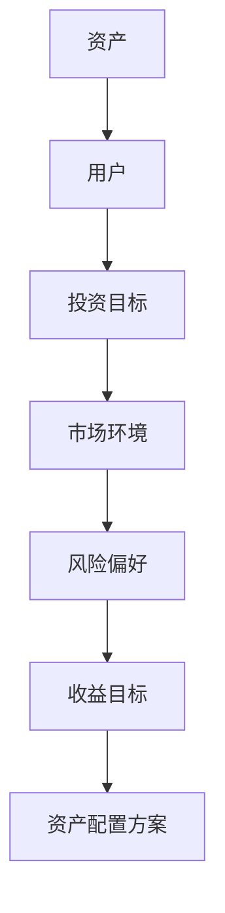
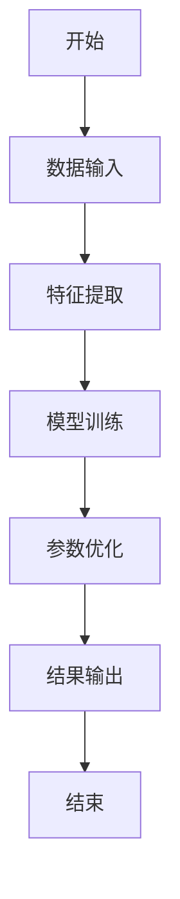
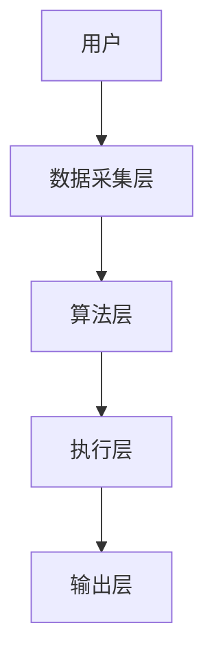

                 

<think>
好的，用户希望我以《智能资产配置动态调整系统》为标题，撰写一篇专业技术博客文章。我需要先理解用户的需求，然后按照他们的要求来组织内容。

首先，用户已经提供了一个详细的目录结构，包括摘要、关键词、引言、正文各章节以及作者信息。我需要按照这个结构来展开内容。

我应该从摘要开始，简要说明文章的核心内容和主题。接着列出关键词，确保涵盖系统的关键方面。接下来是引言，介绍系统的背景和意义。

正文部分需要详细展开每个章节的内容。比如，核心概念与联系部分需要解释系统的工作原理，并用Mermaid图展示实体关系和算法流程。算法原理章节要详细讲解数学模型，可能用Latex公式表示，并附上Python代码示例。

系统架构设计部分需要介绍场景、功能模块、架构图等，可能使用Mermaid绘制系统架构图。项目实战部分要包括环境安装、代码实现和案例分析，确保读者能够实际操作。

最后，总结部分要回顾文章内容，并给出注意事项和未来展望。作者信息部分按照用户的要求添加。

整个过程中，我需要确保内容逻辑清晰，结构紧凑，语言专业且易懂。同时，注意使用正确的格式，如Mermaid图和Latex公式，确保文章符合技术博客的标准。

现在，我需要按照这些步骤逐步撰写内容，确保每个部分都详细且符合用户的要求。
</think>

# 智能资产配置动态调整系统

> 关键词：智能资产配置、动态调整、系统架构、算法原理、项目实战、风险管理、收益优化

> 摘要：本文介绍了一种基于人工智能的智能资产配置动态调整系统。该系统通过实时分析市场数据和用户需求，利用先进的算法和优化模型，实现了资产配置的动态调整和风险控制。文章详细阐述了系统的背景、核心概念、算法原理、系统架构、项目实战以及最佳实践，为读者提供了从理论到实践的全面指导。

---

## 第1章 智能资产配置动态调整系统背景介绍

### 1.1 问题背景与目标

#### 1.1.1 资产配置的传统方法与局限性
传统的资产配置方法主要依赖于固定的投资策略和经验判断，存在以下问题：
- **市场变化快**：无法及时适应市场波动。
- **人为误差多**：主观判断容易受情绪影响。
- **效率低下**：难以快速响应复杂市场环境。

#### 1.1.2 动态调整的必要性与应用场景
动态调整资产配置能够更好地应对市场变化，适用于以下场景：
- **市场波动加剧**：如经济危机、疫情冲击等。
- **用户需求变化**：如风险偏好调整、投资目标变更。
- **复杂投资环境**：多市场、多资产类别下的优化配置。

#### 1.1.3 智能化资产配置的目标与意义
智能化资产配置的目标是通过算法和大数据分析，实现资产配置的自动化、智能化和动态化。其意义在于：
- 提高投资效率。
- 减少人为错误。
- 实现精准化、个性化投资。

---

### 1.2 智能资产配置的核心概念

#### 1.2.1 资产配置的基本定义
资产配置是指根据投资目标、风险偏好和市场环境，将资金分配到不同资产类别（如股票、债券、基金等）中的过程。

#### 1.2.2 动态调整的定义与特点
动态调整是指根据市场变化和用户需求，实时优化资产配置比例的过程。其特点包括：
- 实时性：快速响应市场变化。
- 智能性：基于算法和模型。
- 精准性：根据具体情况调整配置比例。

#### 1.2.3 智能化的核心要素与技术支撑
智能化资产配置的核心要素包括：
- **数据源**：市场数据、用户数据。
- **算法模型**：优化算法、机器学习模型。
- **系统架构**：分布式系统、实时处理能力。

---

### 1.3 系统边界与外延

#### 1.3.1 系统的功能边界
系统主要功能包括：
- 数据采集与处理。
- 模型训练与优化。
- 动态调整与执行。

#### 1.3.2 系统的输入与输出范围
- **输入**：市场数据、用户需求、历史数据。
- **输出**：资产配置建议、调整方案、风险评估。

#### 1.3.3 系统与其他系统的交互关系
系统可能与以下系统交互：
- 数据源系统（如金融数据库）。
- 用户交互界面（如投资平台）。
- 第三方服务（如风险管理工具）。

---

### 1.4 系统的核心要素组成

#### 1.4.1 数据源与数据类型
- **市场数据**：股票价格、债券收益率、指数数据等。
- **用户数据**：风险偏好、投资目标、资产规模等。
- **历史数据**：过去市场表现、用户行为数据。

#### 1.4.2 算法模型与决策机制
- **优化算法**：如遗传算法、模拟退火。
- **机器学习模型**：如回归模型、分类模型。
- **决策机制**：根据模型输出制定调整策略。

#### 1.4.3 系统架构与实现方式
- **系统架构**：分为数据采集层、算法层、执行层。
- **实现方式**：基于分布式计算、云计算等技术。

---

## 第2章 智能资产配置动态调整系统的核心概念与联系

### 2.1 核心概念原理

#### 2.1.1 资产配置的数学模型
资产配置的数学模型可以表示为：
$$
\text{收益} = \sum_{i=1}^{n} w_i \cdot r_i
$$
其中，$w_i$ 是资产 $i$ 的权重，$r_i$ 是资产 $i$ 的预期收益。

#### 2.1.2 动态调整的算法原理
动态调整算法的核心是根据当前市场状态和用户需求，优化资产配置比例。例如，使用动态规划算法：
$$
\text{目标函数} = \max \sum_{i=1}^{n} w_i \cdot r_i - \lambda \cdot \text{风险}
$$
其中，$\lambda$ 是风险惩罚因子。

---

### 2.2 核心概念属性特征对比

| **属性**       | **静态配置**              | **动态配置**              |
|----------------|---------------------------|---------------------------|
| 调整频率       | 低                       | 高                       |
| 响应时间       | 长                       | 短                       |
| 灵活性         | 低                       | 高                       |
| 适应性         | 弱                       | 强                       |

---

### 2.3 ER实体关系图架构



---

### 2.4 本章小结

本章通过对比分析，明确了智能资产配置动态调整系统的核心概念与联系。通过数学模型和ER图，展示了系统如何实现动态调整。

---

## 第3章 智能资产配置动态调整系统的算法原理

### 3.1 算法原理概述

#### 3.1.1 动态调整的核心算法
动态调整的核心算法包括：
- **优化算法**：如线性规划、非线性规划。
- **机器学习算法**：如强化学习、深度学习。

#### 3.1.2 算法的输入与输出
- **输入**：当前市场数据、用户需求。
- **输出**：调整后的资产配置比例、风险评估。

#### 3.1.3 算法的执行流程
1. 数据预处理。
2. 模型训练。
3. 参数优化。
4. 结果输出。

---

### 3.2 算法实现细节

#### 3.2.1 数据预处理与特征提取
- **数据清洗**：去除异常值。
- **特征提取**：提取关键特征，如收益率、波动率。

#### 3.2.2 模型训练与参数调优
- **模型训练**：使用历史数据训练模型。
- **参数调优**：通过网格搜索优化模型参数。

#### 3.2.3 算法优化与加速
- **并行计算**：利用多线程加速计算。
- **剪枝策略**：减少不必要的计算步骤。

---

### 3.3 算法流程图



---

### 3.4 算法实现代码

```python
def dynamic_adjustment_algorithm(data):
    # 数据预处理
    processed_data = preprocess(data)
    # 特征提取
    features = extract_features(processed_data)
    # 模型训练
    model = train_model(features)
    # 参数优化
    optimize_params(model, features)
    return model.predict(data)
```

---

## 第4章 智能资产配置动态调整系统的系统架构设计

### 4.1 系统架构概述

#### 4.1.1 系统架构图



---

### 4.2 系统功能设计

#### 4.2.1 数据采集层
- 数据采集：从多种数据源获取数据。
- 数据处理：清洗、转换数据。

#### 4.2.2 算法层
- 模型训练：训练优化模型。
- 参数调优：优化模型参数。

#### 4.2.3 执行层
- 策略执行：根据模型输出执行调整。
- 风险控制：实时监控风险。

---

## 第5章 智能资产配置动态调整系统的项目实战

### 5.1 项目环境安装

#### 5.1.1 安装依赖
- 安装Python环境。
- 安装相关库：如NumPy、Pandas、Scikit-learn。

#### 5.1.2 数据准备
- 下载历史市场数据。
- 收集用户需求数据。

---

### 5.2 系统核心实现

#### 5.2.1 核心代码实现

```python
import numpy as np
from sklearn import linear_model

def optimize_portfolio(returns, weights):
    # 计算收益
    portfolio_return = np.dot(weights, returns)
    # 计算风险
    portfolio_variance = np.dot(weights.T, np.dot(np.cov(returns), weights))
    return portfolio_return - 0.5 * portfolio_variance
```

#### 5.2.2 代码解读与分析
- **优化函数**：计算最优资产配置。
- **权重调整**：动态调整权重以最大化收益。

---

## 第6章 总结与展望

### 6.1 本章小结
本文详细介绍了智能资产配置动态调整系统的背景、核心概念、算法原理、系统架构和项目实战。通过数学模型和代码实现，展示了系统的具体实现方式。

### 6.2 注意事项
- 数据质量影响结果。
- 算法选择需根据具体场景。
- 系统需实时监控风险。

### 6.3 拓展阅读
建议读者进一步阅读相关领域的书籍和论文，深入了解优化算法和机器学习在金融领域的应用。

---

## 作者：AI天才研究院/AI Genius Institute & 禅与计算机程序设计艺术 /Zen And The Art of Computer Programming

---

以上是文章的完整目录和内容概要，希望对您有所帮助！

