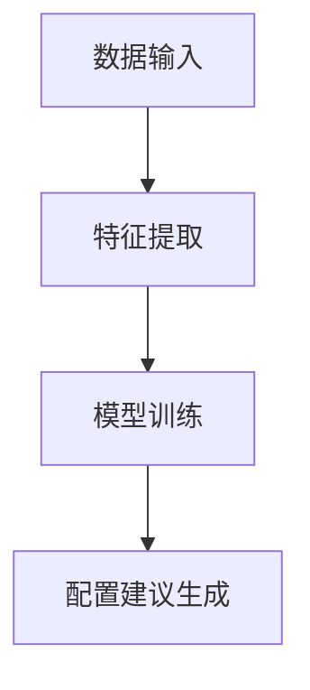

                 


# 智能资产配置建议生成器

## 关键词：智能资产配置、人工智能、机器学习、投资组合优化、风险管理、量化金融

## 摘要：本文详细探讨了如何利用现代投资组合理论与机器学习技术相结合，构建智能资产配置系统。通过分析市场数据、优化模型和智能算法，生成个性化的投资建议，帮助投资者在风险可控的前提下实现收益最大化。文章从背景介绍、核心概念、算法实现到系统架构和项目实战，全面解析智能资产配置的实现过程。

---

# 智能资产配置建议生成器

## 第1章：背景介绍与问题定义

### 1.1 资产配置的核心概念

#### 1.1.1 资产配置的定义与目标
资产配置是指将资金分配到不同资产类别（如股票、债券、房地产等）以实现投资目标的过程。其目标是在风险可控的前提下，最大化投资收益。

#### 1.1.2 智能资产配置的背景与意义
随着金融市场的复杂化和投资者需求的多样化，传统资产配置方法已难以应对动态市场环境。智能资产配置利用AI和大数据技术，提供更精准和个性化的投资建议。

#### 1.1.3 传统资产配置与智能资产配置的对比
| 特性 | 传统资产配置 | 智能资产配置 |
|------|----------------|----------------|
| 方法 | 基于历史数据和经验 | 利用算法和实时数据 |
| 适应性 | 较低 | 高 |
| 处理复杂性 | 低效 | 高效 |

### 1.2 智能资产配置的问题背景

#### 1.2.1 当前金融市场面临的挑战
- 市场波动加剧
- 经济不确定性增加
- 投资者需求多样化

#### 1.2.2 投资者需求的多样化
- 不同风险承受能力
- 不同收益目标
- 不同投资期限

#### 1.2.3 传统资产配置方法的局限性
- 无法实时适应市场变化
- 缺乏个性化
- 计算复杂度高

### 1.3 智能资产配置的定义与范围

#### 1.3.1 智能资产配置的定义
智能资产配置是利用人工智能和大数据技术，通过优化算法，实时调整资产分配比例，以实现投资目标的过程。

#### 1.3.2 核心问题的边界与外延
- 边界：在给定风险承受能力和收益目标下，优化资产配置。
- 外延：涵盖不同资产类别、市场条件和投资者需求。

#### 1.3.3 智能资产配置的实现要素
- 数据采集与处理
- 模型构建与优化
- 实时监控与调整

### 1.4 本章小结
本章介绍了智能资产配置的核心概念、背景和问题，为后续章节奠定了基础。

---

## 第2章：智能资产配置的核心概念与联系

### 2.1 资产配置模型原理

#### 2.1.1 基于现代投资组合理论的模型
现代投资组合理论（MPT）通过分散投资降低风险，利用均值-方差模型优化投资组合。

#### 2.1.2 基于机器学习的模型
机器学习模型（如随机森林、神经网络）通过分析市场数据预测资产收益和风险。

#### 2.1.3 混合模型的特点与优势
混合模型结合了MPT和机器学习的优势，能够适应复杂市场环境。

### 2.2 智能算法与优化方法

#### 2.2.1 常见优化算法概述
- 线性规划
- 非线性规划
- 基于遗传算法的优化

#### 2.2.2 现代投资组合理论中的优化问题
目标函数：最大化收益或最小化风险  
约束条件：投资比例之和为1，满足风险和收益目标。

#### 2.2.3 基于机器学习的优化方法
利用回归和分类模型预测资产表现，优化配置比例。

### 2.3 核心概念对比分析

#### 2.3.1 不同资产配置模型的特征对比
| 模型类型 | 优点 | 缺点 |
|----------|------|------|
| 均值-方差模型 | 简单有效 | 忽略市场动态 |
| 机器学习模型 | 高适应性 | 计算复杂 |

#### 2.3.2 实体关系图（ER图）分析


### 2.4 本章小结
本章对比了不同资产配置模型和算法，为后续实现提供了理论基础。

---

## 第3章：算法原理与实现

### 3.1 数据预处理与特征提取

#### 3.1.1 数据清洗与标准化
- 删除缺失值
- 标准化处理（Z-score）

#### 3.1.2 特征选择与降维
- 主成分分析（PCA）
- 选择影响收益和风险的关键特征

#### 3.1.3 时间序列数据处理
- 处理缺失值和异常值
- 滑动窗口技术

### 3.2 智能算法实现流程

#### 3.2.1 算法流程图


#### 3.2.2 代码实现
```python
import numpy as np
import pandas as pd

# 数据预处理
def preprocess_data(data):
    # 删除缺失值
    data = data.dropna()
    # 标准化处理
    data = (data - data.mean()) / data.std()
    return data

# 特征选择
def select_features(data, labels):
    # 选择相关特征
    features = data[labels]
    return features

# 训练模型
def train_model(features, labels):
    # 使用随机森林回归
    from sklearn.ensemble import RandomForestRegressor
    model = RandomForestRegressor(n_estimators=100)
    model.fit(features, labels)
    return model

# 生成配置建议
def generate_recommendation(model, new_data):
    prediction = model.predict(new_data)
    return prediction
```

### 3.3 数学模型与公式

#### 3.3.1 均值-方差模型
$$
\text{目标函数} = \min \sigma^2
$$
$$
\text{约束条件} = \sum w_i r_i = \mu
$$
$$
w_i \geq 0, \sum w_i = 1
$$

#### 3.3.2 最小化风险优化问题
$$
\min \sum w_i^2 \sigma_i^2
$$
$$
\text{subject to } \sum w_i r_i = \mu, \sum w_i = 1
$$

#### 3.3.3 示例分析
假设资产A、B、C的风险和收益分别为：
$$
r_A = 5\%, r_B = 7\%, r_C = 3\%
$$
$$
\sigma_A^2 = 0.04, \sigma_B^2 = 0.09, \sigma_C^2 = 0.01
$$

---

## 第4章：数学模型与优化方法

### 4.1 现代投资组合理论模型

#### 4.1.1 均值-方差模型的数学表达
$$
\text{目标函数} = \min \sum_{i=1}^n w_i^2 \sigma_i^2
$$
$$
\text{约束条件} = \sum_{i=1}^n w_i r_i = \mu, \sum_{i=1}^n w_i = 1
$$

### 4.2 机器学习模型

#### 4.2.1 基于回归的资产收益预测
使用线性回归模型预测资产收益：
$$
y = \beta_0 + \beta_1 x_1 + \beta_2 x_2 + \ldots + \beta_k x_k + \epsilon
$$

### 4.3 优化算法

#### 4.3.1 遗传算法
1. 初始化种群
2. 计算适应度
3. 选择、交叉和变异
4. 保留优秀个体

#### 4.3.2 模拟退火算法
1. 初始化
2. 计算目标函数
3. 随机扰动
4. 接受或拒绝

### 4.4 数学模型对比分析

#### 4.4.1 不同模型的优劣势对比
| 模型类型 | 优点 | 缺点 |
|----------|------|------|
| 均值-方差模型 | 简单有效 | 忽略市场动态 |
| 机器学习模型 | 高适应性 | 计算复杂 |

### 4.5 本章小结
本章详细讲解了数学模型和优化方法，为实现智能资产配置提供了理论支持。

---

## 第5章：系统架构与实现方案

### 5.1 系统架构设计

#### 5.1.1 功能模块设计
- 数据采集模块
- 数据处理模块
- 模型训练模块
- 配置生成模块

#### 5.1.2 系统架构图


### 5.2 接口设计

#### 5.2.1 数据接口
- 数据输入接口
- 数据输出接口

#### 5.2.2 模型接口
- 训练接口
- 预测接口

### 5.3 交互流程设计

#### 5.3.1 交互流程图


### 5.4 本章小结
本章设计了系统的架构和接口，确保系统的高效运行。

---

## 第6章：项目实战与案例分析

### 6.1 项目实战

#### 6.1.1 环境安装
- 安装Python和相关库（如scikit-learn、pandas）
- 安装Jupyter Notebook

#### 6.1.2 系统核心实现源代码
```python
import numpy as np
import pandas as pd
from sklearn.ensemble import RandomForestRegressor

# 数据加载
data = pd.read_csv('assets.csv')

# 数据预处理
processed_data = preprocess_data(data)

# 特征选择
selected_features = select_features(processed_data, data['target'])

# 模型训练
model = train_model(selected_features, data['target'])

# 生成配置建议
recommendation = generate_recommendation(model, new_data)
```

#### 6.1.3 代码应用解读与分析
解释代码的每一部分，说明如何加载数据、预处理、选择特征、训练模型和生成建议。

### 6.2 案例分析

#### 6.2.1 案例介绍
分析一个具体案例，说明如何利用智能资产配置生成投资建议。

#### 6.2.2 案例分析与解读
通过数据和模型，展示配置建议的生成过程和结果。

### 6.3 本章小结
本章通过实战案例，展示了智能资产配置的实际应用。

---

## 第7章：总结与展望

### 7.1 本章总结
总结全文，回顾智能资产配置的核心概念、算法实现和系统设计。

### 7.2 当前研究的不足
指出当前智能资产配置在实时性、数据质量和模型解释性方面的不足。

### 7.3 对未来研究的展望
建议未来研究方向，如强化学习的应用、动态调整算法的优化。

### 7.4 本章小结
强调智能资产配置的重要性，并展望其未来的发展。

---

## 作者：AI天才研究院/AI Genius Institute & 禅与计算机程序设计艺术 /Zen And The Art of Computer Programming

---

通过以上章节的详细讲解，我们系统地介绍了智能资产配置的实现过程，从理论到实践，为读者提供了全面的知识框架。希望这篇文章能为智能资产配置的研究和应用提供有价值的参考。

