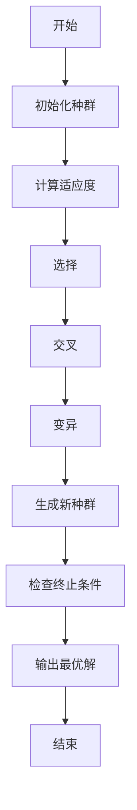
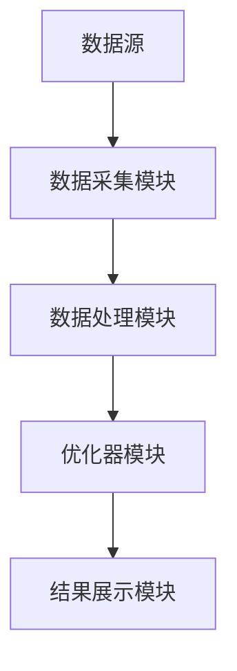

                 


# 智能资产配置策略动态优化器

## 关键词：智能资产配置、动态优化器、资产组合优化、遗传算法、系统架构

## 摘要：本文详细介绍了智能资产配置策略动态优化器的背景、核心概念、算法原理、系统架构以及实际应用。通过分析现有资产配置方法的局限性，提出了基于动态优化的智能配置策略，并结合具体案例展示了如何利用遗传算法实现资产组合的动态优化。文章最后总结了优化器的优势，并展望了未来的研究方向。

---

# 第1章: 背景介绍

## 1.1 问题背景

### 1.1.1 资产配置的重要性
资产配置是投资决策的核心环节，直接影响投资组合的收益和风险。通过科学的配置策略，投资者可以在不同市场环境下实现收益最大化和风险最小化。

### 1.1.2 现有资产配置方法的局限性
传统资产配置方法依赖于静态模型和固定规则，难以适应市场环境的快速变化。人工调整不仅效率低下，还可能因主观因素影响决策的客观性。

### 1.1.3 智能化资产配置的需求
随着市场环境的复杂化和投资者需求的多样化，智能化资产配置成为必然趋势。通过引入人工智能技术，可以实现动态优化和自动化决策。

## 1.2 问题描述

### 1.2.1 资产配置的定义与目标
资产配置是将资金分配到不同资产类别以实现投资目标的过程。其核心目标是在风险可控的前提下，最大化收益。

### 1.2.2 动态优化的必要性
市场环境的波动性要求资产配置策略能够实时调整，以应对突发事件和市场变化，确保投资组合的稳定性。

### 1.2.3 复杂市场环境下的挑战
复杂多变的市场环境、投资者目标的多样性以及数据的不完全性，都增加了资产配置的难度。

## 1.3 问题解决方法

### 1.3.1 智能化技术的应用
引入机器学习、遗传算法等技术，提高资产配置的智能化水平。

### 1.3.2 动态优化算法的引入
通过动态优化算法，实现实时调整资产配置策略，提高配置的灵活性和适应性。

### 1.3.3 数据驱动的决策支持
利用大数据分析和数据挖掘技术，提供科学的决策支持，提高配置的准确性。

## 1.4 边界与外延

### 1.4.1 优化范围的界定
明确优化的范围，例如优化的资产类别、优化的时间周期等。

### 1.4.2 相关概念的扩展
扩展到风险管理、投资组合监控等领域，形成完整的投资决策体系。

### 1.4.3 应用场景的限制
明确动态优化器的应用场景，例如机构投资者、高净值客户等。

## 1.5 核心概念定义

### 1.5.1 智能资产配置的定义
智能资产配置是利用人工智能技术，根据市场环境和投资者目标，动态调整资产配置策略的过程。

### 1.5.2 动态优化器的核心要素
包括数据输入、优化算法、目标函数、约束条件等。

### 1.5.3 相关术语的解释
解释资产组合、风险指标、收益指标等术语的定义和作用。

---

# 第2章: 核心概念与联系

## 2.1 动态优化器的原理

### 2.1.1 优化目标的设定
设定明确的优化目标，例如最大化收益、最小化风险等。

### 2.1.2 优化方法的选择
选择适合的优化算法，例如遗传算法、粒子群优化等。

### 2.1.3 优化过程的描述
描述优化过程的步骤，例如初始化、评估、选择、交叉等。

## 2.2 核心概念对比

### 2.2.1 传统资产配置与智能配置的对比
从方法、效率、适应性等方面对比传统和智能配置的差异。

### 2.2.2 静态优化与动态优化的差异
分析静态优化和动态优化在适应性、实时性等方面的区别。

### 2.2.3 不同优化算法的优缺点
列出常见优化算法的优缺点，帮助读者选择合适的算法。

## 2.3 ER实体关系图

```mermaid
er
    actor 投资者
    actor 市场环境
    actor 优化器
    entity 资产组合
    entity 风险指标
    entity 收益指标
    entity 市场数据
    投资者 --> 资产组合
    资产组合 --> 风险指标
    资产组合 --> 收益指标
    市场环境 --> 市场数据
    优化器 --> 资产组合
    优化器 --> 风险指标
```

---

# 第3章: 算法原理

## 3.1 优化算法的选择与原理

### 3.1.1 遗传算法的原理
遗传算法是一种模拟生物进化过程的优化算法，包括编码、选择、交叉、变异等步骤。

## 3.2 算法流程图



## 3.3 算法实现代码

```python
import random

def objective_function(solution):
    # 计算收益和风险指标
    return -solution['收益'] + solution['风险']  # 最大化收益，最小化风险

def generate_initial_population(size, num_assets):
    # 初始化种群
    population = []
    for _ in range(size):
        solution = {'权重': [random.random() for _ in range(num_assets)}, 
                   '收益': 0, 
                   '风险': 0}
        population.append(solution)
    return population

def evaluate_population(population, data):
    # 计算每个方案的收益和风险
    for solution in population:
        # 假设data包含资产的历史收益和风险数据
        solution['收益'] = sum(solution['权重'][i] * data['收益'][i] for i in range(len(solution['权重'])))
        solution['风险'] = sum(solution['权重'][i] * data['风险'][i] for i in range(len(solution['权重'])))
    return population

def selection(population, k):
    # 选择前k个最优解
    population.sort(key=lambda x: objective_function(x))
    return population[:k]

def crossover(parent1, parent2):
    # 单点交叉
    point = random.randint(1, len(parent1['权重']) - 1)
    new_child = {'权重': parent1['权重'][0:point] + parent2['权重'][point:], 
                  '收益': 0, 
                  '风险': 0}
    return new_child

def mutation(solution, mutation_rate):
    # 随机突变
    for i in range(len(solution['权重'])):
        if random.random() < mutation_rate:
            solution['权重'][i] = random.random()
    return solution

def optimize(num_assets, population_size, generations):
    data = {'收益': [0.1, 0.2, 0.15, 0.08], 
            '风险': [0.05, 0.1, 0.08, 0.12]}
    
    population = generate_initial_population(population_size, num_assets)
    population = evaluate_population(population, data)
    
    for _ in range(generations):
        population = selection(population, int(population_size/2))
        new_population = []
        for i in range(0, len(population), 2):
            parent1 = population[i]
            parent2 = population[i+1]
            child1 = crossover(parent1, parent2)
            child2 = crossover(parent2, parent1)
            child1 = mutation(child1, 0.1)
            child2 = mutation(child2, 0.1)
            new_population.append(child1)
            new_population.append(child2)
        population = new_population + population
        population = evaluate_population(population, data)
    
    optimal_solution = min(population, key=lambda x: objective_function(x))
    return optimal_solution
```

## 3.4 算法的数学模型

### 3.4.1 目标函数
$$ \text{目标函数} = \max (\text{收益}) - \min (\text{风险}) $$

### 3.4.2 约束条件
$$ \sum_{i=1}^{n} w_i = 1 \quad (w_i \geq 0) $$

---

# 第4章: 系统分析与架构设计

## 4.1 项目背景

### 4.1.1 项目目标
开发一个智能资产配置策略动态优化器，实现资产配置的动态优化。

### 4.1.2 项目范围
覆盖多种资产类别，支持实时数据更新和动态优化。

## 4.2 系统功能设计

### 4.2.1 功能模块
- 数据采集模块：获取市场数据。
- 数据处理模块：清洗和转换数据。
- 优化器模块：执行资产配置优化。
- 结果展示模块：可视化优化结果。

## 4.3 系统架构设计

### 4.3.1 系统架构图



### 4.3.2 接口设计
- 数据采集模块接口：提供市场数据接口。
- 优化器模块接口：提供优化结果接口。

### 4.3.3 交互流程

```mermaid
sequence
    投资者 -> 数据采集模块: 获取市场数据
    数据采集模块 -> 数据处理模块: 提供清洗后的数据
    数据处理模块 -> 优化器模块: 发送优化请求
    优化器模块 -> 数据展示模块: 返回优化结果
```

---

# 第5章: 项目实战

## 5.1 环境搭建

### 5.1.1 安装Python和相关库
安装Python和pandas、numpy、matplotlib等库。

## 5.2 核心代码实现

### 5.2.1 数据采集与处理
```python
import pandas as pd
import numpy as np

# 数据采集
data = pd.read_csv('market_data.csv')
# 数据处理
data.dropna(inplace=True)
```

### 5.2.2 优化器实现
```python
def optimize_portfolio(data):
    # 初始化种群
    population = generate_initial_population(100, len(data.columns))
    # 优化过程
    optimal_solution = optimize(len(data.columns), 100, 50)
    return optimal_solution
```

## 5.3 实际案例分析

### 5.3.1 案例背景
假设市场有四种资产，目标是优化配置。

### 5.3.2 案例实现
调用优化器模块，获取最优配置方案。

### 5.3.3 结果分析
分析优化结果，比较不同配置方案的收益和风险。

## 5.4 项目小结

### 5.4.1 经验总结
优化器能够有效提高资产配置的效率和准确性。

### 5.4.2 改进建议
进一步优化算法，引入机器学习模型。

---

# 第6章: 总结与展望

## 6.1 总结

### 6.1.1 优化器的优势
动态优化、高效率、高准确性。

### 6.1.2 应用场景
适用于机构投资者、高净值客户等。

## 6.2 未来展望

### 6.2.1 研究方向
引入强化学习、多目标优化等技术。

### 6.2.2 拓展应用
扩展到风险管理、投资组合监控等领域。

## 6.3 最佳实践 tips

### 6.3.1 数据质量
确保数据的准确性和完整性。

### 6.3.2 模型调优
根据实际需求调整优化算法的参数。

### 6.3.3 风险管理
定期监控和调整配置方案，降低风险。

---

# 作者：AI天才研究院/AI Genius Institute & 禅与计算机程序设计艺术 /Zen And The Art of Computer Programming
```

