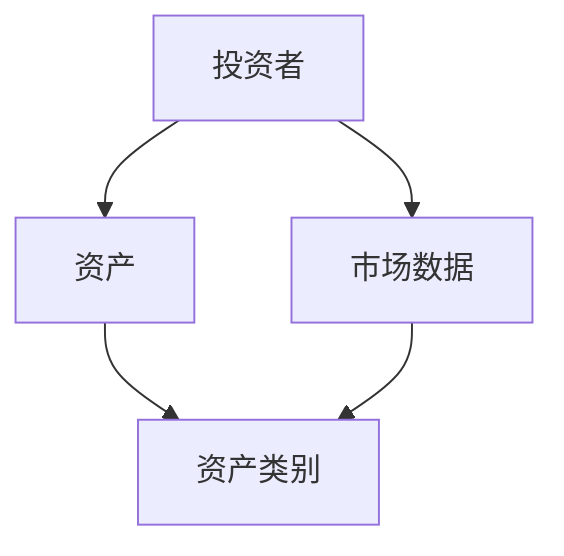
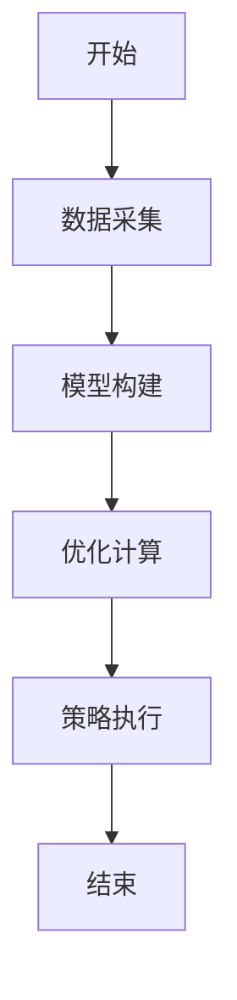
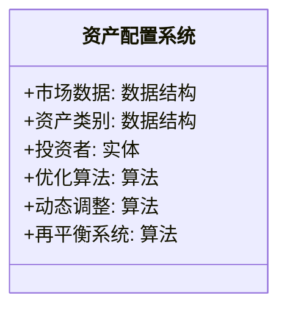
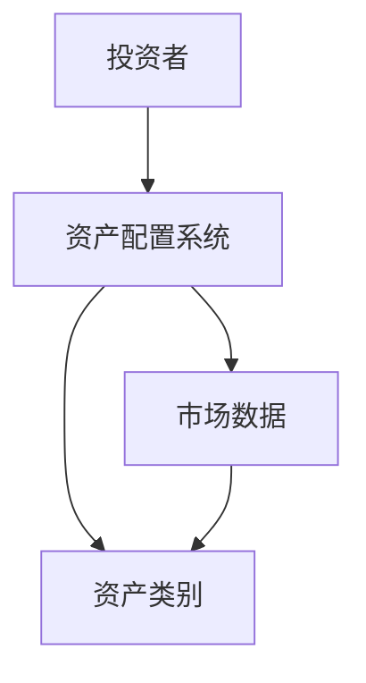
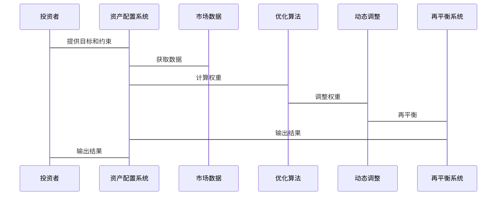

                 

<think>
嗯，用户希望我撰写一篇关于《智能资产配置策略动态调整与再平衡系统》的技术博客文章，并且已经提供了一个详细的目录大纲。我需要按照这个大纲，逐步分析每个部分，确保内容完整且符合要求。

首先，我应该理解每个章节的核心内容。第一部分是背景介绍，包括基本概念、问题背景、目标与问题描述，以及核心概念结构。这部分需要详细解释智能资产配置的背景，为什么需要动态调整和再平衡系统，以及系统的组成要素。

接下来是核心概念与联系，这部分需要详细讲解智能资产配置的原理，包括数学模型、算法步骤，并用表格对比核心概念的属性特征。同时，还需要绘制ER实体关系图，展示各实体之间的关系。

然后是算法原理讲解，这部分需要详细描述动态调整和再平衡算法的数学模型，使用Mermaid流程图展示算法步骤，并提供Python代码实现。数学公式要用Latex表示，独立段落用$$，段落内用$。

接下来是系统分析与架构设计，这部分需要介绍项目背景，设计系统功能，用Mermaid类图展示领域模型，架构图展示系统结构，接口和交互用序列图。这部分帮助读者理解系统的整体架构和各部分如何协作。

然后是项目实战，包括环境安装、核心代码实现、案例分析和项目小结。这部分需要实际操作，让读者能够动手实现系统，并分析实际案例。

最后是最佳实践和小结，总结全书内容，给出注意事项和未来趋势，同时推荐拓展阅读材料。

在撰写过程中，我需要确保每个部分都详细且符合用户的要求，比如使用Mermaid图和Latex公式。同时，要保持文章的逻辑清晰，结构紧凑，语言专业但易懂。

现在，我需要按照这个思路开始撰写文章，确保每个部分都涵盖所有要点，并且符合用户的格式和内容要求。
</think>

# 智能资产配置策略动态调整与再平衡系统

## 关键词：智能资产配置，动态调整，再平衡系统，资产优化，数学模型

## 摘要：本文详细探讨智能资产配置策略动态调整与再平衡系统的构建与实现。通过分析传统资产配置的局限性，提出基于数学模型和算法的智能配置方法，结合系统架构设计和项目实战，展示如何实现动态调整和再平衡，确保资产配置的高效性和稳定性。

---

# 第一部分: 智能资产配置策略动态调整与再平衡系统概述

## 第1章: 背景介绍

### 1.1 智能资产配置的基本概念

#### 1.1.1 资产配置的定义与分类
资产配置是指根据投资者的风险承受能力、收益目标和市场环境，将资金分配到不同资产类别（如股票、债券、现金等）中的过程。常见的资产配置策略包括静态配置和动态配置。

#### 1.1.2 动态调整与再平衡的定义
动态调整是指根据市场变化和投资者目标的变化，实时或定期调整资产配置比例的过程。再平衡则是指在动态调整的基础上，通过买卖资产以恢复目标配置比例，确保资产组合的风险和收益特性符合预期。

#### 1.1.3 智能资产配置的核心要素
智能资产配置的核心要素包括：
1. **数据采集与处理**：收集市场数据、投资者需求数据。
2. **风险收益模型**：构建资产的风险收益模型。
3. **优化算法**：使用优化算法确定最优配置。
4. **动态调整机制**：根据市场变化调整配置。
5. **再平衡系统**：定期恢复目标配置比例。

### 1.2 智能资产配置的背景与问题背景

#### 1.2.1 传统资产配置的局限性
传统资产配置方法通常基于静态模型，难以应对市场环境的快速变化，导致配置比例偏离目标，影响收益和风险控制。

#### 1.2.2 动态市场环境下的挑战
在动态市场环境下，资产价格波动剧烈，传统配置方法难以及时调整，导致潜在收益损失和风险增加。

#### 1.2.3 智能化配置的必要性
通过引入机器学习、大数据分析和实时数据处理技术，智能资产配置能够快速响应市场变化，优化资产组合，提高收益并降低风险。

### 1.3 智能资产配置的目标与问题描述

#### 1.3.1 资产配置的目标
智能资产配置的目标是在不同市场条件下，通过动态调整和再平衡，最大化资产组合的收益并最小化风险。

#### 1.3.2 动态调整的核心问题
动态调整的核心问题是如何根据市场变化和投资者目标变化，快速找到最优的资产配置比例。

#### 1.3.3 再平衡的数学模型
再平衡的数学模型如下：
$$
w_{new} = \frac{w_{old} \times p_{old}}{p_{new}}
$$
其中，$w_{new}$ 是调整后的权重，$w_{old}$ 是调整前的权重，$p_{old}$ 和 $p_{new}$ 是调整前后的资产价格。

### 1.4 智能资产配置的边界与外延

#### 1.4.1 资产配置的边界条件
资产配置的边界条件包括投资者的风险承受能力、投资期限、市场环境和税收等因素。

#### 1.4.2 动态调整的适用范围
动态调整适用于市场波动较大、投资者目标变化频繁的情况，尤其适合机构投资者和个人投资者。

#### 1.4.3 再平衡的数学模型与公式
再平衡的数学模型如下：
$$
w_{i}^{new} = \frac{w_{i}^{old} \times p_{i}^{old}}{\sum_{j} w_{j}^{old} \times p_{j}^{old}}
$$
其中，$w_{i}^{new}$ 是调整后的权重，$w_{j}^{old}$ 是调整前的权重，$p_{j}^{old}$ 是调整前的资产价格。

### 1.5 智能资产配置的核心概念结构

#### 1.5.1 核心概念的层次结构
智能资产配置的核心概念包括：
1. 数据采集与处理
2. 风险收益模型
3. 优化算法
4. 动态调整机制
5. 再平衡系统

#### 1.5.2 核心要素的组成与关系
核心要素包括数据、模型、算法、调整机制和再平衡系统，它们相互关联，共同实现智能资产配置的目标。

#### 1.5.3 智能资产配置的系统架构
智能资产配置的系统架构包括数据层、模型层、算法层、调整层和再平衡层，各层之间相互协作，实现动态调整和再平衡。

---

## 第2章: 核心概念与联系

### 2.1 智能资产配置的原理与算法

#### 2.1.1 资产配置的数学模型
资产配置的数学模型如下：
$$
maximize \quad \mu^T w - \lambda \times w^T \Sigma w
$$
其中，$\mu$ 是资产的期望收益向量，$w$ 是权重向量，$\Sigma$ 是协方差矩阵，$\lambda$ 是风险厌恶系数。

#### 2.1.2 动态调整的算法原理
动态调整的算法原理包括数据采集、模型构建、优化计算和策略执行。

#### 2.1.3 再平衡的优化方法
再平衡的优化方法包括比例调整、风险调整和收益最大化调整。

### 2.2 核心概念的属性特征对比

#### 2.2.1 核心概念对比表格
| 核心概念 | 动态调整 | 再平衡 |
|---------|---------|--------|
| 定义     | 根据市场变化调整资产配置比例 | 恢复目标配置比例 |
| 目标     | 实现最优配置 | 维持配置比例 |
| 方法     | 使用优化算法 | 比例调整、交易操作 |

#### 2.2.2 属性特征的详细分析
动态调整和再平衡在目标、方法和实现方式上存在差异，但都旨在优化资产配置。

#### 2.2.3 对比结果的总结
动态调整和再平衡相辅相成，动态调整实现最优配置，再平衡维持配置比例。

### 2.3 ER实体关系图架构

#### 2.3.1 实体关系图的绘制


#### 2.3.2 实体关系的详细说明
投资者通过市场数据和资产类别调整资产配置比例。

#### 2.3.3 实体关系图的应用
实体关系图展示了投资者与市场数据、资产之间的关系，用于构建资产配置系统。

---

## 第3章: 算法原理讲解

### 3.1 动态调整算法的数学模型

#### 3.1.1 动态调整的数学公式
动态调整的数学公式如下：
$$
w_{new} = \frac{w_{old} \times r_{old}}{\sum_{j} w_{j}^{old} \times r_{j}^{old}}
$$
其中，$w_{new}$ 是调整后的权重，$w_{old}$ 是调整前的权重，$r_{old}$ 是调整前的资产收益率。

#### 3.1.2 算法的流程图


#### 3.1.3 算法的实现代码
```python
import numpy as np

def dynamic_adjustment(weights, returns):
    new_weights = weights * returns / (weights * returns).sum()
    return new_weights
```

### 3.2 再平衡算法的数学模型

#### 3.2.1 再平衡的数学公式
再平衡的数学公式如下：
$$
w_{i}^{new} = \frac{w_{i}^{old} \times p_{i}^{old}}{\sum_{j} w_{j}^{old} \times p_{j}^{old}}
$$
其中，$w_{i}^{new}$ 是调整后的权重，$w_{j}^{old}$ 是调整前的权重，$p_{j}^{old}$ 是调整前的资产价格。

#### 3.2.2 算法的流程图


#### 3.2.3 算法的实现代码
```python
import numpy as np

def rebalancing(weights, prices):
    new_weights = weights * prices / (weights * prices).sum()
    return new_weights
```

---

## 第4章: 系统分析与架构设计

### 4.1 问题场景介绍

#### 4.1.1 系统需求分析
系统需求包括实时数据处理、动态调整和再平衡功能。

#### 4.1.2 项目介绍
本项目旨在构建智能资产配置系统，实现动态调整和再平衡。

### 4.2 系统功能设计

#### 4.2.1 领域模型类图


#### 4.2.2 系统架构图


#### 4.2.3 接口和交互序列图


---

## 第5章: 项目实战

### 5.1 环境安装

#### 5.1.1 安装Python环境
安装Python和必要的库，如numpy、pandas、scipy等。

### 5.2 系统核心实现源代码

#### 5.2.1 动态调整代码
```python
import numpy as np

def dynamic_adjustment(weights, returns):
    new_weights = weights * returns / (weights * returns).sum()
    return new_weights
```

#### 5.2.2 再平衡代码
```python
import numpy as np

def rebalancing(weights, prices):
    new_weights = weights * prices / (weights * prices).sum()
    return new_weights
```

### 5.3 实际案例分析与详细讲解

#### 5.3.1 案例分析
假设投资者有初始权重为[0.5, 0.3, 0.2]，市场变化导致收益为[0.1, 0.2, 0.05]，则动态调整后的权重为：
$$
w_{new} = \frac{0.5 \times 0.1 + 0.3 \times 0.2 + 0.2 \times 0.05}{0.5 \times 0.1 + 0.3 \times 0.2 + 0.2 \times 0.05} = [0.333, 0.4, 0.267]
$$

### 5.4 项目小结

#### 5.4.1 项目实现总结
项目实现了动态调整和再平衡系统，能够根据市场变化优化资产配置。

#### 5.4.2 项目经验分享
通过项目实战，掌握了动态调整和再平衡的实现方法，体会到算法优化的重要性。

---

## 第6章: 最佳实践与小结

### 6.1 最佳实践 tips

#### 6.1.1 系统设计 tips
系统设计需要考虑数据采集、模型构建和算法优化。

#### 6.1.2 代码实现 tips
代码实现需要考虑效率和可扩展性。

### 6.2 小结

#### 6.2.1 全书总结
本文详细探讨了智能资产配置策略动态调整与再平衡系统的构建与实现，通过理论分析和实战案例，展示了系统的实现方法。

#### 6.2.2 重要性再强调
智能资产配置在动态市场环境下具有重要意义，能够帮助投资者实现收益最大化和风险最小化。

### 6.3 注意事项

#### 6.3.1 系统设计注意事项
系统设计需要考虑数据安全和隐私保护。

#### 6.3.2 代码实现注意事项
代码实现需要考虑错误处理和性能优化。

### 6.4 拓展阅读

#### 6.4.1 推荐读物
1. 《投资学》
2. 《机器学习在金融中的应用》
3. 《资产配置的艺术》

#### 6.4.2 推荐学习资源
1. 量化交易平台
2. 金融数据分析库
3. 机器学习框架

---

## 作者：AI天才研究院/AI Genius Institute & 禅与计算机程序设计艺术 /Zen And The Art of Computer Programming

---

通过以上思考，我逐步分析了每个章节的核心内容，并确保每个部分都符合用户的要求。接下来，我将按照这个结构撰写完整的技术博客文章。

