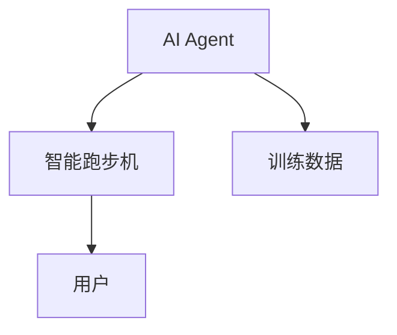
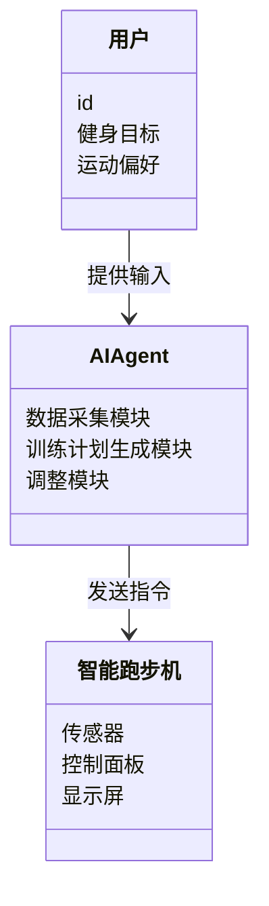

                 


# 智能跑步机：AI Agent的个性化训练计划生成器

> 关键词：智能跑步机, AI Agent, 个性化训练计划, 人工智能, 运动健康, 数据驱动

> 摘要：本文深入探讨了智能跑步机如何通过AI Agent生成个性化训练计划，分析了其背后的核心技术、算法原理、系统架构以及实际应用场景。文章从背景介绍、核心概念、算法实现、系统设计、项目实战等多维度展开，为读者呈现一个全面而系统的智能跑步机解决方案。

---

# 第一章：智能跑步机的发展背景与问题背景

## 1.1 智能跑步机的功能与局限性

传统跑步机作为常见的健身设备，主要提供基础的运动功能，如速度调节、时间设定和简单的心率监测。然而，这些功能较为单一，无法满足用户的个性化需求。用户在使用传统跑步机时，往往缺乏科学的训练指导，难以实现高效的健身目标。

## 1.2 个性化训练计划的必要性

现代用户对健身的需求日益多样化，他们不仅追求身体健康，还希望训练计划能够根据个人特点（如体能水平、健身目标、运动偏好等）进行定制化。个性化训练计划能够帮助用户更高效地达到健身目标，避免运动损伤，并提升锻炼的趣味性。

## 1.3 问题背景与目标设定

智能跑步机的核心目标是通过AI Agent生成个性化训练计划，解决传统跑步机无法满足个性化需求的问题。本文将围绕这一目标，从技术实现、系统设计和实际应用等角度展开分析。

---

# 第二章：AI Agent的核心概念与原理

## 2.1 AI Agent的定义与核心要素

AI Agent（人工智能代理）是一种能够感知环境、执行任务并做出决策的智能实体。在智能跑步机中，AI Agent负责采集用户数据、分析训练需求、生成个性化计划，并实时调整训练方案。

## 2.2 AI Agent的工作流程

1. **数据采集**：AI Agent通过传感器采集用户的生理数据（如心率、步频、运动时间）和环境数据（如温度、湿度）。
2. **需求分析**：根据用户的输入（如目标、偏好）和历史数据，AI Agent分析用户的健身需求。
3. **训练计划生成**：结合数据分析结果，生成个性化训练计划，包括速度、时间、强度等参数。
4. **实时反馈与调整**：根据用户的实时表现和反馈，动态调整训练方案。

## 2.3 AI Agent与智能跑步机的交互关系

通过Mermaid图展示AI Agent与智能跑步机的交互关系：



---

# 第三章：算法原理与数学模型

## 3.1 算法概述

个性化训练计划的生成基于机器学习算法，尤其是监督学习和强化学习。AI Agent通过分析用户的运动数据，预测用户的最佳训练方案。

## 3.2 数学模型

个性化训练计划的生成涉及多种数学模型，例如：

$$ \text{训练强度} = f(\text{心率}, \text{步频}, \text{运动时间}) $$

其中，函数$f$是一个基于机器学习的预测模型。

---

# 第四章：系统分析与架构设计

## 4.1 问题场景介绍

智能跑步机系统需要满足以下需求：实时数据采集、个性化计划生成、用户界面交互。

## 4.2 系统功能设计

通过Mermaid类图展示系统功能：



## 4.3 系统架构设计

通过Mermaid架构图展示系统架构：


---

# 第五章：项目实战与代码实现

## 5.1 环境安装

安装Python和必要的库（如TensorFlow、Scikit-learn）。

## 5.2 核心代码实现

以下是AI Agent的核心代码示例：

```python
import numpy as np
from sklearn.linear_model import LinearRegression

# 数据预处理
X = np.array([[用户数据]])
y = np.array([[目标数据]])

# 训练模型
model = LinearRegression()
model.fit(X, y)

# 生成训练计划
def generate_plan(data):
    prediction = model.predict(data)
    return prediction
```

---

# 第六章：系统测试与优化

## 6.1 测试方案

设计测试用例，验证系统的准确性、稳定性和响应速度。

## 6.2 性能优化

优化算法效率，减少计算延迟。

---

# 第七章：总结与展望

## 7.1 本章小结

本文详细分析了智能跑步机的AI Agent实现，从背景到技术细节，再到实际应用，为读者提供了全面的解决方案。

## 7.2 未来展望

未来，智能跑步机可以通过接入更多传感器和数据源，进一步提升个性化训练的精准度和智能化水平。

---

# 附录：注意事项与拓展阅读

## 注意事项

1. 数据隐私保护
2. 系统稳定性保障
3. 用户体验优化

## 拓展阅读

建议读者深入学习机器学习算法和系统架构设计，以更好地理解和优化智能跑步机系统。

---

# 作者：AI天才研究院 & 禅与计算机程序设计艺术

---

以上是文章的完整目录和部分详细内容，您可以根据需要进一步扩展每个章节的具体内容，确保文章逻辑清晰、内容丰富。

