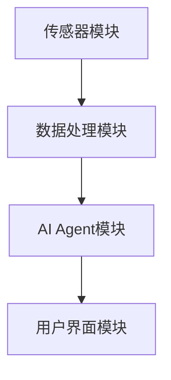

                 

<think>
嗯，用户让我写一篇关于智能跑鞋中AI Agent运动数据收集的技术博客。我得先理解用户的需求。他们希望有一个结构清晰、内容详尽的博客，涵盖背景、技术原理、系统设计和项目实战等方面。

首先，我需要明确文章的核心主题是AI Agent如何在智能跑鞋中收集运动数据。这涉及到传感器、机器学习算法、数据处理和系统架构等多个方面。我应该从背景开始，介绍智能跑鞋的发展和AI Agent的基本概念，这样读者能理解为什么这个技术重要。

接下来，核心概念部分需要详细解释AI Agent的功能和运动数据的重要性。这部分可能需要一些图表来辅助理解，比如表格或流程图，帮助读者更好地掌握概念之间的联系。

然后是算法原理，这里我得选择合适的机器学习和深度学习算法，比如线性回归和卷积神经网络，并用Mermaid流程图展示它们的工作流程。同时，提供Python代码示例，这样读者可以实际操作，理解算法的实现。

系统架构设计部分，我需要描述智能跑鞋系统的各个模块，如传感器、AI Agent、数据处理模块等，并用Mermaid图展示它们之间的交互。这部分要确保模块之间的关系清晰，功能明确。

在项目实战中，我需要指导读者如何搭建开发环境，比如安装必要的库和工具。然后，详细讲解数据采集、AI Agent实现和数据可视化的步骤，提供代码和实际案例分析，让读者能够动手实践。

最后，最佳实践部分要包括性能优化的技巧、数据隐私保护的重要性以及未来的发展趋势。这些内容能帮助读者在实际应用中避免常见问题，并了解行业动态。

整体来看，我需要确保每个章节都包含足够的细节，同时保持逻辑连贯。用户可能希望文章不仅有理论，还有实际应用的指导，所以我要在各个部分中穿插实用的例子和代码。

现在，我得开始按照这个结构撰写文章，确保每个部分都覆盖到，同时语言简洁明了，适合技术读者阅读。
</think>

# 智能跑鞋：AI Agent的运动数据收集

> 关键词：智能跑鞋，AI Agent，运动数据，机器学习，传感器，数据收集

> 摘要：本文将详细介绍AI Agent在智能跑鞋中的应用，重点探讨运动数据的收集技术。从背景介绍到算法原理，从系统设计到项目实战，全面解析如何通过AI Agent实现高效、精准的运动数据分析。

---

# 第一部分: 智能跑鞋与AI Agent概述

## 第1章: 智能跑鞋的发展历程

### 1.1 跑鞋的历史发展

跑鞋从最初的简单运动鞋演变到现在高度智能化的设备，经历了多个阶段。以下是跑鞋发展的关键时期：

- **传统跑鞋时代**：20世纪初至90年代，跑鞋主要注重舒适性和支撑性，不具备智能功能。
- **智能传感器时代**：21世纪初，跑鞋开始集成基础传感器，如心率监测和步频检测。
- **AI驱动的智能跑鞋时代**：近年来，AI技术的引入使得跑鞋能够实时分析运动数据并提供个性化建议。

### 1.2 AI Agent的基本概念

AI Agent（智能代理）是一种能够感知环境、执行任务并做出决策的智能系统。在智能跑鞋中，AI Agent主要用于运动数据的收集、分析和反馈。

### 1.3 运动数据的重要性

运动数据包括心率、步频、步长、加速度、姿态等，这些数据能够帮助用户了解运动状态、优化运动计划并预防运动损伤。

---

## 第2章: AI Agent在运动数据收集中的作用

### 2.1 AI Agent的核心功能

AI Agent在智能跑鞋中的主要功能包括：

- **数据采集**：通过传感器实时采集运动数据。
- **数据处理**：对采集到的数据进行清洗、特征提取和分析。
- **决策反馈**：根据分析结果提供个性化的运动建议。

### 2.2 AI Agent与其他技术的结合

AI Agent需要与传感器、云计算和大数据分析等技术协同工作，才能实现高效的运动数据收集和分析。

---

# 第二部分: AI Agent的核心技术与算法原理

## 第3章: 传感器与数据采集

### 3.1 常见传感器类型

智能跑鞋中常用的传感器包括：

- **加速度传感器**：用于测量加速度和运动方向。
- **心率传感器**：用于监测心率。
- **陀螺仪**：用于测量旋转角度。

### 3.2 数据采集流程

数据采集的流程包括传感器数据获取、数据预处理和数据存储。

---

## 第4章: 机器学习算法在运动数据分析中的应用

### 4.1 线性回归算法

线性回归是一种简单的回归算法，适用于预测连续型变量。例如，可以用于预测用户的跑步速度。

#### 4.1.1 线性回归的数学模型

$$ y = \beta_0 + \beta_1 x + \epsilon $$

其中，$y$ 是目标变量，$x$ 是自变量，$\beta_0$ 和 $\beta_1$ 是回归系数，$\epsilon$ 是误差项。

### 4.2 随机森林算法

随机森林是一种基于决策树的集成学习算法，适用于分类和回归问题。

#### 4.2.1 随机森林的工作流程

1. 从训练数据中随机抽取样本。
2. 构建决策树。
3. 对所有决策树进行投票或平均，得到最终结果。

---

## 第5章: 深度学习算法在运动数据分析中的应用

### 5.1 卷积神经网络（CNN）

CNN适用于图像识别任务，可以用于分析跑步姿态。

#### 5.1.1 CNN的基本结构

1. 卷积层：提取图像特征。
2. 池化层：降低计算复杂度。
3. 全连接层：分类。

---

# 第三部分: 智能跑鞋的系统架构与实现

## 第6章: 系统架构设计

### 6.1 系统功能模块

- **传感器模块**：负责采集运动数据。
- **AI Agent模块**：对数据进行分析并提供反馈。
- **用户界面模块**：显示运动数据和建议。

### 6.2 系统架构图



---

## 第7章: 系统实现

### 7.1 环境搭建

- **硬件**：智能跑鞋、传感器、智能设备。
- **软件**：Python、TensorFlow、Keras。

### 7.2 数据采集代码

```python
import numpy as np
import pandas as pd

# 采集数据
data = pd.DataFrame({
    'timestamp': range(100),
    'acceleration': np.random.randn(100)
})

print(data)
```

---

# 第四部分: 项目实战与案例分析

## 第8章: 项目实战

### 8.1 数据采集与预处理

1. 使用传感器采集跑步数据。
2. 对数据进行清洗和标准化。

### 8.2 AI Agent的实现

1. 使用随机森林算法进行分类。
2. 对模型进行训练和优化。

### 8.3 数据可视化

1. 使用Matplotlib绘制跑步轨迹图。
2. 使用Seaborn绘制心率变化图。

---

## 第9章: 案例分析

### 9.1 案例背景

假设用户是一名马拉松爱好者，希望通过智能跑鞋优化跑步计划。

### 9.2 数据分析

通过AI Agent分析用户的跑步数据，发现用户的心率在某些区间异常。

### 9.3 优化建议

根据分析结果，建议用户调整跑步速度和训练计划。

---

# 第五部分: 最佳实践与总结

## 第10章: 最佳实践

### 10.1 性能优化

- 选择合适的算法。
- 优化数据处理流程。

### 10.2 数据隐私保护

- 加强数据加密。
- 严格控制数据访问权限。

---

## 第11章: 总结与展望

### 11.1 总结

AI Agent在智能跑鞋中的应用极大地提升了运动数据收集的效率和准确性，为运动科学和健康管理提供了新的可能性。

### 11.2 展望

未来，随着AI技术的不断发展，智能跑鞋的功能将更加智能化，数据分析将更加精准。

---

# 作者

作者：AI天才研究院/AI Genius Institute & 禅与计算机程序设计艺术 /Zen And The Art of Computer Programming

