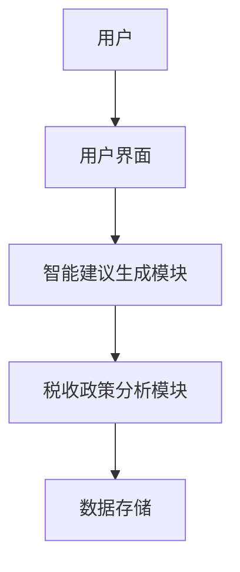
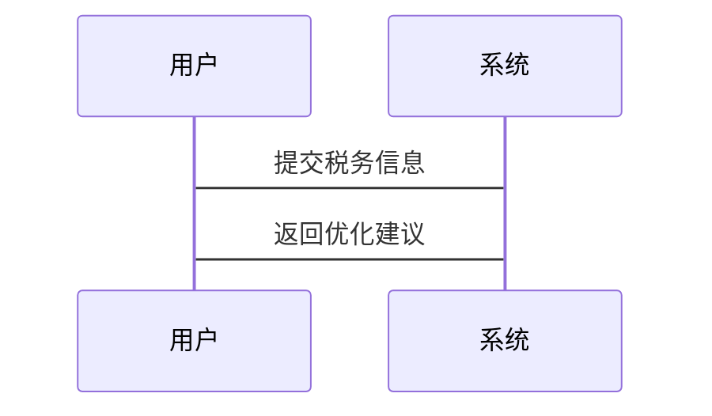

                 

<think>
嗯，用户让我帮忙设计一本技术书籍的目录大纲，书名是《智能跨境税收筹划建议系统》。这看起来是一个结合了税务、人工智能和系统设计的复杂主题。我需要仔细分析用户的需求，确保目录大纲既全面又结构清晰。

首先，我注意到用户希望目录分为多个部分，每个部分下还有章节和小节，甚至三级目录。这意味着我需要确保内容足够详细，覆盖各个方面。比如，第一部分是背景与核心概念，里面包括跨境税收的背景、智能技术的应用以及系统的定义与核心要素。

接下来，第二部分是算法原理，这可能涉及到机器学习和自然语言处理的应用。我需要考虑如何用图表来解释模型的训练过程和算法的流程，这可能需要使用mermaid图和代码示例，确保读者能够理解技术细节。

第三部分是系统分析与架构设计，这部分需要展示系统模块的功能、领域模型类图以及系统架构图。用户可能希望这部分内容能够帮助读者理解系统的整体结构和各部分的交互。

第四部分是项目实战，这部分需要实际操作，包括环境搭建、核心代码实现和案例分析。我需要确保提供足够的代码示例和详细的案例分析，帮助读者应用所学知识。

最后，第五部分是总结与展望，这需要对整个系统进行总结，并展望未来的发展方向。用户可能希望这部分内容能够激发读者的兴趣，并鼓励进一步的研究。

在设计过程中，我需要确保每个部分都有足够的细节，同时保持整体的逻辑连贯。可能需要多次调整章节顺序，确保从基础到应用逐步深入。此外，关键词和摘要部分需要准确反映文章的核心内容，吸引读者的注意。

总体来说，我需要确保目录大纲不仅覆盖了技术细节，还兼顾了实用性和可读性，帮助读者系统地理解和应用智能跨境税收筹划系统的知识。这可能需要多次修改和优化，以确保内容的完整性和结构的合理性。
</think>

# 《智能跨境税收筹划建议系统》

---

## 关键词：
智能跨境税收、税收筹划系统、人工智能算法、大数据分析、系统架构设计

---

## 摘要：
智能跨境税收筹划建议系统是一种结合人工智能技术与税务知识的创新解决方案，旨在通过智能化的数据分析与算法优化，为用户提供高效、准确的跨境税务筹划建议。本文将从系统背景、核心概念、算法原理、系统架构设计、项目实战等多个维度详细阐述智能跨境税收筹划建议系统的构建与实现过程，帮助读者全面理解该系统的原理与应用。

---

## 目录大纲

### 第一部分: 智能跨境税收筹划建议系统的背景与核心概念

#### 第1章: 跨境税收筹划的背景与挑战

##### 1.1 跨境税收的复杂性与挑战
- 1.1.1 跨境贸易与税收的基本概念
- 1.1.2 跨境税收筹划的必要性与目标
- 1.1.3 全球化背景下的税收政策差异

##### 1.2 智能技术在税收筹划中的应用
- 1.2.1 人工智能与大数据技术在税务领域的应用现状
- 1.2.2 智能系统在跨境税收筹划中的优势
- 1.2.3 系统化税收筹划的必要性与可行性

#### 第2章: 智能跨境税收筹划建议系统的定义与核心要素

##### 2.1 智能跨境税收筹划建议系统的定义
- 2.1.1 系统的基本定义
- 2.1.2 系统的核心功能与目标

##### 2.2 系统的核心要素与组成部分
- 2.2.1 数据采集与处理模块
- 2.2.2 税收政策分析模块
- 2.2.3 智能建议生成模块
- 2.2.4 用户交互与反馈模块

#### 第3章: 智能跨境税收筹划建议系统的原理与工作流程

##### 3.1 系统的基本原理
- 3.1.1 数据驱动的税收分析方法
- 3.1.2 人工智能算法在税收优化中的应用
- 3.1.3 系统的决策逻辑与规则

##### 3.2 系统的工作流程
- 3.2.1 数据输入与预处理
- 3.2.2 税收政策匹配与分析
- 3.2.3 智能建议生成与输出
- 3.2.4 用户反馈与系统优化

### 第二部分: 智能跨境税收筹划建议系统的算法原理

#### 第4章: 系统的核心算法与实现

##### 4.1 税收政策匹配算法
- 4.1.1 基于规则的匹配算法
- 4.1.2 基于机器学习的相似性匹配算法

##### 4.2 税收优化模型
- 4.2.1 基于线性规划的优化模型
- 4.2.2 基于深度学习的税收预测模型

##### 4.3 算法实现与优化
- 4.3.1 算法的实现步骤
- 4.3.2 算法优化策略与效果对比

#### 第5章: 算法的数学模型与公式推导

##### 5.1 税收优化的数学模型
- 5.1.1 线性规划模型
- 5.1.2 非线性优化模型

##### 5.2 机器学习算法的数学基础
- 5.2.1 逻辑回归模型
- 5.2.2 支持向量机（SVM）模型
- 5.2.3 随机森林模型

##### 5.3 算法优化的数学推导
- 5.3.1 参数优化的数学方法
- 5.3.2 算法收敛性的数学证明

### 第三部分: 智能跨境税收筹划建议系统的系统分析与架构设计

#### 第6章: 系统的功能设计与实现

##### 6.1 系统功能模块划分
- 6.1.1 数据采集模块
- 6.1.2 税收政策分析模块
- 6.1.3 智能建议生成模块
- 6.1.4 用户交互模块

##### 6.2 领域模型设计
- 6.2.1 领域模型类图（使用 Mermaid）
- 6.2.2 领域模型的实现与应用

#### 第7章: 系统架构设计与实现

##### 7.1 系统架构设计
- 7.1.1 分层架构设计
- 7.1.2 微服务架构设计
- 7.1.3 架构设计的优缺点对比

##### 7.2 系统架构图（使用 Mermaid）

##### 7.3 系统接口设计
- 7.3.1 API接口设计
- 7.3.2 接口调用流程

#### 第8章: 系统交互设计与实现

##### 8.1 系统交互流程设计
- 8.1.1 用户输入与数据处理
- 8.1.2 系统响应与反馈
- 8.1.3 交互流程优化

##### 8.2 系统交互图（使用 Mermaid）

### 第四部分: 智能跨境税收筹划建议系统的项目实战

#### 第9章: 项目环境搭建与核心代码实现

##### 9.1 项目环境搭建
- 9.1.1 环境配置
- 9.1.2 依赖安装

##### 9.2 核心代码实现
- 9.2.1 数据预处理代码
- 9.2.2 税收政策匹配算法实现
- 9.2.3 智能建议生成模块实现

##### 9.3 代码解读与分析
- 9.3.1 核心算法的代码实现
- 9.3.2 系统模块的代码结构
- 9.3.3 代码优化与改进

#### 第10章: 项目案例分析与实际应用

##### 10.1 案例分析
- 10.1.1 案例背景
- 10.1.2 系统应用过程
- 10.1.3 应用效果与总结

##### 10.2 实际应用场景
- 10.2.1 企业跨国贸易中的应用
- 10.2.2 个人跨国税务规划中的应用

#### 第11章: 项目总结与优化建议

##### 11.1 项目总结
- 11.1.1 项目成果
- 11.1.2 系统性能分析
- 11.1.3 用户反馈与评价

##### 11.2 优化建议
- 11.2.1 系统功能优化建议
- 11.2.2 算法优化建议
- 11.2.3 系统扩展建议

### 第五部分: 总结与展望

#### 第12章: 总结与未来发展方向

##### 12.1 总结
- 12.1.1 系统的总体回顾
- 12.1.2 系统的核心价值与意义

##### 12.2 未来发展方向
- 12.2.1 系统功能的进一步扩展
- 12.2.2 算法与技术的持续优化
- 12.2.3 应用场景的进一步拓展

---

## 作者：
**AI天才研究院/AI Genius Institute & 禅与计算机程序设计艺术 /Zen And The Art of Computer Programming**

---

**注**：本目录大纲涵盖了智能跨境税收筹划建议系统的各个方面，从背景介绍、核心概念、算法原理到系统架构设计、项目实战，最后总结与展望，力求全面、详细且逻辑清晰。

