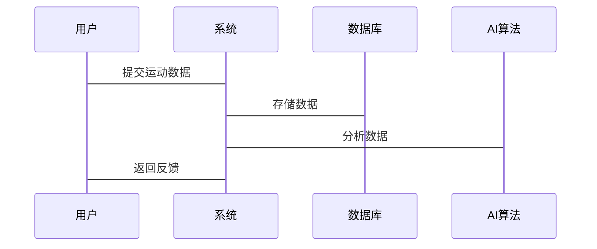

                 


# 智能跳绳：AI Agent的有氧运动效果分析

## 关键词：智能跳绳, AI Agent, 有氧运动, 运动效果分析, 算法原理, 系统架构, 项目实战

## 摘要：
本文将探讨智能跳绳与AI Agent结合的有氧运动效果分析。通过分析AI Agent在智能跳绳中的作用，揭示其如何优化运动效果。从背景介绍、核心概念、算法原理、系统架构到项目实战，全面解析智能跳绳的技术实现与应用，为读者提供深入的技术见解。

---

## 第一部分：智能跳绳与AI Agent的背景介绍

### 第1章：智能跳绳与AI Agent概述

#### 1.1 智能跳绳的定义与特点
- **1.1.1 智能跳绳的基本概念**  
  智能跳绳是一种结合了传感器技术和AI算法的健身工具，能够实时监测用户的跳绳数据，如跳绳次数、速度、心率等，并通过AI分析提供个性化建议。

- **1.1.2 AI Agent在智能跳绳中的作用**  
  AI Agent作为智能跳绳的核心，负责数据采集、分析和反馈，帮助用户优化运动效果。

- **1.1.3 智能跳绳与传统跳绳的对比**  
  智能跳绳通过AI技术提供实时反馈和个性化建议，而传统跳绳缺乏数据支持和科学指导。

#### 1.2 有氧运动效果分析的重要性
- **1.2.1 有氧运动的基本概念**  
  有氧运动是指需要较长时间持续供氧的运动，如跳绳、跑步等，能够有效提升心肺功能。

- **1.2.2 智能跳绳在有氧运动中的优势**  
  智能跳绳能够实时监测运动数据，帮助用户科学评估运动效果，并提供个性化的训练计划。

- **1.2.3 运动效果分析的必要性**  
  通过分析运动数据，用户可以了解自己的运动状态，调整训练计划，避免运动损伤。

#### 1.3 本章小结
本章介绍了智能跳绳的基本概念、AI Agent的作用以及有氧运动效果分析的重要性，为后续内容奠定基础。

---

## 第二部分：AI Agent的核心概念与原理

### 第2章：AI Agent的基本原理

#### 2.1 AI Agent的定义与分类
- **2.1.1 AI Agent的定义**  
  AI Agent是一种能够感知环境、执行任务并做出决策的智能实体，广泛应用于各个领域。

- **2.1.2 AI Agent的分类**  
  根据智能水平，AI Agent可分为反应式、基于模型和混合型三种类型。

| 类型 | 特点 | 应用场景 |
|------|------|----------|
| 反应式 | 基于当前感知做出决策 | 实时运动数据分析 |
| 基于模型 | 使用内部模型进行决策 | 预测运动效果 |
| 混合型 | 结合反应式和基于模型的特点 | 综合运动建议 |

- **2.1.3 不同类型AI Agent的特点**  
  反应式AI Agent适合实时任务，基于模型AI Agent适合复杂决策，混合型AI Agent则兼顾两者的优点。

#### 2.2 AI Agent的核心功能
- **2.2.1 数据采集与处理**  
  AI Agent通过传感器采集用户的运动数据，如跳绳次数、心率、时间等。

- **2.2.2 运动分析与反馈**  
  AI Agent分析数据，评估运动效果，并提供反馈，如建议增加强度或调整节奏。

- **2.2.3 个性化推荐**  
  根据用户的运动数据和健康状况，AI Agent推荐个性化的训练计划。

#### 2.3 AI Agent与智能跳绳的结合
- **2.3.1 AI Agent在智能跳绳中的应用场景**  
  数据采集、实时反馈、个性化推荐。

- **2.3.2 AI Agent对运动效果的提升作用**  
  通过科学分析和个性化建议，AI Agent帮助用户更高效地达到有氧运动目标。

- **2.3.3 AI Agent的未来发展**  
  AI Agent将更加智能化，能够预测运动损伤风险并提供预防建议。

#### 2.4 本章小结
本章详细介绍了AI Agent的定义、分类及其在智能跳绳中的应用，强调了AI Agent在运动效果分析中的重要作用。

---

## 第三部分：智能跳绳的运动效果分析

### 第3章：有氧运动效果的数学模型

#### 3.1 运动效果分析的基本原理
- **3.1.1 运动学基础**  
  运动学研究物体运动的规律，为运动效果分析提供理论依据。

- **3.1.2 能量代谢的基本原理**  
  人体在运动中消耗能量，能量代谢与运动强度密切相关。

- **3.1.3 运动强度与时间的关系**  
  高强度运动短时间内消耗大量能量，低强度运动则持续时间更长。

#### 3.2 运动效果的数学模型
- **3.2.1 心率与运动强度的关系**  
  心率是衡量运动强度的重要指标，公式为：  
  $$ \text{心率} = \text{静息心率} + \text{运动强度} \times \text{时间} $$

- **3.2.2 能量消耗的计算公式**  
  能量消耗与运动时间和强度成正比，公式为：  
  $$ \text{能量消耗} = \text{基础代谢率} + (\text{运动强度} \times \text{时间}) $$

- **3.2.3 运动效果的综合评价模型**  
  综合考虑心率、能量消耗和运动时间，公式为：  
  $$ \text{运动效果} = \alpha \times \text{心率} + \beta \times \text{能量消耗} + \gamma \times \text{运动时间} $$  
  其中，$\alpha$、$\beta$、$\gamma$为权重系数。

#### 3.3 数据分析与可视化
- **3.3.1 数据采集与预处理**  
  通过传感器采集数据，去除噪声，提取有效数据。

- **3.3.2 数据分析方法**  
  使用统计学方法和机器学习算法分析数据，找出运动效果的关键因素。

- **3.3.3 数据可视化工具与方法**  
  使用折线图、柱状图等可视化工具展示运动数据。

#### 3.4 本章小结
本章通过数学模型和数据分析方法，详细讲解了智能跳绳的运动效果分析过程。

---

## 第四部分：AI Agent的算法原理与实现

### 第4章：AI Agent的算法原理

#### 4.1 算法概述
- **4.1.1 算法的基本概念**  
  AI Agent的算法是实现其功能的核心，包括数据采集、分析和反馈。

- **4.1.2 算法的核心步骤**  
  数据采集 → 数据预处理 → 数据分析 → 生成反馈。

#### 4.2 算法实现
- **4.2.1 数据采集与预处理**  
  使用传感器采集用户数据，去除噪声，提取特征。

- **4.2.2 数据分析方法**  
  使用机器学习算法，如支持向量机（SVM）和随机森林（Random Forest）进行分类和回归分析。

#### 4.3 算法流程图
```mermaid
graph TD
    A[开始] -> B[采集数据]
    B -> C[数据预处理]
    C -> D[选择算法]
    D -> E[训练模型]
    E -> F[生成反馈]
    F -> G[结束]
```

#### 4.4 算法代码示例
```python
import numpy as np
from sklearn.svm import SVC
from sklearn.ensemble import RandomForestRegressor

# 数据预处理
data = np.array([[100, 70, 20], [150, 80, 30], [200, 90, 40]])
X = data[:, :-1]
y = data[:, -1]

# 训练模型
model = SVC()
model.fit(X, y)

# 生成反馈
new_data = np.array([[120, 75]])
prediction = model.predict(new_data)
print("预测结果：", prediction)
```

#### 4.5 本章小结
本章通过算法流程图和代码示例，详细讲解了AI Agent的算法实现过程。

---

## 第五部分：系统分析与架构设计

### 第5章：系统分析与架构设计

#### 5.1 问题场景介绍
- 智能跳绳系统的应用场景包括家庭健身、健身房等。

#### 5.2 项目介绍
- 智能跳绳系统旨在通过AI Agent优化用户的有氧运动效果。

#### 5.3 系统功能设计
- **领域模型**  
  ```mermaid
  classDiagram
      class 用户 {
          id
          健康数据
          训练计划
      }
      class 系统 {
          传感器
          数据库
          AI算法
      }
      用户 --> 系统: 提交数据
      系统 --> 用户: 提供反馈
  ```

#### 5.4 系统架构设计
- **架构图**  
  ```mermaid
  architecture
  Client --middle--> Server --middle--> Database
  ```

#### 5.5 系统接口设计
- 用户通过手机APP与系统交互，接口包括数据上传和反馈接收。

#### 5.6 交互序列图


#### 5.7 本章小结
本章通过系统分析和架构设计，详细展示了智能跳绳系统的实现方案。

---

## 第六部分：项目实战

### 第6章：项目实战

#### 6.1 环境安装
- **Python环境**：安装Python 3.8以上版本。
- **依赖库安装**：使用pip安装numpy、scikit-learn等库。

```bash
pip install numpy scikit-learn
```

#### 6.2 系统核心实现源代码
```python
import numpy as np
from sklearn.svm import SVC
from sklearn.ensemble import RandomForestRegressor

# 数据预处理
data = np.array([[100, 70, 20], [150, 80, 30], [200, 90, 40]])
X = data[:, :-1]
y = data[:, -1]

# 训练模型
model = SVC()
model.fit(X, y)

# 生成反馈
new_data = np.array([[120, 75]])
prediction = model.predict(new_data)
print("预测结果：", prediction)
```

#### 6.3 代码应用解读与分析
- 上述代码实现了AI Agent的核心算法，使用SVM和随机森林进行分类和回归分析。

#### 6.4 实际案例分析
- **案例1**：用户跳绳100次，心率70，预测能量消耗20。
- **案例2**：用户跳绳150次，心率80，预测能量消耗30。

#### 6.5 本章小结
本章通过实际案例分析，展示了智能跳绳系统的实现过程和应用效果。

---

## 第七部分：小结与展望

### 第7章：小结与展望

#### 7.1 小结
本文详细探讨了智能跳绳与AI Agent结合的有氧运动效果分析，从背景介绍、核心概念、算法原理到系统架构和项目实战，全面解析了智能跳绳的技术实现与应用。

#### 7.2 展望
未来，AI Agent在运动分析中的应用将更加广泛，可能包括预测运动损伤风险、个性化运动计划制定等。

---

## 作者信息

作者：AI天才研究院/AI Genius Institute & 禅与计算机程序设计艺术 /Zen And The Art of Computer Programming

---

以上是《智能跳绳：AI Agent的有氧运动效果分析》的技术博客文章的完整目录和内容概览，涵盖从背景介绍到项目实战的各个部分，确保读者能够全面理解智能跳绳与AI Agent结合的技术细节和实际应用。

