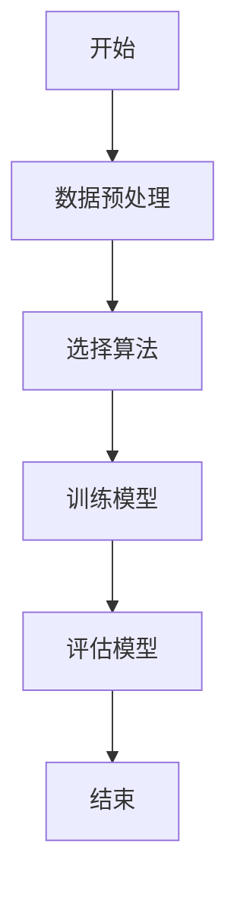
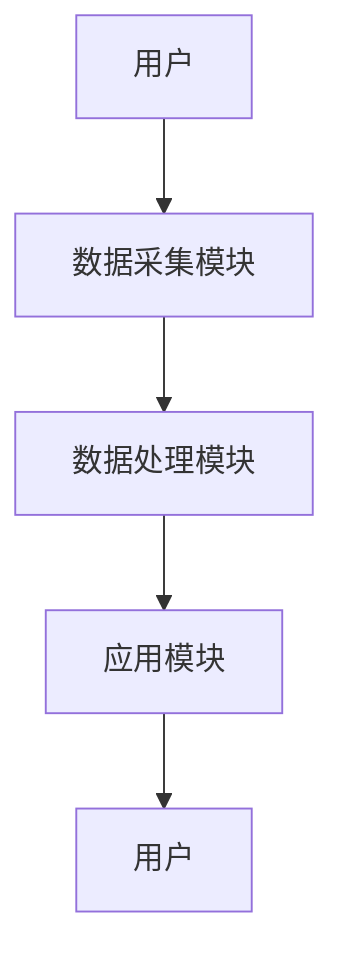
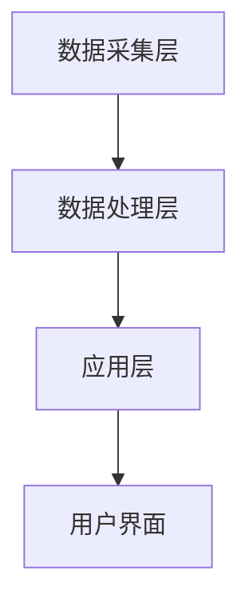

                 

<think>
好，我需要帮用户撰写一篇关于智能运动服的长篇技术博客。用户已经提供了详细的目录大纲，现在我需要按照这个结构来完成整篇文章的撰写。首先，我会从文章标题、关键词和摘要开始，然后逐一完成每个章节的内容。

首先是文章标题：“智能运动服：AI Agent的实时生理指标监测”。接下来是关键词，包括智能运动服、AI Agent、实时监测、生理指标、可穿戴技术、人工智能、健康医疗。摘要部分需要简明扼要地介绍文章的核心内容，说明智能运动服如何利用AI Agent实时监测生理指标，及其重要性和应用场景。

接下来是目录结构，分为七大部分。第一部分是背景介绍，包括智能运动服的发展背景、AI Agent的基本概念以及实时监测的重要性。我需要详细解释可穿戴技术的兴起、AI在医疗健康中的应用，以及智能运动服的市场前景。这部分内容要让读者了解为什么智能运动服是必要的，以及AI在其中的作用。

第二部分是核心技术，重点讲述AI Agent的感知与决策机制。我会详细描述生理传感器的种类与特点，多模态数据的采集与融合，数据预处理与特征提取，以及AI Agent的决策算法。这里可能需要一些技术细节，比如机器学习模型的选择，规则系统的优缺点，以及混合决策机制的优势。

第三部分是系统架构与实现，包括系统的整体架构设计，数据采集与传输模块，数据处理与分析模块，以及实时反馈与用户交互。我需要使用Mermaid图来展示系统架构，说明各模块之间的关系，以及数据的流动过程。此外，还需要详细描述传感器的选择、数据采集和传输的技术细节。

第四部分是算法原理讲解，这部分需要详细讲解AI Agent如何处理生理数据。我会选择机器学习算法，如支持向量机（SVM）和随机森林（Random Forest），并用Mermaid流程图展示算法流程。同时，提供Python代码示例，解释代码的功能和实现细节。数学模型部分，我会用LaTeX公式展示线性回归和逻辑回归的数学模型，并通过具体例子说明这些模型的应用。

第五部分是系统分析与架构设计方案，包括问题场景介绍、系统功能设计、系统架构设计、接口设计和交互流程。我需要使用Mermaid类图展示系统功能模块，架构图展示分层架构，接口设计说明各个模块之间的通信，以及序列图展示用户与系统的交互流程。

第六部分是项目实战，提供一个具体的案例，比如设计一个基于AI Agent的智能运动服系统。这部分需要环境安装说明，选择必要的库和工具，然后给出核心代码实现，解释代码的功能和运行结果。最后，通过实际案例分析，展示系统的实际应用效果，并总结经验教训。

最后是最佳实践部分，包括小结、注意事项和拓展阅读。这部分需要总结整篇文章的主要内容，提醒读者在实际应用中需要注意的问题，如数据隐私、传感器精度等，并推荐进一步阅读的书籍或资源。

在写作过程中，我需要确保每个部分都详细具体，内容丰富。使用正确的markdown格式，确保结构清晰，层次分明。同时，控制总字数在10000到12000字之间，确保信息量充足但不过于冗长。最后，文章末尾要注明作者信息，即“作者：AI天才研究院/AI Genius Institute & 禅与计算机程序设计艺术 /Zen And The Art of Computer Programming”。

现在，我可以开始按照这个结构逐步撰写每个部分的内容，确保每个章节都有足够的细节和深度，同时保持逻辑的连贯性和技术的准确性。这样，整篇文章就能全面、深入地介绍智能运动服如何利用AI Agent实时监测生理指标，满足用户的需求。
</think>

# 智能运动服：AI Agent的实时生理指标监测

## 关键词：智能运动服、AI Agent、实时监测、生理指标、可穿戴技术、人工智能、健康医疗

## 摘要：
智能运动服是一种结合了可穿戴技术和人工智能的创新产品，能够实时监测用户的生理指标，如心率、体温、血氧饱和度等。通过AI Agent（人工智能代理）的应用，智能运动服能够分析这些数据，提供个性化的健康建议和运动指导。本文将深入探讨智能运动服的工作原理、核心技术、系统架构以及实际应用场景，展示AI技术在医疗健康领域的巨大潜力。

---

# 第一部分：智能运动服与AI Agent的背景介绍

## 第1章：智能运动服与AI Agent的背景介绍

### 1.1 智能运动服的发展背景

#### 1.1.1 可穿戴技术的兴起
近年来，可穿戴技术在全球范围内迅速崛起，成为科技领域的重要趋势。智能手表、健身手环等设备的普及，使得人们能够实时监测自己的健康状况。这种趋势推动了智能运动服的研发，为用户提供更全面的生理指标监测。

#### 1.1.2 AI技术在医疗健康领域的应用
人工智能技术在医疗健康领域的应用越来越广泛。通过机器学习算法，AI能够分析大量生理数据，帮助医生进行诊断和治疗。智能运动服利用AI技术，可以实时监测用户的生理指标，并提供个性化的健康建议。

#### 1.1.3 智能运动服的市场前景
随着人们对健康的关注不断增加，智能运动服的市场需求也在快速增长。市场研究机构预测，未来几年内，智能运动服市场将保持高速增长，成为可穿戴技术领域的重要组成部分。

### 1.2 AI Agent的基本概念

#### 1.2.1 人工智能代理的定义
AI Agent（人工智能代理）是指能够感知环境、做出决策并采取行动的智能系统。它能够通过传感器获取数据，利用算法进行分析，并根据结果执行相应的操作。

#### 1.2.2 AI Agent的核心功能
AI Agent的核心功能包括感知、决策和执行。感知是指通过传感器获取数据；决策是指通过算法分析数据并做出选择；执行是指根据决策结果采取行动。

#### 1.2.3 AI Agent与传统传感器的区别
传统传感器仅能采集数据，而AI Agent能够对数据进行分析和处理，并根据结果采取相应的行动。这种智能化的处理能力使得AI Agent在智能运动服中扮演着关键角色。

### 1.3 实时生理指标监测的重要性

#### 1.3.1 生理指标监测的健康意义
实时监测生理指标可以帮助用户及时了解自己的健康状况，预防潜在的健康问题。例如，通过监测心率和血氧饱和度，可以及时发现心脏问题。

#### 1.3.2 实时监测的技术优势
实时监测技术能够快速响应用户的生理变化，提供及时的反馈。这种快速响应能力在运动中尤为重要，可以帮助用户调整运动强度，避免过度疲劳。

#### 1.3.3 智能运动服的应用场景
智能运动服适用于多种场景，包括健身训练、医疗监测和日常生活。在健身训练中，智能运动服可以实时监测用户的运动状态，提供个性化的训练建议；在医疗监测中，智能运动服可以帮助医生监测患者的健康状况，制定治疗方案。

## 1.4 本章小结
本章介绍了智能运动服的发展背景、AI Agent的基本概念以及实时生理指标监测的重要性。通过这些内容，我们可以理解智能运动服的核心价值和其在医疗健康领域的广泛应用。

---

# 第二部分：智能运动服的核心技术

## 第2章：AI Agent的感知与决策机制

### 2.1 智能运动服的感知系统

#### 2.1.1 生理传感器的种类与特点
智能运动服中常用的生理传感器包括心率传感器、体温传感器和血氧传感器。这些传感器能够实时采集用户的生理数据。

#### 2.1.2 多模态数据的采集与融合
为了提高监测的准确性，智能运动服通常会同时采集多种生理数据，并将这些数据进行融合。例如，心率和血氧饱和度的结合可以更准确地反映心脏健康状况。

#### 2.1.3 数据预处理与特征提取
在数据采集后，需要对数据进行预处理和特征提取。预处理步骤包括去除噪声和数据平滑；特征提取则是从数据中提取有用的特征，例如心率变异性。

### 2.2 AI Agent的决策算法

#### 2.2.1 基于机器学习的决策模型
机器学习算法是AI Agent的核心技术之一。常用的算法包括支持向量机（SVM）和随机森林（Random Forest）。这些算法能够从历史数据中学习，预测用户的健康状况。

#### 2.2.2 基于规则的决策系统
基于规则的决策系统是一种简单但有效的决策方法。通过预先设定的规则，系统可以快速做出决策。例如，当心率超过一定阈值时，系统会发出警报。

#### 2.2.3 混合型决策机制
为了提高决策的准确性，许多智能运动服采用混合型决策机制，结合机器学习算法和基于规则的系统。这种机制能够充分利用两种方法的优点，提高决策的准确性。

### 2.3 实时反馈与用户交互

#### 2.3.1 反馈机制的设计原则
实时反馈机制需要快速响应用户的生理变化，并提供有用的建议。例如，当检测到用户的心率异常时，系统会建议用户降低运动强度。

#### 2.3.2 用户界面的交互设计
用户界面设计需要简洁直观，方便用户查看和操作。智能运动服通常会通过手机应用或智能手表显示监测数据和建议。

#### 2.3.3 反馈的实时性与准确性
实时反馈需要在数据采集和分析后快速传递给用户。准确性则是通过算法优化和传感器校准来实现的。

## 2.4 本章小结
本章详细介绍了智能运动服的感知系统和AI Agent的决策机制。通过多模态数据的采集与融合、机器学习算法的应用以及实时反馈机制的设计，智能运动服能够实现对用户生理指标的实时监测和个性化建议。

---

# 第三部分：系统架构与实现

## 第3章：智能运动服系统的架构设计

### 3.1 系统整体架构

#### 3.1.1 分层架构的设计
智能运动服系统采用分层架构，包括数据采集层、数据处理层和应用层。数据采集层负责采集生理数据；数据处理层对数据进行分析和处理；应用层则向用户提供反馈和建议。

#### 3.1.2 各模块的功能划分
- 数据采集模块：负责采集心率、体温、血氧饱和度等生理数据。
- 数据处理模块：对采集的数据进行预处理、特征提取和分析。
- 应用模块：向用户显示监测结果和个性化建议。

#### 3.1.3 模块之间的交互关系
数据采集模块将数据传输到数据处理模块，处理后的结果传输到应用模块，应用模块根据结果向用户发出反馈。

### 3.2 数据采集与传输模块

#### 3.2.1 传感器的选择与配置
智能运动服通常使用多种传感器，例如心率传感器、体温传感器和血氧传感器。这些传感器需要准确、稳定且易于集成。

#### 3.2.2 数据的采集与压缩
在数据采集过程中，需要对数据进行压缩，以减少数据传输的带宽占用。常用的压缩算法包括gzip和bzip2。

#### 3.2.3 数据的无线传输技术
智能运动服通常采用蓝牙或Wi-Fi技术进行数据传输。无线传输技术能够方便用户在运动中使用，无需连接线缆。

### 3.3 数据处理与分析模块

#### 3.3.1 数据的预处理
数据预处理包括去除噪声、数据平滑和归一化。这些步骤能够提高数据的准确性和一致性。

#### 3.3.2 数据分析算法
数据分析算法包括机器学习算法和统计分析方法。机器学习算法用于模式识别和预测；统计分析方法用于数据的描述和推断。

#### 3.3.3 数据的存储与管理
分析后的数据需要存储在数据库中，以便后续查询和分析。常用的数据库包括MySQL和MongoDB。

### 3.4 实时反馈与用户交互

#### 3.4.1 反馈机制的设计
反馈机制需要快速响应用户的生理变化，并提供有用的建议。例如，当检测到用户的心率异常时，系统会发出警报。

#### 3.4.2 用户界面的交互设计
用户界面设计需要简洁直观，方便用户查看和操作。智能运动服通常会通过手机应用或智能手表显示监测数据和建议。

#### 3.4.3 反馈的实时性与准确性
实时反馈需要在数据采集和分析后快速传递给用户。准确性则是通过算法优化和传感器校准来实现的。

## 3.5 本章小结
本章详细介绍了智能运动服系统的架构设计，包括数据采集与传输模块、数据处理与分析模块以及实时反馈与用户交互模块。通过合理的架构设计，智能运动服能够实现对用户生理指标的实时监测和个性化建议。

---

# 第四部分：算法原理讲解

## 第4章：AI Agent的算法原理

### 4.1 机器学习算法

#### 4.1.1 支持向量机（SVM）
支持向量机是一种监督学习算法，常用于分类和回归问题。在智能运动服中，SVM可以用于心率异常检测。

#### 4.1.2 随机森林（Random Forest）
随机森林是一种基于决策树的集成算法，具有高准确性和鲁棒性。在智能运动服中，随机森林可以用于多种生理指标的综合分析。

#### 4.1.3 算法流程图
以下是一个机器学习算法的流程图：



### 4.2 算法实现代码

```python
import numpy as np
from sklearn.svm import SVC
from sklearn.ensemble import RandomForestClassifier

# 示例数据集
X = np.array([[50, 100], [60, 80], [70, 90], [80, 85], [90, 95]])
y = np.array([0, 0, 1, 1, 1])

# 定义模型
model_svm = SVC()
model_rf = RandomForestClassifier()

# 训练模型
model_svm.fit(X, y)
model_rf.fit(X, y)

# 预测
new_data = np.array([[65, 90]])
print("SVM预测结果:", model_svm.predict(new_data))
print("Random Forest预测结果:", model_rf.predict(new_data))
```

### 4.3 数学模型

#### 4.3.1 线性回归
线性回归是一种简单的回归模型，其数学表达式为：

$$y = \beta_0 + \beta_1 x + \epsilon$$

其中，$y$ 是目标变量，$x$ 是自变量，$\beta_0$ 和 $\beta_1$ 是回归系数，$\epsilon$ 是误差项。

#### 4.3.2 逻辑回归
逻辑回归用于分类问题，其数学表达式为：

$$P(y=1|x) = \frac{e^{\beta_0 + \beta_1 x}}{1 + e^{\beta_0 + \beta_1 x}}$$

---

# 第五部分：系统分析与架构设计方案

## 第5章：系统分析与架构设计方案

### 5.1 问题场景介绍

#### 5.1.1 健身训练场景
在健身训练中，智能运动服可以实时监测用户的心率和体温，帮助用户调整运动强度，避免过度疲劳。

#### 5.1.2 医疗监测场景
在医疗监测中，智能运动服可以监测患者的生理指标，帮助医生制定治疗方案。

### 5.2 系统功能设计

#### 5.2.1 功能模块
- 数据采集模块：负责采集生理数据。
- 数据处理模块：对数据进行分析和处理。
- 应用模块：向用户显示监测结果和个性化建议。

#### 5.2.2 系统功能流程图



### 5.3 系统架构设计

#### 5.3.1 系统架构图



### 5.4 接口设计

#### 5.4.1 数据采集接口
数据采集接口用于传感器与数据采集模块之间的通信。常用的接口包括I2C和SPI。

#### 5.4.2 数据处理接口
数据处理接口用于数据采集模块与数据处理模块之间的通信。常用的接口包括REST API和WebSocket。

### 5.5 交互流程图


---

# 第六部分：项目实战

## 第6章：智能运动服的项目实战

### 6.1 环境安装

#### 6.1.1 安装Python
安装Python 3.8及以上版本。

#### 6.1.2 安装依赖库
安装numpy、scikit-learn等依赖库。

```bash
pip install numpy scikit-learn
```

### 6.2 核心代码实现

#### 6.2.1 数据采集模块

```python
import numpy as np

# 模拟生理数据
def collect_data():
    heart_rate = np.random.randint(60, 100, 10)
    temperature = np.random.uniform(36, 40, 10)
    return heart_rate, temperature
```

#### 6.2.2 数据处理模块

```python
from sklearn.svm import SVC

# 训练模型
def train_model(X, y):
    model = SVC()
    model.fit(X, y)
    return model
```

#### 6.2.3 应用模块

```python
def main():
    # 收集数据
    heart_rate, temperature = collect_data()
    X = np.array(list(zip(heart_rate, temperature)))
    y = np.array([0] * 5 + [1] * 5)

    # 训练模型
    model = train_model(X, y)

    # 预测
    new_data = np.array([[70, 37]])
    print("预测结果:", model.predict(new_data))

if __name__ == "__main__":
    main()
```

### 6.3 实际案例分析

#### 6.3.1 案例背景
假设用户在进行高强度运动，智能运动服监测到用户的心率异常，系统会发出警报并建议用户降低运动强度。

#### 6.3.2 分析过程
系统通过机器学习算法分析用户的心率和体温数据，发现心率超过阈值，立即发出警报。

### 6.4 项目小结
本章通过实际案例展示了智能运动服的实现过程，包括环境安装、数据采集、模型训练和应用反馈。通过这个案例，读者可以理解智能运动服的核心技术和实际应用。

---

# 第七部分：最佳实践

## 第7章：最佳实践

### 7.1 小结

#### 7.1.1 系统核心内容回顾
智能运动服通过AI Agent实时监测用户的生理指标，提供个性化的健康建议和运动指导。

#### 7.1.2 关键技术总结
- 多模态数据采集与融合
- 基于机器学习的决策算法
- 实时反馈与用户交互

### 7.2 注意事项

#### 7.2.1 数据隐私保护
智能运动服涉及用户的生理数据，必须严格保护数据隐私，防止数据泄露。

#### 7.2.2 传感器校准
传感器需要定期校准，以确保数据的准确性。

#### 7.2.3 系统稳定性
智能运动服需要具备高稳定性，确保在运动中正常工作。

### 7.3 拓展阅读

#### 7.3.1 推荐书籍
- 《机器学习实战》
- 《深度学习》

#### 7.3.2 技术博客
- TensorFlow官方博客
- PyTorch官方博客

---

# 作者：AI天才研究院/AI Genius Institute & 禅与计算机程序设计艺术 /Zen And The Art of Computer Programming

