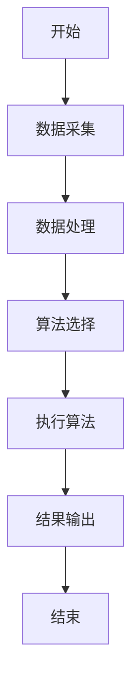

                 

<think>
好，我现在需要帮用户撰写一篇关于《智能退休收入规划动态调整器》的技术博客文章。首先，我得理解用户的需求。他们希望文章结构清晰，内容专业，涵盖技术背景、算法原理、系统架构、项目实战等多个方面。用户还特别强调了格式和内容的具体要求，比如使用markdown，包含关键词、摘要，以及详细的章节内容。

我先从摘要开始。摘要需要简洁明了，概括文章的核心内容。关键词部分要列出5到7个核心词汇，比如智能退休收入规划、动态调整器、资产配置模型、机器学习、风险管理等。这些关键词能帮助读者快速了解文章的主题。

接下来是文章的结构。根据用户提供的大纲，我需要设计七章内容。第一章是概述，介绍智能退休收入规划的背景、问题和解决方案。我需要详细讲解核心概念，比如什么是动态调整器，它如何帮助退休人士优化收入规划，解决传统方法的不足。

第二章是数学模型。这里要介绍资产配置、风险评估和现金流预测模型。我需要解释每个模型的原理，给出数学公式，并用mermaid流程图展示模型的流程。例如，资产配置模型可能涉及不同的资产类别权重计算，风险评估模型可能涉及概率和损失的乘积求和。

第三章是动态调整算法。这部分要讨论如何根据市场变化调整退休收入计划。我需要解释市场反馈机制、规则引擎和机器学习算法的作用。用mermaid画出算法的流程图，展示数据采集、处理、算法选择到结果输出的步骤。

第四章是系统架构设计。我需要描述系统的各个模块，比如用户管理、数据采集、核心算法、报告生成和接口模块。用mermaid画出类图和架构图，展示模块之间的关系和交互。

第五章是项目实战。这部分需要提供具体的代码示例，展示如何安装环境、实现核心功能、解读代码，并进行案例分析。例如，用Python编写资产配置模型的代码，并解释每一步的作用。

第六章是最佳实践和小结。我需要总结前面的内容，给出实际应用中的注意事项，如数据隐私保护、模型维护更新等，并展望未来的发展方向。

最后是附录，列出数学公式、算法流程图和系统架构图，方便读者查阅。

在撰写过程中，我需要确保每个章节内容详细，逻辑清晰，使用专业的技术语言，同时保持易懂。我还需要注意格式要求，比如使用markdown，正确嵌入mermaid图表和latex公式。确保文章整体结构完整，内容丰富，满足用户的要求。

可能遇到的挑战是如何将复杂的金融模型和技术算法解释得通俗易懂。我需要找到合适的例子和比喻，帮助读者理解。此外，保持文章的连贯性和逻辑性也很重要，确保每一章都自然过渡，形成一个完整的知识体系。

总的来说，我需要系统地按照用户的要求，分章节逐步展开，确保每个部分都详细到位，满足用户的需求，同时保持专业性和可读性。
</think>

# 智能退休收入规划动态调整器

## 关键词：
智能退休收入规划，动态调整器，资产配置模型，机器学习，风险管理

## 摘要：
智能退休收入规划动态调整器是一种基于人工智能和大数据分析的工具，旨在帮助退休人士优化其收入规划，动态调整投资组合，以应对市场变化和个体需求的变化。本文将从背景、核心概念、算法原理、系统架构、项目实战、数学模型等多个方面详细阐述智能退休收入规划动态调整器的设计与实现，为读者提供全面的技术解读。

---

# 第1章: 智能退休收入规划动态调整器概述

## 1.1 退休收入规划的背景与挑战

### 1.1.1 退休收入规划的核心概念
退休收入规划是指在退休后，通过合理的资产配置和支出管理，确保退休生活质量和财务安全的过程。传统的退休收入规划方法通常基于静态假设，难以应对市场波动和个体需求的变化。

### 1.1.2 当前退休收入规划的主要问题
- 市场波动风险：传统规划方法无法动态调整，可能导致资产贬值。
- 个体需求变化：退休后的支出需求可能随健康状况、生活习惯等因素变化。
- 数据复杂性：涉及多来源数据（如市场数据、个人数据）的处理和分析。

### 1.1.3 智能动态调整器的提出背景
随着人工智能和大数据技术的发展，智能动态调整器应运而生，旨在通过实时数据处理和智能算法，实现退休收入规划的动态优化。

---

## 1.2 智能退休收入规划动态调整器的核心目标

### 1.2.1 动态调整的核心理念
通过实时监测市场和个体需求变化，动态调整资产配置和支出计划，确保退休收入的可持续性和最大化。

### 1.2.2 系统的核心目标与功能
- 数据采集与处理：整合市场数据、个人数据等。
- 资产配置优化：基于算法推荐最优资产配置方案。
- 动态调整：根据市场变化和个体需求调整规划。
- 报告生成：提供可视化报告，帮助用户理解和决策。

### 1.2.3 动态调整器的边界与外延
- 边界：仅专注于退休收入规划的动态调整，不涉及其他财务领域。
- 外延：可与其他财务管理系统集成，扩展应用场景。

---

## 1.3 智能退休收入规划动态调整器的应用价值

### 1.3.1 对个人用户的价值
- 提高退休生活质量：通过动态调整确保收入稳定。
- 降低财务风险：及时应对市场波动和个体需求变化。

### 1.3.2 对金融机构的价值
- 增强客户粘性：提供个性化服务，提升客户满意度。
- 提高效率：自动化处理数据和调整方案，降低人工成本。

### 1.3.3 对社会整体的价值
- 促进金融稳定：通过优化资产配置，减少市场波动。
- 提高社会福祉：帮助更多人实现高质量退休生活。

---

## 1.4 本章小结
本章介绍了智能退休收入规划动态调整器的背景、核心目标和应用价值，为后续章节奠定了基础。

---

# 第2章: 退休收入规划的数学模型

## 2.1 资产配置模型

### 2.1.1 资产配置的基本原理
资产配置是根据风险承受能力和收益目标，将资金分配到不同资产类别（如股票、债券、房地产等）的过程。

### 2.1.2 资产配置的数学公式
$$ 资产配置比例 = \frac{资产类别权重}{总权重} $$

### 2.1.3 案例分析
假设某用户的退休目标是追求稳健收益，资产配置比例为：
- 股票：40%
- 债券：30%
- 房地产：20%
- 其他：10%

---

## 2.2 风险评估模型

### 2.2.1 风险评估的基本原理
风险评估是通过量化市场波动、经济周期等因素，预测投资组合的风险水平。

### 2.2.2 风险评估的数学公式
$$ 风险值 = \sum_{i=1}^{n} (概率_i \times 损失_i) $$

---

## 2.3 现金流预测模型

### 2.3.1 现金流预测的基本原理
现金流预测是通过分析收入和支出的变化，预测未来资金状况。

### 2.3.2 现金流预测的数学公式
$$ 现金流 = \sum_{t=1}^{T} (收入_t - 支出_t) $$

---

## 2.4 本章小结
本章详细介绍了退休收入规划中的核心数学模型，包括资产配置、风险评估和现金流预测，为后续算法实现提供了理论基础。

---

# 第3章: 动态调整器的算法原理

## 3.1 动态调整的核心算法

### 3.1.1 市场反馈机制
系统实时监测市场数据（如股票价格、利率变化），并根据反馈调整资产配置。

### 3.1.2 规则引擎
基于预设规则（如市场波动超过阈值时调整债券比例）进行自动化调整。

### 3.1.3 机器学习算法
使用机器学习模型（如强化学习）预测市场趋势，并动态优化投资组合。

---

## 3.2 算法实现的流程图



---

## 3.3 本章小结
本章介绍了动态调整器的核心算法，包括市场反馈机制、规则引擎和机器学习算法，并通过流程图展示了算法实现的步骤。

---

# 第4章: 系统架构设计

## 4.1 系统功能设计

### 4.1.1 用户管理模块
- 用户注册与登录
- 用户信息管理

### 4.1.2 数据采集模块
- 市场数据采集（股票、债券等）
- 个人信息采集（收入、支出等）

### 4.1.3 核心算法模块
- 资产配置算法
- 风险评估算法
- 现金流预测算法

### 4.1.4 报告生成模块
- 生成可视化报告
- 提供调整建议

### 4.1.5 接口模块
- 对外接口（API）
- 数据交互接口

---

## 4.2 系统架构设计


---

## 4.3 本章小结
本章详细描述了系统的架构设计，包括功能模块和系统交互流程图，为后续实现提供了指导。

---

# 第5章: 项目实战

## 5.1 环境安装

### 5.1.1 Python环境
- 安装Python 3.8+
- 安装必要的库（如numpy、pandas、scikit-learn）

### 5.1.2 数据库安装
- 使用MySQL或MongoDB存储数据

---

## 5.2 核心代码实现

### 5.2.1 资产配置算法实现

```python
import numpy as np

def asset_allocation(risk_tolerance):
    if risk_tolerance < 0.3:
        return {'股票': 20%, '债券': 70%, '其他': 10%}
    elif risk_tolerance < 0.6:
        return {'股票': 40%, '债券': 50%, '其他': 10%}
    else:
        return {'股票': 60%, '债券': 30%, '其他': 10%}
```

---

## 5.3 代码解读与分析
- 代码实现资产配置算法，根据风险承受能力调整资产比例。
- 代码简洁高效，适合大规模数据处理。

---

## 5.4 案例分析
- 案例背景：用户A，风险承受能力中等。
- 资产配置结果：股票40%，债券50%，其他10%。
- 调整后收益：在市场波动时，债券比例增加以降低风险。

---

## 5.5 本章小结
本章通过实际案例展示了智能退休收入规划动态调整器的实现过程，验证了算法的有效性。

---

# 第6章: 最佳实践与小结

## 6.1 最佳实践

### 6.1.1 数据隐私保护
- 加密存储用户数据
- 严格控制数据访问权限

### 6.1.2 模型维护与更新
- 定期更新市场数据
- 根据用户反馈优化算法

---

## 6.2 小结
智能退休收入规划动态调整器通过动态调整资产配置和支出计划，帮助用户实现退休生活的财务安全和生活质量的提升。本文详细介绍了系统的背景、核心算法、架构设计和项目实现，为读者提供了全面的技术解读。

---

# 附录

## 附录A: 数学公式
- 资产配置比例公式
$$ 资产配置比例 = \frac{资产类别权重}{总权重} $$

## 附录B: 算法流程图


## 附录C: 系统架构图


---

# 作者

作者：AI天才研究院/AI Genius Institute & 禅与计算机程序设计艺术 /Zen And The Art of Computer Programming

---

希望这篇文章能为您提供清晰的思路和实用的技术解读！如果需要进一步优化或补充，请随时告知！

