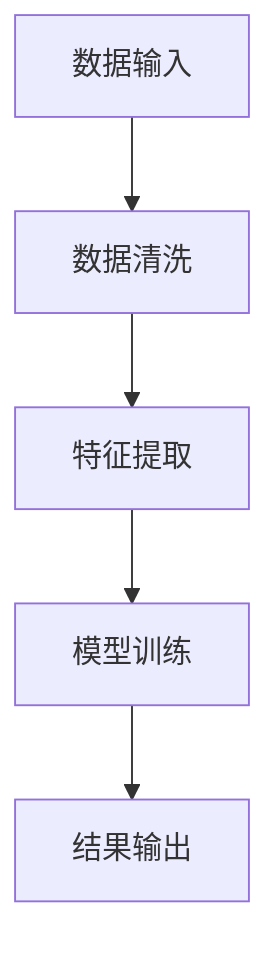
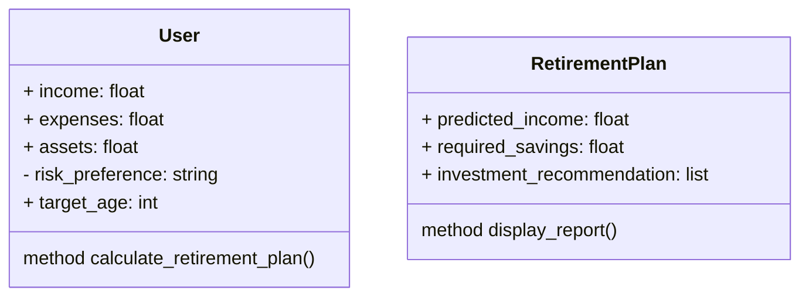
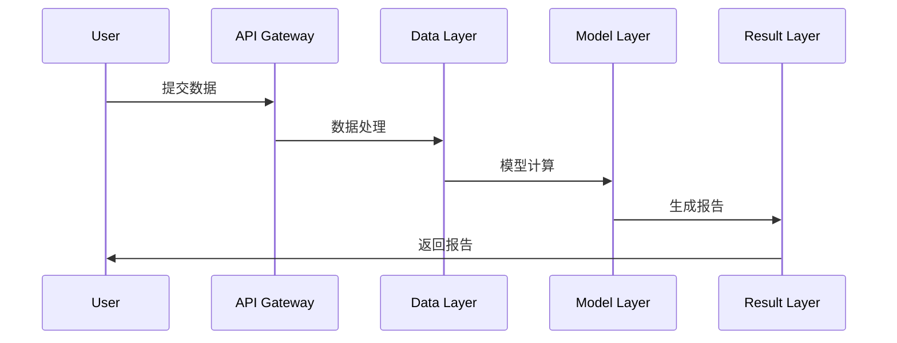

                 


# 智能退休收入规划助手

## 关键词：智能退休收入规划、人工智能、大数据分析、机器学习、财务规划

## 摘要：  
智能退休收入规划助手是一种基于人工智能和大数据分析的工具，旨在帮助用户科学规划退休收入，实现财务自由。本文将从背景、核心概念、算法原理、数学模型、系统架构到项目实战，全面解析智能退休收入规划助手的技术实现和应用。

---

## 第一部分：背景介绍

### 第1章：智能退休收入规划助手概述

#### 1.1 问题背景  
随着人口老龄化加剧，退休规划成为每个人都需要面对的重要课题。传统的退休规划依赖人工计算和经验判断，存在以下问题：  
- 数据分散：需要整合银行账户、投资理财、社保公积金等多来源数据。  
- 计算复杂：涉及通胀、寿命预期、投资收益等多变量的综合计算。  
- 个性化不足：难以根据用户的收入水平、消费习惯、风险偏好提供精准建议。  

#### 1.2 问题描述  
退休收入规划的核心目标是确保退休后的生活质量。然而，传统方法存在以下挑战：  
- 数据获取难度大：用户可能需要从多个渠道收集和整理数据。  
- 计算复杂度高：涉及多变量的非线性关系，人工计算难以覆盖所有可能性。  
- 个性化需求未满足：不同用户的财务状况和风险偏好差异大，通用方案难以满足需求。  

#### 1.3 问题解决  
智能退休收入规划助手通过以下方式解决问题：  
- 自动化数据收集与整合：通过API或用户输入，快速获取多来源数据。  
- 智能计算与预测：利用机器学习算法，预测未来收入、支出和投资收益。  
- 个性化建议：基于用户的财务状况和偏好，提供定制化退休规划方案。  

#### 1.4 概念结构与核心要素  
智能退休收入规划助手的核心要素包括：  
- 数据层：收入数据、支出数据、资产数据、社保数据。  
- 模型层：风险评估模型、收益预测模型、预算分配模型。  
- 用户层：用户偏好、财务目标、生命周期模型。  

---

## 第二部分：核心概念与联系

### 第2章：核心概念原理

#### 2.1 数据分析与处理  
- 数据清洗：去除重复数据、填补缺失值、处理异常值。  
- 数据特征提取：提取关键特征，如收入增长率、支出增长率、资产收益率。  

#### 2.2 机器学习模型  
- 监督学习：用于预测退休收入和支出。  
- 无监督学习：用于识别用户资产配置的潜在风险。  

#### 2.3 用户界面设计  
- 界面交互：简洁直观的可视化界面，方便用户输入和查看结果。  
- 个性化设置：根据用户需求调整风险偏好和目标退休年龄。  

#### 2.4 核心概念对比表  

| 概念         | 属性特征                       |  
|--------------|--------------------------------|  
| 数据分析     | 数据清洗、特征提取              |  
| 机器学习模型 | 监督学习、无监督学习            |  
| 用户界面     | 可视化展示、个性化设置          |  

#### 2.5 ER实体关系图  

```mermaid
erDiagram
    user [*-----* plan : "属于"]
    plan [*-----* data : "包含"]
    data [*-----* model : "通过模型分析"
```

---

## 第三部分：算法原理讲解

### 第3章：算法实现与流程

#### 3.1 算法流程图  



#### 3.2 机器学习模型训练  
- 数据预处理：标准化和归一化。  
- 模型选择：支持向量机（SVM）和随机森林（Random Forest）对比。  
- 模型评估：均方误差（MSE）和R平方（R²）指标。  

#### 3.3 Python代码实现  

```python
import pandas as pd
from sklearn.model_selection import train_test_split
from sklearn.ensemble import RandomForestRegressor
from sklearn.metrics import mean_squared_error, r2_score

# 数据加载
data = pd.read_csv('retirement_data.csv')

# 数据分割
X = data[['income', 'expenses', 'assets']]
y = data['predicted_income']

X_train, X_test, y_train, y_test = train_test_split(X, y, test_size=0.2, random_state=42)

# 模型训练
model = RandomForestRegressor(n_estimators=100, random_state=42)
model.fit(X_train, y_train)

# 模型评估
y_pred = model.predict(X_test)
mse = mean_squared_error(y_test, y_pred)
r2 = r2_score(y_test, y_pred)

print(f'MSE: {mse}\nR²: {r2}')
```

---

## 第四部分：数学模型与公式

### 第4章：数学模型解析

#### 4.1 风险评估模型  
公式：$$风险 = \sum (概率 \times 影响)$$  
- 例如：$$风险 = 0.3 \times (投资亏损10\%) + 0.5 \times (投资稳定) + 0.2 \times (投资收益20\%)$$  

#### 4.2 收益预测模型  
公式：$$收益 = \alpha \times 收入 + \beta \times 资产 + \gamma \times 支出$$  
- 例如：$$收益 = 0.4 \times 收入 + 0.3 \times 资产 + 0.3 \times 支出$$  

---

## 第五部分：系统分析与架构设计

### 第5章：系统架构设计方案

#### 5.1 问题场景介绍  
用户通过智能助手输入收入、支出、资产等数据，系统生成退休规划报告。  

#### 5.2 系统功能设计  



#### 5.3 系统架构设计  


#### 5.4 系统接口设计  
- 输入接口：用户输入数据。  
- 输出接口：生成报告。  

#### 5.5 系统交互流程图  



---

## 第六部分：项目实战

### 第6章：系统实现与案例分析

#### 6.1 环境安装  
- Python 3.8+  
- 安装依赖：pandas、scikit-learn、matplotlib  

#### 6.2 核心功能实现  
- 数据处理：数据清洗和特征提取。  
- 模型训练：随机森林回归模型。  
- 结果展示：可视化报告。  

#### 6.3 案例分析  
假设用户年收入10万元，支出8万元，资产200万元，目标退休年龄60岁。系统生成报告：  
- 预测退休收入：每年12万元。  
- 需要储蓄金额：50万元。  
- 投资建议：配置60%股票、30%债券、10%现金。  

#### 6.4 项目小结  
通过实际案例，验证系统在退休规划中的有效性。

---

## 第七部分：最佳实践

### 第7章：小结与注意事项

#### 7.1 小结  
智能退休收入规划助手通过整合数据、机器学习算法和个性化建议，帮助用户实现科学的退休规划。  

#### 7.2 注意事项  
- 数据质量：确保输入数据的准确性和完整性。  
- 模型可解释性：避免过于复杂的模型，确保用户理解建议。  
- 持续优化：定期更新模型，适应市场变化。  

#### 7.3 拓展阅读  
- 《机器学习实战》  
- 《Python金融数据分析》  
- 《退休规划：理论与实践》  

---

## 作者：AI天才研究院/AI Genius Institute & 禅与计算机程序设计艺术 /Zen And The Art of Computer Programming

