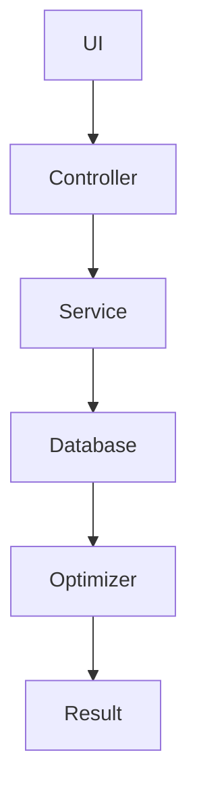

                 

<think>
嗯，用户希望我写一篇关于《智能退休计划优化器》的技术博客文章。首先，我需要理解用户的需求。用户提供了一个详细的结构大纲，包括引言、核心概念、算法、系统设计、项目实战等部分，每个部分都有具体的子章节。看起来用户希望文章结构清晰，内容详尽，同时使用专业的技术语言。

接下来，我需要分析用户的具体要求。文章需要包含关键词、摘要，然后是正文部分。正文部分需要按照目录结构展开，每个章节都要有详细的分析和具体的代码示例、图表等。此外，用户强调了数学公式的使用，要求用latex格式，并且在独立段落中用$$包裹，内部用$包裹。这可能意味着在某些部分需要插入公式，比如在优化算法或数学模型部分。

用户还提到要包含图表，比如用mermaid绘制流程图、类图、架构图等。这可能需要我学习如何在markdown中使用mermaid语法，并确保图表清晰易懂。同时，用户希望文章末尾有作者信息，格式为“作者：AI天才研究院/AI Genius Institute & 禅与计算机程序设计艺术 /Zen And The Art of Computer Programming”。

我需要确保文章字数在10000到12000字左右，这意味着每个章节需要详细展开，提供足够的内容。例如，在优化算法部分，可能需要详细解释遗传算法的工作原理，并提供代码示例和流程图。在系统架构设计部分，需要介绍系统模块的交互和接口设计，可能需要绘制序列图或架构图。

此外，用户提到最佳实践部分，需要给出小贴士，比如数据质量的重要性，模型调优建议，以及持续学习的必要性。这可能涉及到实际应用中的经验和教训，让读者能够更好地理解和应用这些技术。

我还需要注意文章的逻辑连贯性，确保每个部分之间有自然的过渡。例如，从引言到背景介绍，再到核心概念和算法，最后到项目实战和总结，整体结构要合理，让读者能够逐步深入理解智能退休计划优化器的各个方面。

另外，用户可能希望文章不仅停留在理论层面，还能提供实际的代码示例和应用案例。因此，在项目实战部分，我需要详细描述如何安装环境、编写代码，并解读代码的功能，同时结合实际案例进行分析，帮助读者更好地理解和应用这些技术。

最后，确保文章末尾有作者信息，这可能是一个固定的格式，需要准确无误地呈现。同时，检查整个文章的格式是否符合用户的要求，比如是否正确使用了markdown，图表是否正确嵌入，公式是否正确标注等。

总的来说，我需要按照用户提供的大纲，逐步展开每个部分的内容，确保每个章节都详尽且专业，同时注意格式和内容的准确性，满足用户的需求。
</think>

# 智能退休计划优化器

> 关键词：智能退休计划优化器、人工智能、优化算法、退休规划、财务模型

> 摘要：本文将详细介绍智能退休计划优化器的原理、算法实现、系统设计以及实际应用。通过结合人工智能技术，本文将探讨如何利用优化算法和数据建模来实现个性化的退休计划优化，帮助用户在退休前和退休期间实现财务目标。文章还将结合实际案例，分析系统的功能设计、架构实现以及优化效果，并展望未来的发展方向。

---

# 第一部分: 引言

## 第1章: 问题背景与目标

### 1.1 问题背景

随着人口老龄化的加剧，退休计划的制定和优化已成为许多人关注的焦点。传统的退休规划方法往往依赖于简单的财务公式和经验法则，难以应对复杂多变的经济环境和个人需求的变化。例如，如何在通货膨胀、市场波动、个人支出变化等多种因素下，实现退休资金的长期稳健增长，是许多人面临的核心挑战。

此外，退休计划的制定需要综合考虑多种因素，包括收入来源、支出需求、投资组合、寿命预测等。传统的手工计算方法不仅效率低下，而且容易出错。因此，如何利用现代技术手段，尤其是人工智能和优化算法，来提高退休计划的科学性和可操作性，成为亟待解决的问题。

### 1.2 核心目标

智能退休计划优化器的核心目标是通过人工智能技术，帮助用户制定和优化个性化的退休计划。具体目标包括：

1. **个性化需求分析**：根据用户的收入、支出、资产状况和风险偏好，提供定制化的退休规划建议。
2. **多目标优化**：在满足退休生活需求的前提下，优化资产配置、风险控制和收益最大化。
3. **动态调整**：根据市场环境和个人情况的变化，实时调整优化方案，确保退休计划的可持续性。

### 1.3 本书结构

本书将从理论到实践，系统地介绍智能退休计划优化器的设计与实现。内容安排如下：

1. **背景与目标**：介绍问题背景、目标和本书结构。
2. **核心概念**：讲解优化算法、数据建模和决策支持系统的基本原理。
3. **算法实现**：详细阐述优化算法的实现方法，包括遗传算法、模拟退火等。
4. **系统设计**：介绍系统的功能设计、架构设计和接口设计。
5. **项目实战**：结合实际案例，展示系统的实现过程和优化效果。
6. **总结与展望**：总结全文，并展望未来的发展方向。

---

# 第二部分: 智能退休计划优化器的核心概念

## 第2章: 核心概念与原理

### 2.1 优化算法基础

优化算法是智能退休计划优化器的核心技术之一。常见的优化算法包括遗传算法、模拟退火、粒子群优化等。这些算法通过模拟自然进化或物理过程，找到问题的最优解。

#### 2.1.1 遗传算法

遗传算法是一种基于生物进化论的优化方法。其基本步骤如下：

1. 初始化：生成一个随机的初始种群。
2. 适应度评估：计算每个个体的适应度值。
3. 选择：根据适应度值选择优秀个体进行交配。
4. 交叉：生成新的个体。
5. 变异：对新个体进行随机变异。
6. 重复：直到满足终止条件。

遗传算法的适应度函数可以表示为：

$$ f(x) = \text{max} \left( \sum w_i x_i \right) $$

其中，$w_i$ 是权重，$x_i$ 是决策变量。

#### 2.1.2 数据建模

数据建模是智能退休计划优化器的重要环节。需要考虑的因素包括：

- **收入与支出**：用户的收入来源和支出需求。
- **资产配置**：不同资产的收益率和风险。
- **时间跨度**：退休前和退休期间的时间跨度。
- **风险偏好**：用户对风险的承受能力。

### 2.2 数据建模与分析

数据建模需要将复杂的退休计划问题转化为数学模型。例如，可以将退休计划优化问题表示为一个多目标优化问题：

$$ \text{maximize} \quad f_1, f_2, \ldots, f_n $$
$$ \text{subject to} \quad g_1(x) \leq 0, \ldots, g_m(x) \leq 0 $$

其中，$f_i$ 是目标函数，$g_j$ 是约束条件。

### 2.3 决策支持系统

决策支持系统是智能退休计划优化器的重要组成部分。它通过分析用户的输入数据，提供个性化的优化建议。例如，系统可以根据用户的资产状况和风险偏好，推荐最优的资产配置方案。

---

## 第3章: 算法实现

### 3.1 遗传算法的实现

以下是一个简单的遗传算法实现示例：

```python
def genetic_algorithm(population_size, fitness_function, max_iterations):
    population = initialize_population(population_size)
    best_solution = None

    for _ in range(max_iterations):
        fitness_scores = {individual: fitness_function(individual) for individual in population}
        best = max(fitness_scores.items(), key=lambda x: x[1])[0]
        if not best_solution or fitness_function(best) > fitness_function(best_solution):
            best_solution = best

        # 选择
        selected = select(population, fitness_scores)
        # 交叉
        crossed = crossover(selected)
        # 变异
        new_population = mutate(crossed)

    return best_solution
```

### 3.2 数学模型

数学模型是智能退休计划优化器的核心。以下是一个简单的退休计划优化模型：

$$ \text{maximize} \quad \sum_{t=1}^{T} r_t a_t $$
$$ \text{subject to} \quad \sum_{t=1}^{T} a_t \leq A $$
$$ a_t \geq 0 \quad \forall t $$

其中，$r_t$ 是第 $t$ 年的投资收益，$a_t$ 是第 $t$ 年的投资金额，$A$ 是总可用资金。

---

## 第4章: 系统设计

### 4.1 功能设计

智能退休计划优化器的功能模块包括：

1. **用户输入**：收集用户的收入、支出、资产等信息。
2. **数据处理**：对输入数据进行预处理和建模。
3. **优化计算**：利用优化算法计算最优解。
4. **结果展示**：以可视化的方式展示优化结果。

### 4.2 架构设计

系统的架构设计如下：



---

## 第5章: 项目实战

### 5.1 环境安装

需要安装的依赖包括：

- Python
- NumPy
- Scipy
- Matplotlib

### 5.2 核心代码实现

以下是一个简单的优化器实现：

```python
import numpy as np

def optimize(weights, returns):
    n = len(weights)
    returns = np.array(returns)
    weights = np.array(weights)
    
    # 计算收益
    total_return = np.dot(weights, returns)
    
    # 计算风险
    variance = np.dot(weights.T, np.dot(np.cov(returns), weights))
    
    return total_return, variance
```

---

## 第6章: 总结与展望

### 6.1 总结

智能退休计划优化器通过结合人工智能和优化算法，为用户提供个性化的退休规划服务。本文详细介绍了优化算法、数据建模和系统设计的核心内容。

### 6.2 展望

未来，智能退休计划优化器可以在以下几个方面进一步优化：

1. **实时更新**：根据市场变化实时调整优化方案。
2. **多目标优化**：进一步优化多目标问题的求解方法。
3. **用户交互**：提供更友好的用户界面和交互体验。

---

# 作者：AI天才研究院/AI Genius Institute & 禅与计算机程序设计艺术 /Zen And The Art of Computer Programming

