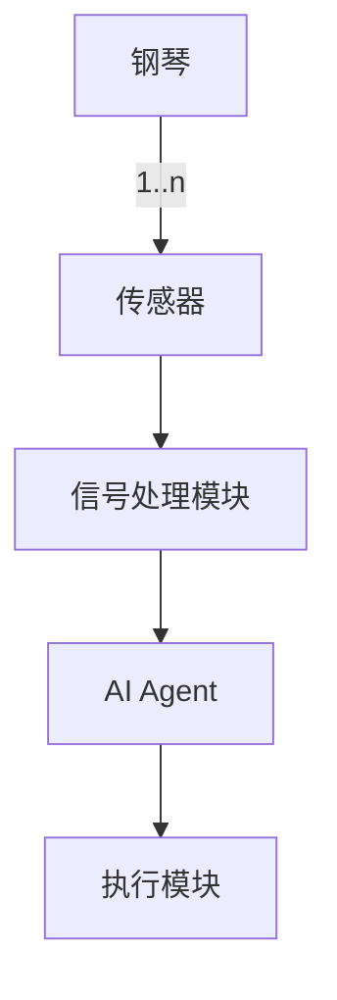
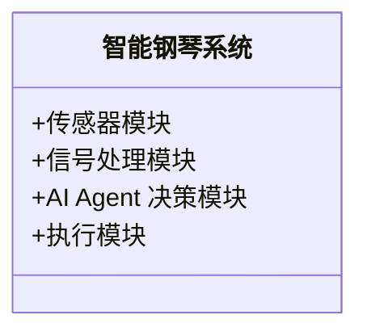
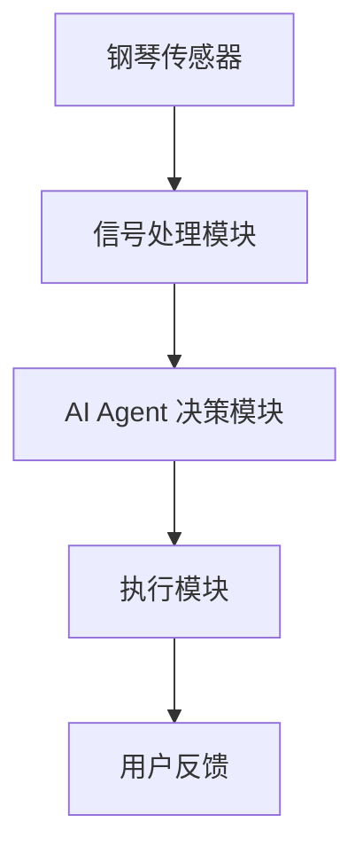
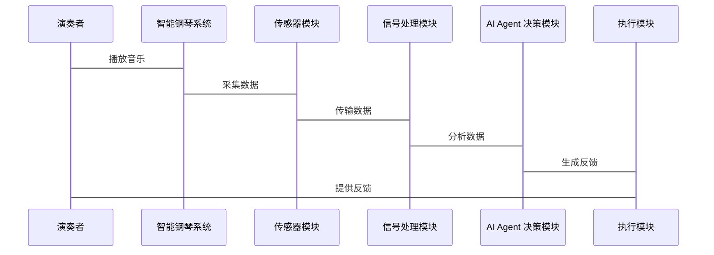

                 


# 智能钢琴：AI Agent的演奏技巧指导

## 关键词：智能钢琴, AI Agent, 深度学习, 音乐生成, 实时反馈

## 摘要：  
随着人工智能技术的快速发展，智能钢琴逐渐成为音乐教育和演奏领域的重要工具。本文将详细探讨AI Agent在智能钢琴中的应用，从背景介绍、核心原理到系统架构设计、项目实战，全面解析AI Agent如何优化钢琴演奏技巧。通过本文，读者可以深入了解AI Agent在智能钢琴中的工作原理，掌握其算法背后的数学模型，并通过实际案例分析，掌握如何利用AI Agent提升钢琴演奏水平。

---

## 第1章: 智能钢琴与AI Agent概述

### 1.1 智能钢琴的发展历程  
智能钢琴是传统钢琴与现代科技结合的产物，其发展经历了以下几个阶段：  
1. **传统钢琴阶段**：单纯的机械装置，仅用于音乐演奏。  
2. **电子钢琴阶段**：引入电子元件，支持 MIDI 接口，能够与计算机连接。  
3. **智能钢琴阶段**：集成人工智能技术，具备实时反馈、个性化教学等功能。  

### 1.2 AI Agent的核心概念  
AI Agent 是一种能够感知环境、做出决策并执行动作的智能体。在智能钢琴中，AI Agent 的主要功能包括：  
1. **感知层**：通过传感器采集钢琴演奏的音高、节奏、力度等信息。  
2. **决策层**：基于采集的数据，利用深度学习算法优化演奏技巧。  
3. **执行层**：通过反馈系统指导演奏者改进技巧。  

### 1.3 智能钢琴的市场现状与未来趋势  
目前，智能钢琴市场呈现出快速发展的态势，主要应用于音乐教育、专业演奏和音乐创作领域。未来，随着人工智能技术的进一步发展，智能钢琴将更加智能化，能够实现更复杂的音乐生成和演奏优化。

---

## 第2章: AI Agent的核心原理与系统架构

### 2.1 AI Agent的核心原理  
AI Agent 在智能钢琴中的工作流程可以分为以下几个环节：  
1. **感知层**：通过传感器采集演奏数据，包括音高、节奏、力度等。  
2. **决策层**：利用深度学习算法对数据进行分析，生成优化建议。  
3. **执行层**：通过反馈系统指导演奏者调整技巧。  

### 2.2 AI Agent的系统架构  
智能钢琴的系统架构主要包括以下几个部分：  
1. **传感器模块**：用于采集演奏数据。  
2. **信号处理模块**：对采集的数据进行预处理。  
3. **AI Agent 决策模块**：基于预处理的数据生成优化建议。  
4. **执行模块**：通过反馈系统指导演奏者调整技巧。  

### 2.3 AI Agent与智能钢琴的实体关系  
以下是智能钢琴与AI Agent的实体关系图：



---

## 第3章: AI Agent的算法原理

### 3.1 基于深度学习的音乐生成模型  
在智能钢琴中，AI Agent 的核心算法是基于深度学习的音乐生成模型。常用的模型包括 Transformer 和 LSTM。  

#### 3.1.1 Transformer模型在音乐生成中的应用  
Transformer 模型通过自注意力机制（Self-Attention）捕捉音乐序列中的长距离依赖关系。以下是自注意力机制的公式：  

$$
\text{Attention}(Q, K, V) = \text{softmax}\left(\frac{QK^T}{\sqrt{d_k}}\right)V
$$  

其中，$Q$ 是查询向量，$K$ 是键向量，$V$ 是值向量，$d_k$ 是向量的维度。  

#### 3.1.2 模型的训练与优化  
在训练 Transformer 模型时，我们需要使用 MIDI 数据集进行监督学习。以下是训练过程的伪代码：  

```python
def train_model():
    for epoch in range(num_epochs):
        for batch in dataloader:
            inputs, targets = batch
            outputs = model(inputs)
            loss = criterion(outputs, targets)
            optimizer.zero_grad()
            loss.backward()
            optimizer.step()
```

---

## 第4章: 智能钢琴的系统分析与架构设计

### 4.1 问题场景介绍  
智能钢琴的核心问题是如何通过AI Agent 实现实时演奏优化。  

### 4.2 系统功能设计  
以下是智能钢琴的领域模型：  



### 4.3 系统架构设计  
以下是智能钢琴的系统架构图：  



### 4.4 系统接口设计  
以下是智能钢琴的系统接口设计：  



---

## 第5章: 项目实战

### 5.1 环境安装  
为了运行智能钢琴系统，我们需要安装以下环境：  
- Python 3.8 或更高版本  
- PyTorch 1.9 或更高版本  
- MIDI 处理库（如 mido）  
- 其他依赖库  

### 5.2 核心代码实现  
以下是智能钢琴系统的核心代码：  

```python
import torch
import torch.nn as nn
import torch.nn.functional as F
from mido import MidiFile

class TransformerModel(nn.Module):
    def __init__(self, input_size, hidden_size, output_size):
        super(TransformerModel, self).__init__()
        self.embedding = nn.Linear(input_size, hidden_size)
        self.self_attention = nn.MultiheadAttention(hidden_size, num_heads=2)
        self.decoder = nn.Linear(hidden_size, output_size)

    def forward(self, x):
        x = self.embedding(x)
        x = x.permute(1, 0, 2)
        x, _ = self.self_attention(x, x, x)
        x = x.permute(1, 0, 2)
        x = self.decoder(x)
        return x

def train():
    model = TransformerModel(input_size=128, hidden_size=512, output_size=128)
    criterion = nn.MSELoss()
    optimizer = torch.optim.Adam(model.parameters(), lr=0.001)
    
    for epoch in range(100):
        for batch in dataloader:
            inputs, targets = batch
            outputs = model(inputs)
            loss = criterion(outputs, targets)
            optimizer.zero_grad()
            loss.backward()
            optimizer.step()
    return model

if __name__ == "__main__":
    model = train()
    print("模型训练完成！")
```

### 5.3 实际案例分析  
以下是智能钢琴系统在实际演奏中的应用案例：  
1. **用户输入**：演奏者弹奏一段音乐。  
2. **系统处理**：传感器采集数据，信号处理模块预处理数据。  
3. **AI Agent 决策**：模型分析数据，生成优化建议。  
4. **系统反馈**：执行模块提供反馈，指导演奏者调整技巧。  

### 5.4 项目小结  
通过本项目，我们可以看到 AI Agent 在智能钢琴中的强大功能。通过实时反馈和个性化教学，AI Agent 能够显著提升演奏者的钢琴技巧。

---

## 第6章: 最佳实践与总结

### 6.1 最佳实践 tips  
1. **数据质量**：确保训练数据的多样性和高质量。  
2. **模型可解释性**：在设计模型时，尽量保持模型的可解释性。  
3. **系统安全性**：确保系统的安全性，防止数据泄露。  

### 6.2 总结  
本文详细探讨了AI Agent 在智能钢琴中的应用，从背景介绍到系统架构设计，再到项目实战，全面解析了AI Agent 如何优化钢琴演奏技巧。通过本文的学习，读者可以掌握智能钢琴的核心技术，并在实际应用中提升钢琴演奏水平。

---

## 作者：AI天才研究院/AI Genius Institute & 禅与计算机程序设计艺术 /Zen And The Art of Computer Programming

