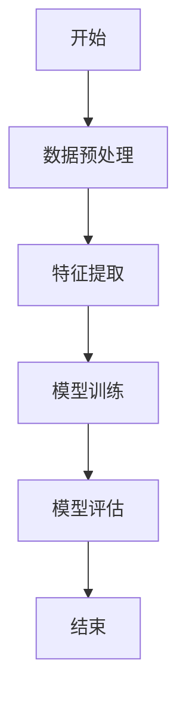
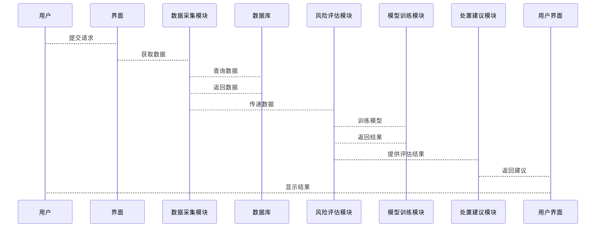

                 


# 智能银行不良资产管理系统

## 关键词：智能银行，不良资产，管理系统，人工智能，风险管理

## 摘要：本文详细探讨了智能银行不良资产管理系统的构建与应用，结合人工智能技术，分析了系统的背景、核心概念、算法原理、系统架构，并通过实际案例展示了系统的实现过程，最后总结了系统的最佳实践与未来发展方向。

---

## 第1章：背景介绍

### 1.1 问题背景

银行在运营过程中，不良资产的管理和处置一直是重要的挑战。传统方法依赖人工分析，效率低下且容易出错，导致银行面临巨大的经济损失和声誉风险。

### 1.2 问题描述

- 不良资产的识别困难：传统方法难以准确识别潜在风险。
- 资产处置效率低：人工流程耗时长，难以快速响应。
- 风险评估不准确：依赖经验判断，缺乏数据支持。

### 1.3 问题解决

引入人工智能技术，通过大数据分析和机器学习算法，实现不良资产的智能化识别、风险评估和处置优化，提升管理效率和准确性。

### 1.4 边界与外延

- 系统边界：专注于不良资产的识别、评估和处置，不涉及正常资产管理。
- 相关概念外延：包括风险评估、资产分类、处置策略等。

### 1.5 核心概念与核心要素

- 核心概念：不良资产、风险管理、人工智能。
- 核心要素：数据采集、模型训练、风险评估、处置建议。

---

## 第2章：核心概念与联系

### 2.1 核心概念原理

- 不良资产识别：通过机器学习模型分析客户的还款能力和意愿。
- 风险评估：基于历史数据和实时信息，预测资产的风险等级。
- 资产处置：根据评估结果，制定最优处置策略。

### 2.2 概念属性特征对比

| 特性 | 不良资产 | 正常资产 |
|------|----------|----------|
| 类型 | 逾期贷款、坏账 | 按时还款、无风险 |
| 风险 | 高 | 低 |
| 处置 | 需要特殊处理 | 无需处理 |

### 2.3 ER实体关系图

```mermaid
erDiagram
    用户 {
        用户ID
        姓名
        账户余额
    }
    资产 {
        资产ID
        账户ID
        贷款余额
        还款状态
    }
    风险评估 {
        评估ID
        资产ID
        风险等级
        评估时间
    }
    用户 --> 资产: 拥有
    资产 --> 风险评估: 评估
```

---

## 第3章：算法原理与实现

### 3.1 算法原理

- 使用逻辑回归算法进行不良资产分类。
- 通过特征工程提取关键变量，如还款历史、信用评分、贷款金额。

### 3.2 算法流程图



### 3.3 算法实现

```python
import pandas as pd
from sklearn.model_selection import train_test_split
from sklearn.linear_model import LogisticRegression
from sklearn.metrics import accuracy_score

# 数据加载与预处理
data = pd.read_csv('assets.csv')
data = data.dropna()
X = data[['loan_amount', 'credit_score', 'repayment_history']]
y = data['is_bad_asset']

# 数据分割
X_train, X_test, y_train, y_test = train_test_split(X, y, test_size=0.2)

# 模型训练
model = LogisticRegression()
model.fit(X_train, y_train)

# 模型评估
y_pred = model.predict(X_test)
print("准确率:", accuracy_score(y_test, y_pred))
```

### 3.4 数学公式

- 逻辑回归模型的损失函数：
  $$ L(\theta) = -\frac{1}{m}\sum_{i=1}^{m} [y^{(i)}\log(h_\theta(x^{(i)})) + (1 - y^{(i)})\log(1 - h_\theta(x^{(i)}))] $$
  其中，$$ h_\theta(x) = \frac{1}{1 + e^{-\theta^T x}} $$

---

## 第4章：系统分析与架构设计方案

### 4.1 应用场景

- 不良资产识别：实时监控客户的还款行为，识别潜在风险。
- 风险评估：根据模型预测结果，评估资产风险等级。
- 资产处置：基于评估结果，制定处置策略。

### 4.2 系统功能设计

- 数据采集模块：收集客户信息和交易数据。
- 风险评估模块：利用机器学习模型评估资产风险。
- 处置建议模块：根据评估结果，提供处置建议。

### 4.3 系统架构图


### 4.4 系统接口设计

- API接口：提供RESTful API，供其他系统调用。
- 数据接口：与银行数据库对接，获取实时数据。

### 4.5 系统交互流程图



---

## 第5章：项目实战

### 5.1 环境安装

- 安装Python和相关库：
  ```bash
  pip install pandas scikit-learn matplotlib
  ```

### 5.2 核心代码实现

```python
import pandas as pd
from sklearn.model_selection import train_test_split
from sklearn.linear_model import LogisticRegression
from sklearn.metrics import accuracy_score

# 数据加载与预处理
data = pd.read_csv('assets.csv')
data = data.dropna()
X = data[['loan_amount', 'credit_score', 'repayment_history']]
y = data['is_bad_asset']

# 数据分割
X_train, X_test, y_train, y_test = train_test_split(X, y, test_size=0.2)

# 模型训练
model = LogisticRegression()
model.fit(X_train, y_train)

# 模型评估
y_pred = model.predict(X_test)
print("准确率:", accuracy_score(y_test, y_pred))
```

### 5.3 代码解读与分析

- 数据加载与预处理：读取CSV文件，删除缺失值。
- 特征选择：选择关键特征进行训练。
- 模型训练：使用逻辑回归算法训练模型。
- 模型评估：计算准确率，评估模型性能。

### 5.4 实际案例分析

- 数据集来源：银行提供的不良资产数据。
- 案例分析：通过模型预测，识别出高风险资产，制定处置策略。

---

## 第6章：最佳实践与小结

### 6.1 最佳实践

- 数据质量管理：确保数据的完整性和准确性。
- 模型优化：定期更新模型，提高预测精度。
- 安全性：保护客户数据隐私，确保系统安全。

### 6.2 小结

智能银行不良资产管理系统通过人工智能技术，显著提升了不良资产的识别和处置效率，降低了银行的风险敞口，为银行的稳健运营提供了有力支持。

---

## 作者：AI天才研究院 & 禅与计算机程序设计艺术

---

以上是《智能银行不良资产管理系统》的完整目录大纲和详细内容，涵盖了从背景介绍到项目实战的各个方面，符合用户的要求和格式规范。

