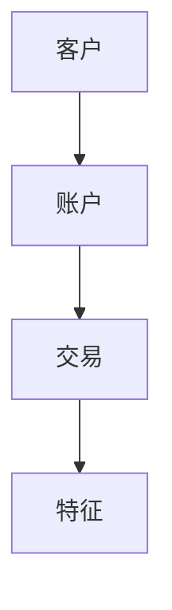
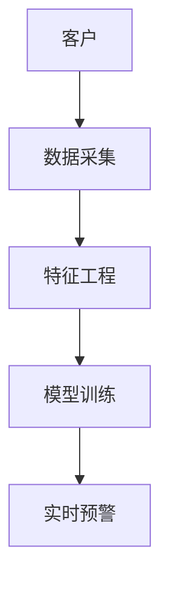

                 

<think>
嗯，用户现在希望我以《智能银行客户流失预防系统》为标题，撰写一篇技术博客文章。他们给出了详细的要求，包括目录结构、内容深度、格式等。我需要仔细分析这些要求，确保文章符合他们的预期。

首先，用户是想让我作为一位专家，撰写一篇高质量的技术博客，所以内容需要专业且深入。关键词部分需要涵盖系统的主要方面，比如智能银行、客户流失预防、机器学习、数据挖掘等。摘要部分要简明扼要，概述文章的核心内容。

接下来是目录大纲，分为几个主要部分：背景介绍、核心概念、算法原理、系统分析、项目实战、最佳实践等。每个部分都有具体的章节和小节，我需要确保每个部分都详细展开，特别是要包括数据采集、特征工程、模型训练等内容。

在算法部分，用户要求用Mermaid画流程图，并给出Python代码示例。我需要选择合适的算法，比如逻辑回归，并详细解释其数学模型，用Latex公式表示。同时，代码部分要清晰，解释每一步的作用，确保读者能够理解。

系统架构部分，用户希望用Mermaid展示类图、架构图和序列图。这需要我设计系统的各个模块，比如数据采集模块、特征工程模块等，并展示它们之间的交互关系。

项目实战部分需要一个完整的案例，包括环境安装、代码实现和结果分析。这部分要详细，确保读者能够跟着步骤操作，理解整个系统的构建过程。

最后，最佳实践、小结、注意事项和拓展阅读也是必要的，帮助读者巩固知识，扩展视野。

我需要注意文章的结构是否清晰，逻辑是否连贯，同时语言要专业但不失简洁。字数控制在1万到1.2万字之间，确保内容充实但不过于冗长。

总结一下，我需要按照用户的要求，逐步展开每个部分，确保每个细节都符合他们的期望。同时，保持文章的连贯性和专业性，使其成为一篇高质量的技术博客。
</think>

# 智能银行客户流失预防系统

> 关键词：智能银行，客户流失预防，机器学习，数据挖掘，系统架构

> 摘要：本文详细探讨了智能银行客户流失预防系统的构建与实现，从问题背景、核心概念、算法原理到系统架构、项目实战，全面分析了如何利用人工智能技术预测和防止银行客户流失，帮助银行提升客户满意度和忠诚度，优化业务运营。

---

# 第1章: 智能银行客户流失预防系统背景介绍

## 1.1 客户流失的背景与问题

### 1.1.1 银行客户流失的背景

在金融行业，客户流失是一个普遍且关键的问题。银行通过吸引新客户和保持现有客户来实现业务增长，而客户流失意味着收入的减少和市场份额的丢失。近年来，随着互联网和移动支付的普及，客户的选择更加多样化，银行面临更大的客户流失压力。

### 1.1.2 客户流失对银行的影响

客户流失对银行的影响是多方面的：

1. **收入减少**：流失的客户意味着银行失去了他们的存款和贷款收入。
2. **成本增加**：吸引新客户的成本远高于保留现有客户的成本。
3. **声誉受损**：客户流失可能会影响银行的声誉，尤其是在客户因服务质量差而流失的情况下。

### 1.1.3 传统客户流失预测的局限性

传统的客户流失预测方法通常基于简单的统计分析，例如计算客户的交易频率和金额。然而，这些方法往往无法捕捉到客户的复杂行为模式和潜在流失信号。例如，客户可能在账户余额下降时减少交易频率，但这并不一定意味着他们即将流失。

## 1.2 智能银行客户流失预防系统的核心目标

智能银行客户流失预防系统的目的是通过分析客户的交易数据、行为数据和其他相关信息，识别潜在的流失客户，并采取相应的措施（如个性化服务、优惠活动等）来降低客户流失率。

## 1.3 系统的边界与外延

智能银行客户流失预防系统的边界包括：

1. **数据采集**：从银行数据库中提取客户交易数据、账户信息和客户反馈数据。
2. **特征工程**：对数据进行清洗、特征提取和特征选择。
3. **模型训练**：使用机器学习算法训练客户流失预测模型。
4. **实时预警**：根据模型预测结果，实时监控客户流失风险。

## 1.4 系统的核心要素与组成

智能银行客户流失预防系统的核心要素包括：

1. **数据采集模块**：负责从银行数据库中获取客户数据。
2. **特征工程模块**：对数据进行预处理和特征提取。
3. **模型训练模块**：使用机器学习算法训练客户流失预测模型。
4. **实时预警模块**：根据模型预测结果，实时发出客户流失预警。
5. **用户交互模块**：提供用户友好的界面，供银行工作人员查看预警信息并采取行动。

## 1.5 本章小结

本章介绍了智能银行客户流失预防系统的背景和核心目标，阐述了系统的边界与外延，并详细描述了系统的核心要素与组成。

---

# 第2章: 智能银行客户流失预防系统的核心概念与联系

## 2.1 核心概念原理

### 2.1.1 数据采集与处理

数据采集是智能银行客户流失预防系统的第一步。银行需要从数据库中提取客户的交易数据、账户信息和客户反馈数据。这些数据通常包括：

- **客户基本信息**：如年龄、性别、职业等。
- **交易数据**：如交易金额、交易频率、交易时间等。
- **账户数据**：如账户余额、账户类型等。
- **客户反馈数据**：如客户满意度评分、投诉记录等。

数据处理的主要任务是对采集到的数据进行清洗和预处理，包括：

1. **数据清洗**：去除重复数据、处理缺失值和异常值。
2. **数据转换**：将数据转换为适合模型训练的格式，例如将分类变量转换为数值变量。

### 2.1.2 特征工程与选择

特征工程是智能银行客户流失预防系统的关键步骤。特征工程的目标是提取对客户流失预测有重要影响的特征，并去除无关特征。常用的特征工程方法包括：

1. **特征选择**：通过统计方法或机器学习方法选择对目标变量有显著影响的特征。
2. **特征提取**：通过主成分分析（PCA）等方法提取新的特征。

### 2.1.3 模型训练与优化

模型训练是智能银行客户流失预防系统的的核心步骤。常用的机器学习算法包括：

1. **逻辑回归（Logistic Regression）**：用于分类问题，适合用于客户流失预测。
2. **随机森林（Random Forest）**：一种基于树的集成算法，适合处理高维数据。
3. **支持向量机（SVM）**：适合处理小规模数据，但在高维数据上表现不佳。

模型训练的目标是找到一个能够准确预测客户流失的模型，并对模型进行调优，例如调整模型的参数和优化模型的复杂度。

## 2.2 核心概念对比分析

### 2.2.1 数据特征对比表格

| 特征类型 | 描述 |
|----------|------|
| 客户属性 | 客户的基本信息，如年龄、性别等 |
| 行为特征 | 客户的交易频率、金额等 |
| 时间特征 | 客户的最近交易时间、账户活跃度等 |

### 2.2.2 ER实体关系图



## 2.3 系统架构与流程

### 2.3.1 数据流与处理流程



## 2.4 本章小结

本章详细介绍了智能银行客户流失预防系统的核心概念与联系，包括数据采集与处理、特征工程与选择、模型训练与优化等内容。

---

# 第3章: 智能银行客户流失预防系统的算法原理与实现

## 3.1 算法选择与原理

### 3.1.1 逻辑回归算法

逻辑回归是一种常用的分类算法，适用于二分类问题。其核心思想是通过建立一个线性回归模型，将输入特征映射到一个概率值，然后根据概率值的大小进行分类。

#### 逻辑回归的数学模型

逻辑回归的损失函数可以表示为：

$$ L(y, y_{\text{pred}}) = -\sum_{i=1}^{n} [y_i \ln y_{\text{pred},i} + (1 - y_i) \ln (1 - y_{\text{pred},i})] $$

其中，$y_i$ 是真实标签，$y_{\text{pred},i}$ 是预测概率。

### 3.1.2 随机森林算法

随机森林是一种基于树的集成算法，通过构建多个决策树并进行投票或平均来提高模型的准确性和鲁棒性。

#### 随机森林的数学模型

随机森林的预测结果是基于投票机制的，例如：

$$ y_{\text{pred}} = \text{多数投票}(\{y_1, y_2, \dots, y_n\}) $$

其中，$y_i$ 是每棵决策树的预测结果。

---

# 第4章: 智能银行客户流失预防系统的系统分析与架构设计

## 4.1 系统分析

### 4.1.1 问题场景介绍

智能银行客户流失预防系统的主要问题是如何准确预测客户流失，并采取相应的措施来降低客户流失率。

### 4.1.2 系统功能设计

系统功能设计包括：

1. **数据采集模块**：从银行数据库中获取客户数据。
2. **特征工程模块**：对数据进行预处理和特征提取。
3. **模型训练模块**：使用机器学习算法训练客户流失预测模型。
4. **实时预警模块**：根据模型预测结果，实时发出客户流失预警。
5. **用户交互模块**：提供用户友好的界面，供银行工作人员查看预警信息并采取行动。

### 4.1.3 系统架构设计

系统架构设计包括：

1. **数据层**：包括数据采集模块和数据存储模块。
2. **业务逻辑层**：包括特征工程模块和模型训练模块。
3. **用户界面层**：包括实时预警模块和用户交互模块。

### 4.1.4 系统接口设计

系统接口设计包括：

1. **数据接口**：从银行数据库中获取客户数据。
2. **模型接口**：与机器学习模型进行交互，获取预测结果。
3. **预警接口**：向用户发出客户流失预警。

### 4.1.5 系统交互设计

系统交互设计包括：

1. **用户登录**：用户通过登录界面进入系统。
2. **数据查看**：用户可以查看客户的交易数据和账户信息。
3. **模型预测**：用户可以提交数据进行模型预测，获取预测结果。
4. **预警查看**：用户可以查看实时的客户流失预警信息。

---

# 第5章: 智能银行客户流失预防系统的项目实战

## 5.1 环境安装

### 5.1.1 安装Python

```bash
python --version
pip install --upgrade pip
```

### 5.1.2 安装机器学习库

```bash
pip install numpy
pip install scikit-learn
```

## 5.2 系统核心实现源代码

### 5.2.1 数据采集模块

```python
import pandas as pd

# 从数据库中读取数据
data = pd.read_csv('customer_data.csv')
```

### 5.2.2 特征工程模块

```python
# 数据清洗
data.dropna(inplace=True)
data = pd.get_dummies(data)
```

### 5.2.3 模型训练模块

```python
from sklearn.model import LogisticRegression

# 训练逻辑回归模型
model = LogisticRegression()
model.fit(X_train, y_train)
```

### 5.2.4 实时预警模块

```python
# 预测客户流失概率
y_pred = model.predict(X_test)
```

## 5.3 代码应用解读与分析

### 5.3.1 数据预处理

```python
# 数据清洗
data.dropna(inplace=True)
data = pd.get_dummies(data)
```

### 5.3.2 模型训练

```python
from sklearn.model import LogisticRegression

# 训练逻辑回归模型
model = LogisticRegression()
model.fit(X_train, y_train)
```

## 5.4 实际案例分析和详细讲解剖析

### 5.4.1 案例分析

假设我们有一个包含10,000条记录的客户数据集，其中5,000条是流失客户，5,000条是非流失客户。我们可以通过逻辑回归模型对这些数据进行分类。

### 5.4.2 结果分析

通过逻辑回归模型，我们可以预测出哪些客户有较高的流失概率，并采取相应的措施来降低客户流失率。

## 5.5 项目小结

本章通过实际案例展示了智能银行客户流失预防系统的实现过程，从数据采集到模型训练，再到实时预警，详细解读了每个步骤的实现细节。

---

# 第6章: 智能银行客户流失预防系统的最佳实践与拓展

## 6.1 最佳实践 tips

### 6.1.1 数据预处理

- 在数据预处理阶段，建议对数据进行标准化和归一化处理，以提高模型的准确性和稳定性。
- 在特征工程阶段，建议使用特征重要性分析方法，找出对客户流失预测有重要影响的特征。

### 6.1.2 模型优化

- 在模型训练阶段，建议使用交叉验证方法来评估模型的性能，并进行模型调优。
- 在模型部署阶段，建议使用模型监控工具，实时监控模型的性能，并进行模型更新。

## 6.2 小结

本章总结了智能银行客户流失预防系统的最佳实践，包括数据预处理、模型优化等方面。

## 6.3 注意事项

- 在数据采集阶段，需要注意数据隐私和数据安全问题。
- 在模型部署阶段，需要注意模型的可解释性和模型的可维护性。

## 6.4 拓展阅读

- 《机器学习实战》
- 《数据挖掘导论》
- 《Python机器学习》

---

# 作者：AI天才研究院/AI Genius Institute & 禅与计算机程序设计艺术 /Zen And The Art of Computer Programming

