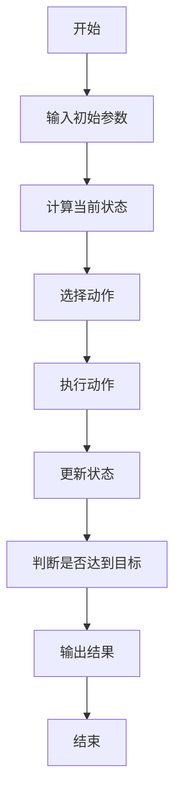
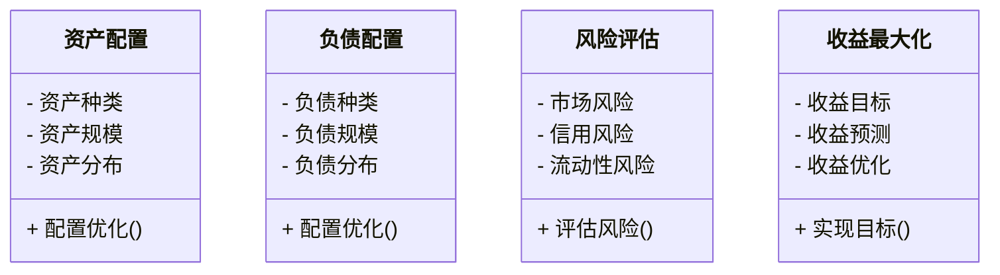
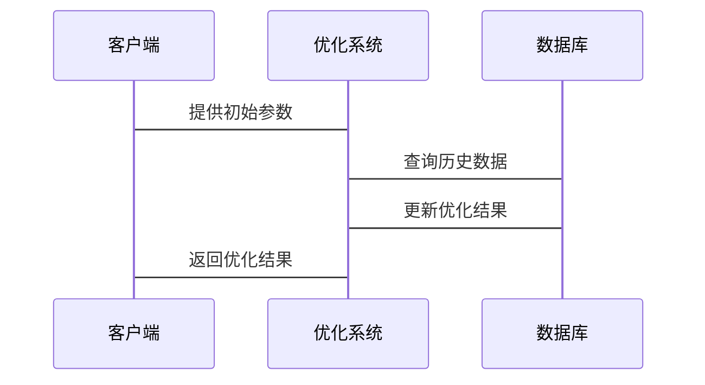

                 


# 智能银行资产负债管理优化系统

## 关键词：智能银行、资产负债管理、人工智能、优化系统、风险管理

## 摘要： 
智能银行资产负债管理优化系统是一种利用人工智能和大数据技术，对银行的资产和负债进行智能化配置和风险控制的系统。通过优化资产负债结构，提升银行的收益能力、风险控制能力和市场适应能力，从而在数字化转型中保持竞争优势。本文将从系统背景、核心概念、算法原理、系统架构、项目实战等方面，深入分析智能银行资产负债管理优化系统的构建与应用。

---

## 第一部分: 智能银行资产负债管理优化系统的背景与意义

### 第1章: 智能银行资产负债管理优化系统的背景与意义

#### 1.1 传统银行资产负债管理的挑战
##### 1.1.1 资产负债管理的基本概念
资产负债管理（Asset-Liability Management，ALM）是银行管理的核心内容之一，旨在通过合理配置资产和负债，确保银行在不同经济周期和市场环境下的稳健经营。传统资产负债管理主要依赖人工分析和经验判断，存在以下问题：
- 数据处理效率低：传统方法依赖大量人工计算，效率低下。
- 风险控制不足：面对复杂多变的市场环境，人工判断的局限性导致风险控制能力不足。
- 无法实时优化：市场环境变化快，传统方法难以快速响应并优化资产负债结构。

##### 1.1.2 传统资产负债管理的局限性
- 数据处理效率低：传统资产负债管理依赖人工分析，数据处理效率低，难以应对海量数据。
- 风险控制不足：传统方法无法实时捕捉市场变化，风险预测和控制能力有限。
- 无法实时优化：市场环境变化快，传统方法难以快速响应并优化资产负债结构。

##### 1.1.3 智能化管理的必要性
随着金融市场的快速变化和客户需求的多样化，银行需要更加智能化的管理工具来应对挑战。智能化管理能够通过大数据和人工智能技术，实时捕捉市场变化，优化资产负债结构，降低风险，提升收益。

#### 1.2 智能银行的定义与发展
##### 1.2.1 智能银行的核心特征
智能银行是传统银行与现代信息技术结合的产物，其核心特征包括：
- 数据驱动：利用大数据技术，实时分析市场和客户需求。
- 智能决策：通过人工智能技术，实现自动化、智能化的决策。
- 客户体验优化：通过智能技术提升客户服务体验。

##### 1.2.2 智能银行与传统银行的对比
| 特性 | 传统银行 | 智能银行 |
|------|----------|----------|
| 数据处理 | 依赖人工，效率低 | 数据驱动，实时处理 |
| 决策方式 | 依赖经验，主观性高 | 智能决策，数据支持 |
| 客户体验 | 服务质量参差不齐 | 个性化服务，体验提升 |

##### 1.2.3 智能银行在行业中的应用前景
随着人工智能和大数据技术的快速发展，智能银行在金融行业的应用前景广阔。通过智能化管理，银行可以更好地应对市场变化，提升竞争力，实现可持续发展。

#### 1.3 资产负债管理优化系统的重要性
##### 1.3.1 资产负债管理对银行经营的影响
资产负债管理是银行经营的核心，直接关系到银行的收益和风险。优化资产负债结构，可以降低风险，提升收益，增强银行的市场竞争力。

##### 1.3.2 智能优化系统在资产负债管理中的作用
智能优化系统通过大数据和人工智能技术，帮助银行实现资产和负债的智能化配置，提升管理效率，降低风险。

##### 1.3.3 系统优化对银行竞争力的提升
通过智能优化系统，银行可以实现精准的市场预测，优化资产配置，提升收益，降低风险，从而在市场竞争中占据优势。

---

## 第二部分: 智能银行资产负债管理优化系统的概念与核心要素

### 第2章: 智能银行资产负债管理优化系统的概念与核心要素

#### 2.1 核心概念解析
##### 2.1.1 资产负债管理的定义
资产负债管理是指通过对资产和负债的合理配置，实现银行在不同经济周期和市场环境下的稳健经营。

##### 2.1.2 智能优化系统的定义
智能优化系统是利用人工智能和大数据技术，对资产和负债进行智能化配置和优化的系统。

##### 2.1.3 两者结合的必要性
通过结合人工智能和大数据技术，资产负债管理可以实现智能化、自动化，提升管理效率和精准度。

#### 2.2 核心要素分析
##### 2.2.1 资产负债结构分析
资产结构分析包括对银行资产的种类、规模和分布的分析，负债结构分析包括对负债的种类、规模和分布的分析。通过分析，可以找到资产和负债的最优配置。

##### 2.2.2 风险评估与控制
风险评估包括对市场风险、信用风险和流动性风险的评估，风险控制包括通过资产再配置和负债结构调整来降低风险。

##### 2.2.3 收益最大化目标
通过优化资产和负债结构，实现收益的最大化。

#### 2.3 系统边界与外延
##### 2.3.1 系统的边界定义
智能银行资产负债管理优化系统的边界包括数据输入、算法处理、结果输出和用户界面。

##### 2.3.2 系统的外延范围
系统外延包括与银行其他业务的接口，如客户管理、风险管理等。

##### 2.3.3 系统与银行其他业务的关联
智能银行资产负债管理优化系统与银行其他业务密切相关，如客户管理、风险管理等。

---

## 第三部分: 智能银行资产负债管理优化系统的算法原理

### 第3章: 智能银行资产负债管理优化系统的算法原理

#### 3.1 核心原理分析
##### 3.1.1 智能优化的基本原理
智能优化系统通过大数据和人工智能技术，实现资产和负债的智能化配置和优化。

##### 3.1.2 算法在优化中的应用
算法在优化中的应用包括数据预处理、模型建立、参数优化和结果输出。

##### 3.1.3 系统优化的数学模型
优化系统可以通过数学模型实现资产和负债的最优配置。例如，线性规划模型可以用于资产配置优化。

#### 3.2 算法原理讲解
##### 3.2.1 强化学习算法在优化中的应用
强化学习算法通过不断试错，找到资产和负债的最优配置。

##### 3.2.2 算法流程图（使用 Mermaid）


##### 3.2.3 Python实现代码示例
```python
def optimize_assets(parameters):
    # 算法实现部分
    pass
```

#### 3.3 数学模型与公式
##### 3.3.1 资产负债配置的数学模型
$$ \text{目标函数：最大化收益} $$

$$ \text{约束条件：} $$

$$ \text{风险控制：} $$

##### 3.3.2 算法的数学推导
通过数学推导，可以找到资产和负债的最优配置。

---

## 第四部分: 智能银行资产负债管理优化系统的系统分析与架构设计

### 第4章: 智能银行资产负债管理优化系统的系统分析与架构设计

#### 4.1 系统应用场景介绍
##### 4.1.1 银行资产负债管理的核心问题
银行资产负债管理的核心问题是如何实现资产和负债的最优配置。

##### 4.1.2 智能优化系统的目标
智能优化系统的目标是实现资产和负债的智能化配置，提升管理效率和精准度。

#### 4.2 系统功能设计
##### 4.2.1 领域模型（使用 Mermaid 类图）


##### 4.2.2 系统架构设计（使用 Mermaid 架构图）


##### 4.2.3 系统接口设计
系统接口设计包括数据输入接口、算法调用接口和结果输出接口。

##### 4.2.4 系统交互流程图（使用 Mermaid 序列图）


---

## 第五部分: 智能银行资产负债管理优化系统的项目实战

### 第5章: 智能银行资产负债管理优化系统的项目实战

#### 5.1 环境安装与配置
##### 5.1.1 安装 Python 和相关库
安装 Python 和必要的库，如 NumPy、Pandas、Scikit-learn 等。

##### 5.1.2 安装依赖项
安装 Mermaid 和其他必要的工具。

#### 5.2 系统核心实现
##### 5.2.1 数据预处理
对数据进行清洗、转换和标准化处理。

##### 5.2.2 算法实现
实现强化学习算法，进行资产和负债的配置优化。

##### 5.2.3 系统测试
对系统进行功能测试和性能测试，确保系统的稳定性和高效性。

#### 5.3 实际案例分析
##### 5.3.1 案例背景
介绍一个实际案例的背景和目标。

##### 5.3.2 数据分析与建模
对数据进行分析，建立数学模型。

##### 5.3.3 优化结果展示
展示优化结果，分析优化效果。

#### 5.4 项目小结
总结项目实施的经验和教训，提出改进建议。

---

## 第六部分: 智能银行资产负债管理优化系统的最佳实践

### 第6章: 智能银行资产负债管理优化系统的最佳实践

#### 6.1 小结
总结全文的核心内容和主要观点。

#### 6.2 注意事项
在实际应用中，需要注意数据质量和模型的可解释性。

#### 6.3 拓展阅读
推荐相关领域的书籍和论文，供读者进一步学习。

---

## 附录

### 附录 A: 术语表
列出文章中涉及的专业术语及其定义。

### 附录 B: 参考文献
列出文章中引用的文献和资料。

---

## 作者：AI天才研究院/AI Genius Institute & 禅与计算机程序设计艺术 /Zen And The Art of Computer Programming

---

本文从智能银行资产负债管理优化系统的背景、核心概念、算法原理、系统架构设计、项目实战等方面进行了详细分析，帮助读者全面理解智能银行资产负债管理优化系统的构建与应用。通过本文的分析，读者可以掌握智能银行资产负债管理优化系统的相关知识，并在实际工作中应用这些方法和技巧，提升银行的管理效率和竞争力。

