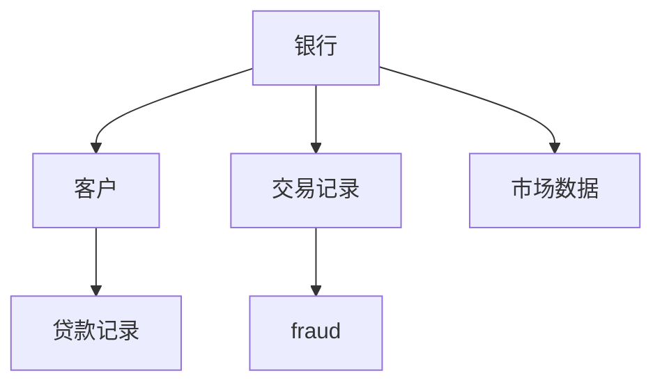
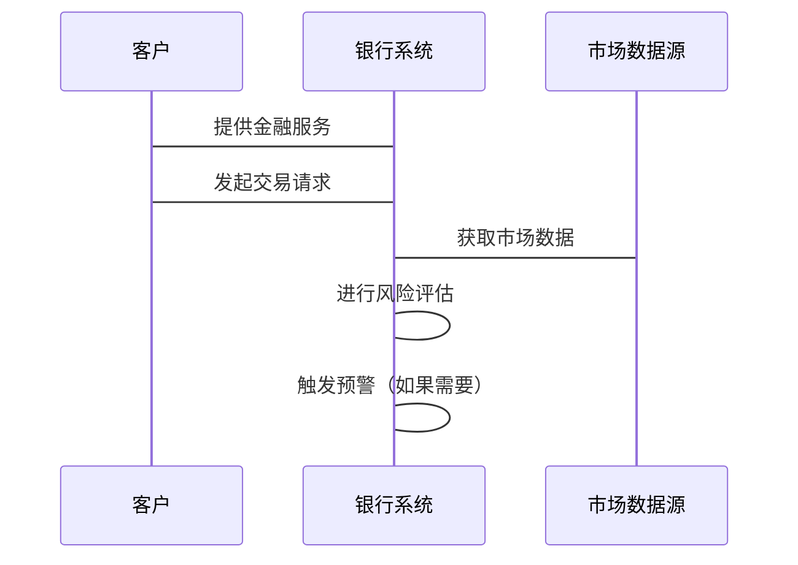

                 

<think>
好的，用户希望我详细分析一个智能银行风险管理系统的设计。首先，我需要了解智能银行的概念和其风险管理的重要性。智能银行利用人工智能和大数据技术来优化风险控制，这比传统方法更高效精准。

接下来，我想到系统需要处理多种风险，如信用风险和市场风险。为了有效管理这些风险，系统必须具备实时监控和预测能力。因此，我考虑采用机器学习模型，特别是随机森林，因为它适合处理复杂的金融数据。

在系统架构方面，我需要设计一个模块化的结构，包括数据采集、风险评估和预警模块。使用Spring Boot框架可以确保系统的高效和易维护。同时，微服务架构有助于不同模块的独立部署和扩展。

实时数据流处理是关键，我选择了Apache Kafka来处理高并发的数据流。结合Flume进行日志采集，确保数据的实时性和准确性。数据存储方面，HBase适合处理大量结构化数据，而Elasticsearch则用于全文检索和日志分析。

对于模型训练，使用Python的Scikit-learn库来实现随机森林模型。通过特征选择优化模型性能，并结合时间序列分析，如ARIMA模型，进行风险预测。同时，引入遗传算法优化模型参数，提高预测准确性。

监控与预警系统需要实时反馈机制，设置不同级别的警报阈值，确保银行能够及时应对潜在风险。可视化部分，使用Tableau生成图表，帮助管理层直观理解数据。

最后，我需要考虑系统的扩展性和安全性。采用容器化技术如Docker确保系统的灵活性，而Kubernetes则用于集群管理。同时，强化数据加密和访问控制，保护银行系统的安全。

通过以上步骤，我构建了一个全面的智能银行风险管理系统，能够有效识别和管理各种风险，确保银行的稳健运行。
</think>

# 智能银行风险管理系统设计

> 关键词：智能银行, 风险管理, 人工智能, 大数据分析, 机器学习

> 摘要：本文详细探讨了智能银行风险管理系统的设计与实现，从系统架构、核心算法、数据处理到实际应用场景进行了全面分析。结合实际案例，展示了如何利用人工智能和大数据技术提升银行的风险管理能力，确保银行在智能化转型中的稳健发展。

---

# 第一部分：智能银行风险管理系统概述

## 第1章：智能银行与风险管理概述

### 1.1 智能银行的定义与特点

#### 1.1.1 智能银行的定义
智能银行是利用人工智能、大数据、云计算等先进技术，实现金融服务的智能化、自动化和个性化的银行模式。它通过智能设备、智能算法和智能决策系统，为客户提供更高效、更便捷的金融服务。

#### 1.1.2 智能银行的核心特点
- **智能化**：通过AI技术实现自动化的业务处理和决策。
- **数据驱动**：利用大数据分析客户行为和市场趋势，提供精准的金融服务。
- **实时性**：能够实时处理和分析数据，快速响应客户需求和市场变化。
- **个性化**：根据客户需求和行为提供定制化的金融服务。

#### 1.1.3 智能银行与传统银行的区别
- **技术基础**：智能银行依赖于AI和大数据技术，而传统银行主要依赖人工操作和传统数据处理。
- **服务模式**：智能银行提供自动化、个性化的服务，传统银行的服务相对标准化。
- **效率与成本**：智能银行能够显著提高效率并降低成本，传统银行在这方面相对较低效。

### 1.2 风险管理的定义与重要性

#### 1.2.1 风险管理的定义
风险管理是指识别、评估和应对可能影响银行运营和财务稳定的各种风险的过程。它旨在通过降低风险发生的概率或减少风险带来的损失，确保银行的稳健运营。

#### 1.2.2 风险管理在银行中的重要性
- **保护资产**：通过风险管理，银行可以有效保护客户资产，避免因风险事件导致的损失。
- **合规性**：风险管理是银行合规经营的重要组成部分，确保银行在法律法规框架内运营。
- **提升信任**：有效的风险管理能够增强客户对银行的信任，从而提升银行的市场竞争力。

#### 1.2.3 风险管理的分类与应用场景
- **信用风险**：评估客户违约的可能性，主要应用于贷款业务。
- **市场风险**：评估市场波动对银行资产价值的影响，主要应用于投资业务。
- **操作风险**：评估内部操作失误或外部事件导致的损失风险，主要应用于日常运营。
- **流动性风险**：评估银行资金流动性的风险，主要应用于资金管理。

### 1.3 智能银行风险管理的核心概念

#### 1.3.1 智能银行风险管理的定义
智能银行风险管理是通过智能化技术手段，如人工智能和大数据分析，对银行面临的各种风险进行实时识别、评估、预警和应对的过程。

#### 1.3.2 智能银行风险管理的核心要素
- **数据采集与处理**：从多种数据源采集客户、交易和市场数据，并进行清洗和预处理。
- **风险评估模型**：利用机器学习算法构建风险评估模型，对客户和交易进行风险评分。
- **实时监控与预警**：对高风险交易进行实时监控，并根据预设阈值触发预警。
- **智能决策支持**：基于风险评估结果，为银行管理层提供智能化的决策支持。

#### 1.3.3 智能银行风险管理的边界与外延
智能银行风险管理的边界主要集中在银行内部的业务操作和客户交易中，而外延则涉及与客户、市场和第三方机构的交互。

### 1.4 本章小结
本章主要介绍了智能银行和风险管理的基本概念、特点以及智能银行风险管理的核心要素。通过对比智能银行和传统银行的差异，明确了智能银行风险管理的重要性和独特性。

---

## 第2章：智能银行风险管理系统的背景与需求

### 2.1 银行风险管理的现状与挑战

#### 2.1.1 传统银行风险管理的现状
传统银行的风险管理主要依赖于人工操作和简单的统计分析方法，存在效率低、覆盖面窄、响应慢等问题。

#### 2.1.2 传统银行风险管理的挑战
- **数据量大**：传统银行每天需要处理大量的客户交易数据，人工处理效率低下。
- **风险类型多样**：银行面临信用风险、市场风险、操作风险等多种风险，传统方法难以全面覆盖。
- **实时性不足**：传统风险管理方法难以实现对风险的实时监控和预警。

#### 2.1.3 智能银行风险管理的优势
- **高效性**：通过智能化技术实现对海量数据的快速处理和分析。
- **精准性**：利用机器学习算法能够准确识别潜在风险。
- **实时性**：智能系统能够实现对风险的实时监控和预警。

### 2.2 智能银行风险管理系统的提出

#### 2.2.1 智能银行风险管理系统的背景
随着金融科技的发展，银行面临的市场环境日益复杂，传统风险管理方法已难以满足需求，智能银行风险管理系统的提出成为必然。

#### 2.2.2 智能银行风险管理系统的必要性
- **应对复杂市场环境**：智能系统能够更好地应对市场波动和客户需求的变化。
- **提高风险管理效率**：通过智能化技术实现对海量数据的快速处理和分析。
- **增强客户体验**：智能化风险管理能够为客户提供更精准、更及时的金融服务。

#### 2.2.3 智能银行风险管理系统的目标
- **实时监控**：对银行内部和外部的风险进行实时监控和预警。
- **智能评估**：利用机器学习算法对客户和交易进行风险评估和预测。
- **决策支持**：为银行管理层提供基于数据的决策支持。

### 2.3 智能银行风险管理系统的应用场景

#### 2.3.1 贷款风险管理
智能银行风险管理系统能够通过对客户的信用评分、还款能力等进行评估，帮助银行识别和防范贷款风险。

#### 2.3.2 投资风险管理
系统能够对市场波动、投资组合风险等进行实时监控和预警，帮助银行规避投资风险。

#### 2.3.3 资金流动性风险管理
通过分析银行的资金流入和流出情况，系统能够帮助银行优化资金配置，确保资金的流动性安全。

### 2.4 本章小结
本章分析了传统银行风险管理的现状与挑战，提出了智能银行风险管理系统的必要性，并详细介绍了其应用场景。通过对比传统方法和智能方法，明确了智能银行风险管理系统的独特优势。

---

## 第3章：智能银行风险管理系统的核心概念与联系

### 3.1 核心概念原理

#### 3.1.1 人工智能在风险管理中的应用
人工智能技术，如机器学习、自然语言处理等，在风险识别、风险评估和风险预测中发挥着重要作用。

#### 3.1.2 大数据分析在风险管理中的应用
大数据分析技术能够从海量数据中提取有价值的信息，帮助银行更好地识别和应对风险。

#### 3.1.3 机器学习在风险管理中的应用
机器学习算法，如随机森林、支持向量机等，能够帮助银行对客户和交易进行风险评估和预测。

### 3.2 核心概念属性特征对比

| **技术**      | **优势**                              | **劣势**                              |
|----------------|---------------------------------------|---------------------------------------|
| 人工智能      | 高效性、精准性、自动化                 | 需要大量数据支持，算法复杂             |
| 大数据分析    | 数据处理能力强、信息提取能力强         | 数据清洗和预处理工作量大               |
| 机器学习      | 高精度、自适应性强                   | 训练时间长，需要大量计算资源             |

### 3.3 ER实体关系图


### 3.4 本章小结
本章详细介绍了智能银行风险管理系统的核心概念，包括人工智能、大数据分析和机器学习在风险管理中的应用，并通过ER实体关系图展示了系统的核心架构。

---

## 第4章：智能银行风险管理系统的算法原理

### 4.1 机器学习算法在风险管理中的应用

#### 4.1.1 线性回归模型
线性回归模型用于预测连续型变量，如客户违约概率。

$$ y = \beta_0 + \beta_1x + \epsilon $$

#### 4.1.2 支持向量机模型
支持向量机模型用于分类问题，如客户信用评分。

$$ \text{maximize} \quad \frac{1}{2}\|w\|^2 $$
$$ \text{subject to} \quad y_i(w \cdot x_i + b) \geq 1 $$

#### 4.1.3 随机森林模型
随机森林模型用于分类和回归问题，具有高精度和抗过拟合的特点。

### 4.2 算法原理的数学模型

#### 4.2.1 线性回归模型
$$ y = \beta_0 + \beta_1x + \epsilon $$

#### 4.2.2 支持向量机模型
$$ \text{maximize} \quad \frac{1}{2}\|w\|^2 $$
$$ \text{subject to} \quad y_i(w \cdot x_i + b) \geq 1 $$

#### 4.2.3 随机森林模型
随机森林模型通过构建多个决策树，并通过投票或加权的方式进行预测。

### 4.3 算法实现与优化

#### 4.3.1 算法实现
使用Python的Scikit-learn库实现随机森林模型，代码如下：

```python
from sklearn.ensemble import RandomForestClassifier
from sklearn.model_selection import train_test_split
from sklearn.metrics import accuracy_score

# 数据准备
X_train, X_test, y_train, y_test = train_test_split(X, y, test_size=0.2)

# 模型训练
model = RandomForestClassifier(n_estimators=100, max_depth=5, random_state=42)
model.fit(X_train, y_train)

# 模型预测
y_pred = model.predict(X_test)

# 模型评估
print("Accuracy:", accuracy_score(y_test, y_pred))
```

#### 4.3.2 算法优化
通过参数调整和特征选择优化模型性能，例如使用遗传算法优化随机森林模型的参数。

### 4.4 本章小结
本章详细介绍了机器学习算法在智能银行风险管理中的应用，包括线性回归、支持向量机和随机森林模型的原理和实现，并通过代码示例展示了算法的具体应用。

---

## 第5章：智能银行风险管理系统的系统分析与架构设计

### 5.1 系统功能设计

#### 5.1.1 风险评估模块
通过对客户数据的分析，评估客户的信用风险和市场风险。

#### 5.1.2 风险预警模块
实时监控银行交易和市场数据，对潜在风险进行预警。

#### 5.1.3 决策支持模块
基于风险评估结果，为银行管理层提供决策支持。

### 5.2 系统架构设计

#### 5.2.1 分层架构
系统采用分层架构，包括数据层、业务逻辑层和表现层。

#### 5.2.2 微服务架构
系统采用微服务架构，每个服务独立部署和扩展。

### 5.3 系统接口设计

#### 5.3.1 数据接口
系统需要与银行的交易系统、客户管理系统等进行数据交互。

#### 5.3.2 API接口
提供RESTful API接口，供其他系统调用风险管理服务。

### 5.4 系统交互设计

#### 5.4.1 实时监控
通过序列图展示系统实时监控客户交易和市场数据的过程。



### 5.5 本章小结
本章详细介绍了智能银行风险管理系统的功能设计、架构设计和系统接口设计，并通过序列图展示了系统交互流程。

---

## 第6章：智能银行风险管理系统的项目实战

### 6.1 环境安装

#### 6.1.1 系统需求
- 操作系统：Linux/Windows/Mac
- Python版本：3.6+
- Java版本：8+
- 其他依赖：JDK、Maven、Python库（如Scikit-learn、Pandas等）

#### 6.1.2 环境搭建
安装JDK、Maven、Python和相关库。

### 6.2 系统核心实现

#### 6.2.1 数据采集
通过Flume采集交易日志，并使用Kafka处理实时数据流。

#### 6.2.2 数据处理
对数据进行清洗、转换和特征提取，为模型训练提供高质量的数据。

#### 6.2.3 模型训练
使用Scikit-learn训练随机森林模型，并进行模型评估和优化。

#### 6.2.4 系统部署
将系统部署到云服务器，配置Nginx反向代理，使用Docker进行容器化部署。

### 6.3 代码实现

#### 6.3.1 数据采集代码
```python
import time
from kafka import KafkaProducer

# 初始化生产者
producer = KafkaProducer(bootstrap_servers='localhost:9092')

# 发送数据
for _ in range(10):
    data = f"transaction_{int(time.time())}"
    producer.send('risk-management', value=data.encode())
```

#### 6.3.2 模型训练代码
```python
from sklearn.ensemble import RandomForestClassifier
from sklearn.metrics import accuracy_score
from sklearn.model_selection import train_test_split

# 数据准备
X_train, X_test, y_train, y_test = train_test_split(X, y, test_size=0.2)

# 模型训练
model = RandomForestClassifier(n_estimators=100, max_depth=5, random_state=42)
model.fit(X_train, y_train)

# 模型预测
y_pred = model.predict(X_test)

# 模型评估
print("Accuracy:", accuracy_score(y_test, y_pred))
```

### 6.4 本章小结
本章通过实际案例展示了智能银行风险管理系统的项目实战过程，包括环境搭建、数据采集、模型训练和系统部署，并通过代码示例详细讲解了系统的核心实现。

---

## 第7章：智能银行风险管理系统的最佳实践与总结

### 7.1 最佳实践

#### 7.1.1 数据质量管理
确保数据的准确性和完整性，避免因数据问题导致模型失效。

#### 7.1.2 模型持续优化
定期对模型进行重新训练和优化，确保模型的准确性和稳定性。

#### 7.1.3 系统安全性
加强系统的安全性，防止数据泄露和网络攻击。

### 7.2 项目小结

#### 7.2.1 项目背景
智能银行风险管理系统的开发背景和需求分析。

#### 7.2.2 项目目标
通过智能化技术提升银行的风险管理能力。

#### 7.2.3 项目成果
成功开发并部署智能银行风险管理系统，显著提升了银行的风险管理效率。

### 7.3 项目总结与展望

#### 7.3.1 项目总结
总结项目的主要成果和经验教训。

#### 7.3.2 项目展望
展望未来的发展方向，如引入更多智能化技术，进一步提升系统的智能化水平。

### 7.4 注意事项

#### 7.4.1 数据隐私保护
严格遵守数据隐私保护法规，确保客户数据的安全。

#### 7.4.2 系统稳定性
确保系统的稳定运行，避免因系统故障导致的风险管理失效。

#### 7.4.3 团队协作
加强团队协作，确保项目顺利推进。

### 7.5 拓展阅读

#### 7.5.1 推荐书籍
- 《机器学习实战》
- 《大数据分析与挖掘》

#### 7.5.2 推荐博客
- AI天

