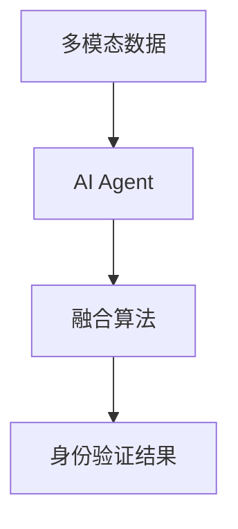

                 

<think>
嗯，我现在需要帮助用户完成一个关于《智能门禁：AI Agent的多模态身份验证》的技术博客文章。首先，我需要仔细阅读用户提供的需求和目录结构，确保完全理解每一个部分的要求。

用户希望文章结构清晰，逻辑严谨，涵盖从背景介绍到项目实战的各个方面。每个章节都需要有详细的子章节，且内容要专业且易于理解。此外，用户强调要使用技术术语，但同时保持易懂，这需要我在解释复杂概念时，用简单明了的语言。

首先，我会从背景介绍开始。这部分需要涵盖多模态身份验证的背景、AI Agent在智能门禁中的应用，以及问题背景。我需要确保每个子章节都详细解释相关概念，并使用实例帮助读者理解。

接下来是核心概念与联系，这里需要详细探讨多模态数据融合的原理，AI Agent的角色，以及它们之间的关系。我需要使用ER实体关系图和Mermaid流程图来辅助说明，确保结构清晰。

在算法原理部分，我需要详细讲解多模态数据融合的算法，如特征融合、决策融合和模型融合。同时，我需要使用数学公式和Python代码来展示这些算法，并结合实际案例进行解释，以便读者能够理解这些算法的实际应用。

系统分析与架构设计部分需要介绍系统架构，包括功能模块和接口设计。我会用Mermaid图来展示系统架构和交互流程，帮助读者更好地理解系统的整体结构。

项目实战部分需要提供具体的代码实现和案例分析。我会详细说明如何安装环境、实现核心功能，并分析实际案例，确保读者能够跟随步骤进行实践。

最后，我会总结与展望，讨论当前技术的优缺点，并提出未来的发展方向。同时，提供最佳实践和小结，帮助读者巩固所学内容，并提醒一些注意事项。

在写作过程中，我需要确保每个章节的内容详实，使用适当的术语，同时保持语言的流畅和易懂。我会反复检查每个部分，确保没有遗漏关键点，并且逻辑连贯。

总的来说，我需要一步步地按照用户提供的目录结构，逐一完成每个章节的内容，确保文章既有深度又易于理解，满足用户的需求。
</think>

# 智能门禁：AI Agent的多模态身份验证

**关键词：** 智能门禁、AI Agent、多模态身份验证、机器学习、安全技术

**摘要：**  
随着人工智能技术的快速发展，智能门禁系统在现代安全技术中的应用日益广泛。本文聚焦于AI Agent在多模态身份验证中的应用，从背景介绍、核心概念、算法原理、系统架构到项目实战，全面解析多模态身份验证的技术细节和实现方案。通过本文，读者将深入了解AI Agent在智能门禁系统中的重要作用，以及如何通过多模态数据融合提升身份验证的安全性和准确性。

---

## 第一部分：智能门禁与AI Agent的背景介绍

### 第1章：多模态身份验证的背景与问题背景

#### 1.1 多模态身份验证的背景
- **1.1.1 身份验证技术的发展历程**  
  身份验证技术从最初的单因素验证（如密码）到多因素验证（如密码+短信验证码），再到如今的多模态验证（如人脸+指纹+声音），经历了多个阶段的演进。多模态验证结合多种生物特征，显著提升了安全性。

- **1.1.2 多模态身份验证的定义与特点**  
  多模态身份验证是指结合两种或多种不同的生物特征（如人脸、指纹、声音等）进行身份识别的技术。其特点包括高安全性、抗 spoofing（防欺骗）能力强、用户体验灵活等。

- **1.1.3 智能门禁系统的需求与挑战**  
  智能门禁系统需要在高并发场景下快速响应，同时确保安全性。传统的单一生物特征验证在面对攻击（如照片攻击）时存在漏洞，而多模态验证则能有效弥补这一不足。

#### 1.2 AI Agent在智能门禁中的应用
- **1.2.1 AI Agent的基本概念**  
  AI Agent（智能代理）是一种能够感知环境并自主决策的智能体，能够执行复杂任务，如数据处理、模式识别和决策优化。

- **1.2.2 AI Agent在身份验证中的作用**  
  AI Agent可以实时分析多模态数据，通过深度学习模型进行特征提取和融合，从而实现高精度的身份验证。

- **1.2.3 智能门禁系统中的AI Agent应用场景**  
  在智能门禁系统中，AI Agent可以用于实时监控、异常检测和多模态数据融合，提升系统的安全性和智能化水平。

#### 1.3 问题背景与问题描述
- **1.3.1 当前身份验证技术的局限性**  
  单一生物特征验证易受攻击，且在高并发场景下效率较低。

- **1.3.2 多模态身份验证的优势**  
  多模态验证结合多种特征，显著提高了安全性，同时提升了用户体验。

- **1.3.3 AI Agent在多模态身份验证中的问题与挑战**  
  AI Agent需要实时处理大量多模态数据，对计算能力和算法优化提出了更高要求。

#### 1.4 问题解决与边界外延
- **1.4.1 多模态身份验证的核心问题**  
  如何高效融合多模态数据，提升识别准确率。

- **1.4.2 AI Agent在多模态身份验证中的边界**  
  AI Agent的作用边界包括数据处理、特征提取和决策优化，但不涉及物理设备的硬件控制。

- **1.4.3 问题解决的思路与方法**  
  通过深度学习模型实现多模态数据融合，结合边缘计算技术提升实时性。

#### 1.5 概念结构与核心要素
- **1.5.1 多模态身份验证的核心要素**  
  包括多模态数据采集、特征提取、数据融合和决策优化。

- **1.5.2 AI Agent在多模态身份验证中的角色**  
  AI Agent作为核心计算单元，负责数据处理和决策优化。

- **1.5.3 系统架构的核心要素组成**  
  包括数据采集模块、AI Agent计算模块、融合算法模块和输出模块。

---

## 第二部分：多模态身份验证的核心概念与联系

### 第2章：多模态身份验证的核心原理

#### 2.1 多模态身份验证的核心原理
- **2.1.1 多模态数据的定义与分类**  
  多模态数据包括人脸、指纹、声音等多种生物特征数据，可分为图像类、语音类和行为类。

- **2.1.2 多模态数据融合的原理**  
  通过特征融合、决策融合或模型融合的方式，将多种生物特征信息整合，提升识别准确率。

- **2.1.3 AI Agent在多模态数据融合中的作用**  
  AI Agent通过深度学习模型提取特征，并实现多种特征的高效融合。

#### 2.2 多模态数据融合的算法原理
- **2.2.1 基于特征融合的多模态数据融合**  
  将不同特征的低维表示进行融合，如通过线性组合或非线性变换生成高维特征向量。

- **2.2.2 基于决策融合的多模态数据融合**  
  分别对每种特征进行分类，然后将分类结果进行融合，如逻辑回归或投票机制。

- **2.2.3 基于模型融合的多模态数据融合**  
  将多种特征分别输入不同的模型，通过加权或集成学习生成最终结果。

#### 2.3 AI Agent与多模态数据融合的关系
- **2.3.1 AI Agent在多模态数据融合中的角色**  
  AI Agent作为计算单元，负责多模态数据的特征提取和融合。

- **2.3.2 多模态数据融合对AI Agent性能的影响**  
  数据量和复杂度的增加对AI Agent的计算能力提出了更高要求。

- **2.3.3 AI Agent与多模态数据融合的协同优化**  
  通过优化AI Agent的算法和硬件配置，提升多模态数据融合的效率和准确率。

#### 2.4 核心概念的属性特征对比
- **2.4.1 多模态数据的属性特征对比**  
  | 特征 | 图像类 | 语音类 | 行为类 |
  |------|--------|--------|--------|
  | 类型 | 图像数据 | 音频数据 | 行为数据 |
  | 优点 | 高精度 | 高鲁棒性 | 难以 spoof |

- **2.4.2 AI Agent的属性特征对比**  
  | 特征 | 计算能力 | 学习能力 | 决策能力 |
  |------|----------|----------|----------|
  | 优劣 | 高 | 强 | 准确 |

- **2.4.3 多模态数据融合的属性特征对比**  
  | 特征 | 特征融合 | 决策融合 | 模型融合 |
  |------|----------|----------|----------|
  | 优劣 | 高效 | 简单 | 高精度 |

#### 2.5 ER实体关系图架构


---

## 第三部分：多模态身份验证的算法原理

### 第3章：多模态身份验证的算法原理

#### 3.1 多模态数据融合算法
- **3.1.1 基于特征融合的算法**  
  使用深度学习模型（如卷积神经网络CNN和循环神经网络RNN）提取多模态特征，通过融合层（如全连接层）生成最终特征向量。

- **3.1.2 基于决策融合的算法**  
  分别对每种特征进行分类，生成多个决策结果，通过投票或加权的方式生成最终决策。

- **3.1.3 基于模型融合的算法**  
  使用集成学习（如堆叠模型）对多种特征分别建模，通过加权融合生成最终结果。

#### 3.2 多模态数据融合的数学模型
- **3.2.1 特征融合的数学模型**  
  设 $x_i$ 为第 $i$ 种特征的表示，融合后的特征为：
  $$ z = f(x_1, x_2, \dots, x_n) $$
  其中，$f$ 是融合函数，如线性组合或非线性变换。

- **3.2.2 决策融合的数学模型**  
  设 $y_i$ 为第 $i$ 种特征的分类结果，融合后的决策为：
  $$ y = g(y_1, y_2, \dots, y_n) $$
  其中，$g$ 是融合函数，如逻辑回归或投票机制。

#### 3.3 AI Agent与多模态数据融合的协同优化
- **3.3.1 AI Agent的优化算法**  
  使用强化学习（如Q-Learning）优化AI Agent的决策策略。

- **3.3.2 多模态数据融合的优化算法**  
  使用自适应融合算法（如自适应加权融合）提升融合效果。

---

## 第四部分：系统分析与架构设计

### 第4章：智能门禁系统架构设计

#### 4.1 系统功能设计
- **4.1.1 领域模型设计**  
  ```mermaid
  classDiagram
      class 用户 {
          id: string
          name: string
          role: string
      }
      class 设备 {
          mac: string
          type: string
          status: boolean
      }
      class 门禁记录 {
          time: datetime
          user_id: string
          device_id: string
      }
      用户 --> 门禁记录
      设备 --> 门禁记录
  ```

- **4.1.2 系统架构设计**  
  ```mermaid
  graph TD
      A[用户] --> B[AI Agent]
      B --> C[多模态数据融合]
      C --> D[身份验证结果]
      D --> E[门禁控制]
  ```

- **4.1.3 系统交互设计**  
  ```mermaid
  sequenceDiagram
      participant 用户
      participant AI Agent
      participant 门禁系统
      用户 -> AI Agent: 提供生物特征
      AI Agent -> 门禁系统: 发送验证结果
      门禁系统 -> 用户: 允许进入或拒绝
  ```

#### 4.2 系统架构设计
- **4.2.1 系统模块划分**  
  包括数据采集模块、AI Agent计算模块、融合算法模块和门禁控制模块。

- **4.2.2 系统接口设计**  
  提供API接口，如`/api/verify`用于身份验证，`/api/log`用于记录门禁操作。

- **4.2.3 系统交互流程设计**  
  用户提供生物特征，AI Agent处理并融合数据，生成验证结果，门禁系统根据结果控制门禁。

---

## 第五部分：项目实战

### 第5章：智能门禁系统项目实战

#### 5.1 环境安装与配置
- 安装Python 3.8及以上版本
- 安装深度学习框架（如TensorFlow或PyTorch）
- 安装多模态数据处理库（如OpenCV、SpeechRecognition）

#### 5.2 系统核心实现
- **5.2.1 数据采集模块**  
  使用摄像头和麦克风采集人脸和语音数据。

- **5.2.2 AI Agent计算模块**  
  使用预训练的深度学习模型进行特征提取。

- **5.2.3 融合算法模块**  
  实现特征融合或决策融合算法，生成最终验证结果。

#### 5.3 代码实现与解读
- **5.3.1 数据融合代码**  
  ```python
  import numpy as np

  def fuse_features(face_features, voice_features):
      # 线性融合
      fused_features = np.concatenate([face_features, voice_features], axis=1)
      return fused_features

  # 示例数据
  face_features = np.random.rand(100, 5)
  voice_features = np.random.rand(100, 5)
  fused_features = fuse_features(face_features, voice_features)
  print("Fused Features Shape:", fused_features.shape)
  ```

- **5.3.2 门禁控制代码**  
  ```python
  def verify_access(fused_features, threshold=0.95):
      # 假设模型输出是一个概率值
      if np.mean(fused_features) > threshold:
          return "允许进入"
      else:
          return "拒绝进入"

  result = verify_access(fused_features)
  print("验证结果:", result)
  ```

#### 5.4 案例分析与详细解读
- 分析实际案例，展示系统的运行流程和验证结果。

---

## 第六部分：总结与展望

### 第6章：总结与展望

#### 6.1 核心内容总结
- 多模态身份验证的核心原理和实现方法
- AI Agent在智能门禁系统中的重要作用
- 系统架构设计和项目实战经验

#### 6.2 技术展望
- 更高效的多模态数据融合算法
- 更智能的AI Agent决策机制
- 更安全的生物特征保护技术

#### 6.3 最佳实践 tips
- 数据采集时确保多样性
- 算法优化时关注计算效率
- 系统部署时注重安全性

#### 6.4 小结
通过本文的详细讲解，读者可以全面掌握多模态身份验证的核心技术和实现方法，为实际应用提供参考。

---

**作者：AI天才研究院/AI Genius Institute & 禅与计算机程序设计艺术 /Zen And The Art of Computer Programming**

