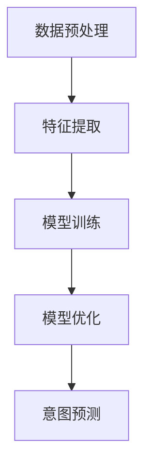
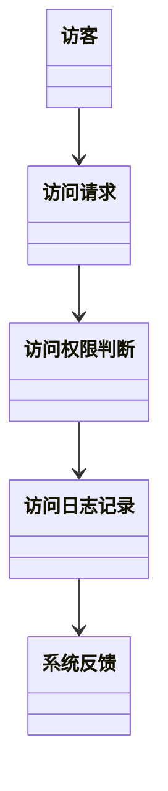

                 


# 智能门禁：AI Agent的访客意图预测

> 关键词：智能门禁，AI Agent，访客意图预测，机器学习，深度学习，计算机视觉

> 摘要：本文深入探讨了AI Agent在智能门禁系统中的应用，重点分析了访客意图预测的核心原理、算法实现以及系统架构设计。通过结合机器学习、深度学习和计算机视觉技术，本文详细阐述了如何利用AI Agent实现访客意图的精准预测，从而提升智能门禁系统的安全性和智能化水平。

---

## 第一章: 智能门禁系统与访客意图预测的背景

### 1.1 智能门禁系统的发展历程

智能门禁系统作为现代安全技术的重要组成部分，经历了从简单机械锁到高度智能化的转变。早期的门禁系统主要依赖于刷卡或输入密码的方式进行身份验证，这种方式虽然能够实现基本的安全管理，但缺乏智能化和个性化的特点。随着人工智能技术的快速发展，智能门禁系统逐渐引入了AI Agent技术，使其能够根据访客的行为和意图进行动态决策。

#### 问题背景：
- 传统门禁系统的身份验证方式单一，难以应对复杂的访客管理需求。
- 访客行为的多样性和不确定性增加了门禁系统管理的难度。
- 如何通过智能化手段提升门禁系统的安全性与便捷性，成为当前技术研究的重点。

#### 问题解决：
- 引入AI Agent技术，实现访客意图的动态预测和智能决策。
- 利用机器学习和深度学习算法，分析访客的行为数据，预测其意图。
- 基于意图预测结果，优化门禁系统的权限管理流程。

#### 边界与外延：
- 本研究聚焦于智能门禁系统中的访客意图预测，不涉及门禁系统的硬件设计。
- 本文主要探讨AI Agent在访客意图预测中的应用，不涉及其他类型的智能门禁功能。

---

### 1.2 访客意图预测的核心价值

访客意图预测是智能门禁系统的重要组成部分，其核心价值体现在以下几个方面：

1. **提升安全性**：通过预测访客意图，系统可以及时识别潜在的安全威胁，例如未经授权的访问行为。
2. **优化用户体验**：基于意图预测结果，系统可以为访客提供更加便捷的服务，例如提前预判访客需求并主动提供帮助。
3. **降低管理成本**：通过智能化的访客管理，减少人工干预，提升管理效率。

---

## 第二章: 访客意图预测的核心概念与技术

### 2.1 访客意图预测的核心概念

访客意图预测是指通过分析访客的行为数据（如动作、语言、表情等），推断其潜在的访问目的。例如，访客可能意图进入特定区域、寻找特定人员或获取特定信息。

#### 核心概念对比：

| **概念**       | **描述**                                                                 |
|----------------|--------------------------------------------------------------------------|
| 访客行为数据     | 包括访客的动作、语言、表情等数据，用于分析访客的意图。                     |
| 意图预测模型     | 基于机器学习或深度学习算法，对访客行为数据进行建模，预测其意图。           |
| AI Agent         | 具备智能决策能力的代理系统，能够根据访客意图预测结果优化门禁系统的管理流程。 |

#### 实体关系图：

```mermaid
er
actor 访客 {
  id: integer
  name: string
  意图: string
}
actor 系统 {
  id: integer
  访问权限: boolean
  访问时间: datetime
}
relation 访客-系统意图预测 {
  访客 -> 系统
  关联属性: 意图预测结果
}
```

---

## 第三章: 访客意图预测的算法原理

### 3.1 基于机器学习的意图预测模型

#### 算法流程图：



#### 特征提取与选择：

访客行为数据的特征提取是意图预测的关键步骤。常见的特征包括：

1. **时间特征**：访客的到达时间、访问时长。
2. **行为特征**：访客的动作频率、方向变化。
3. **语言特征**：访客的对话内容、语气。

#### 模型训练与优化：

常用的机器学习算法包括支持向量机（SVM）和随机森林（Random Forest）。以下是SVM模型的数学公式：

$$
\text{目标函数：} \quad \text{minimize} \quad \frac{1}{2} \|\omega\|^2 + C \sum_{i=1}^n \xi_i
$$

其中，$\omega$ 是模型参数，$C$ 是惩罚系数，$\xi_i$ 是松弛变量。

---

## 第四章: 系统分析与架构设计方案

### 4.1 系统功能设计

#### 领域模型：



#### 系统架构设计：


#### 系统接口设计：

- **访客身份验证接口**：`POST /api/authenticate`
- **访客意图预测接口**：`POST /api/intent-predict`

---

## 第五章: 项目实战

### 5.1 环境安装

#### 安装Python环境：

```bash
python --version
pip install -r requirements.txt
```

#### 安装深度学习框架：

```bash
pip install tensorflow
pip install keras
pip install numpy
```

### 5.2 核心功能实现

#### 意图预测模型实现：

```python
import numpy as np
from sklearn import svm

# 数据预处理
X = np.array([...])  # 特征向量
y = np.array([...])  # 标签

# 模型训练
model = svm.SVC()
model.fit(X, y)

# 模型预测
def predict_intentions(new_data):
    return model.predict(new_data)
```

---

## 第六章: 最佳实践与小结

### 6.1 小结

本文详细探讨了AI Agent在智能门禁系统中的应用，重点分析了访客意图预测的核心原理、算法实现以及系统架构设计。通过结合机器学习、深度学习和计算机视觉技术，本文展示了如何利用AI Agent实现访客意图的精准预测，从而提升智能门禁系统的安全性和智能化水平。

### 6.2 注意事项

- 在实际应用中，需注意数据隐私保护，避免访客信息泄露。
- 系统的实时性要求较高，需优化算法性能以满足实际需求。

### 6.3 拓展阅读

- 《深度学习入门：基于Python的CNN实践》
- 《自然语言处理实战：基于Python的NLP应用》
- 《计算机视觉导论：基于OpenCV的图像处理技术》

---

作者：AI天才研究院 & 禅与计算机程序设计艺术

