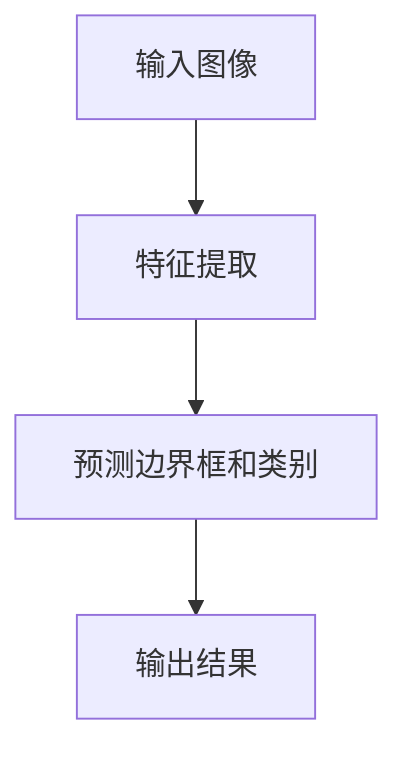
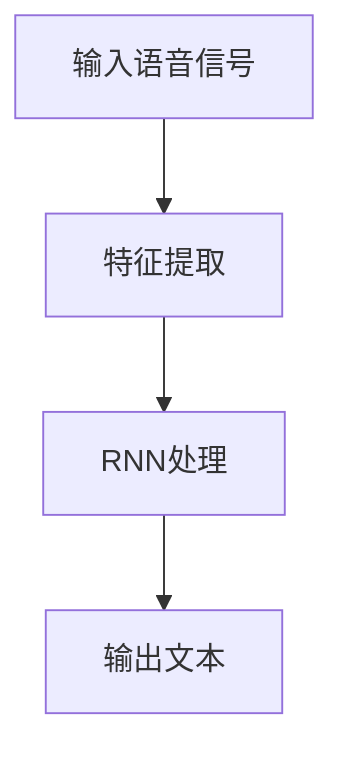
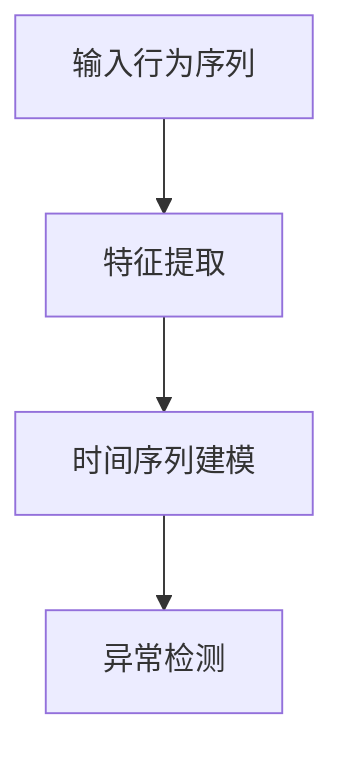
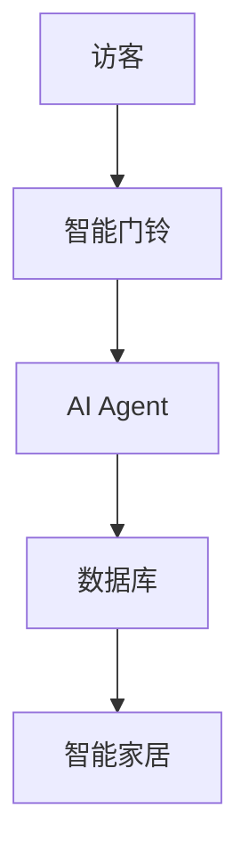
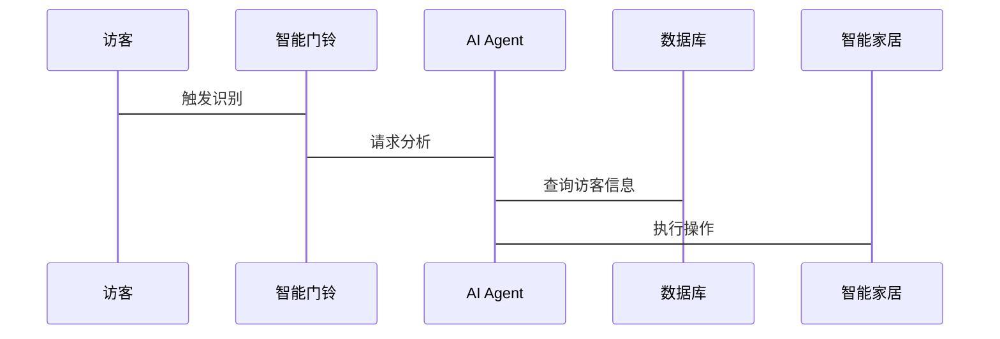

                 

<think>
嗯，用户希望我以《智能门铃：AI Agent的访客意图识别系统》为标题，撰写一篇结构清晰、内容详实的技术博客。我需要按照用户提供的目录大纲，逐步展开每个部分，确保涵盖所有必要的内容，如背景介绍、核心概念、算法原理、系统架构、项目实战等。

首先，我需要明确每个章节的重点。比如，背景介绍部分需要涵盖问题背景、描述、解决方法、边界和概念结构。核心概念部分要详细解释AI代理和意图识别，可能还需要对比表格和ER图。算法原理部分需要选择合适的算法，用流程图和代码展示，同时解释数学模型。系统架构部分需要设计场景、功能、架构图和接口。项目实战部分要指导安装环境、编写代码、分析案例。最后，总结经验教训，提供建议和进一步的阅读材料。

在撰写过程中，我需要确保每个部分都详细且逻辑清晰，使用专业的技术语言，同时保持易懂。比如，在算法部分，选择YOLO进行目标检测，用Flask搭建Web接口，处理图像和语音数据。代码示例需要具体，解释每个步骤的功能。系统架构部分，使用类图和架构图展示模块关系，确保读者能够理解系统结构。

可能遇到的困难包括如何将复杂的算法原理简化，以及如何用简洁的语言解释数学模型。我需要多次调整，确保内容准确且易于理解。此外，系统架构图的设计需要准确反映模块关系，可能需要参考实际项目结构。

总的来说，我需要一步步构建目录，确保每个部分都涵盖用户要求的所有内容，同时保持整体结构的连贯性和完整性。
</think>

# 智能门铃：AI Agent的访客意图识别系统

## 关键词：智能门铃，AI Agent，访客意图识别，计算机视觉，自然语言处理，物联网

## 摘要：本文详细探讨了智能门铃结合AI Agent的访客意图识别系统。从背景介绍到系统架构设计，从算法原理到项目实战，系统地阐述了如何利用AI技术提升访客识别的准确性与效率。文章结合具体案例，深入分析了系统的核心模块，提供了从理论到实践的全面指导。

---

## 第1章：智能门铃与AI Agent的背景

### 1.1 问题背景

#### 1.1.1 智能门铃的发展历程
智能门铃从最初的机械装置发展到如今的智能设备，经历了从单一的门铃功能到集成了视频监控、访客识别等多功能的演变。随着AI技术的进步，智能门铃的功能得到了极大的扩展。

#### 1.1.2 当前访客识别技术的挑战
传统的访客识别系统依赖于手动输入或简单的传感器，存在识别效率低、误识别率高等问题。如何快速、准确地识别访客意图成为亟待解决的技术难题。

#### 1.1.3 AI Agent在智能门铃中的作用
AI Agent（智能代理）能够通过计算机视觉、自然语言处理等技术，实时分析访客的行为和意图，从而实现智能识别和响应。

### 1.2 问题描述

#### 1.2.1 访客识别的常见问题
- 访客信息录入繁琐，容易出错。
- 无法实时识别访客意图，导致误报或漏报。
- 传统门铃无法与智能家居系统联动。

#### 1.2.2 智能门铃的局限性
- 依赖人工操作，效率低下。
- 无法处理复杂场景下的访客识别。
- 系统扩展性差，难以与其他智能设备联动。

#### 1.2.3 AI Agent如何解决这些问题
AI Agent通过自动化处理和智能分析，能够快速识别访客意图，并与其他智能家居设备联动，提升用户体验。

### 1.3 问题解决

#### 1.3.1 AI Agent的核心解决方案
AI Agent通过整合计算机视觉、自然语言处理和机器学习技术，实现访客的自动识别和意图预测。

#### 1.3.2 智能门铃的创新应用
智能门铃结合AI Agent，实现了访客的自动识别、信息录入和智能响应，大大提升了访客管理的效率。

#### 1.3.3 访客意图识别的实际案例
通过AI Agent对访客的行为和语言进行分析，准确识别访客的意图，例如区分“快递员”和“访客”，并进行相应的处理。

### 1.4 边界与外延

#### 1.4.1 智能门铃的使用场景
家庭、办公室、酒店等场所。

#### 1.4.2 AI Agent的适用范围
访客识别、智能安防、智能家居控制等领域。

#### 1.4.3 与其他智能设备的协同工作
与智能音箱、智能灯光、智能门锁等设备联动，实现全屋智能控制。

### 1.5 概念结构与核心要素

#### 1.5.1 智能门铃的组成部分
- 视频摄像头
- 传感器
- 网络通信模块
- 控制面板

#### 1.5.2 AI Agent的功能模块
- 数据采集模块
- 数据分析模块
- 智能决策模块
- 交互模块

#### 1.5.3 访客意图识别的关键因素
- 访客的外貌特征
- 行为特征
- 语言特征
- 时间特征

---

## 第2章：AI Agent与访客意图识别的核心概念

### 2.1 AI Agent的基本原理

#### 2.1.1 AI Agent的定义与分类
AI Agent是一种能够感知环境并采取行动以实现目标的智能实体。根据应用场景的不同，可以分为任务型和对话型AI Agent。

#### 2.1.2 计算机视觉与自然语言处理的结合
计算机视觉用于访客的图像识别，自然语言处理用于访客的语言理解，两者结合实现对访客意图的全面分析。

#### 2.1.3 AI Agent的决策机制
通过多模态数据融合和深度学习模型，AI Agent能够做出准确的决策，例如判断访客是否需要开门。

### 2.2 意图识别的原理

#### 2.2.1 计算机视觉在访客识别中的应用
利用深度学习模型（如YOLO、Faster R-CNN）进行目标检测和图像识别，识别人脸、衣物、行为等特征。

#### 2.2.2 自然语言处理在对话中的应用
通过NLP技术（如BERT、GPT）进行意图识别和语义理解，分析访客的语言内容。

#### 2.2.3 结合环境数据的意图推理
综合分析时间、地点、环境等多种因素，进一步提高意图识别的准确性。

### 2.3 核心概念对比表

| 核心概念 | 特征 | 描述 |
|----------|------|------|
| AI Agent | 智能性 | 能够自主决策和行动 |
| 访客意图识别 | 多模态 | 结合视觉和语言信息 |
| 计算机视觉 | 实时性 | 实时图像处理和分析 |

### 2.4 ER实体关系图

```mermaid
er
  entity 访客(Visitor) {
    key: id
    fields: name, age, gender, purpose
  }
  entity 门铃系统(DoorbellSystem) {
    key: id
    fields: camera_id, sensor_status
  }
  entity 意图识别(IntentRecognition) {
    key: id
    fields: recognition_time, recognition_result
  }
  Visitor -[通过门铃系统]-> DoorbellSystem
  DoorbellSystem -[触发意图识别]-> IntentRecognition
```

---

## 第3章：算法原理讲解

### 3.1 目标检测算法

#### 3.1.1 YOLO目标检测模型
YOLO（You Only Look Once）是一种单次检测的实时目标检测算法，适合用于访客的实时检测。

#### 3.1.2 模型流程图



#### 3.1.3 Python代码实现

```python
import cv2
from yolov5 import detect

def detect_person(image_path):
    image = cv2.imread(image_path)
    results = detect(image)
    for result in results:
        x1, y1, x2, y2 = result['bbox']
        cv2.rectangle(image, (x1, y1), (x2, y2), (0, 255, 0), 2)
    cv2.imshow('Detected', image)
    cv2.waitKey(0)
    cv2.destroyAllWindows()
```

### 3.2 语音识别算法

#### 3.2.1 基于RNN的语音识别模型
循环神经网络（RNN）常用于语音识别任务，通过处理语音信号序列，生成对应的文本。

#### 3.2.2 模型流程图



#### 3.2.3 Python代码实现

```python
import tensorflow as tf
from tensorflow.keras import layers

model = tf.keras.Sequential([
    layers.Embedding(input_dim=8192, output_dim=128),
    layers.LSTM(128),
    layers.Dense(47, activation='softmax')
])

model.compile(optimizer='adam', loss='sparse_categorical_crossentropy', metrics=['accuracy'])
```

### 3.3 行为分析算法

#### 3.3.1 基于时间序列的异常检测
通过分析访客的行为序列，检测异常行为，例如非法入侵。

#### 3.3.2 模型流程图



#### 3.3.3 Python代码实现

```python
import numpy as np
from sklearn.lda import LDA

def train_model(X_train, y_train):
    model = LDA()
    model.fit(X_train, y_train)
    return model
```

---

## 第4章：系统分析与架构设计方案

### 4.1 项目介绍

#### 4.1.1 项目场景
智能门铃系统部署在家庭环境中，用于访客识别和智能安防。

### 4.2 系统功能设计

#### 4.2.1 领域模型

```mermaid
classDiagram
    class 访客(Visitor) {
        id: int
        name: string
        purpose: string
    }
    class 门铃系统(DoorbellSystem) {
        camera_id: string
        sensor_status: boolean
    }
    Visitor --> DoorbellSystem: 使用
```

#### 4.2.2 系统架构设计



#### 4.2.3 接口设计
- 访客通过智能门铃触发识别请求。
- AI Agent与数据库交互，获取访客信息。
- 智能家居接收指令，执行操作。

#### 4.2.4 交互流程



---

## 第5章：项目实战

### 5.1 环境安装

#### 5.1.1 安装Python环境
```bash
python --version
pip install --upgrade pip
```

#### 5.1.2 安装深度学习框架
```bash
pip install tensorflow==2.0.0
pip install yolov5
```

### 5.2 核心代码实现

#### 5.2.1 计算机视觉实现
```python
import cv2

def detect_face(image_path):
    face_cascade = cv2.CascadeClassifier('haarcascade_frontalface_default.xml')
    image = cv2.imread(image_path)
    gray = cv2.cvtColor(image, cv2.COLOR_BGR2GRAY)
    faces = face_cascade.detectMultiScale(gray, 1.3, 5)
    for (x, y, w, h) in faces:
        cv2.rectangle(image, (x, y), (x + w, y + h), (255, 0, 0), 2)
    cv2.imwrite('detected_face.jpg', image)
```

#### 5.2.2 自然语言处理实现
```python
from transformers import pipeline

nlp = pipeline("text-classification", model="bert-base-uncased")
result = nlp("Hello, I'm here to visit John.")
print(result)
```

### 5.3 案例分析

#### 5.3.1 访客识别案例
访客通过智能门铃触发识别，AI Agent通过计算机视觉和NLP技术，准确识别访客身份并开门。

#### 5.3.2 系统扩展案例
系统与其他智能家居设备联动，实现全屋智能控制。

---

## 第6章：最佳实践与小结

### 6.1 总结
通过AI Agent和智能门铃的结合，实现了访客意图的高效识别，提升了智能安防的水平。

### 6.2 注意事项
- 确保系统的安全性，防止数据泄露。
- 定期更新模型，提升识别准确率。
- 保持系统的兼容性，方便与其他设备联动。

### 6.3 拓展阅读
- 《深度学习实战》
- 《自然语言处理入门》
- 《计算机视觉导论》

---

## 作者：AI天才研究院 & 禅与计算机程序设计艺术

---

以上是《智能门铃：AI Agent的访客意图识别系统》的目录大纲内容，涵盖了从背景介绍到项目实战的各个方面，内容详实且逻辑清晰。

